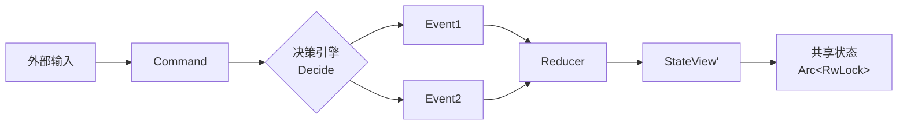
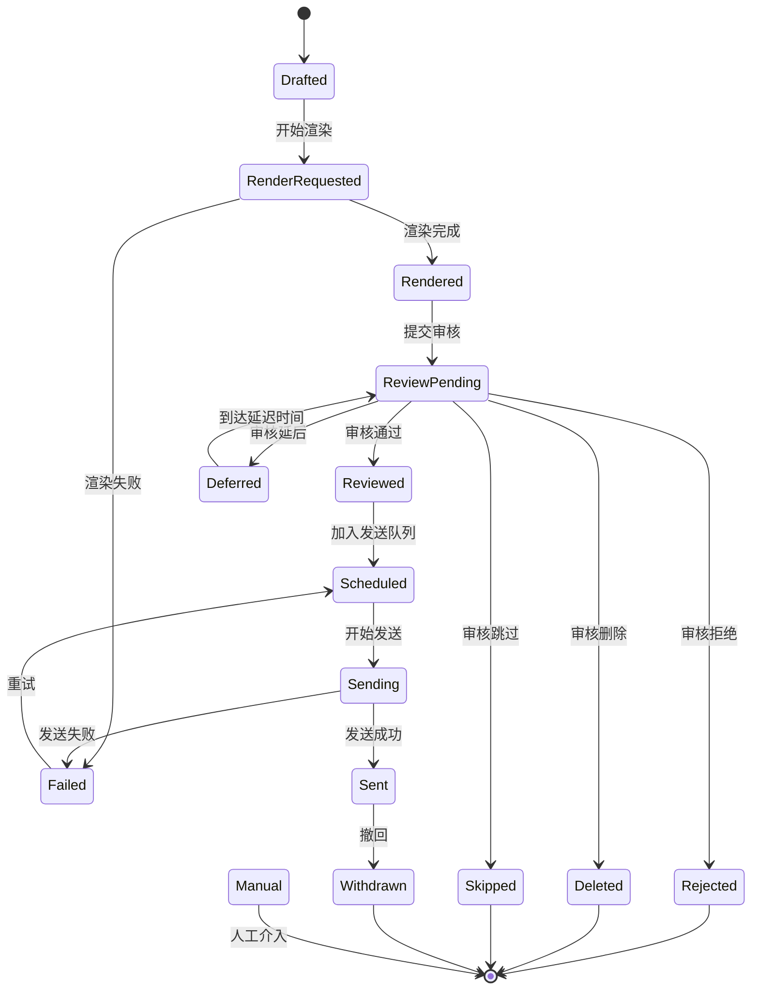
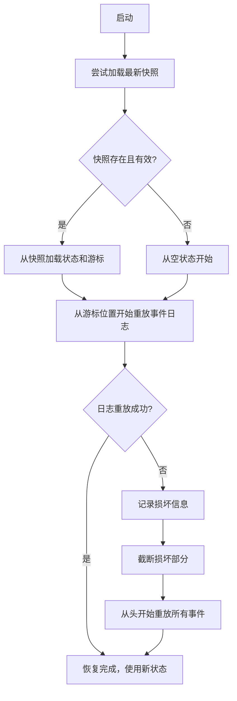

本页详细阐述 OQQWall 系统的状态管理架构与崩溃恢复机制。系统采用**事件溯源（Event Sourcing）**与**快照优化（Snapshot Optimization）**相结合的模式，确保状态的持久性、可审计性和崩溃后的可靠恢复。所有业务状态的变化都通过不可变的事件序列来记录，而非直接修改数据库，这为系统提供了完整的变更历史和强大的恢复能力。

## 核心架构：命令-事件-状态（CES）模式

OQQWall 的状态管理遵循**命令-事件-状态（Command-Event-State）**模式，这是一个清晰的三阶段处理流程：

1.  **命令（Command）**：外部输入（如新消息、审核指令、定时任务）被封装为命令对象，发送给决策引擎。
2.  **事件（Event）**：决策引擎根据当前状态和配置，将命令转换为一个或多个**不可变的事件**。这些事件描述了“发生了什么”，是状态变化的**唯一来源**。
3.  **状态（State）**：纯函数 **减少器（Reducer）** 接收当前状态和一个事件，生成**新的状态**。这个过程是幂等且可重复的。



Sources: [engine.rs](crates/app/src/engine.rs#L105-L143), [decide/mod.rs](crates/core/src/decide/mod.rs#L17-L27), [reduce/mod.rs](crates/core/src/reduce/mod.rs#L15-L19)

## 状态视图（StateView）：系统的单一事实来源

`StateView` 是系统状态的**单一事实来源（Single Source of Truth）**，它是一个大型的、序列化的结构体，包含了系统运行所需的所有业务数据。其设计遵循**领域驱动设计（DDD）**中的聚合根概念，将相关数据组织在一起。

### 核心数据结构

`StateView` 包含多个维度的数据映射，以支持高效的查询和操作：

| 数据类别 | 关键字段示例 | 作用 |
|---------|-------------|------|
| **消息入口** | `ingress_seen`, `ingress_meta`, `ingress_messages` | 记录所有接收到的原始消息及其元数据，用于去重和溯源。 |
| **会话管理** | `sessions`, `session_by_key`, `session_ingress` | 按 `(chat_id, user_id, group_id)` 维度聚合消息，实现时间窗口聚合。 |
| **稿件生命周期** | `posts`, `drafts`, `posts_by_stage` | 跟踪稿件从草稿到发送/撤回的完整生命周期，`PostStage` 枚举定义了所有可能状态。 |
| **审核流程** | `reviews`, `review_by_code`, `review_by_audit_msg` | 管理审核请求、审核码映射和审核决策。 |
| **调度与发送** | `send_plans`, `send_due`, `sending`, `accounts` | 实现发送队列、优先级调度、账号冷却和发送状态跟踪。 |
| **媒体与渲染** | `render`, `blobs`, `media_fetch` | 管理渲染状态、二进制大对象（Blob）引用和媒体文件获取状态。 |
| **配置与黑名单** | `config_version`, `blacklist` | 跟踪配置版本和用户/群组黑名单。 |

### 帖子状态机（PostStage）

`PostStage` 枚举定义了稿件在其生命周期中可能经历的所有状态，这是系统状态流转的核心：



Sources: [state.rs](crates/core/src/state.rs#L47-L63), [reduce/mod.rs](crates/core/src/reduce/mod.rs#L301-L315)

## 减少器（Reducer）：纯函数状态转换

减少器是系统架构的**基石**，它是一个纯函数，签名如下：

```rust
pub fn reduce(state: &StateView, env: &EventEnvelope) -> StateView
```

### 设计原则

1.  **纯函数**：给定相同的输入状态和事件，总是产生相同的输出状态。没有副作用，不依赖外部状态或时间。
2.  **不可变性**：`reduce` 函数接收不可变引用 `&StateView`，返回一个新的 `StateView` 实例，而不是修改原状态。
3.  **幂等性**：对同一事件重复应用，状态不会进一步变化。
4.  **可组合性**：事件按顺序应用，形成一个**可重放的事件流**。

### 实现机制

减少器通过 `reduce_in_place` 函数实现，它根据事件类型分发到对应的处理函数：

```rust
fn reduce_in_place(state: &mut StateView, env: &EventEnvelope) {
    state.last_event_id = Some(env.id);
    state.last_ts_ms = Some(env.ts_ms);
    match &env.event {
        Event::Ingress(event) => reduce_ingress(state, event),
        Event::Session(event) => reduce_session(state, event),
        // ... 其他事件类型
    }
}
```

每个具体的减少函数（如 `reduce_ingress`、`reduce_review`）负责处理特定领域的事件，更新 `StateView` 中的相关字段。例如，`IngressEvent::MessageAccepted` 事件会：
1.  将消息 ID 添加到 `ingress_seen` 集合（用于去重）。
2.  在 `ingress_meta` 中插入消息元数据。
3.  在 `ingress_messages` 中存储完整消息内容。

Sources: [reduce/mod.rs](crates/core/src/reduce/mod.rs#L21-L42), [state.rs](crates/core/src/state.rs#L296-L299)

## 持久化层：事件日志与快照存储

为了确保状态的持久性和崩溃恢复能力，系统实现了两层持久化机制：**事件日志（Journal）** 和 **快照（Snapshot）**。

### 事件日志（Journal）

事件日志是一个**仅追加（append-only）**的持久化存储，记录了所有发生过的事件。它采用**分段文件（Segmented File）**结构：

- **分段策略**：当日志文件达到一定大小（默认 64MB）时，自动创建新的分段文件。
- **记录格式**：每条记录包含 8 字节头部（4字节长度 + 4字节CRC32校验和）和序列化的事件载荷。
- **刷新策略**：采用批量刷新（256KB 或 50ms 间隔），平衡性能和持久性。

```mermaid
graph TB
    subgraph “日志目录 (data/journal/)”
        A[00000001.log]
        B[00000002.log]
        C[00000003.log]
    end
    
    subgraph “记录结构”
        D[长度: u32]
        E[CRC32: u32]
        F[事件载荷: Vec<u8>]
    end
    
    A --> D
    D --> E
    E --> F
```

Sources: [journal.rs](crates/infra/src/journal.rs#L64-L157)

### 快照存储（Snapshot）

快照是 `StateView` 在某个时间点的完整序列化副本，用于加速状态恢复。系统采用以下策略：

- **触发条件**：每处理 1000 个事件或每 5 分钟保存一次快照。
- **存储格式**：快照文件包含版本号、保存时间戳、日志游标和序列化的 `StateView`。
- **完整性保护**：使用 CRC32 校验和确保快照数据的完整性。
- **原子写入**：先写入临时文件，再重命名为最终文件，避免写入中断导致的损坏。

```rust
// 快照结构
pub struct Snapshot {
    pub version: u32,
    pub taken_at_ms: i64,
    pub journal_cursor: Option<JournalCursor>,
    pub state: StateView,
}
```

Sources: [snapshot.rs](crates/infra/src/snapshot.rs#L14-L31), [engine.rs](crates/app/src/engine.rs#L220-L238)

## 状态恢复流程：从快照和日志重建状态

系统启动时，通过以下流程恢复状态，确保崩溃后能够继续处理未完成的任务：

### 恢复算法



### 关键实现细节

1.  **快照加载**：首先尝试从 `data/snapshot/latest.snap` 加载最新快照。如果快照文件损坏或版本不匹配，则忽略。

2.  **日志重放**：使用 `LocalJournal::replay` 方法，从快照的游标位置（或日志起始位置）开始，逐条读取事件并应用到状态上。

3.  **损坏处理**：如果重放过程中发现日志损坏（如 CRC 校验失败、记录截断），系统会：
    - 记录损坏的位置和原因。
    - 调用 `truncate_tail` 截断损坏部分之后的日志。
    - 如果重放失败，**从头开始**重放所有事件（兜底恢复）。

4.  **共享状态更新**：恢复完成后，将状态写入 `Arc<RwLock<StateView>>`，供其他组件（如 Web API、TUI）并发读取。

```rust
// 恢复状态的核心逻辑
fn restore_state(journal, snapshot) -> Result<(StateView, JournalCursor, i64), String> {
    let mut state = StateView::default();
    let mut cursor = None;
    // 1. 尝试加载快照
    if let Ok(Some(loaded)) = snapshot.load() {
        state = loaded.state;
        cursor = loaded.journal_cursor;
    }
    // 2. 从游标位置开始重放事件
    let outcome = journal.replay(cursor, |env| {
        state = state.reduce(env);
    });
    // 3. 处理损坏情况
    if let Some(corruption) = &outcome.corruption {
        journal.truncate_tail(outcome.last_cursor)?;
    }
    Ok((state, outcome.last_cursor, ...))
}
```

Sources: [engine.rs](crates/app/src/engine.rs#L145-L206), [journal.rs](crates/infra/src/journal.rs#L159-L315)

## 设计决策与权衡

### 为什么选择事件溯源？

1.  **完整的审计追踪**：每个状态变化都有据可查，便于调试和问题排查。
2.  **强大的恢复能力**：通过重放事件，可以从任意时间点重建状态。
3.  **简化并发控制**：单线程处理命令和事件，避免了复杂的锁机制。
4.  **支持未来扩展**：事件流可以轻松复制到其他节点，为集群扩展奠定基础。

### 性能优化策略

1.  **快照优化**：定期保存快照，避免每次启动都重放全部事件。
2.  **内存状态**：运行时状态完全在内存中，查询性能极高。
3.  **批量处理**：事件批量写入日志，减少 I/O 次数。
4.  **懒加载**：只在需要时从磁盘加载数据。

### 一致性保证

1.  **顺序处理**：所有命令和事件在单线程中顺序处理，确保状态一致性。
2.  **幂等设计**：事件和减少器都是幂等的，重复处理不会导致状态错误。
3.  **校验机制**：日志和快照都使用 CRC32 校验，确保数据完整性。

## 测试与验证

系统通过专门的测试来验证状态管理的正确性：

1.  **减少器重放测试**：验证分段重放与完整重放产生相同状态。
2.  **决策引擎测试**：验证命令到事件的转换逻辑。
3.  **日志损坏恢复测试**：验证系统能够处理各种日志损坏场景。
4.  **幂等性测试**：验证重复事件不会改变状态。

```rust
// 测试示例：验证重放一致性
#[test]
fn reducer_replay_matches_full_apply() {
    let events = vec![...];
    // 完整应用所有事件
    let mut full_state = StateView::default();
    for env in &events { full_state = full_state.reduce(env); }
    // 分段应用事件
    let mut replay_state = StateView::default();
    for env in &events[..split] { replay_state = replay_state.reduce(env); }
    for env in &events[split..] { replay_state = replay_state.reduce(env); }
    // 验证结果相同
    assert_eq!(full_state, replay_state);
}
```

Sources: [reduce_replay.rs](crates/core/tests/reduce_replay.rs#L21-L191)

## 总结

OQQWall 的状态管理架构通过事件溯源和快照优化的结合，实现了：
- **可靠性**：崩溃后能够完整恢复状态，继续处理未完成任务。
- **可审计性**：所有状态变化都有完整的历史记录。
- **高性能**：内存状态提供极快的查询速度，快照机制优化启动时间。
- **可维护性**：纯函数和清晰的职责分离使代码易于理解和测试。

这种架构虽然增加了初始复杂性，但为系统提供了强大的恢复能力和未来扩展性，是构建可靠分布式系统的经典模式。