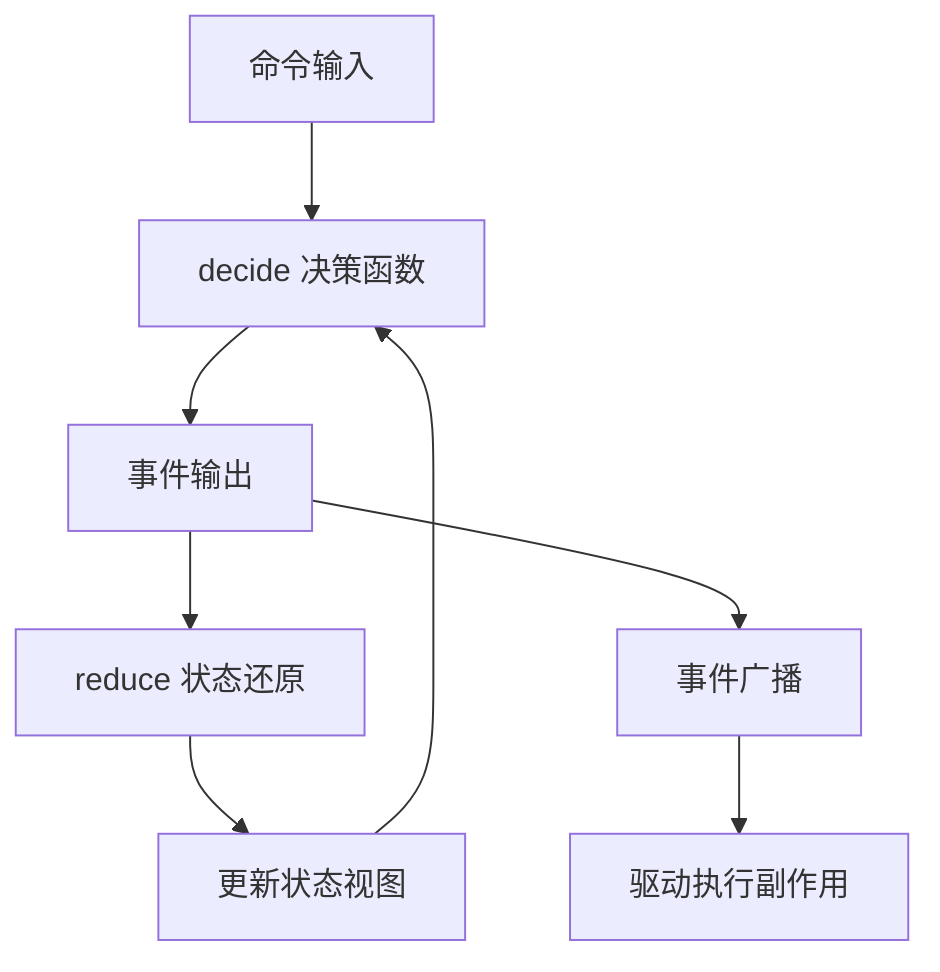
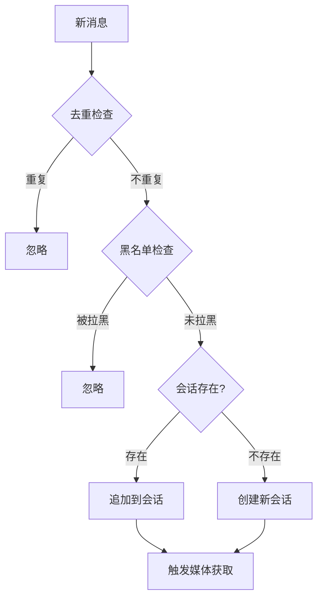
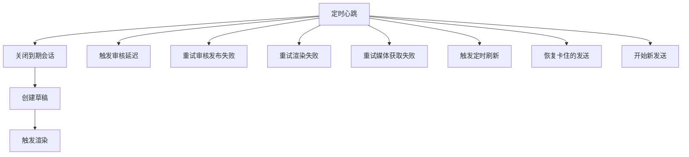
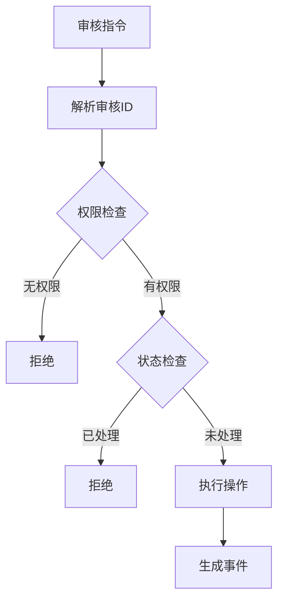
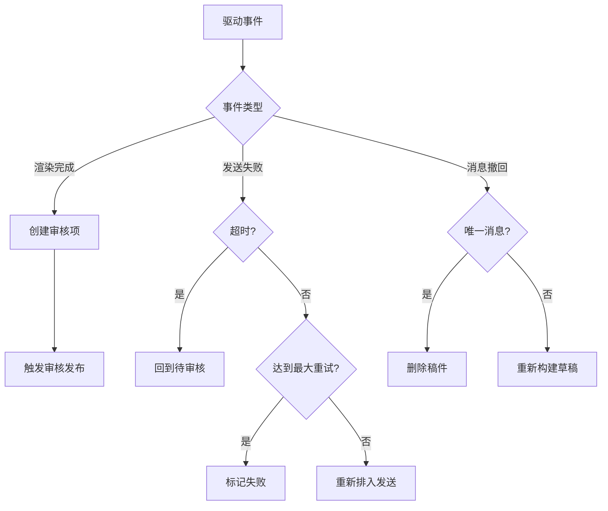

指令决策引擎是 OQQWall_rust 系统的核心大脑，负责将外部输入（用户指令、定时事件、驱动回调）转化为具体的系统行为。它采用**函数式核心/命令式外壳**架构，确保所有决策逻辑都是纯函数、可测试、可重放的。

## 架构概览

决策引擎的核心是一个纯函数 `decide`，它接收当前状态和命令，产生一系列事件。这些事件随后被应用到状态上（通过 `reduce` 函数），并广播给各个驱动执行副作用。



## 核心概念

### Command（命令）

命令是决策引擎的输入，代表需要系统响应的指令。系统定义了七种命令类型：

| 命令类型 | 说明 | 来源 |
|---------|------|------|
| `Ingress` | 新消息进入 | NapCat OneBot |
| `Tick` | 定时心跳 | 引擎定时器 |
| `ReviewAction` | 审核指令（单个） | 审核群用户 |
| `ReviewActionBatch` | 审核指令（批量） | 快捷指令展开 |
| `GlobalAction` | 全局指令（单个） | 审核群管理员 |
| `GlobalActionBatch` | 全局指令（批量） | 快捷指令展开 |
| `DriverEvent` | 驱动事件 | 渲染器/发送器回调 |

Sources: [command.rs](crates/core/src/command.rs#L1-L153)

### Event（事件）

事件是决策引擎的输出，代表系统状态的变化。事件分为多个子类型：

- **SystemEvent**：系统启动、快照加载
- **IngressEvent**：消息接收、忽略、撤回
- **SessionEvent**：会话开启、追加、关闭
- **DraftEvent**：草稿创建
- **RenderEvent**：渲染请求、成功、失败
- **ReviewEvent**：审核决策、发布、延迟
- **ScheduleEvent**：发送计划创建、重排、取消
- **SendEvent**：发送开始、成功、失败
- **MediaEvent**：媒体获取请求、成功、失败
- **AccountEvent**：账号启用、禁用、冷却
- **ManualEvent**：人工介入请求

Sources: [event.rs](crates/core/src/event.rs#L1-L468)

### StateView（状态视图）

状态视图是系统当前状态的完整快照，包含：

- **入站消息**：`ingress_seen`、`ingress_meta`、`ingress_messages`
- **会话**：`sessions`、`session_by_key`、`session_ingress`
- **草稿和稿件**：`drafts`、`posts`、`posts_by_stage`
- **渲染**：`render`
- **审核**：`reviews`、`review_by_code`、`review_by_audit_msg`
- **发送计划**：`send_plans`、`send_due`、`sending`
- **账号运行时**：`accounts`、`group_runtime`
- **QQ空间发布**：`qzone_publications`、`qzone_publications_by_post`
- **黑名单**：`blacklist`
- **外部编号**：`external_code_by_post`、`next_external_code_by_group`

Sources: [state.rs](crates/core/src/state.rs#L1-L329)

## 决策流程

决策引擎的核心函数 `decide` 根据命令类型分发到不同的决策模块：

```rust
pub fn decide(state: &StateView, command: &Command, config: &CoreConfig) -> Vec<Event> {
    match command {
        Command::Ingress(cmd) => ingress::decide_ingress(state, cmd, config),
        Command::Tick(cmd) => tick::decide_tick(state, cmd, config),
        Command::ReviewAction(cmd) => review::decide_review_action(state, cmd, config),
        Command::ReviewActionBatch(cmd) => review::decide_review_action_batch(state, cmd, config),
        Command::GlobalAction(cmd) => global::decide_global_action(state, cmd, config),
        Command::GlobalActionBatch(cmd) => global::decide_global_action_batch(state, cmd, config),
        Command::DriverEvent(event) => driver::decide_driver_event(state, event, config),
    }
}
```

Sources: [mod.rs](crates/core/src/decide/mod.rs#L1-L28)

## 决策模块详解

### 1. 消息入口决策（ingress.rs）

处理来自 OneBot 的新消息，主要逻辑：

1. **去重检查**：根据 `profile_id`、`chat_id`、`user_id`、`platform_msg_id` 生成唯一 ID
2. **黑名单检查**：检查发送者是否被拉黑
3. **会话管理**：
   - 如果已有相同 `(chat_id, user_id, group_id)` 的会话，追加消息
   - 否则创建新会话
4. **媒体获取**：为远程 URL 附件触发媒体获取请求



Sources: [ingress.rs](crates/core/src/decide/ingress.rs#L1-L115)

### 2. 定时任务决策（tick.rs）

处理定时心跳，执行以下任务：

1. **关闭到期会话**：当会话超过 `process_waittime_ms` 且用户停止输入时，关闭会话并创建草稿
2. **触发审核延迟**：处理"等"指令的延迟到期
3. **重试审核发布失败**：重新发布审核消息
4. **重试渲染失败**：重新渲染失败的稿件
5. **重试媒体获取失败**：重新获取失败的媒体
6. **触发定时刷新**：按 `send_schedule_minutes` 定时刷新发送队列
7. **恢复卡住的发送**：处理发送超时
8. **开始新发送**：从发送计划中选择下一个待发送稿件



Sources: [tick.rs](crates/core/src/decide/tick.rs#L1-L336)

### 3. 审核指令决策（review.rs）

处理审核群中的审核指令，支持以下操作：

| 指令 | 动作 | 说明 |
|------|------|------|
| 是 | `Approve` | 通过并加入发送队列 |
| 否 | `Skip` | 跳过，外部编号+1 |
| 等 | `Defer` | 延迟 180 秒后重新审核 |
| 删 | `Delete` | 删除稿件，不发送 |
| 拒 | `Reject` | 拒绝稿件，通知投稿人 |
| 立即 | `Immediate` | 立即发送，优先级最高 |
| 刷新 | `Refresh` | 重新提取消息并渲染 |
| 重渲染 | `Rerender` | 仅重新渲染 |
| 消息全选 | `SelectAllMessages` | 选择所有消息 |
| 匿 | `ToggleAnonymous` | 切换匿名状态 |
| 扩列审查 | `ExpandAudit` | 扩列审查（未实现） |
| 展示 | `Show` | 展示稿件内容 |
| 评论 | `Comment` | 添加评论 |
| 回复 | `Reply` | 向投稿人发送消息 |
| 拉黑 | `Blacklist` | 拉黑投稿人 |
| 快捷回复 | `QuickReply` | 使用快捷回复模板 |
| 合并 | `Merge` | 合并两个稿件 |

**关键决策逻辑**：

1. **审核 ID 解析**：支持通过 `review_id`、`review_code` 或 `audit_msg_id` 解析
2. **权限检查**：确保操作者有权操作该稿件
3. **状态检查**：确保稿件未被处理
4. **批量操作**：支持快捷指令展开的批量操作，按顺序执行，某一步失败则停止



Sources: [review.rs](crates/core/src/decide/review.rs#L1-L692)

### 4. 全局指令决策（global.rs）

处理审核群中的全局指令，支持以下操作：

| 指令 | 动作 | 说明 |
|------|------|------|
| 帮助 | `Help` | 显示帮助（未实现） |
| 调出 | `Recall` | 重新渲染并展示 |
| 撤回 | `Withdraw` | 撤回稿件 |
| 信息 | `Info` | 查询稿件信息（未实现） |
| 手动重新登录 | `ManualRelogin` | 手动重新登录（未实现） |
| 自动重新登录 | `AutoRelogin` | 自动重新登录（未实现） |
| 待处理 | `PendingList` | 列出待处理稿件（未实现） |
| 删除待处理 | `PendingClear` | 清空待处理列表 |
| 删除暂存区 | `SendQueueClear` | 清空发送队列 |
| 发送暂存区 | `SendQueueFlush` | 立即发送队列 |
| 清理发送中 | `SendInFlightClear` | 清理发送中的稿件 |
| 列出拉黑 | `BlacklistList` | 列出黑名单（未实现） |
| 取消拉黑 | `BlacklistRemove` | 取消拉黑 |
| 设定编号 | `SetExternalNumber` | 设定外部编号 |
| 快捷回复 | `QuickReplyList` | 列出快捷回复（未实现） |
| 快捷回复 添加 | `QuickReplyAdd` | 添加快捷回复（未实现） |
| 快捷回复 删除 | `QuickReplyDelete` | 删除快捷回复（未实现） |
| 快捷指令 | `ShortcutList` | 列出快捷指令（未实现） |
| 快捷指令 添加 | `ShortcutAdd` | 添加快捷指令（未实现） |
| 快捷指令 删除 | `ShortcutDelete` | 删除快捷指令（未实现） |
| 自检 | `SelfCheck` | 系统自检（未实现） |
| 系统修复 | `SystemRepair` | 系统修复（未实现） |

**关键决策逻辑**：

1. **撤回逻辑**：
   - 如果稿件在发送队列中，取消发送计划，重新进入待审核
   - 如果稿件已发送，从 QQ 空间撤回
2. **清空待处理**：将所有待审核稿件标记为删除，分配外部编号
3. **刷新发送队列**：立即将所有待发送稿件的 `not_before_ms` 设为当前时间

Sources: [global.rs](crates/core/src/decide/global.rs#L1-L354)

### 5. 驱动事件决策（driver.rs）

处理来自驱动（渲染器、发送器等）的回调事件：

1. **渲染完成**：
   - 创建审核项（如果不存在）
   - 触发审核发布
2. **发送失败**：
   - 如果是超时错误，回到待审核
   - 如果达到最大重试次数，标记为失败并要求人工介入
   - 否则重新排入发送计划
3. **发送放弃**：回到待审核
4. **消息撤回**：
   - 如果是唯一消息，删除稿件
   - 否则重新构建草稿并刷新



Sources: [driver.rs](crates/core/src/decide/driver.rs#L1-L240)

### 6. 调度决策（scheduler.rs）

负责计算发送时间：

1. **发送窗口**：根据 `send_windows` 配置，确保在允许的时间窗口内发送
2. **最小间隔**：确保两次发送之间有足够间隔
3. **队列溢出**：当队列满时，延迟到下一个发送窗口

```rust
pub fn compute_not_before(
    now_ms: TimestampMs,
    delay_until_ms: Option<TimestampMs>,
    send_windows: &[TimeWindow],
    min_interval_ms: TimestampMs,
    last_send_ms: Option<TimestampMs>,
    queue_depth: usize,
    max_queue: usize,
    tz_offset_minutes: i32,
) -> TimestampMs
```

Sources: [scheduler.rs](crates/core/src/decide/scheduler.rs#L1-L98)

### 7. 发送决策（sender.rs）

负责选择发送账号：

1. **账号选择**：选择可用的、最近未使用的账号
2. **冷却处理**：如果所有账号都在冷却中，返回重试时间
3. **不可用处理**：如果没有可用账号，返回不可用状态

```rust
pub fn choose_account(
    state: &StateView,
    group_config: Option<&GroupConfig>,
    now_ms: TimestampMs,
) -> AccountChoice
```

Sources: [sender.rs](crates/core/src/decide/sender.rs#L1-L84)

### 8. 刷新决策（flush.rs）

负责刷新发送队列：

1. 获取指定组的所有发送计划
2. 按优先级、序列号、稿件 ID 排序
3. 将所有计划的 `not_before_ms` 设为当前时间

Sources: [flush.rs](crates/core/src/decide/flush.rs#L1-L29)

### 9. 草稿构建决策（builder.rs）

负责从消息构建草稿：

1. 遍历所有消息
2. 提取文本块和附件
3. 解析特殊标记（如回复、JSON 卡片、戳一戳）

Sources: [builder.rs](crates/core/src/decide/builder.rs#L1-L55)

## 指令解析

指令解析在 `napcat.rs` 中实现，支持两种触发方式：

1. **@机器人执行**：`@机器人 指令` 或 `@机器人 review_code 指令`
2. **回复审核消息执行**：回复审核消息，只发指令

### 解析流程

```mermaid
graph TD
    A[群消息] --> B{是否@机器人?}
    B -->|是| C[解析为全局或审核指令]
    B -->|否| D{是否回复审核消息?}
    D -->|是| E[解析为审核指令]
    D -->|否| F[忽略]
    C --> G{以数字开头?}
    G -->|是| H[解析为审核指令]
    G -->|否| I[解析为全局指令]
    H --> J{指令存在?}
    I --> J
    E --> J
    J -->|是| K[执行指令]
    J -->|否| L[提示错误]
```

### 指令优先级

1. **原始内置指令**：`原始 指令名` 强制执行内置指令
2. **快捷指令**：检查当前作用域的快捷指令
3. **内置指令**：检查内置指令
4. **快捷回复**：在回复态下检查快捷回复模板

### 快捷指令 DSL

快捷指令支持占位符：

- `{args}`：用户输入的参数
- `{review_code}`：审核编号
- `{sender_id}`：投稿人 ID
- `{group_id}`：组 ID

示例：
```
快捷指令 添加 审核 滚=拒 | 拉黑
```

Sources: [napcat.rs](crates/drivers/src/napcat.rs#L3548-L3900), [shortcut.rs](crates/drivers/src/shortcut.rs#L1-L486)

## 状态管理与事件溯源

### 事件溯源架构

系统采用事件溯源架构，所有状态变化都记录为事件：

1. **事件日志**：所有事件持久化到 `journal.log`
2. **快照**：每 1000 个事件或 5 分钟创建一次快照
3. **恢复**：重启时从快照 + 日志恢复状态

### 状态还原

`reduce` 函数是纯函数，将事件应用到状态：

```rust
pub fn reduce(state: &StateView, env: &EventEnvelope) -> StateView {
    let mut next = state.clone();
    reduce_in_place(&mut next, env);
    next
}
```

### 批量操作

批量操作通过 `decide_review_action_batch` 和 `decide_global_action_batch` 实现：

1. 克隆当前状态作为临时状态
2. 按顺序执行每个操作
3. 将事件应用到临时状态
4. 如果某一步产生空事件，停止执行

Sources: [review.rs](crates/core/src/decide/review.rs#L250-L300), [global.rs](crates/core/src/decide/global.rs#L180-L230)

## 引擎运行

引擎在 `engine.rs` 中实现，负责：

1. **初始化**：从日志和快照恢复状态
2. **命令处理**：接收命令，调用 `decide` 函数
3. **事件处理**：
   - 持久化事件到日志
   - 应用事件到状态
   - 广播事件到驱动
4. **快照管理**：定期创建快照

```rust
pub async fn run(mut self) {
    while let Some(cmd) = self.cmd_rx.recv().await {
        let events = decide(&self.state, &cmd, &self.config);
        for event in events {
            let env = self.envelope(event);
            self.journal.append(&env)?;
            self.state = self.state.reduce(&env);
            self.bus.send(env)?;
            self.maybe_snapshot();
        }
    }
}
```

Sources: [engine.rs](crates/app/src/engine.rs#L1-L247)

## 配置

决策引擎的配置在 `CoreConfig` 中定义，包括：

- **默认配置**：
  - `default_process_waittime_ms`：会话关闭等待时间
  - `default_send_windows`：默认发送窗口
  - `default_min_interval_ms`：最小发送间隔
  - `default_max_queue`：最大队列长度
  - `default_max_images_per_post`：每篇帖子最大图片数
  - `default_send_timeout_ms`：发送超时时间
  - `default_send_max_attempts`：最大发送重试次数

- **组级配置**：每个组可以覆盖默认配置

Sources: [config.rs](crates/core/src/config.rs#L1-L87)

## 测试

决策引擎的测试位于 `crates/core/tests/` 目录，包括：

- `decide_action_batch.rs`：批量操作测试
- `decide_review_stack.rs`：审核堆叠测试
- `decide_tick.rs`：定时任务测试
- `decide_driver_recall.rs`：驱动召回测试
- `decide_driver_refresh.rs`：驱动刷新测试
- `decide_driver_send.rs`：驱动发送测试
- `decide_global_withdraw.rs`：全局撤回测试
- `decide_ingress_blacklist.rs`：入口黑名单测试
- `decide_review_merge.rs`：审核合并测试
- `decide_review_toggle_anonymous.rs`：审核匿名切换测试
- `reduce_recall.rs`：状态还原召回测试
- `reduce_replay.rs`：状态还原重放测试

## 总结

指令决策引擎通过纯函数式的架构，确保了系统的可测试性、可重放性和可维护性。所有决策逻辑都集中在 `decide` 函数中，状态变化通过事件溯源记录，副作用被隔离到驱动层。这种设计使得系统易于扩展和调试，同时保证了高并发下的正确性。