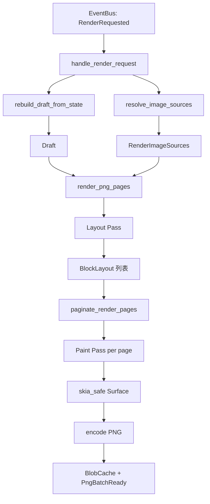
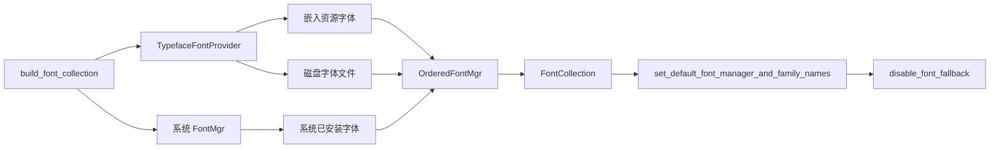

OQQWall 的渲染引擎基于 **skia-safe**（Rust 绑定）构建，负责将结构化的 `Draft` 数据直接绘制为 PNG 图片。该引擎采用 **两阶段流水线**（Layout → Paint），以 Skia 的 `textlayout` 模块实现类浏览器级的文字排版，通过 3× 超采样输出高清晰度图片。整个渲染器实现在单一文件 `crates/drivers/src/renderer.rs` 中（约 7948 行），是项目中体量最大、复杂度最高的模块。

## 整体架构

渲染引擎的核心设计遵循 **测量-布局-绘制** 的经典图形管线。从事件总线接收 `RenderRequested` 事件开始，经过草案重建、图片资源解析、布局计算、分页策略、最终绘制输出 PNG 字节流。以下架构图展示了数据从输入到输出的完整流转路径。



渲染器以 Tokio 异步任务的形式由 `spawn_renderer` 启动，持续监听事件总线，对每个 `RenderRequested` 事件触发完整的渲染流水线。渲染结果通过 `PngBatchReady` 事件回传给上层调度。

Sources: [renderer.rs](crates/drivers/src/renderer.rs#L1737-L1783), [renderer.rs](crates/drivers/src/renderer.rs#L2272-L2284), [renderer.rs](crates/drivers/src/renderer.rs#L4080-L4086)

## 依赖与构建配置

渲染引擎的 Skia 集成通过 `skia-safe` crate 实现，启用 `textlayout` feature 以获取段落排版能力。`textlayout` 模块底层依赖 HarfBuzz（文本塑形）和 ICU（Unicode 处理），由 skia-safe 自动管理编译。

| 配置项 | 值 | 说明 |
|--------|-----|------|
| skia-safe 版本 | 0.91 | Rust Skia 绑定 |
| textlayout feature | 已启用 | ParagraphBuilder / Paragraph API |
| 默认画布宽度 | 1152px（输出） / 384px（逻辑） | 3× 超采样 |
| 默认最大高度 | 6912px（输出） / 2304px（逻辑） | 长内容分页阈值 |
| 输出格式 | PNG | 通过 `EncodedImageFormat::PNG` 编码 |

Sources: [Cargo.toml](crates/drivers/Cargo.toml#L19), [renderer.rs](crates/drivers/src/renderer.rs#L73-L75)

## 字体管理子系统

字体管理是渲染质量的关键保障。引擎采用 **双层字体加载** 策略：优先加载内置字体资源（`res/fonts/`），再通过系统字体管理器补充缺失字形。`FontCollection` 是 Skia textlayout 模块的核心抽象，它统一管理多个字体源，为 `ParagraphBuilder` 提供字形查找服务。



字体加载遵循严格的优先级顺序。`FONT_BYTES_CACHE` 使用 `OnceLock` 实现线程安全的全局单例缓存，避免重复读取磁盘。`build_font_collection` 每次渲染调用时构建一个新的 `FontCollection` 实例，但底层字体数据来自缓存。当前默认字体族配置为 `["PingFang SC"]`，配合 `res/fonts/PingFangSC-Regular.otf` 内置字体确保跨平台一致性。

| 字体管理层 | 机制 | 优先级 |
|-----------|------|--------|
| 内置资源字体 | `embedded_resources::RESOURCES` 中的 `fonts/*` 条目 | 最高 |
| 磁盘字体文件 | `res/fonts/` 目录下的 `.ttf` / `.otf` 文件 | 次高 |
| 系统字体 | `skia_safe::FontMgr::new()` 提供的系统字体 | 补充 |

值得注意的是，引擎调用了 `fc.disable_font_fallback()` 禁用了 Skia 的自动字体回退机制。这意味着如果请求的字形在已注册字体中不存在，将不会自动尝试其他字体——这是一种有意的设计选择，确保渲染结果的确定性和可复现性。

Sources: [renderer.rs](crates/drivers/src/renderer.rs#L7320-L7396), [renderer.rs](crates/drivers/src/renderer.rs#L7287-L7318), [renderer.rs](crates/drivers/src/renderer.rs#L104)

## Draft 数据模型

渲染器不直接消费 OneBot 原始消息，而是接收经过归一化处理的 `Draft` 结构。`Draft` 由 `DraftBlock` 枚举的有序列表组成，每种变体对应一种可视化的消息块类型。

| DraftBlock 变体 | 描述 | 渲染为 BlockKind |
|----------------|------|-----------------|
| `Paragraph { text }` | 纯文本段落 | `Text` — 白底气泡 |
| `Attachment { kind, name, reference, size_bytes }` | 媒体附件 | `Image` / `VideoPreview` / `MediaCard` / `FileCard` |
| `Reply { preview }` | 引用回复 | `Reply` — 左侧蓝线内嵌框 |
| `Poke` | 戳一戳 | `Poke` — 图片或文字占位 |
| `JsonCard { raw }` | JSON 卡片 | `JsonCard` — contact/miniapp/news |
| `Forward { items }` | 合并转发 | `Forward` — 蓝线嵌套容器 |

特殊块类型（Reply、JsonCard、Forward、Poke）在文本段落中以 Base64 编码的标记字符串嵌入（如 `[[reply:...]]`、`[[jsoncard:...]]`），由 `parse_special_marker` 解析还原。

Sources: [draft.rs](crates/core/src/draft.rs#L13-L68), [renderer.rs](crates/drivers/src/renderer.rs#L161-L218)

## Layout Pass：测量与布局

布局阶段是渲染管线的第一阶段，负责将 `Draft` 中的每个块转换为带有精确坐标的 `BlockLayout`。布局采用 **单列流式布局**，所有块从上到下依次排列，通过 `cursor_y` 游标追踪当前垂直位置。

### 画布与坐标系

引擎使用 **逻辑坐标** 进行所有布局计算，最终通过 3× 缩放因子映射到物理像素。逻辑画布宽度固定为 384px（对应原始 `gotohtml.sh` 的 `4in@96DPI`），高度根据内容动态计算。

```
逻辑坐标系 (384 × H)
┌─────────────────────────────────┐
│ padding=20                      │
│  ┌───────────────────────────┐  │
│  │ Header (avatar + title)   │  │
│  ├───────────────────────────┤  │
│  │ Block 1 (Text bubble)     │  │
│  │ Block 2 (Image preview)   │  │
│  │ Block 3 (Reply box)       │  │
│  │ ...                       │  │
│  └───────────────────────────┘  │
│ padding=20                      │
└─────────────────────────────────┘
        ↓ ×3 scale
物理像素 (1152 × 3H)
```

### 文本测量

文本宽度测量通过 `TextMeasurer` 封装，内部使用 `build_line_paragraph` 构建单行 `Paragraph` 并查询 `max_intrinsic_width`。`TextMeasurer` 维护一个 `HashMap<TextMeasureKey, u32>` 缓存，避免重复测量相同文本。

布局阶段的核心参数定义在 `render_png_pages` 函数顶部：

| 参数 | 值 | CSS 等价 |
|------|-----|---------|
| padding | 20px | container padding |
| font_size | 16px | body font-size |
| line_height | 22px | body line-height |
| face_size | 16px | cqface inline size |
| title_size | 32px | header nickname |
| meta_size | 12px | header UID |
| bubble_pad | 8px × 6px | 气泡内边距 |
| radius_lg | 12px | 圆角半径 |
| card_padding | 8px | 卡片内边距 |

Sources: [renderer.rs](crates/drivers/src/renderer.rs#L2284-L2340), [renderer.rs](crates/drivers/src/renderer.rs#L348-L410), [renderer.rs](crates/drivers/src/renderer.rs#L5569-L5609)

### 内联元素解析

文本段落中的内联元素（表情、cqface）通过 `parse_inline_atoms` 解析为 `InlineAtom` 序列。该函数识别三种原子类型：纯字符（`Char`）、QQ 表情标记（`Face`）、Emoji 序列（`Emoji`）。解析后的原子序列由 `build_inline_line` 组装为 `InlineLine`，其中连续的同类原子合并为 `InlineRun`。

Emoji 处理是一个独立的复杂子系统。引擎使用预提取的 Apple Color Emoji PNG 图片（存储在 `res/emoji_png/apple_color_emoji/`），通过 `metadata.json` 中的码点映射表和序列映射表进行查找。`EmojiRenderCache` 实现了多级匹配：单码点匹配、多码点序列匹配（按长度降序）、以及 Keycap 序列（如 `1️⃣`）的特殊处理。

| 内联元素类型 | 数据结构 | 渲染方式 |
|-------------|---------|---------|
| 纯文本 | `InlineRun::Text(String)` | Paragraph 绘制 |
| QQ 表情 | `InlineRun::Face { id }` | `res/face/{id}.png` 图片绘制 |
| Emoji | `InlineRun::Emoji { glyph_id }` | `emoji_png/apple_color_emoji/gid_{id}.png` 图片绘制 |

Sources: [renderer.rs](crates/drivers/src/renderer.rs#L7050-L7200), [renderer.rs](crates/drivers/src/renderer.rs#L5300-L5499), [renderer.rs](crates/drivers/src/renderer.rs#L230-L263)

## 分页策略

当内容总高度超过 `max_page_height` 时，引擎自动将内容拆分为多页。分页算法 `paginate_render_pages` 采用 **智能断页** 策略：优先在块边界处断开，避免将单个块拆分到两页。

分页逻辑维护以下不变量：
- 每页高度不超过 `max_page_height`（默认 2304 逻辑像素）
- 每页高度不小于 `min_page_height`（等于画布宽度，384px）
- 尽量在块之间的间距中点处断页
- 如果软断点产生的页面过小（小于 `min_page_height / 2`），则强制使用硬断点

Sources: [renderer.rs](crates/drivers/src/renderer.rs#L4088-L4138)

## Paint Pass：绘制阶段

绘制阶段为每页创建独立的 `skia_safe::Surface`，在其 `Canvas` 上执行实际的像素绘制。Surface 使用 `raster_n32_premul` 格式创建（32 位 RGBA，预乘 alpha），尺寸为物理像素（逻辑尺寸 × 3）。

### 缩放与变换

绘制时首先通过 `canvas.scale((3.0, 3.0))` 设置 3× 缩放，后续所有绘制操作使用逻辑坐标。对于分页内容，通过 `canvas.translate((0.0, -page_y))` 将视口偏移到当前页的起始位置。绘制完成后，`surface.image_snapshot()` 获取快照，`encode(None, EncodedImageFormat::PNG, None)` 编码为 PNG 字节。

Sources: [renderer.rs](crates/drivers/src/renderer.rs#L2869-L2900), [renderer.rs](crates/drivers/src/renderer.rs#L4080-L4086)

### 块类型绘制

每种 `BlockKind` 有对应的绘制逻辑。以下表格汇总了各块类型的视觉特征：

| BlockKind | 背景 | 边框 | 阴影 | 特殊元素 |
|-----------|------|------|------|---------|
| Text | 白色圆角矩形 | 无 | drop_shadow (blur=2.5, α=0.10) | 内联 face/emoji |
| Image | 白色圆角矩形 | 1px #E0E0E0 | drop_shadow (blur=3.0, α=0.20) | cover-fit 裁剪 |
| VideoPreview | 同 Image | 同 Image | 同 Image | 播放三角图标 |
| Reply | 白色外框 + #FAFAFA 内框 | 左侧 3px #71A1CC | drop_shadow (blur=2.5, α=0.10) | meta + body 文本 |
| FileCard | 白色圆角矩形 | 无 | drop_shadow | 文件图标 + 文件名 |
| JsonCard | 白色圆角矩形 | 1px #E0E0E0 | drop_shadow | QR 码、预览图、标签行 |
| Forward | 透明 | 左侧 3px #71A1CC | 无 | 嵌套子块递归绘制 |
| Poke | 无 | 无 | 无 | 图片或 `[戳一戳]` 文字 |

Sources: [renderer.rs](crates/drivers/src/renderer.rs#L2928-L3100), [renderer.rs](crates/drivers/src/renderer.rs#L5072-L5160), [renderer.rs](crates/drivers/src/renderer.rs#L4712-L4838)

### 阴影绘制

所有阴影效果通过 `draw_shadowed_rrect` 统一实现，内部调用 Skia 的 `image_filters::drop_shadow_only` 创建阴影滤镜。该滤镜模拟 CSS `box-shadow` 效果，参数包括偏移量（始终为 `(0,0)`）、模糊半径和颜色透明度。阴影绘制在实体形状之前，形成"先阴影后填充"的视觉层次。

Sources: [renderer.rs](crates/drivers/src/renderer.rs#L5611-L5627)

### 图片绘制

图片绘制支持两种模式：**cover-fit 裁剪**（`draw_image_cover_rounded`）和 **拉伸填充**（`draw_image_stretch`）。cover-fit 模式计算源图片与目标区域的缩放比，居中裁剪后通过 `canvas.clip_rrect` 裁切圆角区域，再以线性采样绘制。非标准格式（如 WebP、BMP）通过 `image` crate 先转码为 PNG 再交由 Skia 解码。

| 绘制模式 | 函数 | 用途 |
|---------|------|------|
| cover-fit 圆角 | `draw_image_cover_rounded` | 头像、图片预览、JSON 卡片媒体 |
| 拉伸填充 | `draw_image_stretch` | Emoji PNG、戳一戳图片 |
| 预览框架 | `draw_image_preview_frame` | 图片/视频预览（含阴影+边框+圆角） |

Sources: [renderer.rs](crates/drivers/src/renderer.rs#L6046-L6094), [renderer.rs](crates/drivers/src/renderer.rs#L6094-L6112), [renderer.rs](crates/drivers/src/renderer.rs#L5986-L6014)

### QR 码绘制

QR 码通过 `qrcode` crate 生成，以模块点阵形式绘制到 Skia Canvas。绘制过程在独立的 `raster_n32_premul` 子 Surface 上完成（模块尺寸 3px），生成快照后以线性采样缩放绘制到目标区域。引擎还实现了一个自定义的 QR 编码器（`legacy_qr_colors`），用于兼容旧版渲染结果的确定性输出。

Sources: [renderer.rs](crates/drivers/src/renderer.rs#L5628-L5700)

## 水印系统

水印层在所有内容绘制完成后叠加，采用 **平铺旋转文字** 模式。水印文本按 480px 间距平铺，每行偏移半格（交错排列），每个印章位置有 ±10px 的确定性随机抖动。旋转角度固定为 -24°，透明度 12%。

确定性是水印系统的核心设计目标。`DeterministicRng` 使用 `watermark_seed(header, text)` 生成种子（基于群组 ID、用户 ID、帖子 ID 和水印文本的哈希），确保相同输入始终产生相同的抖动模式。这避免了 `Math.random()` 带来的不可复现问题。

| 水印参数 | 值 | 说明 |
|---------|-----|------|
| opacity | 0.12 | 透明度 |
| angle | -24° | 旋转角度 |
| font_size | 40px | 字号 |
| font_weight | 500 | 字重 |
| tile | 480px | 平铺间距 |
| jitter | ±10px | 随机抖动范围 |

Sources: [renderer.rs](crates/drivers/src/renderer.rs#L5182-L5250)

## 图片资源解析

渲染前的图片资源解析阶段（`resolve_image_sources`）负责将 `Draft` 中的媒体引用转换为内存中的字节数据。引擎支持多种图片来源，并维护一个 `ImageMemoryCache` 避免重复加载。

| 来源类型 | 解析方式 | 超时 |
|---------|---------|------|
| Blob 引用 | 从 `blob_cache` 读取 | 无 |
| RemoteUrl (HTTP) | `reqwest` 下载 | 15s（头像）/ 8s（卡片） |
| Data URI | Base64 解码 | 无 |
| 文件路径 | `fs::read` | 无 |
| 内置资源 | `read_res_relative_bytes` | 无 |

`ResolvedImage` 结构体同时持有原始字节和预解析的宽高信息（通过 `imagesize` crate 快速读取图片头），避免在布局阶段重复解码整个图片。

Sources: [renderer.rs](crates/drivers/src/renderer.rs#L6173-L6350), [renderer.rs](crates/drivers/src/renderer.rs#L247-L280)

## 资源管理

渲染引擎依赖一组静态资源文件（字体、头像、表情、Emoji PNG 等），通过 `validate_renderer_resources` 在启动时校验完整性。资源目录的查找遵循优先级链：`OQQWALL_RES_DIR` 环境变量 → 可执行文件同级 `res/` 目录 → 当前工作目录 `res/`。如果可执行文件旁存在 `OQQWall_RUST-res*.tar.gz` 归档，引擎会自动进行 SHA256 校验并解压。

构建时，`build.rs` 生成 `embedded_resources.rs` 文件，包含资源归档的 SHA256 哈希值（用于运行时校验），以及一个空的 `RESOURCES` 静态数组（预留给未来可能的内嵌资源）。

| 必需资源文件 | 用途 |
|------------|------|
| `Anonymous_avatar.png` | 匿名用户头像 |
| `fonts/PingFangSC-Regular.otf` | 默认中文字体 |
| `face/default_config.json` | QQ 表情 ID 到文件的映射 |
| `emoji_png/apple_color_emoji/metadata.json` | Emoji 码点到 glyph ID 的映射 |

Sources: [build.rs](crates/drivers/build.rs#L1-L133), [renderer.rs](crates/drivers/src/renderer.rs#L95-L103), [renderer.rs](crates/drivers/src/renderer.rs#L7490-L7550)

## 与渲染流水线的集成

渲染器通过事件驱动架构与系统其他部分解耦。`spawn_renderer` 返回的 `JoinHandle` 被上层持有，渲染器持续监听事件总线。当收到 `RenderRequested` 事件时，完整流程如下：

1. **草案重建**：从 `StateView` 中提取关联的 ingress 消息，重新构建 `Draft`
2. **合并转发展开**：递归解析嵌套的 `Forward` 块，通过 NapCat API 拉取转发内容
3. **图片资源解析**：将所有媒体引用解析为内存字节
4. **渲染执行**：调用 `render_png_pages` 完成布局和绘制
5. **结果持久化**：PNG 字节存入 `BlobCache` 和磁盘，发送 `PngBatchReady` 事件

渲染失败时，引擎通过 `RenderEvent::RenderFailed` 通知上层，并实现指数退避重试（`render_retry_delay_ms`）。