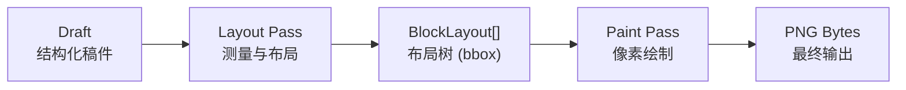
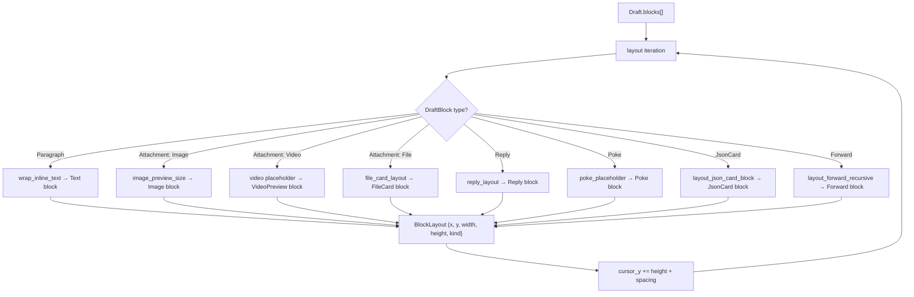
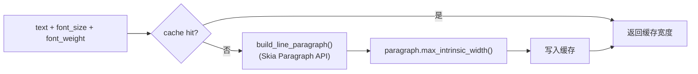
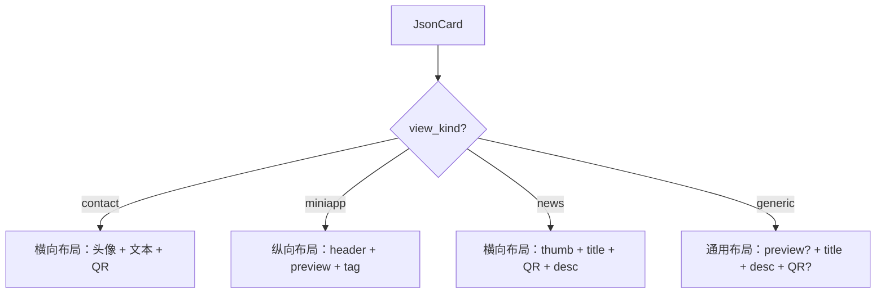
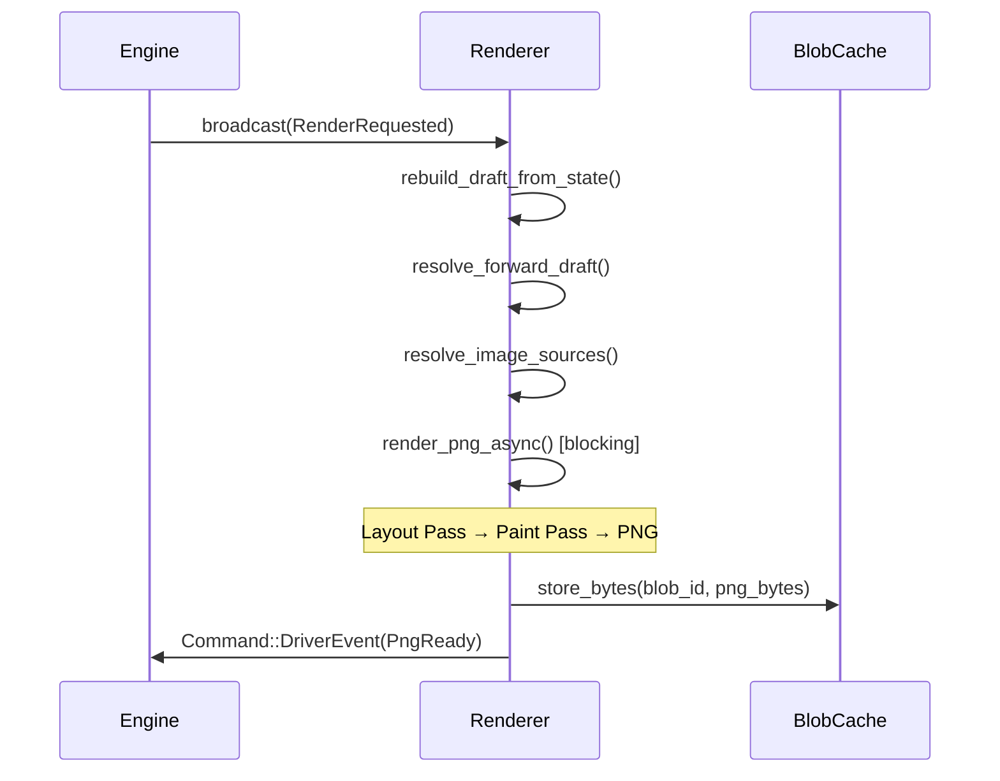

本文档阐述 OQQWall_rust 渲染管线中"SVG 作为中间表示"这一架构概念的来龙去脉、设计理念及其在实际代码中的落地形态。项目最初设计了一套完整的 SVG 中间表示管线，随后在工程实践中演进为 Skia 直绘方案，但 SVG 中间表示的核心设计思想——**两段式渲染（Layout → Paint）**——至今仍深刻塑造着渲染器的架构。

## 设计动机与历史沿革

原版 `gotohtml.sh` 的渲染链路是：OneBot JSON → `progress-lite-json.sh` 归一化 → `gotohtml.sh` 生成 HTML/CSS → 浏览器渲染 → 截图输出 PNG。这条链路依赖外部浏览器引擎完成排版和渲染，不适合打包为单二进制部署。

Rust 版的目标是**直接输出 PNG**，同时尽可能复刻原版的页面结构、视觉样式与信息密度。SVG 被选为内部中间表示，原因在于：

1. **声明式布局语义**：SVG 的 `<rect>`、`<text>`、`<image>` 等元素天然映射 UI 组件，可将排版结果表达为一棵节点树
2. **坐标确定性**：SVG 使用绝对坐标定位，契合事件溯源架构对"同一输入必须产生字节级稳定输出"的要求
3. **可调试性**：中间 SVG 可直接在浏览器中打开审查，降低排版调试成本
4. **解耦渲染与排版**：将布局计算（Layout Pass）与像素绘制（Paint Pass）分离，各自独立测试和演进

然而，SVG 作为 XML 格式存在固有局限：没有自动换行引擎、无法内联播放视频、不支持 `object-fit: cover` 等 CSS 特性，且需要通过 `resvg` 等二次渲染才能得到位图，增加了复杂度和性能开销。因此项目最终演进为**直接使用 Skia Canvas 绘制**，保留了两段式架构但跳过了 SVG 中间产物。

Sources: [typesetting&render.md](docs/typesetting&render.md#L1-L5), [toward_skia.md](docs/toward_skia.md#L1-L27)

## 两段式渲染架构

无论中间表示是 SVG 字符串还是 Skia Canvas 指令，渲染管线始终遵循两段式设计：



**Layout Pass** 负责：接收 `Draft`（由 `DraftBlock` 组成的有序列表），结合运行时配置（画布宽度、最大高度、字体集合），将每个 `DraftBlock` 测量为带有精确边界框（`x, y, width, height`）的 `BlockLayout`。此阶段不产生任何像素，仅执行文本度量、换行计算和布局累积。

**Paint Pass** 负责：遍历 `BlockLayout` 数组，根据每个块的 `BlockKind` 调用对应的绘制函数，在 Skia Surface 上输出最终像素。分页逻辑也在此阶段执行——当内容总高度超过 `max_height_px` 时，将布局树切分为多个页面范围，逐页生成独立的 PNG。



Sources: [renderer.rs](crates/drivers/src/renderer.rs#L2284-L2334), [renderer.rs](crates/drivers/src/renderer.rs#L2393-L2834)

## 输入结构：Draft 与 DraftBlock

渲染器的输入是 `Draft`，它由 `core` crate 定义，是一个 `Vec<DraftBlock>` 的有序列表。每条入站消息在归一化后被转换为一组 `DraftBlock`，类型包括：

| DraftBlock 变体 | 语义 | 布局产物 |
|-----------------|------|----------|
| `Paragraph { text }` | 文本气泡，支持内联表情和 emoji | `BlockKind::Text { lines }` |
| `Attachment { kind: Image, ... }` | 图片/贴纸 | `BlockKind::Image { image }` |
| `Attachment { kind: Video, ... }` | 视频（抽首帧预览） | `BlockKind::VideoPreview { image }` |
| `Attachment { kind: File, ... }` | 文件卡片（按扩展名选 icon） | `BlockKind::FileCard { ... }` |
| `Reply { preview }` | 回复引用预览 | `BlockKind::Reply { ... }` |
| `Poke` | 戳一戳 | `BlockKind::Poke { ... }` |
| `JsonCard { raw }` | QQ 卡片（contact/miniapp/news/generic） | `BlockKind::JsonCard { ... }` |
| `Forward { items }` | 合并转发（支持嵌套） | `BlockKind::Forward { ... }` |

`DraftBlock` 中的特殊类型（Reply、JsonCard、Forward、Poke）通过带编码的标记字符串（如 `[[reply:...]]`、`[[jsoncard:...]]`）在文本段落中内联传递，由 `parse_special_marker()` 函数在构建 Draft 时解析。

Sources: [draft.rs](crates/core/src/draft.rs#L12-L40), [draft.rs](crates/core/src/draft.rs#L92-L157)

## 布局树：BlockLayout 与 BlockKind

Layout Pass 的输出是一棵扁平的 `BlockLayout` 数组。每个节点携带：

```rust
struct BlockLayout {
    x: u32,       // 左上角 x 坐标（px）
    y: u32,       // 左上角 y 坐标（px）
    width: u32,   // 宽度（px）
    height: u32,  // 高度（px）
    kind: BlockKind, // 块的语义类型
}
```

`BlockKind` 枚举携带该块渲染所需的全部数据，例如：

- **Text** 块携带 `Vec<InlineLine>`，每个 `InlineLine` 包含 `Vec<InlineRun>`（文本片段或表情占位符）和行宽
- **JsonCard** 块携带 `JsonCardView`（卡片元信息：标题、描述、跳转 URL、媒体源）和预渲染的文本行
- **Forward** 块递归携带 `Vec<ForwardLayoutItem>`，每个 item 内嵌自己的 `Vec<BlockLayout>`

布局采用**竖向流式排列**：每个块从 `cursor_y` 位置开始，渲染完成后 `cursor_y += height + spacing`。所有块默认左对齐于 `content_padding` 位置。

Sources: [renderer.rs](crates/drivers/src/renderer.rs#L174-L276), [renderer.rs](crates/drivers/src/renderer.rs#L2390-L2391)

## 文本度量与换行策略

文本排版是 SVG 中间表示设计中最具挑战性的部分，因为 SVG 不提供自动换行引擎，所有断行必须在 Layout Pass 中由应用层完成。Rust 渲染器通过 `TextMeasurer` 和 `wrap_inline_text()` 实现这一能力。

### TextMeasurer

`TextMeasurer` 封装了 Skia 的 `textlayout::Paragraph` API，提供带缓存的文本宽度测量。其核心方法 `measure_text_width()` 接受文本、字号和字重，返回像素宽度。测量结果通过 `TextMeasureKey` 缓存，避免重复计算。



### 换行算法

`wrap_inline_text()` 实现了基于**原子（atom）粒度**的贪婪换行算法：

1. 将输入文本解析为 `InlineAtom` 序列（`Char`、`Face`、`Emoji` 三种原子类型）
2. 逐原子累加宽度（字符宽度由 `TextMeasurer` 测量，表情/face 按固定尺寸计算）
3. 当行宽超过 `max_width` 时，回退到最近的断点（空格、标点等 `is_break` 字符）
4. 若无断点可回退，则在当前原子处硬断（实现 `word-break: break-word` 语义）
5. 对每段硬换行（`\n`）独立执行上述流程

对于非内联文本（如卡片标题、描述），使用更简单的 `wrap_text()` 函数，按 `char` 粒度换行。

Sources: [renderer.rs](crates/drivers/src/renderer.rs#L346-L411), [renderer.rs](crates/drivers/src/renderer.rs#L6817-L6938), [renderer.rs](crates/drivers/src/renderer.rs#L6980-L7050)

## 布局常量与设计 Token

SVG 中间表示设计文档将原版 `gotohtml.sh` 的 CSS 变量抽象为"设计 Token"。在 Skia 直绘实现中，这些 Token 被固化为渲染函数内的常量：

| 常量类别 | 示例值 | 对应原版 CSS |
|----------|--------|-------------|
| 画布宽度 | `1152 px`（输出），`384 px`（逻辑） | `width: 4in` @ 96 DPI × 3× 缩放 |
| 容器内边距 | `20 px`（页面），`15 px`（内容区） | `padding: 20px` |
| 气泡内边距 | `8 px`（左右），`6 px`（上下） | `.bubble { padding: 4px 8px }` |
| 圆角半径 | `12 px` | `border-radius: 12px` |
| 阴影参数 | blur=2.5, alpha=0.10 | `box-shadow: 0 0 5px rgba(0,0,0,0.10)` |
| 字号 | title=32, body=16, meta=12 | `font-size: 24/14/12` |
| 行高 | body=22 px | `line-height: 1.5` |
| 头像尺寸 | `50 px` | `avatar_size: 50px` |
| QR 码尺寸 | `48 px` | `qr_size: 48px` |
| 卡片最大宽 | `276 px` | `card_max_width: 276px` |
| 文件图标尺寸 | `40 px` | `file_icon_size: 40px` |
| 缩放因子 | `3`（3× 超采样） | — |

渲染器使用 **3× 超采样**：逻辑画布宽度为 `canvas_width_px / 3`（384 px），输出画布宽度为 `canvas_width_px`（1152 px），通过 `canvas.scale(3.0)` 实现高清渲染。

Sources: [renderer.rs](crates/drivers/src/renderer.rs#L65-L103), [renderer.rs](crates/drivers/src/renderer.rs#L2290-L2326)

## 各消息类型的布局规范

### 文本气泡（Text）

文本气泡采用"fit-content"宽度策略：先测量所有行的最大宽度 `max_line_w`，气泡宽度 = `min(max_line_w + padding, content_width)`。气泡高度 = `line_count × line_height + padding_tb × 2`。气泡背景为白色圆角矩形，带 shadow-sm 投影。

内联表情（face）和彩色 emoji 在 Layout 阶段被识别为 `InlineAtom::Face` 和 `InlineAtom::Emoji`，占用固定宽度（`face_size` = 16 px），在 Paint 阶段以图片形式绘制到对应坐标。

### 图片块（Image）

图片块的最大宽度为内容区宽度的一定比例，最大高度为固定值。尺寸优先级为：blob 元信息（真实宽高）> OneBot 段携带宽高 > 占位比例（4:3）。图片使用 `draw_image_cover_rounded()` 实现居中裁剪 + 圆角裁剪，对齐原版 CSS 的 `object-fit: cover; border-radius: 12px`。

### QQ 卡片（JsonCard）

QQ 卡片是最复杂的布局类型，支持四种视图变体：



卡片解析通过 `parse_json_card_view()` 完成，它对原始 JSON 做宽容解析（处理 `&#44;` 转义、`\\/` 转义），从多种可能的字段路径中提取标题、描述、跳转 URL、媒体源等信息。QR 码通过 `draw_qr_code()` 使用纯 Rust `qrcode` 库生成矢量矩形模块。

Sources: [renderer.rs](crates/drivers/src/renderer.rs#L434-L575), [renderer.rs](crates/drivers/src/renderer.rs#L5628-L5730)

### 合并转发（Forward）

合并转发支持递归嵌套（最大深度 `MAX_FORWARD_DEPTH` = 4）。每层转发渲染为：标题文本"合并转发聊天记录" + 左侧蓝色竖线（3px, #71A1CC）+ 缩进内容区。内层转发再次缩进，形成层次化的视觉结构。

### 水印（Watermark）

水印实现严格遵循确定性原则，与 SVG 中间表示设计文档中的规范完全一致：

1. **种子派生**：`watermark_seed = FNV-1a(post_id_hex + watermark_text)`
2. **PRNG**：使用 xorshift64 确定性随机数生成器
3. **平铺网格**：按 480px 间距铺满画布，奇数行交错偏移半个间距
4. **抖动**：每个水印印记的 x/y 坐标添加 `[-jitter, +jitter]` 范围内的确定性偏移
5. **旋转**：每个印记围绕自身中心旋转 -24°

这确保了同一 `post_id` 和 `watermark_text` 组合始终产生完全相同的水印图案，满足事件溯源回放的确定性要求。

Sources: [renderer.rs](crates/drivers/src/renderer.rs#L5182-L5295)

## 分页机制

当内容总高度超过 `max_height_px`（默认 6912 px，即逻辑 2304 px）时，渲染器将布局树切分为多个页面。分页算法 `paginate_render_pages()` 在块边界处切割，确保单个块不跨页。每页生成独立的 PNG 文件，最终以 `RenderEvent::PngBatchReady` 事件携带多个 `BlobId` 发布。

分页的最小页面高度为画布宽度（保证每页至少为正方形），避免产生过窄的长条图片。

Sources: [renderer.rs](crates/drivers/src/renderer.rs#L2836-L2858), [renderer.rs](crates/drivers/src/renderer.rs#L1891-L1910)

## 渲染确定性保障

SVG 中间表示设计文档强调"同一输入必须字节级稳定输出"。Skia 直绘方案通过以下机制实现这一要求：

1. **整数坐标**：所有布局坐标使用 `u32` 整数，避免浮点差异
2. **确定性水印**：PRNG 种子由内容哈希派生，不依赖系统随机源
3. **稳定遍历顺序**：布局和绘制严格按输入 `Draft.blocks` 顺序进行
4. **固定缩放因子**：3× 超采样比例硬编码，不随环境变化
5. **固定字体集**：内置 `PingFangSC-Regular.otf`，不依赖系统字体回退链的不确定性

Sources: [typesetting&render.md](docs/typesetting&render.md#L634-L641), [renderer.rs](crates/drivers/src/renderer.rs#L2324-L2325)

## 渲染管线中的事件流

渲染器作为事件驱动的异步任务运行，监听 `RenderEvent::RenderRequested` 事件，完成后发布 `RenderEvent::PngReady` 或 `RenderEvent::PngBatchReady`：



渲染器维护 `ImageMemoryCache` 缓存已解码的图片资源，避免同一图片在多次渲染请求中重复解码。图片资源通过 `RenderImageSources` 结构体按块索引组织，与 `Draft.blocks` 一一对应。

Sources: [renderer.rs](crates/drivers/src/renderer.rs#L1745-L1794), [renderer.rs](crates/drivers/src/renderer.rs#L1840-L1910), [event.rs](crates/core/src/event.rs#L170-L191)

## 从 SVG 中间表示到 Skia 直绘的演进

SVG 中间表示设计最初计划的管线是：`Layout → SVG DOM 构建 → resvg 光栅化 → PNG`。实际实现演进为 `Layout → Skia Canvas 绘制 → PNG`，跳过了 SVG 序列化和解析环节。这一演进带来了以下改进：

| 维度 | SVG 中间表示方案 | Skia 直绘方案（当前） |
|------|-----------------|---------------------|
| 文本换行 | 应用层实现，需自建字体度量 | `skia_safe::textlayout::Paragraph` 原生支持 |
| 内联图片 | SVG `<image>` + base64 编码 | `ParagraphBuilder::add_placeholder()` + 坐标提取 |
| 阴影效果 | SVG filter（`feDropShadow`） | `image_filters::drop_shadow_only()` |
| 圆角裁剪 | SVG `clipPath` + `rect rx/ry` | `canvas.clip_rrect()` |
| 视频预览 | SVG 无法表达，需降级 | 直接抽帧 + 绘制播放图标 |
| 性能 | SVG 解析 + resvg 光栅化 | 直接光栅化，无中间序列化开销 |
| 确定性 | SVG 字符串拼接顺序敏感 | Skia 渲染顺序由代码控制 |

尽管 SVG 不再作为实际的中间产物，两段式架构的设计精髓——**将布局计算与像素绘制严格分离**——被完整保留。`BlockLayout` 和 `BlockKind` 本质上就是 SVG `<rect>`、`<text>`、`<image>` 的结构化等价物。

Sources: [toward_skia.md](docs/toward_skia.md#L1-L113), [typesetting&render.md](docs/typesetting&render.md#L145-L190)

## 资源打包与字体策略

渲染器依赖的静态资源通过 `build.rs` 在编译期嵌入二进制：

| 资源 | 路径 | 用途 |
|------|------|------|
| 匿名头像 | `res/Anonymous_avatar.png` | 匿名投稿的头像占位 |
| 正文字体 | `res/fonts/PingFangSC-Regular.otf` | 文本度量与渲染 |
| 表情配置 | `res/face/default_config.json` | QQ 表情 ID 到图片的映射 |
| Emoji 元数据 | `res/emoji_png/apple_color_emoji/metadata.json` | 彩色 emoji 图片映射 |
| 文件图标 | `res/doc.png`, `res/apk.png`, ... | 文件卡片类型图标 |

字体集合通过 `build_font_collection()` 初始化：先注册内置的 `PingFangSC-Regular.otf` 为 asset font manager，再附加系统字体作为 fallback（`FontMgr::new()`）。