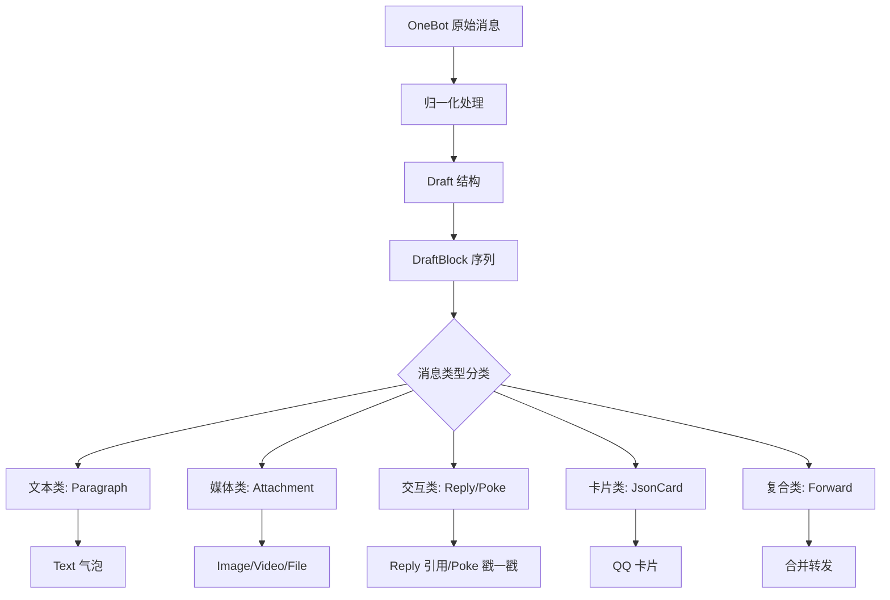
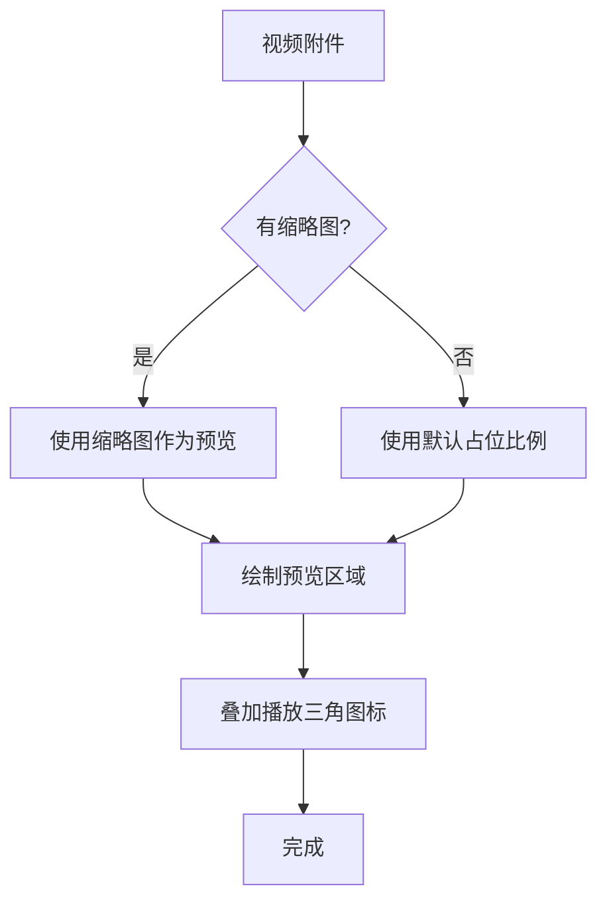
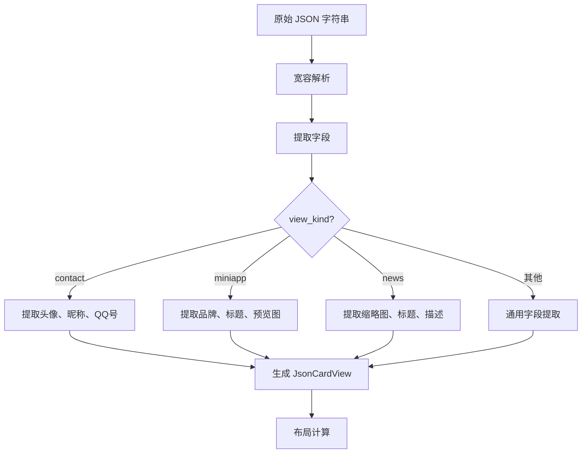
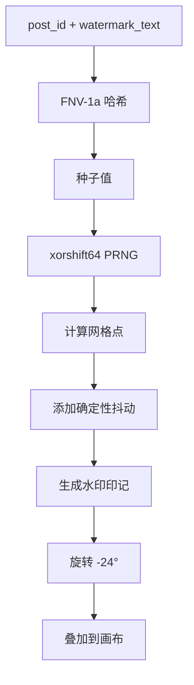

本文档详细阐述 OQQWall_rust 渲染管线中各种消息类型的排版实现机制。系统将结构化的 `Draft` 数据通过两阶段流水线（Layout → Paint）转换为可视化的 PNG 图片，每种消息类型都有独特的布局算法和视觉呈现规则。

## 消息类型架构概览

OQQWall_rust 的消息排版系统基于 **Draft 数据模型** 构建，将原始 OneBot 消息归一化为统一的 `DraftBlock` 枚举序列。渲染器不直接处理原始协议数据，而是消费经过标准化处理的结构化稿件。



每种 `DraftBlock` 变体在布局阶段被转换为对应的 `BlockKind`，携带完整的渲染数据。这种设计实现了**数据与表现的分离**，使得消息类型的扩展和样式调整互不影响。

Sources: [draft.rs](crates/core/src/draft.rs#L12-L40), [renderer.rs](crates/drivers/src/renderer.rs#L161-L218)

## Draft 数据模型与消息分类

### DraftBlock 枚举定义

`DraftBlock` 是消息排版的核心数据结构，定义了所有可渲染的消息块类型：

| DraftBlock 变体 | 语义描述 | 布局产物 | 视觉特征 |
|-----------------|----------|----------|----------|
| `Paragraph { text }` | 纯文本段落 | `BlockKind::Text` | 白色圆角气泡，支持内联表情 |
| `Attachment { kind: Image, ... }` | 图片/贴纸 | `BlockKind::Image` | 居中裁剪预览，圆角阴影 |
| `Attachment { kind: Video, ... }` | 视频文件 | `BlockKind::VideoPreview` | 媒体卡片 + 播放图标 |
| `Attachment { kind: File, ... }` | 文件附件 | `BlockKind::FileCard` | 文件图标 + 文件名 + 大小 |
| `Reply { preview }` | 回复引用 | `BlockKind::Reply` | 左侧蓝色竖线 + 引用内容 |
| `Poke` | 戳一戳 | `BlockKind::Poke` | 图片或 `[戳一戳]` 文字 |
| `JsonCard { raw }` | JSON 卡片 | `BlockKind::JsonCard` | 多种卡片布局 + QR 码 |
| `Forward { items }` | 合并转发 | `BlockKind::Forward` | 嵌套容器 + 蓝色竖线 |

特殊块类型（Reply、JsonCard、Forward、Poke）通过带编码的标记字符串在文本段落中内联传递，由 `parse_special_marker()` 函数解析。这种设计允许在单个文本段落中混合普通文本和特殊消息类型。

Sources: [draft.rs](crates/core/src/draft.rs#L12-L40), [draft.rs](crates/core/src/draft.rs#L92-L157)

### MediaKind 枚举

媒体附件通过 `MediaKind` 枚举进一步细分：

```rust
pub enum MediaKind {
    Image,      // 图片
    Video,      // 视频
    File,       // 文件
    Audio,      // 音频
    Other,      // 其他
    Sticker,    // 贴纸
}
```

每种媒体类型在布局阶段有对应的处理逻辑，确保视觉呈现符合其语义特征。

Sources: [draft.rs](crates/core/src/draft.rs#L85-L93)

## 布局算法与坐标系统

### 画布与坐标系

渲染器使用 **逻辑坐标** 进行所有布局计算，最终通过 3× 缩放因子映射到物理像素：

| 参数 | 逻辑值 | 物理值 | 说明 |
|------|--------|--------|------|
| 画布宽度 | 384px | 1152px | 对应原版 4in@96DPI |
| 最大高度 | 2304px | 6912px | 长内容分页阈值 |
| 缩放因子 | 1× | 3× | 超采样高清渲染 |

布局采用**单列流式排列**，所有块从上到下依次放置，通过 `cursor_y` 游标追踪当前垂直位置。每个块渲染完成后，游标更新为 `cursor_y += height + spacing`。

```
逻辑坐标系 (384 × H)
┌─────────────────────────────────┐
│ padding=20                      │
│  ┌───────────────────────────┐  │
│  │ Header (avatar + title)   │  │
│  ├───────────────────────────┤  │
│  │ Block 1 (Text bubble)     │  │
│  │ Block 2 (Image preview)   │  │
│  │ Block 3 (Reply box)       │  │
│  │ ...                       │  │
│  └───────────────────────────┘  │
│ padding=20                      │
└─────────────────────────────────┘
        ↓ ×3 scale
物理像素 (1152 × 3H)
```

### 设计 Token 与常量

渲染器使用一套统一的设计 Token 来控制视觉样式，这些 Token 对齐原版 `gotohtml.sh` 的 CSS 变量：

| Token 类别 | 参数名 | 值 | CSS 等价 |
|-----------|--------|-----|---------|
| 画布 | `canvas_width_px` | 384px（逻辑） | `width: 4in` @ 96 DPI |
| 内边距 | `padding` | 20px | `padding: 20px` |
| 内容区内边距 | `content_padding` | 15px | 区域内边距 |
| 气泡内边距 | `bubble_pad` | 8px×6px | `.bubble { padding: 4px 8px }` |
| 圆角半径 | `radius_lg` | 12px | `border-radius: 12px` |
| 阴影参数 | `shadow_sm` | blur=2.5, α=0.10 | `box-shadow: 0 0 5px rgba(0,0,0,0.10)` |
| 字号 | `font_size` | 16px | `font-size: 14px`（逻辑） |
| 行高 | `line_height` | 22px | `line-height: 1.5` |
| 头像尺寸 | `avatar_size` | 50px | `avatar_size: 50px` |
| QR 码尺寸 | `qr_size` | 48px | `qr_size: 48px` |
| 卡片最大宽 | `card_max_width` | 276px | `card_max_width: 276px` |
| 文件图标尺寸 | `file_icon_size` | 40px | `file_icon_size: 40px` |

Sources: [renderer.rs](crates/drivers/src/renderer.rs#L2284-L2340), [renderer.rs](crates/drivers/src/renderer.rs#L65-L103)

## 文本消息排版（Text）

### 布局算法

文本消息是排版系统中最基础也最复杂的类型。布局算法 `wrap_inline_text()` 实现了基于**原子粒度**的贪婪换行：

1. **原子解析**：将输入文本解析为 `InlineAtom` 序列
   - `Char(char)`：普通字符
   - `Face(String)`：QQ 表情标记
   - `Emoji(u16)`：Emoji 码点

2. **宽度测量**：使用 `TextMeasurer` 封装 Skia Paragraph API，测量每个原子的像素宽度
   - 普通字符：通过字体度量测量
   - 表情/Emoji：固定宽度 `face_size`（16px）

3. **贪婪换行**：逐原子累加宽度，当超过 `max_width` 时回退到最近断点
   - 断点识别：空格、标点等 `is_break` 字符
   - 硬断机制：无断点时在当前原子处强制换行（`word-break: break-word`）

4. **气泡尺寸计算**：
   ```
   bubble_w = min(max_line_w + padding, content_width)
   bubble_h = line_count × line_height + padding_tb × 2
   ```

### 视觉特征

| 属性 | 值 | 说明 |
|------|-----|------|
| 背景色 | 白色 (#FFFFFF) | 纯白背景 |
| 圆角半径 | 12px | 圆角矩形 |
| 阴影 | shadow-sm | 轻微投影效果 |
| 内边距 | 8px×6px | 左右×上下 |
| 文本颜色 | 黑色 (#000000) | 主要文本色 |
| 行高 | 22px | 固定行高 |

### 内联元素支持

文本气泡支持三种内联元素类型：

| 元素类型 | 数据结构 | 渲染方式 | 尺寸 |
|----------|---------|---------|------|
| 纯文本 | `InlineRun::Text` | Paragraph 绘制 | 自动测量 |
| QQ 表情 | `InlineRun::Face` | `res/face/{id}.png` 图片 | 16×16px |
| Emoji | `InlineRun::Emoji` | Apple Color Emoji PNG | 16×16px |

Sources: [renderer.rs](crates/drivers/src/renderer.rs#L2393-L2450), [renderer.rs](crates/drivers/src/renderer.rs#L6817-L6938), [renderer.rs](crates/drivers/src/renderer.rs#L4839-L4856)

## 图片消息排版（Image）

### 尺寸计算

图片消息的尺寸计算遵循严格的优先级规则：

1. **真实尺寸优先**：如果 blob 缓存中有图片元信息（宽度、高度），使用真实比例
2. **段携带尺寸**：OneBot 消息段中携带的宽高信息
3. **占位比例**：默认 4:3 比例作为后备

尺寸约束：
- 最大宽度：内容区宽度的 50%
- 最大高度：300px
- 保持原始宽高比

计算公式：
```
scale_w = max_width / orig_w
scale_h = max_height / orig_h
scale = min(scale_w, scale_h, 1.0)
final_w = orig_w × scale
final_h = orig_h × scale
```

### 渲染方式

图片使用 `draw_image_cover_rounded()` 实现**居中裁剪 + 圆角裁剪**：

1. 计算源图片与目标区域的缩放比
2. 居中裁剪源图片区域
3. 通过 `canvas.clip_rrect()` 裁切圆角区域
4. 以线性采样绘制到目标矩形

视觉特征：
- 背景色：白色 (#FFFFFF)
- 圆角半径：12px
- 阴影：shadow-md（blur=3.0, α=0.20）
- 边框：1px #E0E0E0

Sources: [renderer.rs](crates/drivers/src/renderer.rs#L2471-L2520), [renderer.rs](crates/drivers/src/renderer.rs#L5986-L6045)

## 视频消息排版（Video）

### 占位卡片设计

由于 SVG/PNG 无法直接播放视频，视频消息渲染为**占位卡片**：

1. **布局结构**：与图片类似的媒体预览区域
2. **播放图标**：在预览区域中心绘制三角播放图标
3. **文件信息**：可选显示文件名或 URL

### 渲染逻辑



视觉特征：
- 外观：与图片块相似
- 特殊元素：半透明播放三角图标
- 尺寸：遵循图片的尺寸约束规则

Sources: [renderer.rs](crates/drivers/src/renderer.rs#L2521-L2550), [renderer.rs](crates/drivers/src/renderer.rs#L6014-L6045)

## 文件消息排版（File）

### 布局算法

文件消息采用**卡片式布局**，包含文件图标、文件名和文件大小：

1. **图标选择**：根据文件扩展名映射到对应的图标文件
2. **文件名处理**：自动换行，最大宽度限制
3. **大小格式化**：自动转换为 B/KB/MB 单位

### 扩展名图标映射

渲染器内置了一套完整的扩展名到图标的映射表：

| 文件类型 | 扩展名 | 图标文件 |
|----------|--------|----------|
| 文档 | doc/docx/odt | `doc.png` |
| 应用 | apk/ipa | `apk.png` |
| 磁盘镜像 | dmg/iso | `dmg.png` |
| 演示文稿 | ppt/pptx/key | `ppt.png` |
| 电子表格 | xls/xlsx/numbers | `xls.png` |
| 设计文件 | ai/ps/sketch | `ps.png` |
| 字体 | ttf/otf/woff | `font.png` |
| 图片 | png/jpg/gif/bmp/webp | `image.png` |
| 音频 | mp3/wav/flac/aac/ogg | `audio.png` |
| 视频 | mp4/mkv/mov/avi/webm | `video.png` |
| 压缩包 | zip/7z | `zip.png` |
| 压缩包 | rar | `rar.png` |
| 安装包 | pkg | `pkg.png` |
| PDF | pdf | `pdf.png` |
| 可执行文件 | exe/msi | `exe.png` |
| 代码 | sh/py/c/cpp/js/ts/go/rs/java | `code.png` |
| 文本 | txt/md/note | `txt.png` |
| 其他 | 未知扩展名 | `unknown.png` |

### 布局结构

```
┌─────────────────────────────────────┐
│ padding=7                           │
│  ┌─────────────────────┬──────────┐ │
│  │ 文件名 (自动换行)   │ 图标     │ │
│  │ 大小: 1.2 MB        │ (40×40)  │ │
│  └─────────────────────┴──────────┘ │
│ padding=7                           │
└─────────────────────────────────────┘
```

视觉特征：
- 背景色：白色 (#FFFFFF)
- 圆角半径：12px
- 阴影：shadow-sm
- 布局方向：row-reverse（图标在右侧）

Sources: [renderer.rs](crates/drivers/src/renderer.rs#L2551-L2650), [renderer.rs](crates/drivers/src/renderer.rs#L4930-L5029)

## 引用回复排版（Reply）

### 布局算法

引用回复消息采用**嵌套卡片**设计，左侧有蓝色竖线标识：

1. **外层容器**：白色圆角矩形，带阴影
2. **内层容器**：浅灰色背景 (#FAFAFA)，左侧蓝色竖线 (3px, #71A1CC)
3. **内容区域**：
   - 元信息行：引用的消息发送者和时间
   - 正文行：引用的消息内容

### 尺寸计算

```
inner_width = frame.width - bubble_pad_left - bubble_pad_right
text_max_w = min(inner_width, 320) - accent_width - inner_pad_x × 2
height = bubble_pad_top + bubble_pad_bottom + inner_height + extra_height
```

### 视觉特征

| 属性 | 值 | 说明 |
|------|-----|------|
| 外层背景 | 白色 (#FFFFFF) | 外框背景 |
| 内层背景 | 浅灰 (#FAFAFA) | 引用区域背景 |
| 左侧竖线 | 3px #71A1CC | 蓝色标识线 |
| 元信息字号 | 14px | 发送者和时间 |
| 正文字号 | 16px | 引用内容 |
| 元信息颜色 | #666666 | 灰色文本 |
| 正文颜色 | #333333 | 深灰文本 |

Sources: [renderer.rs](crates/drivers/src/renderer.rs#L2651-L2750), [renderer.rs](crates/drivers/src/renderer.rs#L5072-L5159)

## 戳一戳排版（Poke）

### 实现方式

戳一戳消息有两种渲染模式：

1. **图片模式**：如果 `res/poke.png` 存在且可解码，显示图片
2. **文字模式**：否则显示 `[戳一戳]` 文字占位

### 尺寸计算

图片模式：
```
max_width = content_width / 2
max_height = 120px
scale = min(max_width / orig_w, max_height / orig_h, 1.0)
```

文字模式：使用默认字号 16px。

Sources: [renderer.rs](crates/drivers/src/renderer.rs#L2751-L2780), [renderer.rs](crates/drivers/src/renderer.rs#L5160-L5181)

## JSON 卡片排版（JsonCard）

JSON 卡片是排版系统中最复杂的类型，支持多种视图变体。

### 卡片类型识别

卡片类型通过 `view_kind` 字段识别，支持以下变体：

| view_kind | 卡片类型 | 布局特征 |
|-----------|----------|----------|
| `contact` | 联系人卡片 | 横向：头像 + 文本 + QR |
| `miniapp` | 小程序卡片 | 纵向：header + preview + tag |
| `news` | 新闻卡片 | 横向：thumb + title + QR + desc |
| 其他 | 通用卡片 | 通用布局 |

### 卡片解析流程



解析器对原始 JSON 做宽容处理：
- 处理 `&#44;` 转义为 `,`
- 处理 `\\/` 转义为 `/`
- 从多种可能的字段路径中提取信息

### 各类型卡片布局

#### 联系人卡片 (contact)

```
┌─────────────────────────────────────┐
│ padding=8                           │
│  ┌──────┬─────────────────┬──────┐  │
│  │ 头像 │ 昵称 (bold)     │ QR   │  │
│  │48×48 │ QQ 号码 (gray)  │48×48 │  │
│  │      │ 标签 (gray)     │      │  │
│  └──────┴─────────────────┴──────┘  │
│ padding=8                           │
└─────────────────────────────────────┘
```

#### 小程序卡片 (miniapp)

```
┌─────────────────────────────────────┐
│ padding=8                           │
│  ┌─────────────────────────────┐    │
│  │ [品牌图标] 来源 (gray)      │    │
│  │ 标题 (bold)                 │    │
│  │                    [QR码]   │    │
│  ├─────────────────────────────┤    │
│  │ 预览图片 (宽度撑满)         │    │
│  ├─────────────────────────────┤    │
│  │ [标签图标] 标签文本 (gray)  │    │
│  └─────────────────────────────┘    │
│ padding=8                           │
└─────────────────────────────────────┘
```

#### 新闻卡片 (news)

```
┌─────────────────────────────────────┐
│ padding=8                           │
│  ┌──────┬─────────────────┬──────┐  │
│  │ 缩略 │ 标题 (bold)     │ QR   │  │
│  │ 图   │                 │48×48 │  │
│  │48×48 │                 │      │  │
│  └──────┴─────────────────┴──────┘  │
│  描述文本 (gray)                     │
│  [标签图标] 标签文本 (gray)          │
│ padding=8                           │
└─────────────────────────────────────┘
```

### QR 码生成

卡片中的 QR 码使用纯 Rust `qrcode` 库生成：

1. **URL 提取**：从卡片的 `jump_url` 字段提取目标 URL
2. **QR 生成**：使用 `qrcode` 库生成模块矩阵
3. **矢量绘制**：在 SVG 中绘制为矩形阵列

QR 码尺寸固定为 48×48px，背景白色，前景黑色。

Sources: [renderer.rs](crates/drivers/src/renderer.rs#L724-L923), [renderer.rs](crates/drivers/src/renderer.rs#L434-L575), [renderer.rs](crates/drivers/src/renderer.rs#L5628-L5730)

## 合并转发排版（Forward）

### 递归嵌套结构

合并转发支持递归嵌套，最大深度限制为 `MAX_FORWARD_DEPTH = 4`：

```mermaid
flowchart TD
    A[合并转发容器] --> B[标题: "合并转发聊天记录"]
    B --> C[蓝色竖线 (3px #71A1CC)]
    C --> D[缩进内容区]
    D --> E[子消息 1]
    D --> F[子消息 2]
    D --> G[子消息 N]
    E --> H{子消息类型}
    H --> I[文本气泡]
    H --> J[图片预览]
    H --> K[文件卡片]
    H --> L[嵌套转发]
    L --> M[再次缩进]
    M --> N[递归渲染]
```

### 布局规则

1. **标题行**：显示 "合并转发聊天记录" 文字
2. **容器结构**：左侧蓝色竖线 (3px, #71A1CC) + 内容区缩进 (17px)
3. **子消息渲染**：每个子消息独立布局，遵循各自的类型规则
4. **嵌套处理**：内部转发再次缩进，形成层次化的视觉结构

### 尺寸计算

```
width = min(content_width, 340)
child_x = content_padding + forward_child_indent (17px)
child_width = width - forward_child_indent
```

视觉特征：
- 外框：无背景，无阴影
- 左侧竖线：3px #71A1CC
- 缩进：17px
- 子消息间距：6px

Sources: [renderer.rs](crates/drivers/src/renderer.rs#L2781-L2834), [renderer.rs](crates/drivers/src/renderer.rs#L997-L1113), [renderer.rs](crates/drivers/src/renderer.rs#L4712-L4838)

## 水印实现机制

### 确定性原则

水印实现严格遵循**确定性原则**，确保同一输入始终产生完全相同的输出：

1. **种子派生**：`seed = FNV-1a(post_id_hex + watermark_text)`
2. **PRNG**：使用 xorshift64 确定性随机数生成器
3. **平铺网格**：按 480px 间距铺满画布
4. **抖动**：每个水印印记添加确定性偏移 `[-jitter, +jitter]`
5. **旋转**：每个印记围绕自身中心旋转 -24°

### 生成算法



### 参数配置

| 参数 | 默认值 | 说明 |
|------|--------|------|
| opacity | 0.12 | 透明度 |
| angle | 24° | 旋转角度（负值） |
| font_size | 40px | 字号 |
| tile | 480px | 平铺间距 |
| jitter | 10px | 抖动幅度 |

Sources: [renderer.rs](crates/drivers/src/renderer.rs#L5182-L5295)

## 分页策略与超长内容

### 分页阈值

当内容总高度超过 `max_height_px`（默认 2304px 逻辑像素）时，渲染器自动将内容拆分为多页：

| 配置项 | 默认值 | 说明 |
|--------|--------|------|
| `max_height_px` | 2304px | 最大页面高度 |
| `min_page_height` | 384px | 最小页面高度（等于画布宽度） |
| 输出文件命名 | `{post_id}_p{n}.png` | 多页文件命名规则 |

### 智能断页算法

分页算法 `paginate_render_pages()` 采用**智能断页**策略：

1. **块边界优先**：优先在块之间的间距中点处断页
2. **避免块拆分**：尽量不将单个块拆分到两页
3. **软断点**：如果软断点产生的页面过小（小于 `min_page_height / 2`），则强制使用硬断点
4. **硬断点**：当无法在块边界断开时，在块内部强制断页

Sources: [renderer.rs](crates/drivers/src/renderer.rs#L4088-L4138)

## 性能优化策略

### 文本测量缓存

`TextMeasurer` 维护一个 `HashMap<TextMeasureKey, u32>` 缓存，避免重复测量相同文本：

```rust
struct TextMeasureKey {
    font_size: u32,
    font_weight: u32,
    text: String,
}
```

缓存命中率对渲染性能有显著影响，特别是在处理大量重复文本时。

### 图片资源缓存

图片资源通过多级缓存机制管理：

1. **内存缓存**：`ImageMemoryCache` 存储已解码的图片
2. **Blob 缓存**：`BlobCache` 管理磁盘上的二进制资源
3. **远程资源**：通过 `MediaFetcher` 异步下载并缓存

### 字体资源管理

字体资源使用 `OnceLock` 实现线程安全的全局单例缓存：

```rust
static FONT_BYTES_CACHE: OnceLock<Vec<FontBytes>> = OnceLock::new();
```

避免每次渲染时重复读取磁盘字体文件。

Sources: [renderer.rs](crates/drivers/src/renderer.rs#L346-L411), [renderer.rs](crates/drivers/src/renderer.rs#L380-L390)

## 与原版系统的兼容性

### 对齐原版 `gotohtml.sh`

Rust 渲染器在设计上尽可能复刻原版 `gotohtml.sh` 的视觉效果：

| 特性 | 原版 HTML/CSS | Rust PNG 渲染器 | 差异说明 |
|------|--------------|----------------|----------|
| 页面结构 | 4in@96DPI | 384px 逻辑宽度 | 完全对齐 |
| 气泡样式 | `.bubble` 类 | 白色圆角矩形 | 视觉一致 |
| 图片约束 | `max-width:50%` | 内容区宽度 50% | 视觉一致 |
| 卡片布局 | 多种 CSS 类 | 对应 BlockKind | 布局逻辑一致 |
| 水印 | JS 生成 | 确定性 PRNG | 算法等价 |
| QR 码 | 浏览器生成 | 纯 Rust 库 | 矢量输出 |

### 确定性保证

同一 `Draft` 输入应输出**字节级稳定**的 PNG：

- 坐标使用整数 px
- 水印 jitter 使用种子 PRNG
- 节点遍历顺序稳定（按输入顺序）
- base64 编码固定（标准 base64，无换行）

Sources: [typesetting&render.md](docs/typesetting&render.md#L660-L666), [renderer.rs](crates/drivers/src/renderer.rs#L2272-L2284)

## 扩展与定制

### 添加新消息类型

要添加新的消息类型，需要：

1. **扩展 DraftBlock**：在 `draft.rs` 中添加新变体
2. **添加 BlockKind**：在 `renderer.rs` 中添加对应的布局数据结构
3. **实现布局算法**：在 Layout Pass 中添加新类型的测量和布局逻辑
4. **实现绘制函数**：在 Paint Pass 中添加新类型的绘制逻辑

### 样式定制

视觉样式通过设计 Token 控制，修改 `render_png_pages` 函数顶部的常量即可调整：

- 字号、行高、颜色
- 间距、圆角、阴影
- 卡片尺寸约束

Sources: [draft.rs](crates/core/src/draft.rs#L12-L40), [renderer.rs](crates/drivers/src/renderer.rs#L2284-L2340)

## 总结

OQQWall_rust 的消息类型排版系统通过**结构化数据模型**、**两阶段流水线**和**确定性渲染**，实现了高质量、可复现的消息可视化。每种消息类型都有独特的布局算法和视觉特征，共同构成了完整的排版解决方案。

系统设计遵循以下核心原则：
1. **数据驱动**：所有排版参数通过 Draft 数据模型传递
2. **类型安全**：使用 Rust 枚举确保消息类型处理的完整性
3. **性能优先**：多级缓存机制避免重复计算
4. **确定性**：相同输入产生字节级相同的输出
5. **可扩展**：模块化设计支持新消息类型的添加

这种设计使得渲染引擎既能满足生产环境的性能要求，又能保证事件溯源架构下的可重放性。