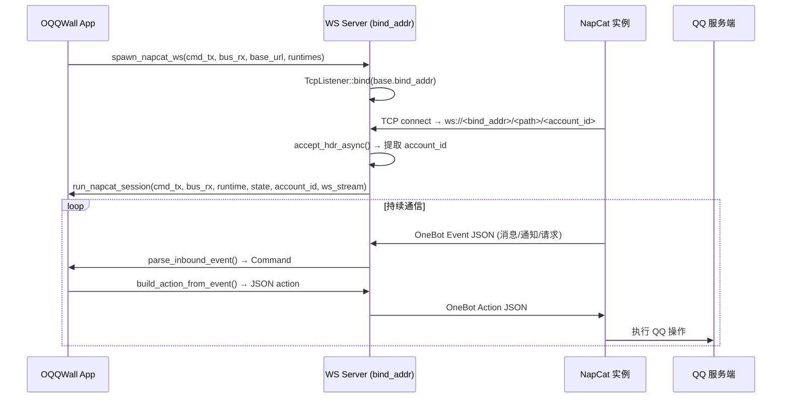
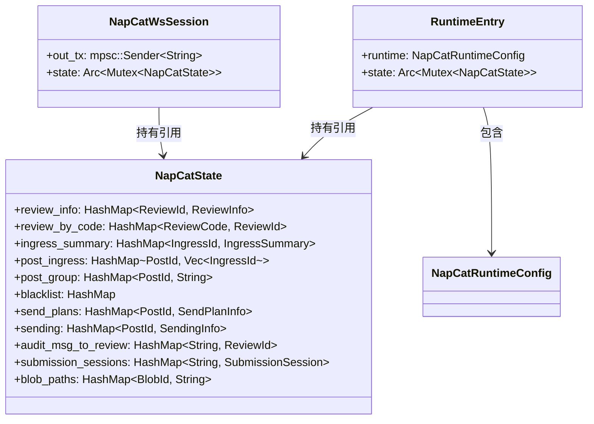
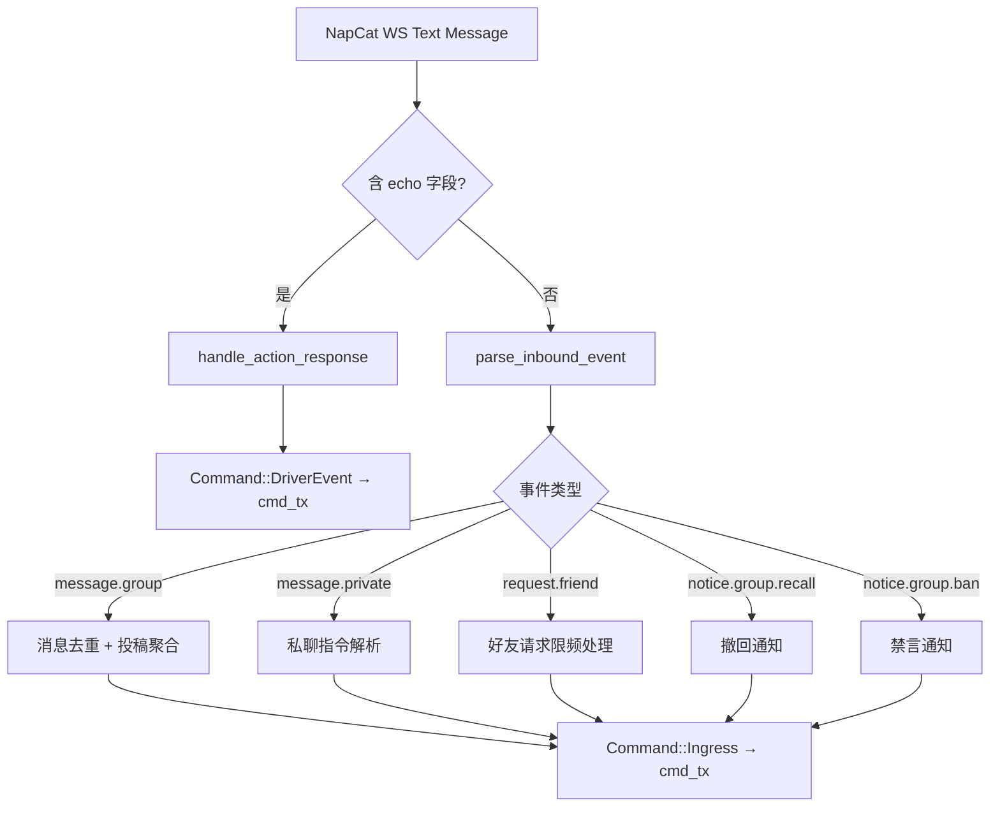
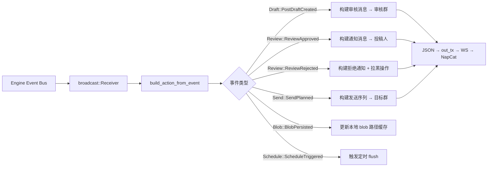
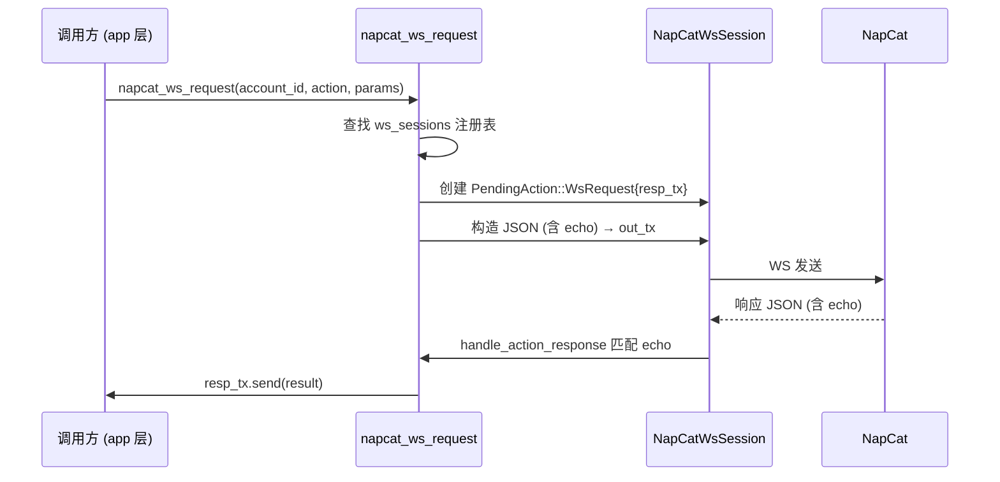

本文档详细说明 OQQWall 如何通过 NapCat OneBot 协议桥接 QQ 生态，实现消息收发、审核指令路由和群管理操作。NapCat 作为 QQ 协议的 OneBot v11 实现层，与 OQQWall 之间采用**反向 WebSocket** 模式建立长连接，所有通信均在此通道上完成双向事件交换。

## 连接架构概览

OQQWall 采用**反向 WebSocket（Reverse WS）**模式与 NapCat 通信：OQQWall 启动一个 TCP 监听端口，NapCat 作为客户端主动连接上来。每条连接通过 URL 路径中的 QQ 号进行身份识别和运行时路由。

连接建立时，系统会通过 `accept_hdr_async` 回调从 WebSocket 请求的 URI 路径中提取账号 ID，然后将其映射到对应的运行时配置。每个账号同时只允许一条活跃连接，重复连接会被静默丢弃。

Sources: [napcat.rs](crates/drivers/src/napcat.rs#L546-L735)、[connect.rs](crates/app/src/connect.rs#L24-L71)

## 配置模型

NapCat 连接的配置分为三层：**全局通用配置** → **组级配置** → **运行时配置对象**。配置文件中 `napcat_base_url` 字段决定了 WS 服务器的监听地址和路径前缀。

| 配置层 | 结构体 | 关键字段 | 作用 |
|--------|--------|----------|------|
| 全局 | `common` (config.json) | `napcat_base_url`, `napcat_access_token` | 所有组的默认值 |
| 组级 | `groups.<id>` (config.json) | 同上，可覆盖 | 单组独立配置 |
| 运行时 | `NapCatRuntimeConfig` | `napcat`, `group_id`, `accounts`, `audit_group_id` | 启动时构建的不可变配置 |

`NapCatConfig` 是最底层的连接凭证，仅包含 `base_url` 和可选的 `access_token`：

| 字段 | 类型 | 说明 |
|------|------|------|
| `base_url` | `String` | NapCat 反向 WS 地址，格式 `host:port/path` |
| `access_token` | `Option<String>` | 可选的鉴权 token |

反向 WS 的完整 URL 构造规则为 `ws://<napcat_base_url>/<QQ号>`。例如 `napcat_base_url = "127.0.0.1:3001/oqqwall/ws"` 且账号为 `3995477265`，则在 NapCat 端配置 `ws://127.0.0.1:3001/oqqwall/ws/3995477265`。

| 环境变量 | 覆盖目标 | 说明 |
|----------|----------|------|
| `OQQWALL_NAPCAT_BASE_URL` | 所有组的 `napcat_base_url` | 运行时全局覆盖 |
| `OQQWALL_NAPCAT_TOKEN` | 所有组的 `napcat_access_token` | 运行时全局覆盖 |

Sources: [napcat.rs](crates/drivers/src/napcat.rs#L63-L82)、[config.rs](crates/app/src/config.rs#L43-L55)、[config.md](docs/config.md#L51-L52)

## 会话管理与状态结构

每个 WebSocket 连接对应一个独立的 `NapCatWsSession`，内含消息发送通道和共享状态。系统通过全局静态注册表管理活跃会话，支持账号在线状态查询和跨会话请求。

`NapCatState` 是整个 NapCat 驱动的核心状态容器。它维护了审核信息索引、投稿映射、黑名单缓存、发送计划等所有运行时数据。启动时通过 `build_state_from_view` 从事件溯源快照重建；运行期间通过 `broadcast::Receiver` 订阅引擎事件总线实时更新。

系统支持**多账号多组**部署：相同 `base_url` 下的多个组共享同一个 TCP 监听器，通过账号 ID 路由到不同的 `RuntimeEntry`。每个组可配置多个 QQ 账号，首项为主账号，仅主账号处理审核消息发送和启动通知。

Sources: [napcat.rs](crates/drivers/src/napcat.rs#L203-L234)、[napcat.rs](crates/drivers/src/napcat.rs#L236-L399)

## 数据流：入站事件处理

NapCat 发送的 OneBot v11 事件经由 WebSocket 到达后，首先判断是否为 Action 响应（含 `echo` 字段），否则作为入站事件进入 `parse_inbound_event` 进行解析。解析结果为 `Command` 枚举，被发送到引擎的命令通道。

入站事件处理的关键逻辑包括：

| OneBot 事件 | 处理方式 | 产生的 Command |
|-------------|----------|----------------|
| `message.group` | 消息提取、转发展开、投稿聚合 | `Command::Ingress(IngressCommand)` |
| `message.private` | 审核指令解析、快捷回复匹配 | `Command::Ingress` 或 `Command::Review` |
| `request.friend` | 限频窗口去重、延迟审批 | `Command::Ingress` |
| `notice.group.msg_recall` | 关联 ingress_id 清理 | 通过事件总线间接处理 |
| `notice.group.ban` | 禁言状态更新 | 日志记录 |

消息提取过程中，系统会展开合并转发消息（最深 4 层递归），提取图片/文件/语音/视频等附件，并生成摘要文本用于审核展示。

Sources: [napcat.rs](crates/drivers/src/napcat.rs#L2004)、[napcat.rs](crates/drivers/src/napcat.rs#L785-L829)

## 数据流：出站动作构建

引擎产生的事件通过 `broadcast` 总线分发到所有活跃会话。`build_action_from_event` 函数根据事件类型构建对应的 OneBot Action JSON，通过会话的 `out_tx` 通道发送到 NapCat。

只有主账号（`is_effective_primary_account`）才会处理出站事件，避免多账号场景下的重复发送。系统支持的出站动作类型包括：

| 场景 | OneBot Action | 说明 |
|------|---------------|------|
| 审核消息发布 | `send_group_msg` | 向审核群发送投稿预览 + 审核码 |
| 通过通知 | `send_private_msg` | 通知投稿人审核通过 |
| 拒绝通知 | `send_private_msg` + `set_group_kick` | 通知原因 + 可选拉黑 |
| 定时发送 | `send_group_msg` | 按 send_schedule 触发的批量发送 |
| 好友申请处理 | `set_friend_add_request` | 自动通过/拒绝 + 延迟通知 |
| 启动通知 | `send_group_msg` | "系统已启动" 提示 |

Sources: [napcat.rs](crates/drivers/src/napcat.rs#L1018-L1080)、[napcat.rs](crates/drivers/src/napcat.rs#L836-L864)

## NapCat OneBot 事件兼容性

OQQWall 仅使用 NapCat OneBot v11 事件的一个子集。以下列出实际消费的事件类型：

| 事件分类 | 事件名 | 说明 | 使用状态 |
|----------|--------|------|----------|
| meta_event | `lifecycle.connect` | WebSocket 连接成功 | ✅ |
| meta_event | `heartbeat` | 心跳保活 | ✅ |
| message | `message.group` | 群聊消息（投稿入口） | ✅ |
| message | `message.private` | 私聊消息（审核指令） | ✅ |
| message_sent | `message_sent.group` | 自身群聊消息回显 | ✅ |
| request | `request.friend` | 好友申请 | ✅ |
| request | `request.group.add` | 加群请求 | ✅ |
| notice | `notice.group.recall` | 群消息撤回 | ✅ |
| notice | `notice.group.ban` | 群禁言 | ✅ |

系统不消费红包运气王、荣誉变更、戳一戳等娱乐性通知事件。

Sources: [napcat_onebot_event.md](docs/napcat_onebot_event.md#L1-L84)

## 跨会话请求机制

`napcat_ws_request` 提供了从应用层向特定账号的活跃 NapCat 会话发送同步请求的能力。它通过 `oneshot` 通道实现请求-响应配对，支持调用任意 OneBot API（如获取群成员信息、撤回消息等）。

此机制用于需要同步等待 NapCat 响应的场景，例如获取消息详情、查询群列表等。默认超时由通道的 `recv()` 阻塞控制。

Sources: [napcat.rs](crates/drivers/src/napcat.rs#L980-L1016)

## 调试与运维

系统内置了分级日志机制：`debug_assertions` 模式下所有 `debug_log!` 宏输出详细运行日志，生产构建中则完全消除。关键运行时事件（连接建立/断开、消息收发、错误）始终通过 `println!` 输出到标准输出。

| 日志事件 | 输出方式 | 触发条件 |
|----------|----------|----------|
| `NapCat WS 已连接: account_id=... group_id=...` | println | 每次 WS 连接建立 |
| `napcat ws disconnected: account_id=...` | debug_log | 连接断开 |
| `napcat ws action response: echo=... event=...` | debug_log | 收到 Action 响应 |
| `napcat ws inbound command: ...` | debug_log | 收到入站事件 |
| `napcat ws outbound action: group_id=... bytes=...` | debug_log | 发送出站动作 |
| `系统已启动` | WS 消息 | 主账号首次连接 |

启动通知通过 `STARTUP_NOTICE_SENT` 静态 `OnceLock` 保证每个审核群仅发送一次，防止多账号重复通知。

Sources: [napcat.rs](crates/drivers/src/napcat.rs#L51-L61)、[napcat.rs](crates/drivers/src/napcat.rs#L871-L878)

## 下一步阅读

- 了解消息从投稿到发送的完整流程，请参阅 [投稿处理流程](7-tou-gao-chu-li-liu-cheng)
- 了解审核指令如何被解析和执行，请参阅 [指令决策引擎](11-zhi-ling-jue-ce-yin-qing)
- 了解事件溯源如何驱动状态管理，请参阅 [事件溯源架构](9-shi-jian-su-yuan-jia-gou)
- 了解渲染后的图片如何通过 QZone 发送，请参阅 [QQ空间发送机制](16-qqkong-jian-fa-song-ji-zhi)
- 了解 NapCat OneBot 完整 API 参考，请查阅 [docs/napcat_onebot_doc.md](docs/napcat_onebot_doc.md)