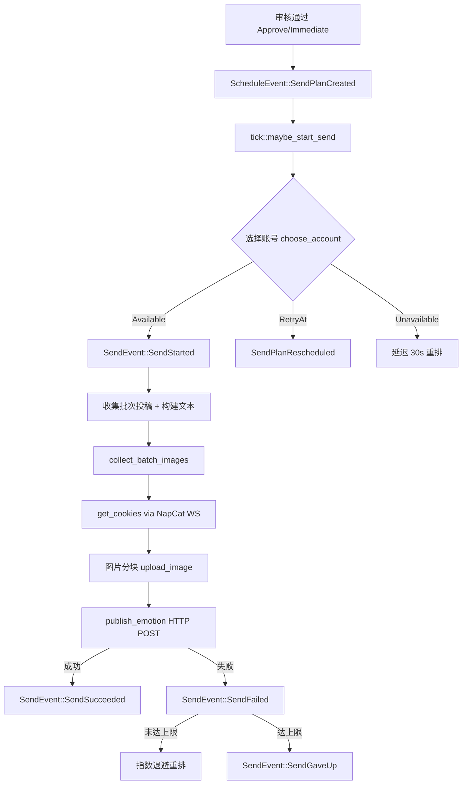
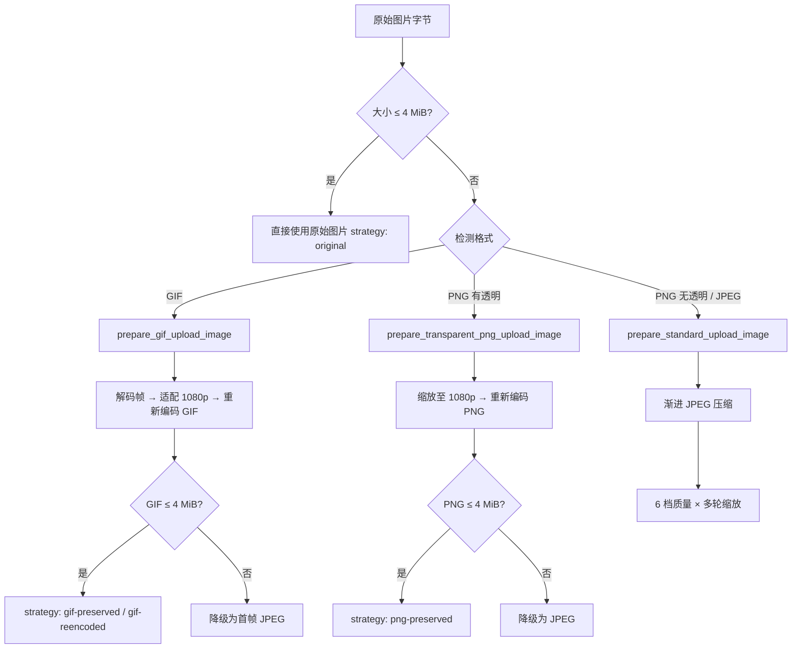

本文档深入解析 OQQWall 如何将审核通过的投稿以说说形式发布到 QQ 空间。整个发送链路覆盖**发送计划调度 → 账号选择 → Cookie 获取 → 图片准备与上传 → 说说发布 → 错误重试与撤回更新**的完整生命周期。系统采用事件溯源驱动架构，发送动作由 `SendEvent::SendStarted` 事件触发，由 `crates/drivers/src/qzone.rs` 中的 `spawn_qzone_sender` 执行实际的 HTTP 调用。

Sources: [qzone.rs](crates/drivers/src/qzone.rs#L322-L791)、[sender.rs](crates/core/src/decide/sender.rs#L1-L84)、[tick.rs](crates/core/src/decide/tick.rs#L294-L335)

## 发送流程全景

QQ空间发送并非单一函数调用，而是横跨核心决策引擎和驱动层的多阶段事件流。下图展示了从审核通过到说说发布的完整数据流：



整个流程被设计为完全异步且事件驱动：每一步的结果都以事件形式写入事件总线，其他驱动（如 NapCat 审核驱动）可以同步观察发送状态变化。

Sources: [qzone.rs](crates/drivers/src/qzone.rs#L538-L743)、[tick.rs](crates/core/src/decide/tick.rs#L294-L335)、[driver.rs](crates/core/src/decide/driver.rs#L57-L99)

## 发送计划与调度

审核员执行 `Approve`（正常通过）或 `Immediate`（立即发送）指令后，决策引擎会创建 `SendPlanCreated` 事件，将投稿注册到发送队列中。调度器根据优先级、时间窗口、最小间隔等约束计算出 `not_before_ms`（最早可发送时间戳）。

| 调度策略 | 优先级 | `not_before_ms` 计算 | 触发条件 |
|----------|--------|---------------------|----------|
| `Immediate`（立即发送） | `High` | `now_ms`（立即）或 `now_ms + 1`（合并模式） | 审核员手动执行"立即"指令 |
| `Approve`（正常通过） | `Normal` | 由 `compute_not_before` 综合计算 | 审核员执行"通过"指令 |
| 定时 flush | `Normal` | `now_ms` | `send_schedule` 命中的本地时间点 |
| 重试 | 继承原优先级 | 指数退避计算的 `retry_at_ms` | 发送失败后自动重排 |

`compute_not_before` 函数综合考虑以下约束：**发送时间窗口**（`send_windows`，若配置则发送时间必须落在窗口内）、**最小发送间隔**（`min_interval_ms`，两次发送之间至少间隔该时长）、**队列深度**（当 `queue_depth >= max_queue` 时溢出退避到下一个时间窗口）。定时 flush 通过 `trigger_group_flush` 在每个 tick 周期检查本地时间的分钟数是否命中 `send_schedule` 配置的触发点。

Sources: [scheduler.rs](crates/core/src/decide/scheduler.rs#L4-L34)、[review.rs](crates/core/src/decide/review.rs#L261-L394)、[flush.rs](crates/core/src/decide/flush.rs#L5-L28)、[tick.rs](crates/core/src/decide/tick.rs#L229-L256)

## 账号选择机制

当 `maybe_start_send` 检测到有到期的发送计划且当前无正在进行的发送时，系统通过 `choose_account` 从组内配置的账号列表中选择一个可用账号。选择算法的核心是**轮询负载均衡**：优先选择上次发送时间最早的可用账号。

| 选择结果 | 条件 | 处理方式 |
|----------|------|----------|
| `Available(account_id)` | 存在未冷却的启用账号 | 立即触发 `SendStarted` |
| `RetryAt(timestamp)` | 所有账号均在冷却期中 | 重新排期到最早冷却结束时间 |
| `Unavailable` | 无配置账号或全部禁用 | 延迟 30 秒后重排 |

每个账号维护独立的 `AccountRuntime` 状态，包含 `enabled`（是否启用）、`cooldown_until_ms`（冷却截止时间）、`last_send_ms`（上次发送时间）。当发送失败触发 `AccountCooldownSet` 事件时，对应账号进入冷却期，直到冷却结束才会重新参与选择。系统同一时刻只允许一个发送任务运行（`state.sending.is_empty()` 检查），避免并发冲突。

Sources: [sender.rs](crates/core/src/decide/sender.rs#L12-L61)、[tick.rs](crates/core/src/decide/tick.rs#L294-L335)

## 批次合并与文本构建

`SendStarted` 事件到达 `qzone_sender` 后，系统首先进行**批次合并**：如果 `max_queue > 1`（合并模式启用）且优先级为 `Normal`，则将同组同优先级的排队投稿合并为一个批次一次性发布，以减少 API 调用次数。

合并流程通过 `collect_batch_post_ids` 收集同组排队投稿的 `PostId` 列表，然后 `collect_post_assets` 提取每个投稿的渲染图和原始图资源，最终由 `build_publish_text_for_batch` 构建说说正文。正文格式为 `#投稿码` 或 `#起始码~结束码`（批量时），当 `at_unprived_sender` 配置为 `true` 时，还会追加非匿名投稿人的 `@{uin:...,nick:,who:1}` 提及标记。

图片数量超过单条说说上限（`max_images_per_post`）时，`split_publication_items_by_image_chunks` 将图片切分为多个 chunk，每个 chunk 对应一条独立的说说发布请求，确保每条说说的图片数不超限。

Sources: [qzone.rs](crates/drivers/src/qzone.rs#L552-L607)、[qzone.rs](crates/drivers/src/qzone.rs#L1507-L1568)、[qzone.rs](crates/drivers/src/qzone.rs#L1580-L1595)、[qzone.rs](crates/drivers/src/qzone.rs#L944-L978)

## Cookie 获取与管理

QQ空间 HTTP API 需要有效的登录 Cookie 和 `g_tk` 安全令牌。系统通过 **NapCat WebSocket** 通道调用 `get_cookies` API 获取指定域名（`user.qzone.qq.com`）的 Cookie 字符串，然后解析为键值对缓存到 `CookieCache` 中。

Cookie 缓存有效期为 **5 分钟**（300,000 毫秒）。缓存命中时直接复用；缓存未命中或发送失败时，系统会调用 `refresh_cookie_cache` 强制刷新。`QzoneClient` 从 Cookie 中提取 `skey` / `p_skey` 并通过 `generate_gtk` 计算 `g_tk` 令牌：

```rust
fn generate_gtk(skey: &str) -> String {
    let mut hash: i64 = 5381;
    for b in skey.bytes() {
        hash = hash.wrapping_mul(33).wrapping_add(b as i64) & 0x7FFF_FFFF;
    }
    hash.to_string()
}
```

`g_tk` 作为查询参数附加到所有 QQ空间 API 请求的 URL 上，用于服务端验证请求合法性。

Sources: [qzone.rs](crates/drivers/src/qzone.rs#L2256-L2325)、[qzone.rs](crates/drivers/src/qzone.rs#L2236-L2243)、[qzone.rs](crates/drivers/src/qzone.rs#L1130-L1155)

## 图片准备与压缩

在上传到 QQ 空间之前，所有图片都需要经过预处理以满足平台限制。系统支持 JPEG、PNG、GIF 三种格式，核心约束为**单张图片不超过 4 MiB**（`MAX_UPLOAD_IMAGE_BYTES = 4 * 1024 * 1024`）。



| 压缩策略 | 触发条件 | 处理方式 | 输出格式 |
|----------|----------|----------|----------|
| `original` | ≤ 4 MiB | 直接透传 | 原格式 |
| `gif-preserved` | GIF 经 1080p 缩放后 ≤ 4 MiB | 缩放 + 重新编码 | GIF |
| `gif-reencoded` | GIF 未缩放但重新编码后 ≤ 4 MiB | 仅重新编码 | GIF |
| `gif-to-jpeg` | GIF 重新编码后仍 > 4 MiB | 降级为首帧 JPEG | JPEG |
| `png-preserved` | 透明 PNG 缩放后 ≤ 4 MiB | 缩放 + 重新编码 | PNG |
| `png-to-jpeg` | 透明 PNG 编码后仍 > 4 MiB | 降级为 JPEG | JPEG |
| `jpeg-reencoded` | 非透明图渐进压缩 | 6 档质量 × 多轮缩放 | JPEG |

JPEG 渐进压缩采用 6 档质量系数 `[90, 82, 74, 66, 58, 50]` 循环尝试，每轮全部质量系数用完后将图片尺寸缩小为原来的 80%，直到满足 4 MiB 限制或尺寸低于最小阈值（512px）。1080p 适配的目标尺寸为长边 ≤ 1920px、短边 ≤ 1080px，使用 Lanczos3 滤波器进行高质量缩放。

Sources: [qzone.rs](crates/drivers/src/qzone.rs#L2624-L2821)、[qzone.rs](crates/drivers/src/qzone.rs#L60-L65)

## QQ空间 HTTP API 调用

图片预处理完成后，系统通过两个核心 HTTP 接口完成说说发布：**图片上传**和**说说发布**（或编辑更新）。

### 图片上传

`upload_image` 将图片字节 Base64 编码后以表单形式 POST 到 `https://up.qzone.qq.com/cgi-bin/upload/cgi_upload_image`。请求必须携带 `skey`、`p_skey`、`uin`、`g_tk` 等鉴权字段，以及 `uploadtype=1`、`albumtype=7`（说说图片相册类型）等参数。服务端返回 JSON 包含 `picbo`（图片业务对象标识）和 `richval`（富文本值），这两个值将用于后续的说说发布请求。

| 参数 | 值 | 说明 |
|------|-----|------|
| `uploadtype` | `1` | 普通上传模式 |
| `albumtype` | `7` | 说说图片相册 |
| `upload_hd` | `1` | 启用高清上传 |
| `hd_width` | `2048` | 高清图片最大宽度 |
| `hd_quality` | `96` | 高清图片质量 |
| `base64` | `1` | 图片以 Base64 编码传输 |
| `refer` | `shuoshuo` | 来源标识为说说 |

Sources: [qzone.rs](crates/drivers/src/qzone.rs#L1396-L1504)

### 说说发布

`publish_emotion` 将正文内容和图片引用组装为表单 POST 到 `https://user.qzone.qq.com/proxy/domain/taotao.qzone.qq.com/cgi-bin/emotion_cgi_publish_v6`。当有多张图片时，`pic_bo` 和 `richval` 字段用 `\t` 分隔拼接。请求头必须包含标准的 Chrome User-Agent、Referer（`https://user.qzone.qq.com/{uin}`）和 Origin。

| 表单字段 | 说明 |
|----------|------|
| `con` | 说说正文内容（含投稿码和可选的 @提及） |
| `pic_bo` | 图片业务对象标识，多张用 `\t` 分隔 |
| `richval` | 富文本值，多张用 `\t` 分隔 |
| `richtype` | `1` 表示带图片 |
| `subrichtype` | `1` 表示子富文本类型 |
| `hostuin` | 发布者的 QQ 号 |
| `ugc_right` | `1` 表示公开可见 |
| `format` | `fs` 返回格式 |

发布成功后返回 JSON 中的 `tid` 字段即为说说的远程 ID（`RemotePostId`），用于后续的撤回/更新操作。`update_emotion` 用于编辑已发布的说说（撤回图片场景），使用 `emotion_cgi_update` 接口，额外携带 `tid` 参数标识目标说说。

Sources: [qzone.rs](crates/drivers/src/qzone.rs#L1156-L1287)、[qzone.rs](crates/drivers/src/qzone.rs#L1289-L1395)、[qzone.rs](crates/drivers/src/qzone.rs#L54-L59)

## 错误分类与重试策略

系统将所有错误分为四种类型，每种类型对应不同的重试策略：

| 错误类型 | `QzoneErrorKind` | 触发场景 | 重试退避 |
|----------|-------------------|----------|----------|
| 网络错误 | `Network` | 连接超时、DNS 失败、5xx 服务端错误 | 指数退避，基础 5s，上限 300s |
| 风控错误 | `RiskControl` | HTTP 429、服务端返回风控码 | 指数退避，基础 60s，上限 3600s |
| 账号错误 | `Account` | HTTP 401/403、缺少 skey/p_skey | 刷新 Cookie 后立即重试 |
| 未知错误 | `Unknown` | 解析失败、响应格式异常 | 指数退避，基础 10s，上限 600s |

退避延迟公式为 `delay = base_ms × 2^(attempt-1)`，上限为 `max_delay_ms`。当发送失败时，系统先刷新 Cookie 缓存（`refresh_cookie_cache`），然后根据错误类型计算下次重试时间。如果重试次数达到 `send_max_attempts` 上限（默认 3 次），则触发 `SendGaveUp` 事件，投稿回退到审核状态等待人工介入。

发送超时（`send_timeout_ms`，默认 300 秒）由 `recover_stuck_sends` 在每个 tick 中检测。超时的发送任务被视为失败并立即重排。

Sources: [qzone.rs](crates/drivers/src/qzone.rs#L87-L131)、[qzone.rs](crates/drivers/src/qzone.rs#L2244-L2254)、[qzone.rs](crates/drivers/src/qzone.rs#L2334-L2416)、[driver.rs](crates/core/src/decide/driver.rs#L57-L99)、[tick.rs](crates/core/src/decide/tick.rs#L258-L292)

## 说说撤回与图片更新

当已发布的投稿需要撤回部分图片时，系统通过 `QzonePostWithdrawRequested` 事件触发撤回流程。撤回并非删除整条说说，而是调用 `update_emotion` 用更新后的文本和剩余图片**原地编辑**说说内容。

`withdraw_qzone_post_images` 函数首先通过 `build_withdrawn_qzone_text` 从原始文本中移除被撤回投稿的投稿码标记，然后 `collect_publication_item_images` 重新收集未撤回投稿的图片字节，最后调用 `update_emotion` 更新说说。这一机制确保了合并发布场景下，单个投稿被撤回时不影响同一说说中的其他投稿。

| 事件 | 说明 |
|------|------|
| `QzonePostWithdrawRequested` | 触发撤回更新请求 |
| `QzonePostWithdrawSucceeded` | 更新成功，返回新的文本 |
| `QzonePostWithdrawFailed` | 更新失败，记录错误信息 |

Sources: [qzone.rs](crates/drivers/src/qzone.rs#L980-L1000)、[qzone.rs](crates/drivers/src/qzone.rs#L744-L783)、[event.rs](crates/core/src/event.rs#L401-L434)

## QzoneRuntimeConfig 配置项

`QzoneRuntimeConfig` 是 QQ空间发送驱动的运行时配置，在启动时从 `config.json` 构建。组级配置项会覆盖全局默认值。

| 配置项 | 类型 | 默认值 | 说明 |
|--------|------|--------|------|
| `napcat_by_group` | `HashMap<String, NapCatConfig>` | - | 每组的 NapCat 连接配置 |
| `default_napcat` | `Option<NapCatConfig>` | - | 全局默认 NapCat 配置 |
| `accounts_by_group` | `HashMap<String, Vec<String>>` | - | 每组的 QQ 账号列表 |
| `at_unprived_sender` | `bool` | `false` | 是否 @非匿名投稿人 |
| `max_queue_by_group` | `HashMap<String, usize>` | - | 每组最大合并队列深度 |
| `max_images_per_post_by_group` | `HashMap<String, usize>` | - | 每组单条说说最大图片数 |
| `individual_images_by_group` | `HashMap<String, bool>` | - | 每组是否附带原图 |
| `default_max_queue` | `usize` | `1` | 全局默认最大队列深度 |
| `default_max_images_per_post` | `usize` | `30` | 全局默认单条最大图片数 |
| `default_individual_images` | `bool` | `true` | 全局默认是否附带原图 |

`max_queue` 控制合并行为：值为 `1` 时每条投稿单独发送；大于 `1` 时同组投稿在触发 flush 前暂存，达到上限后合并为一次发布。`max_images_per_post` 控制单条说说的图片上限，超出时自动拆分为多条说说。`individual_images_by_group` 决定发送时是否附带原始图片（即未渲染的投稿人原图）。

Sources: [qzone.rs](crates/drivers/src/qzone.rs#L71-L85)、[config.md](docs/config.md#L99-L124)

## 调试模式：EmuQzone 虚拟空间

在 `debug_assertions` 构建配置下，系统支持通过 `use_virt_qzone` 启用本地虚拟 QQ 空间（EmuQzone）。该模式在 `127.0.0.1:18080` 启动一个简易 HTTP 服务器，模拟 QQ 空间的说说发布和展示功能，所有发布的说说存储在内存中，最多保留 50 条。

虚拟空间提供了一个 HTML 页面用于查看已发布的说说，方便开发者在无真实 QQ 环境下调试发送流程。当 `use_virt_qzone` 为 `true` 时，`publish_batch_for_account` 会跳过 Cookie 获取和 HTTP API 调用，直接将内容写入 EmuQzone 内存状态。

Sources: [qzone.rs](crates/drivers/src/qzone.rs#L66-L69)、[qzone.rs](crates/drivers/src/qzone.rs#L304-L320)、[qzone.rs](crates/drivers/src/qzone.rs#L845-L870)、[qzone.rs](crates/drivers/src/qzone.rs#L2065-L2210)

## 状态同步与事件监听

`spawn_qzone_sender` 在启动时通过 `load_state_view_cached` 从事件溯源快照和日志重建初始状态，随后通过 `broadcast::Receiver` 订阅引擎事件总线，实时同步以下状态变化：

| 事件类型 | 状态更新 | 作用 |
|----------|----------|------|
| `IngressEvent::MessageAccepted/Synced` | 缓存投稿消息和作者信息 | 构建说说正文时提取 @提及 |
| `DraftEvent::PostDraftCreated` | 缓存草稿和投稿-消息映射 | 发送时解析草稿内容 |
| `ReviewEvent::ReviewItemCreated` | 建立审核码-投稿映射 | 说说正文使用审核码 |
| `ScheduleEvent::SendPlanCreated/Rescheduled` | 注册发送计划 | 调度器决定何时发送 |
| `RenderEvent::PngReady/PngBatchReady` | 缓存渲染图 BlobId | 发送时加载渲染图文件 |
| `BlobEvent::BlobPersisted` | 更新 Blob 路径 | 文件系统定位 |
| `SendEvent::SendSucceeded/GaveUp` | 释放 Blob 缓存 | 防止内存泄漏 |

这种基于事件总线的松耦合设计使得 QQ空间发送驱动可以独立于审核驱动和渲染驱动运行，各驱动通过观察事件流而非直接调用来协调工作。