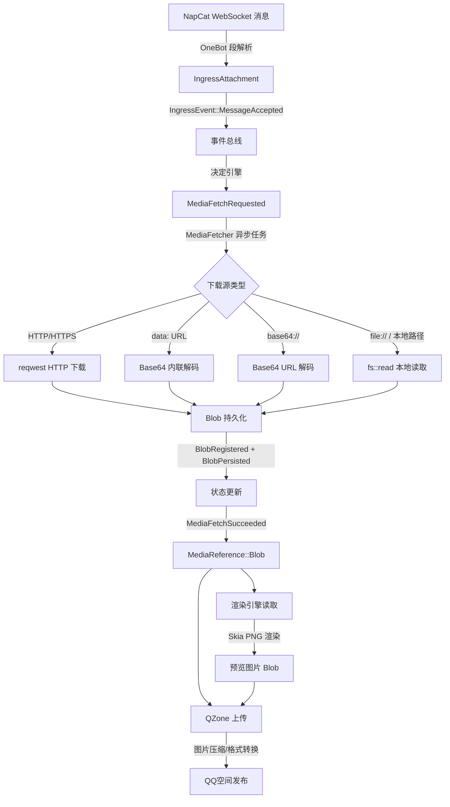
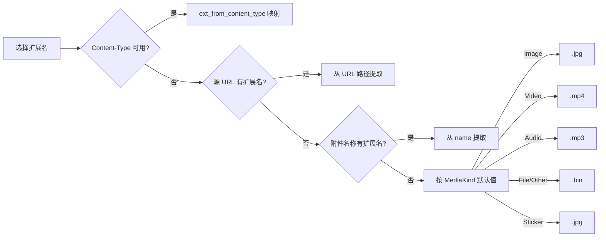
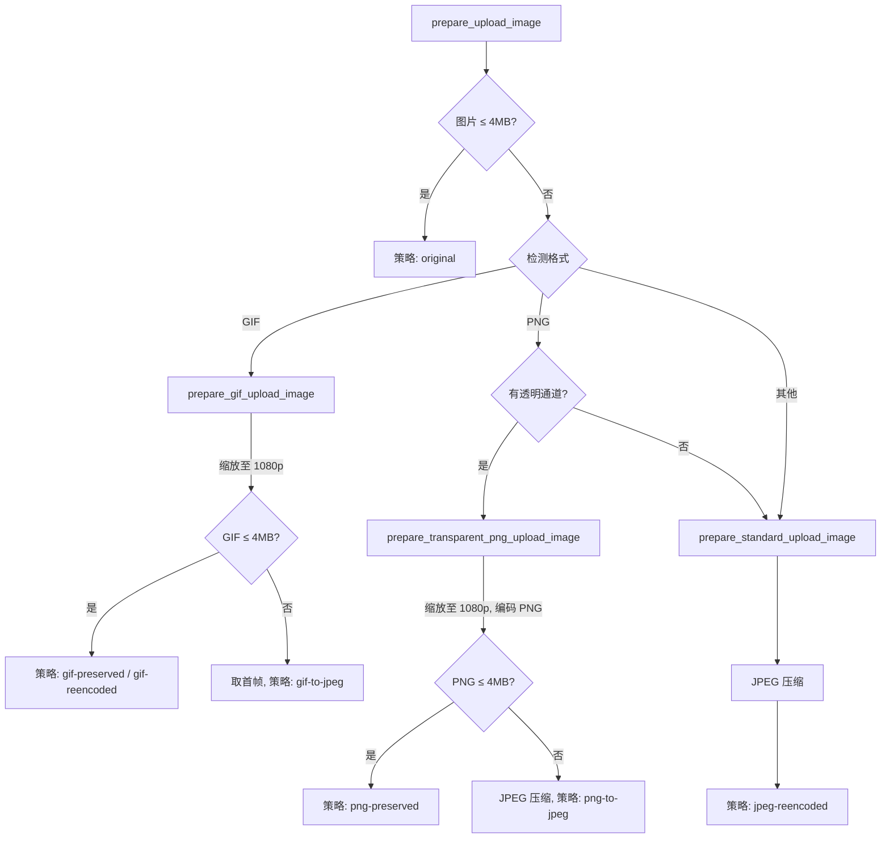

本文档详细解析 OQQWall_rust 项目中媒体文件的完整生命周期——从消息接收到渲染展示，再到发布上传的全链路处理机制。系统支持 **图片（Image）、表情包（Sticker）、视频（Video）、音频（Audio）、文件（File）** 五种媒体类型，通过事件溯源架构实现媒体资源的异步获取、缓存管理与持久化存储。

## 媒体类型系统

项目使用 `MediaKind` 枚举定义了统一的媒体分类体系，每种类型在不同阶段（获取、缓存、渲染、上传）拥有不同的处理策略。

| MediaKind | 含义 | 缓存策略 | 渲染行为 | 上传策略 |
|-----------|------|---------|---------|---------|
| **Image** | 普通图片 | UntilSend（发送前保留） | 直接渲染为图片预览 | 上传原图 |
| **Sticker** | 表情包/贴纸 | RenderOnly（仅渲染用） | 直接渲染为图片预览 | 上传原图 |
| **Video** | 视频 | 不缓存到内存 | 提取首帧作为预览 | 不上传 |
| **Audio** | 语音消息 | 不缓存到内存 | 显示文件标签 | 不上传 |
| **File** | 普通文件 | 不缓存到内存 | 显示文件标签 | 不上传 |
| **Other** | 其他 | 不缓存到内存 | 显示文件标签 | 不上传 |

媒体引用通过 `MediaReference` 枚举表示两种状态：**`RemoteUrl`** 表示原始远程 URL（尚未下载），**`Blob`** 表示已下载并分配了 `BlobId` 的本地二进制对象。这个状态转换是媒体处理的核心生命周期。

Sources: [draft.rs](crates/core/src/draft.rs#L82-L90), [draft.rs](crates/core/src/draft.rs#L76-L80), [blob_cache.rs](crates/drivers/src/blob_cache.rs#L60-L66)

## 媒体文件生命周期概览

下图展示了媒体文件从接收到使用的完整数据流：

Sources: [media_fetcher.rs](crates/drivers/src/media_fetcher.rs#L59-L148), [ingress.rs](crates/core/src/decide/ingress.rs#L73-L83)

## 消息接收与媒体解析

当 QQ 群消息通过 NapCat OneBot 协议到达时，`napcat.rs` 中的 `extract_message_chunks` 函数将 OneBot 消息段数组解析为结构化的 `IngressMessage`，其中包含文本和附件列表。解析逻辑按段类型分发：

**图片段（image）**：通过 `image_kind_from_data` 判断 `sub_type` 字段——值为 `0` 时归类为 `MediaKind::Image`（普通图片），其他值归类为 `MediaKind::Sticker`（表情包）。参考 URL 从 `url`、`file`、`path` 字段中按优先级提取。

**视频/文件/语音段（video / file / record）**：视频固定为 `MediaKind::Video`，语音为 `MediaKind::Audio`。文件段通过 `file_segment_kind` 进一步判断——检查 `mime` 字段是否以 `image/` 开头或文件名是否为图片扩展名，若是则归类为 `MediaKind::Image`，否则为 `MediaKind::File`。

附件名称通过 `attachment_name_from_data` 从 `name`、`file_name`、`filename`、`file`、`path`、`url` 六个字段中按优先级提取，并通过 `filename_from_reference` 清理路径前缀和查询参数。

Sources: [napcat.rs](crates/drivers/src/napcat.rs#L3038-L3159), [napcat.rs](crates/drivers/src/napcat.rs#L3387-L3402), [napcat.rs](crates/drivers/src/napcat.rs#L3404-L3418), [napcat.rs](crates/drivers/src/napcat.rs#L3449-L3467)

## 媒体获取引擎（MediaFetcher）

`MediaFetcher` 是一个独立的 Tokio 异步任务，监听事件总线上的媒体相关事件并执行实际的文件下载与持久化。它由 `spawn_media_fetcher` 函数启动，接受命令通道、事件总线接收器和运行时配置三个参数。

### 触发机制

消息被接受时，**决定引擎**（`decide_ingress`）会检查每个附件的引用类型：对于所有 `RemoteUrl` 类型且非 `data:` 内联数据的附件，自动发出 `MediaFetchRequested` 事件。这确保了消息一进入系统即开始异步下载媒体资源，无需等待人工审核。

### 下载策略

`fetch_bytes` 函数实现了统一的多源下载接口，支持四种媒体来源：

| 来源类型 | 识别方式 | 处理逻辑 |
|---------|---------|---------|
| **Data URL** | `data:` 前缀 | 解析 MIME 和 Base64 编码数据 |
| **Base64 URL** | `base64://` 前缀 | 标准 Base64 解码 |
| **HTTP/HTTPS** | `http://` 或 `https://` | reqwest GET 请求，读取 Content-Type |
| **本地文件** | `file://` 前缀或路径存在 | `fs::read` 直接读取 |

### 重试机制

下载失败时采用**指数退避**策略。重试延迟通过 `retry_delay_ms` 计算：以 1 秒为基准，按 `2^(attempt-1)` 指数增长，上限 30 秒。最大尝试次数默认为 3 次（可配置）。失败信息通过 `MediaFetchFailed` 事件携带 `retry_at_ms` 写入状态，供后续决策引擎判断是否重试。

### Blob 持久化

下载成功后，系统执行三步持久化操作：

1. **内存缓存**：若媒体类型符合缓存策略（Image → UntilSend, Sticker → RenderOnly），将字节写入 `blob_cache`
2. **磁盘写入**：按类型目录（`image/`、`video/`、`file/`、`audio/`、`other/`）写入 `{blob_root}/{kind_dir}/{blob_id_hex}.{ext}` 路径
3. **事件发布**：依次发出 `BlobRegistered`（注册 Blob 元数据）、`BlobPersisted`（记录持久化路径）、`MediaFetchSucceeded`（通知附件引用更新为 Blob）

BlobId 通过 `derive_blob_id` 基于 blake3 哈希算法从 `ingress_id` 和 `attachment_index` 确定性派生，确保相同附件总是生成相同的 BlobId。

Sources: [media_fetcher.rs](crates/drivers/src/media_fetcher.rs#L198-L311), [media_fetcher.rs](crates/drivers/src/media_fetcher.rs#L319-L377), [media_fetcher.rs](crates/drivers/src/media_fetcher.rs#L545-L551), [media_fetcher.rs](crates/drivers/src/media_fetcher.rs#L481-L511)

## 文件扩展名推断

当 Content-Type 不可用时，系统通过多级策略推断文件扩展名：

已识别的 Content-Type 映射包括：`image/png` → `.png`、`image/jpeg` → `.jpg`、`image/gif` → `.gif`、`image/webp` → `.webp`、`video/mp4` → `.mp4`、`audio/mpeg` → `.mp3` 等。

Sources: [media_fetcher.rs](crates/drivers/src/media_fetcher.rs#L409-L490)

## 内存缓存体系

系统维护两层内存缓存，分别服务于不同的生命周期需求。

### BlobCache — 媒体二进制缓存

`blob_cache` 是全局单例的线程安全缓存，默认容量上限 **256 MB**（通过 `OQQWALL_BLOB_DIR` 环境变量或 `configure_max_cache_mb` 配置）。缓存条目包含原始字节、大小、类型、保留策略和可选 MIME 信息。

**淘汰策略**：当缓存总量超过上限时，按条目大小**降序排列**后逐个淘汰最大条目，直到总量恢复限制内。这是一种简单但有效的"大对象优先淘汰"策略。

**保留策略**分为两级：
- **RenderOnly**（仅渲染用）：用于表情包（Sticker），渲染完成后即通过 `release_render_only` 批量释放
- **UntilSend**（发送前保留）：用于普通图片（Image），在 QZone 上传完成后才释放

渲染完成后，系统调用 `release_render_only` 清理所有 RenderOnly 策略的缓存条目，而 UntilSend 条目则在发送流程中通过 `release_many` 批量清理。

Sources: [blob_cache.rs](crates/drivers/src/blob_cache.rs#L1-L178)

### AvatarCache — 头像缓存

头像缓存采用独立的去重机制。`start_fetch` 函数检查是否已有缓存或正在获取中，返回 `Option<Arc<Notify>>` 用于协调并发请求。`wait_for_avatar` 提供带超时的异步等待接口。头像来源为 QQ 空间头像 API：`https://qlogo2.store.qq.com/qzone/{user_id}/{user_id}/640`。

头像缓存无容量限制和淘汰策略，因为其数据量相对可控。缓存条目可通过 `remove_avatar` 在相关帖子被撤回时主动清理。

Sources: [avatar_cache.rs](crates/drivers/src/avatar_cache.rs#L1-L144), [media_fetcher.rs](crates/drivers/src/media_fetcher.rs#L150-L196)

## 渲染引擎的媒体解析

渲染器（`renderer.rs`）在生成 PNG 预览图片时需要将媒体引用解析为可绘制的图片数据。这一过程通过 `ImageMemoryCache` 和 `resolve_image_sources` 协作完成。

### ImageMemoryCache

渲染器维护一个进程内的 `ImageMemoryCache`，以 `ImageCacheKey`（`Blob(BlobId)` 或 `Source(String)`）为键存储 `ResolvedImage` 数据。缓存支持以下查询模式：

| 方法 | 用途 | 数据来源 |
|------|------|---------|
| `get_or_load_blob` | 从 BlobCache 加载已下载的图片 | blob_cache → 文件系统 |
| `get_or_load_source` | 从本地路径/内联数据加载 | fs::read / data: URL 解码 |
| `get_or_fetch_remote_source` | 从远程 URL 获取（仅 JsonCard 媒体） | HTTP GET |
| `get_or_load_video_preview_blob` | 提取视频首帧预览 | ffmpeg / 文件系统 |

渲染完成后，通过 `release_keys` 释放本次渲染使用的缓存条目，避免内存累积。

### 媒体引用解析

`resolve_image_sources` 函数遍历 Draft 中的所有 Block，按类型分发解析：

- **图片/表情包附件**：通过 `resolve_media_reference_for_image` 从 Blob 或本地源加载
- **视频附件**：通过 `resolve_media_reference_for_video_preview` 提取首帧预览图
- **其他附件**：通过 `resolve_media_reference_for_label` 生成文件名标签文本
- **JsonCard 媒体**：通过 `resolve_json_card_media_source` 解析卡片中的图片 URL

**安全约束**：渲染引擎明确拒绝加载远程 HTTP URL 的图片——`resolve_media_reference_for_image` 和 `resolve_media_reference_for_video_preview` 中均有 `is_remote_http` 检查，确保所有渲染资源必须是本地已下载的 Blob 或文件。

Sources: [renderer.rs](crates/drivers/src/renderer.rs#L1577-L1715), [renderer.rs](crates/drivers/src/renderer.rs#L6107-L6300)

## QZone 图片上传与压缩

发送到 QQ 空间时，图片需要经过压缩处理以满足 QZone API 的 **4 MB 大小限制**（`MAX_UPLOAD_IMAGE_BYTES`）。上传流程包含格式检测、尺寸调整、质量压缩三个核心阶段。

### 格式检测与压缩策略

`prepare_upload_image` 是图片压缩的入口函数。若原始图片 ≤ 4 MB 则直接原样上传（策略标记为 `original`）。超过限制时按格式分发：

### 1080p 尺寸调整

所有超限图片在压缩前先通过 `resize_for_1080p` 缩放至 1080p 分辨率内。约束参数为：长边 ≤ 1920px，短边 ≤ 1080px。缩放使用 **Lanczos3** 插值算法以保持质量。GIF 动图对每一帧单独缩放并保持原始帧延迟。

### JPEG 渐进质量压缩

`compress_dynamic_as_jpeg` 实现了**渐进式质量降级**：从质量 90 开始，依次尝试 `[90, 82, 74, 66, 58, 50]` 六个质量等级，每次将图片尺寸缩小 25%（`next_scaled_dimensions`），直到编码结果 ≤ 4 MB。对于带透明通道的图片（RGBA），先通过 `flatten_image_for_jpeg` 将透明区域填充为白色再编码。最终兜底在质量 50 且最小尺寸 512px 处。

### 上传 API 调用

压缩完成的图片通过 `upload_image` 方法以 Base64 编码形式 POST 到 QZone 图片上传接口 `https://up.qzone.qq.com/cgi-bin/upload/cgi_upload_image`。请求携带 Cookie 认证（skey/p_skey）、GTK 令牌和一系列 QZone 特有参数（albumtype=7, upload_hd=1, hd_width=2048 等）。上传成功后从响应 JSON 中提取 `picbo` 和 `richval`，拼接到发布表单的 `pic_bo` 和 `richval` 字段中（多图以 `\t` 分隔）。

Sources: [qzone.rs](crates/drivers/src/qzone.rs#L2624-L2840), [qzone.rs](crates/drivers/src/qzone.rs#L1396-L1504), [qzone.rs](crates/drivers/src/qzone.rs#L1156-L1199)

## Blob 状态追踪

Blob 的生命周期通过事件溯源完全追踪。每个 Blob 从创建到释放经历以下状态转换：

| 事件 | 状态变更 | 说明 |
|------|---------|------|
| `BlobRegistered` | 创建 `BlobMeta`，`ref_count=1` | 下载完成或渲染生成时触发 |
| `BlobPersisted` | 设置 `persisted_path` | 磁盘写入成功后触发 |
| `BlobReleased` | `ref_count -= 1` | 引用释放时触发 |
| `BlobGcRequested` | 从状态中移除 | 垃圾回收时触发 |

`StateView` 中的 `blobs: HashMap<BlobId, BlobMeta>` 维护了所有活跃 Blob 的元数据，包括大小、持久化路径和引用计数。当消息被撤回时（`MessageRecalled`），相关的 `media_fetch` 记录也会被级联清理。

Sources: [state.rs](crates/core/src/state.rs#L198-L204), [reduce/mod.rs](crates/core/src/reduce/mod.rs#L908-L940), [event.rs](crates/core/src/event.rs#L438-L443)

## 环境变量与配置

| 环境变量 | 默认值 | 说明 |
|---------|--------|------|
| `OQQWALL_BLOB_DIR` | `data/blobs` | Blob 持久化存储根目录 |
| `OQQWALL_DATA_DIR` | `data` | 数据目录（日志、快照） |

运行时配置 `MediaFetcherRuntimeConfig` 包含三个字段：
- **`blob_root`**：Blob 存储根路径
- **`max_attempts`**：下载最大重试次数（默认 3）
- **`timeout`**：HTTP 请求超时时间（默认 15 秒）

缓存容量通过 `configure_max_cache_mb` 设置，默认 256 MB。

Sources: [media_fetcher.rs](crates/drivers/src/media_fetcher.rs#L34-L52), [blob_cache.rs](crates/drivers/src/blob_cache.rs#L7)

## 相关阅读

- **事件溯源架构**：了解媒体事件如何融入整体事件驱动设计，请参阅 [事件溯源架构](9-shi-jian-su-yuan-jia-gou)
- **Skia 渲染引擎**：了解图片如何被渲染为 PNG 预览，请参阅 [Skia 渲染引擎](12-skia-xuan-ran-yin-qing)
- **QQ空间发送机制**：了解完整的发布流程，请参阅 [QQ空间发送机制](16-qqkong-jian-fa-song-ji-zhi)
- **NapCat OneBot 集成**：了解消息接入的完整链路，请参阅 [NapCat OneBot 集成](15-napcat-onebot-ji-cheng)