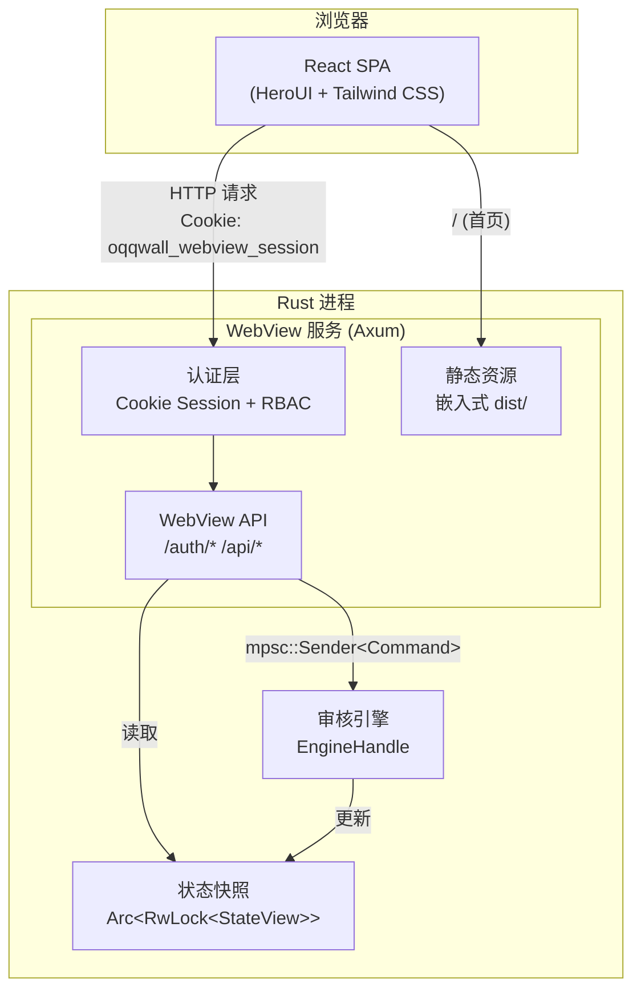
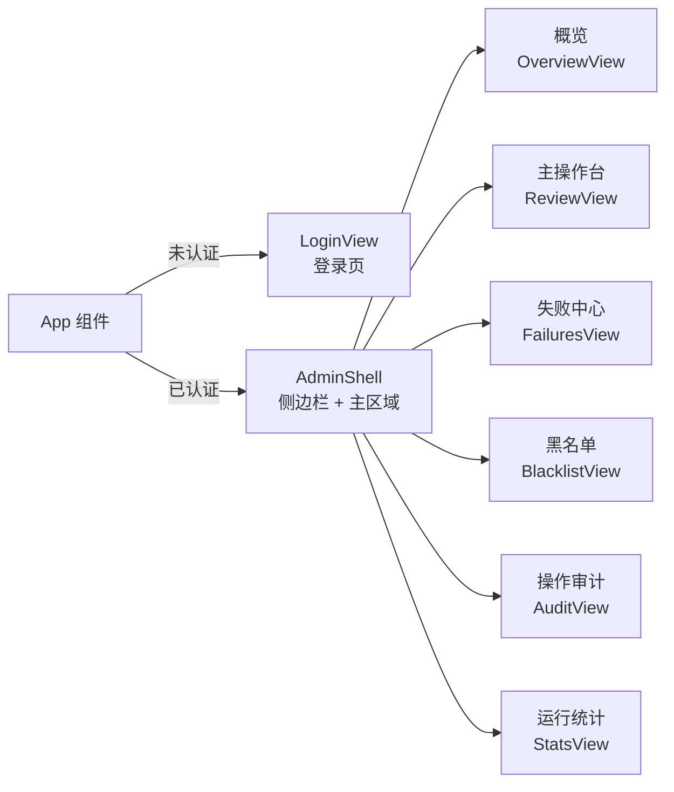
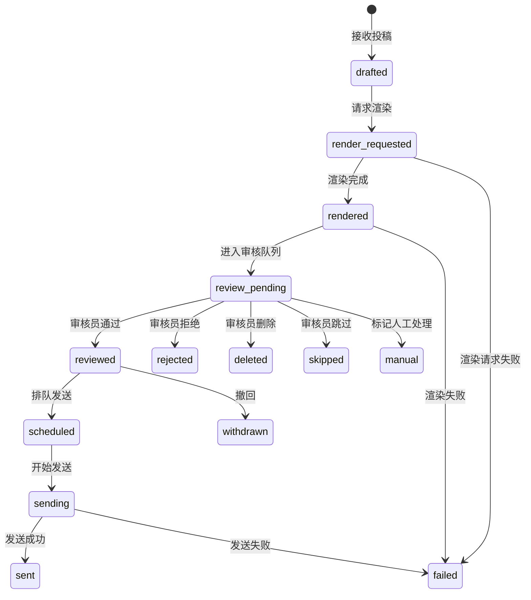

OQQWall 的 WebView 审核界面是一个基于 **React + Rust** 的内置管理后台，为稿件审核提供可视化的 Web 操作台。它将前端资源在构建时嵌入 Rust 二进制，由 Axum 在独立端口提供完整的登录、鉴权与审核 API，无需外部 Web 服务器或数据库即可运行。从登录到审核决策，全链路通过 `HttpOnly` Cookie 会话和 RBAC 组级权限保护。

## 整体架构

WebView 审核界面采用前后端一体化的**嵌入式单页应用**架构：前端 SPA 在 Rust 编译期通过 `build.rs` 将 `dist/` 目录下所有静态资源序列化为 `include_bytes!` 常量，运行时由 Axum 路由提供服务。后端与审核引擎通过 `tokio::sync::mpsc::Sender<Command>` 通道通信，状态快照通过 `Arc<RwLock<StateView>>` 共享读取。



**关键设计决策**：前端资源以 `EmbeddedWebAsset { path, content_type, bytes }` 结构体数组的形式编译进二进制，[build.rs](crates/app/build.rs#L1-L104) 在 `cargo build` 时扫描 `webview-ui/dist` 目录生成 `webview_assets.rs`，实现零外部文件依赖的部署。

Sources: [build.rs](crates/app/build.rs#L1-L104), [webview.rs](crates/app/src/webview.rs#L22-L22), [webview.rs](crates/app/src/webview.rs#L2309-L2355)

## 技术栈与工程配置

| 层级 | 技术选型 | 版本 | 职责 |
|------|---------|------|------|
| UI 框架 | React | 19.x | 组件化渲染 |
| 构建工具 | Vite | 5.x | 开发热更新 + 生产打包 |
| 组件库 | HeroUI (原 NextUI) | 3.x | Card / Button / Drawer / Toast 等 |
| 样式方案 | Tailwind CSS | 4.x | 原子化 CSS |
| 图标库 | Lucide React | 1.x | 全部 UI 图标 |
| 后端框架 | Axum | - | HTTP 路由 + 中间件 |
| 包管理 | Bun | 1.3.x | 依赖安装与脚本运行 |

前端项目位于 [crates/app/webview-ui](crates/app/webview-ui/)，[package.json](crates/app/webview-ui/package.json#L1-L30) 定义了 `dev`、`build`、`preview` 和 `typecheck` 四个脚本。开发模式下 [vite.config.ts](crates/app/webview-ui/vite.config.ts#L1-L27) 将 `/auth` 和 `/api` 请求代理到 `VITE_WEBVIEW_BACKEND`（默认 `http://127.0.0.1:10924`），实现前后端分离开发体验。

Sources: [package.json](crates/app/webview-ui/package.json#L1-L30), [vite.config.ts](crates/app/webview-ui/vite.config.ts#L1-L27)

## 页面结构与导航

应用的入口由 [index.html](crates/app/webview-ui/index.html#L1-L13) 定义，[main.tsx](crates/app/webview-ui/src/main.tsx) 挂载到 `#app` 根节点。[App.tsx](crates/app/webview-ui/src/App.tsx#L180-L249) 中的 `App` 组件是全局壳，它管理认证状态并根据 `view` 状态切换六个核心视图：



**侧边栏导航** 由 [SidebarNav](crates/app/webview-ui/src/App.tsx#L271-L303) 渲染，每个导航项是一个 `Button` 组件，当前页面以 `primary` 变体高亮。移动端（视口宽度 ≤ 980px）由 [MobileTabbar](crates/app/webview-ui/src/App.tsx#L305-L335) 在底部渲染精简标签栏。账户信息卡片显示当前用户名、角色和所属分组，并提供退出按钮。

Sources: [App.tsx](crates/app/webview-ui/src/App.tsx#L180-L335)

## 认证与 RBAC 权限

登录流程由 `LoginView` 组件驱动，调用 `POST /auth/login` 发送用户名和密码。后端 [webview_login](crates/app/src/webview.rs#L582-L600) 验证凭证后创建会话，通过 `Set-Cookie: oqqwall_webview_session` 写入 `HttpOnly` Cookie。会话 TTL 由配置项 `common.webview.session_ttl_sec` 控制（默认 43200 秒 = 12 小时）。

权限模型基于**双层 RBAC**：

| 角色 | 标识 | 能力范围 |
|------|------|---------|
| 全局管理员 | `global_admin` | 查看和操作所有分组的稿件 |
| 组管理员 | `group_admin` | 仅可操作其 `groups` 字段中列出的分组 |

每个 API 请求经过 [authenticate_webview](crates/app/src/webview.rs#L2357-L2388) 提取 Cookie 中的会话 ID，验证有效性和过期时间。对于稿件操作，后端还会调用 [can_access_review](crates/app/src/webview.rs#L2072-L2078) 检查目标稿件的分组是否在当前用户的授权范围内。

管理员账号在配置文件中定义：
- 全局管理员：`webview_global_admins` 字段
- 组管理员：`groups.<id>.webview_admins` 字段

密码支持 `sha256:<hex64>` 哈希格式，明文密码在首次加载时会被自动归一化为哈希值并写回配置文件。

Sources: [webview.rs](crates/app/src/webview.rs#L582-L600), [webview.rs](crates/app/src/webview.rs#L2357-L2400), [config.rs](crates/app/src/config.rs#L57-L69)

## 稿件审核工作台（主操作台）

**主操作台**（`ReviewView`）是审核员的核心工作界面，[App.tsx 第 573-1181 行](crates/app/webview-ui/src/App.tsx#L573-L1181) 实现了完整的稿件审核流程。界面采用**双栏布局**——左侧为稿件队列列表，右侧为详情面板（大屏时以内联面板展示，小屏时以抽屉覆盖层展示）。

### 数据加载与自动刷新

`ReviewView` 通过 `loadPosts()` 函数调用 `GET /api/posts` 获取稿件列表。请求参数由 [buildPostParams](crates/app/webview-ui/src/App.tsx#L2322-L2335) 构建，支持以下查询维度：

| 参数 | 前端状态 | 说明 |
|------|---------|------|
| `stage` | `stage` | 状态筛选（默认 `__active__`，排除终态） |
| `keyword` | `keyword` | 全文搜索（编号、投稿人、内容、错误） |
| `group_id` | `groupId` | 分组筛选 |
| `sort_by` / `sort_order` | `sortBy` / `sortOrder` | 排序字段与方向 |
| `only_error` | `onlyError` | 仅显示有异常的稿件 |
| `actionable_only` | `onlyActionable` | 仅显示有审核 ID 可操作的稿件 |
| `cursor` / `limit` | `page` / `pageSize` | 分页游标与页大小 |

**自动刷新**默认开启，每 30 秒轮询一次（[App.tsx 第 627-631 行](crates/app/webview-ui/src/App.tsx#L627-L631)）。切换条件或手动点击刷新按钮时立即触发加载。

### 指标面板

队列上方展示四个实时指标卡片：

| 指标 | 计算逻辑 | 色调 |
|------|---------|------|
| 当前结果 | `visiblePosts.length` | 中性 |
| 可操作 | `posts.filter(!!review_id).length` | 绿色 |
| 异常 | `posts.filter(!!last_error).length` | 红色 |
| 已选 | 跨页选择计数 | 黄色 |

Sources: [App.tsx](crates/app/webview-ui/src/App.tsx#L573-L899)

### 筛选器工具栏

工具栏区域支持组合筛选，底部提供了**筛选器保存与加载**功能：

- **保存筛选**：将当前筛选条件以 `POST /api/filter-presets` 持久化
- **已保存筛选**：在详情面板侧栏展示，点击一键应用预设条件
- **重置筛选**：恢复为默认的「全部活跃 + 最新优先」视图

后端将筛选器存储在内存 `HashMap<String, Vec<SavedFilterPreset>>` 中，按用户名隔离。

Sources: [App.tsx](crates/app/webview-ui/src/App.tsx#L900-L973), [webview.rs](crates/app/src/webview.rs#L67-L71)

### 批量操作

批量操作区支持三种选择模式：

1. **选择本页**：通过 `togglePageSelection()` 切换当前页全选/取消
2. **选择当前筛选**：调用 `GET /api/reviews/ids` 获取符合筛选条件的全部审核 ID，前端记录 `selectAllTotal` 实现跨页全选
3. **清空选择**：重置 `selected` 和 `selectAllTotal`

批量动作支持 `approve`（通过）、`reject`（拒绝）、`delete`（删除）、`skip`（跳过）、`immediate`（立即发送）、`refresh`（刷新）和 `rerender`（重渲染）。执行时调用 `POST /api/reviews/batch`。

**危险操作确认**：`reject`、`delete` 和 `blacklist` 被标记为危险操作（[App.tsx 第 147 行](crates/app/webview-ui/src/App.tsx#L147)），执行前通过 `window.confirm` 弹出确认对话框。

Sources: [App.tsx](crates/app/webview-ui/src/App.tsx#L975-L1026), [webview.rs](crates/app/src/webview.rs#L2159-L2200)

### 稿件视图模式

稿件队列支持两种展示模式，通过 `ToggleButtonGroup` 切换：

**卡片视图**（`PostCards`）使用 [useMasonryLayout](crates/app/webview-ui/src/App.tsx#L2433-L2487) 自定义 Hook 实现瀑布流布局。每张卡片包含：
- 标题区：审核编号 + 投稿人 + 状态标签 + 图片计数 + 选择复选框
- 内容区：预览文本或预览图片网格（最多显示 6 张，超出显示 `+N` 计数）
- 元数据：分组 + 创建时间
- 评论输入框：用于填写拒绝/删除/拉黑原因
- 底部快捷操作按钮：通过、跳过、立即、拒绝、删除、拉黑、评论、刷新、重渲染

**列表视图**（`PostTable`）以传统表格呈现，列包括选择、编号、状态、内容（含缩略图）、时间和操作。每行提供三个主要操作按钮 + 一个「更多」下拉菜单。

Sources: [App.tsx](crates/app/webview-ui/src/App.tsx#L1183-L1559)

### 详情面板

点击稿件标题或列表行时，`openDetail()` 调用 `GET /api/posts/{post_id}` 获取完整详情。详情面板（`InlineDetailPanel` / `DetailDrawer`）包含以下区域：

| 区域 | 内容 |
|------|------|
| 工具栏 | 上一条 / 下一条 / 刷新 / 关闭 |
| 元数据标签 | 状态 + 安全/待核查 + 匿名/非匿名 |
| 渲染预览 | 若 `render_png_blob_id` 存在，通过 `/api/blobs/{blob_id}` 加载 |
| 基本信息 | 分组、投稿人、时间、决策理由、会话 ID |
| 快速操作面板 | 9 个快捷操作按钮 |
| 动作执行区 | 动作选择下拉框 + 可选文本输入 + 执行按钮 |
| 时间线 | 稿件生命周期事件列表 |
| 错误信息 | 若 `last_error` 存在则显示 |

**响应式策略**：当视口宽度 > 980px 时，详情以内联面板嵌入右侧（`InlineDetailPanel`）；≤ 980px 时使用 `Drawer` 组件从右侧滑出覆盖层（`DetailDrawer`）。

详情面板侧栏还展示两个辅助面板：
- **已保存筛选**：列出所有预设筛选器，点击一键应用
- **最近操作**：显示最近 8 条审核操作记录

Sources: [App.tsx](crates/app/webview-ui/src/App.tsx#L1587-L1896)

## 审核动作体系

所有审核动作最终通过 `POST /api/reviews/{review_id}/decision` 提交到后端，[parse_review_action](crates/app/src/webview.rs#L2810-L2880) 将前端字符串映射为 `ReviewAction` 枚举：

| 动作 | 标识 | 前端标签 | 需要文本 | 说明 |
|------|------|---------|---------|------|
| 通过 | `approve` | 通过 | 否 | 批准稿件进入下一阶段 |
| 拒绝 | `reject` | 拒绝 | 可选 reason | 拒绝稿件，可填写理由 |
| 删除 | `delete` | 删除 | 可选 reason | 删除稿件，可填写理由 |
| 暂缓 | `defer` | 暂缓 | 否（需延迟值） | 延迟指定毫秒后重新进入队列 |
| 跳过 | `skip` | 跳过/否 | 否 | 跳过当前稿件，不做决策 |
| 立即发送 | `immediate` | 立即 | 否 | 跳过排队，立即发送到空间 |
| 刷新 | `refresh` | 刷新 | 否 | 重新加载稿件状态 |
| 重渲染 | `rerender` | 重渲染 | 否 | 重新触发渲染流程 |
| 切换匿名 | `toggle_anonymous` | 切换匿名 | 否 | 切换稿件匿名/署名 |
| 展开审核 | `expand_audit` | 展开审核 | 否 | 展开审核详情 |
| 展示 | `show` | 展示 | 否 | 展示稿件 |
| 评论 | `comment` | 评论 | 是 text | 对稿件添加评论 |
| 回复 | `reply` | 回复 | 是 text | 回复投稿人 |
| 拉黑 | `blacklist` | 拉黑 | 可选 reason | 将投稿人加入黑名单 |
| 快捷回复 | `quick_reply` | 快捷回复 | 是 quick_reply_key | 使用预设快捷回复 |
| 合并 | `merge` | 合并 | 是 target_review_code | 合并到目标审核编号 |

请求体通过 [buildActionPayload](crates/app/webview-ui/src/App.tsx#L2337-L2346) 构建，根据动作类型填充 `comment`、`text`、`quick_reply_key`、`target_review_code` 或 `delay_ms` 字段。

后端处理审核决策后，会自动生成一条审计记录（[webview_decide_review](crates/app/src/webview.rs#L2132-L2148)），包含操作人、动作、目标信息摘要和时间戳。

Sources: [App.tsx](crates/app/webview-ui/src/App.tsx#L2337-L2346), [webview.rs](crates/app/src/webview.rs#L2810-L2880), [webview.rs](crates/app/src/webview.rs#L2055-L2157)

## 辅助功能模块

### 概览页面

概览页面（`OverviewView`）是一个运营仪表盘，聚合展示待审核数、今日投稿、异常告警和可操作数四项指标，以及快捷入口、组别健康度、最近告警、最新稿件预览和阶段分布五个面板。

### 失败中心

失败中心（`FailuresView`）汇总展示渲染失败、发布失败和稿件异常，调用 `GET /api/failures` 获取数据。展示异常总量、阶段失败、渲染异常和审核发布异常四项指标。

### 黑名单管理

黑名单页面（`BlacklistView`）支持添加和移除黑名单条目，每条记录包含分组 ID、投稿人 ID 和拉黑原因。通过 `POST /api/blacklist` 添加，通过 `POST /api/blacklist/{group_id}/{sender_id}` 移除。

### 操作审计

审计页面（`AuditView`）展示最近 100 条管理操作记录，调用 `GET /api/audit` 获取。每条记录包含操作摘要、操作人、动作类型、关联稿件信息和状态标签。

### 运行统计

统计页面（`StatsView`）展示待审核数、今日投稿、总投稿和平均审核时间四项指标，以及阶段分布列表。数据来自 `GET /api/stats`。

Sources: [App.tsx](crates/app/webview-ui/src/App.tsx#L397-L571), [App.tsx](crates/app/webview-ui/src/App.tsx#L1898-L2203)

## WebView API 端点总览

后端 [webview.rs](crates/app/src/webview.rs#L534-L564) 中注册的路由：

| 方法 | 路径 | 功能 |
|------|------|------|
| POST | `/auth/login` | 用户名密码登录 |
| POST | `/auth/logout` | 登出，清除会话 |
| GET | `/auth/me` | 获取当前用户信息 |
| GET | `/api/stats` | 运行统计数据 |
| GET | `/api/overview/groups` | 组别健康度 |
| GET | `/api/failures` | 失败中心数据 |
| GET | `/api/posts` | 稿件列表（支持筛选、排序、分页） |
| GET | `/api/posts/{post_id}` | 稿件详情 |
| GET | `/api/posts/{post_id}/similar` | 相似稿件 |
| GET | `/api/posts/by-sender` | 按投稿人查询 |
| GET | `/api/blobs/{blob_id}` | 二进制资源（图片等） |
| GET | `/api/blacklist` | 黑名单列表 |
| POST | `/api/blacklist` | 添加黑名单 |
| POST | `/api/blacklist/{group_id}/{sender_id}` | 移除黑名单 |
| GET | `/api/audit` | 审计日志 |
| GET | `/api/filter-presets` | 已保存筛选器列表 |
| POST | `/api/filter-presets` | 保存筛选器 |
| GET | `/api/reviews/ids` | 跨页选择审核 ID 列表 |
| POST | `/api/reviews/{review_id}/decision` | 单条审核决策 |
| POST | `/api/reviews/batch` | 批量审核决策 |

**鉴权边界**：`/auth/*` 和 `/api/*` 使用 Cookie 会话认证（WebView 内部），`/v1/*` 使用 Bearer Token 认证（外部 API），两者认证体系完全独立。

Sources: [webview.rs](crates/app/src/webview.rs#L534-L564), [webview.md](docs/webview.md#L6-L9)

## 构建与部署

### 开发模式

```bash
cd crates/app/webview-ui
bun install
bun run dev
```

开发服务器在 `http://localhost:5173` 提供前端资源，`/auth` 和 `/api` 请求被代理到后端。后端端口可通过环境变量 `VITE_WEBVIEW_BACKEND` 覆盖。

### 生产构建

```bash
cd crates/app/webview-ui
bun run build    # 生成 dist/ 目录
cd ../..
cargo build      # build.rs 嵌入 dist/ 到二进制
```

如果 `webview-ui/dist` 目录不存在，访问 WebView 时会返回 `webview-ui dist not found` 提示页面。

### 部署配置

WebView 通过 `common.webview` 配置节控制：

| 配置项 | 默认值 | 说明 |
|--------|--------|------|
| `enabled` | `false` | 是否启用 WebView 服务 |
| `host` | `0.0.0.0` | 监听地址 |
| `port` | `10924` | 监听端口 |
| `session_ttl_sec` | `43200` | 会话有效期（秒），范围 300 ~ 604800 |

WebView 与外部 API 使用分离端口（默认 `10924` / `10923`），建议仅开放内网访问，公网场景需在反向代理后附加额外访问控制。

Sources: [config.rs](crates/app/src/config.rs#L93-L97), [webview.md](docs/webview.md#L119-L127)

## 数据流与状态模型

稿件在系统中经历的状态流转由 `Stage` 枚举定义，前端在 [types.ts](crates/app/webview-ui/src/api/types.ts#L3-L19) 中声明：



前端的 `__active__` 虚拟阶段（[App.tsx 第 145 行](crates/app/webview-ui/src/App.tsx#L145)）用于过滤掉终态（`rejected`、`deleted`、`withdrawn`、`skipped`、`failed`），只展示仍在流转中的稿件。

Sources: [types.ts](crates/app/webview-ui/src/api/types.ts#L3-L19), [App.tsx](crates/app/webview-ui/src/App.tsx#L120-L146)

## 下一步

- 了解 WebView 背后的审核引擎如何处理决策指令：[指令决策引擎](11-zhi-ling-jue-ce-yin-qing)
- 了解外部 API 的 Token 认证与接口规范：[HTTP API v1](19-http-api-v1)
- 了解稿件渲染预览图片的生成机制：[Skia 渲染引擎](12-skia-xuan-ran-yin-qing)
- 了解稿件从投递到发送的完整生命周期：[投稿处理流程](7-tou-gao-chu-li-liu-cheng)