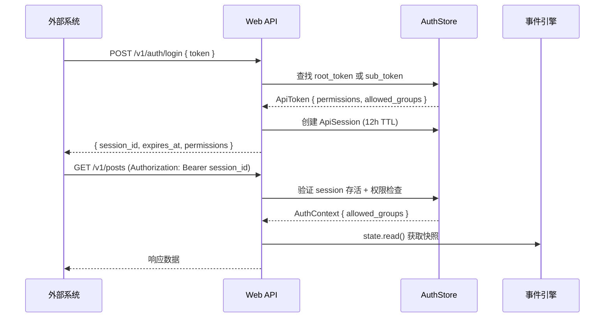
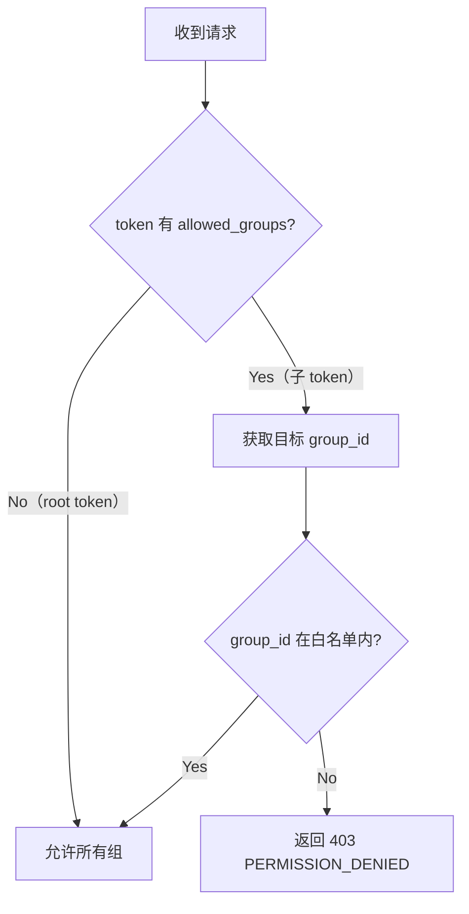

OQQWall 提供的 HTTP API v1 是一套面向外部集成的投稿管理与审核接口。它允许第三方系统通过标准 HTTP 协议完成投稿创建、审核决策、黑名单管理、消息发送等操作，无需依赖群内指令交互。API 基于 **Axum** 框架构建，采用 **Token → Session → Permission** 三级鉴权模型，支持细粒度的组级访问控制。

## 架构概览

HTTP API v1 作为应用层服务运行在 `crates/app` 中，通过 `EngineHandle` 获取状态快照并通过 `mpsc::Sender<Command>` 向事件引擎下发命令。它不直接修改状态，而是遵循事件溯源架构——所有操作最终转化为 `Command` 进入引擎状态机处理。

```mermaid
flowchart LR
    subgraph HTTP Client
        C[外部系统]
    end

    subgraph Web API Server["Web API Server (Axum)"]
        R[路由层<br/>Router]
        A[鉴权层<br/>AuthStore]
        H[处理器<br/>Handlers]
    end

    subgraph Engine["事件引擎 (EngineHandle)"]
        S[StateView<br/>只读快照]
        CMD[Command Channel<br/>mpsc::Sender]
    end

    subgraph StateMachine["核心状态机"]
        SM[事件处理<br/>Event Sourcing]
    end

    C -->|HTTP 请求| R
    R -->|Bearer Session| A
    A -->|AuthContext| H
    H -->|state.read()| S
    H -->|cmd_tx.send()| CMD
    CMD --> SM
    SM -->|状态更新| S
```

API 服务器通过 `spawn_web_api` 函数启动，绑定到 `0.0.0.0:{port}`（默认 `10923`）。启动时会自动构建 `account_group_by_account` 映射表，将 QQ 账号映射到所属组，用于后续的 `target_account` → `group_id` 推导。

Sources: [web_api.rs](crates/app/src/web_api.rs#L413-L521)

## 启用与配置

API 的启用受配置文件中 `common.web_api` 节点控制。只有同时满足以下条件时才会启动：

1. `common.web_api.enabled` 为 `true`
2. `common.web_api.root_token`（或环境变量 `OQQWALL_API_TOKEN`）存在且长度 ≥ 32

| 配置项 | 类型 | 默认值 | 说明 |
| --- | --- | --- | --- |
| `common.web_api.enabled` | bool | `false` | 是否启用 HTTP API |
| `common.web_api.port` | number | `10923` | 监听端口，固定绑定 `0.0.0.0` |
| `common.web_api.root_token` | string | 无 | Root token，建议通过 `OQQWALL_API_TOKEN` 注入 |

兼容迁移：启动时自动将旧字段 `common.use_web_review` → `web_api.enabled`、`common.web_review_port` → `web_api.port`、`common.api_token` → `web_api.root_token` 进行映射读取。

Sources: [config.rs](crates/app/src/config.rs#L141-L155), [config.md](docs/config.md)

## 鉴权模型

API 采用 **Token → Session → Permission** 三级鉴权体系。所有 token 和 session 均存储在进程内的 `AuthStore` 中（`Arc<RwLock<AuthStore>>`），重启后失效。



### Token 类型

系统中有两种 token：

**Root Token**：在配置文件中定义，拥有全部 7 项权限，不受 `allowed_groups` 限制。每个 API 实例有且仅有一个 root token。

**子 Token**：通过 `POST /v1/auth/tokens` 创建，可自定义权限子集、过期时间和组白名单。子 token 的 `allowed_groups` 设置后，所有业务接口均会按组进行校验和过滤。

### 权限枚举

| 权限 | 说明 |
| --- | --- |
| `review.read` | 读取稿件列表、详情、Blob |
| `review.write` | 创建稿件、提交审核决策 |
| `send.execute` | 触发发件、发送私信 |
| `blacklist.read` | 读取黑名单 |
| `blacklist.write` | 新增/删除黑名单 |
| `session.manage` | 强制下线其他 session |
| `token.manage` | 创建子 token |

Sources: [web_api.rs](crates/app/src/web_api.rs#L40-L48), [web_api.rs](crates/app/src/web_api.rs#L3081-L3135)

## 统一错误格式

所有非成功响应遵循统一的 JSON 错误结构：

```json
{
  "error": {
    "code": "PERMISSION_DENIED",
    "message": "group is not allowed for current token",
    "request_id": "req_a1b2c3d4e5f6"
  }
}
```

每个请求会优先读取 `X-Request-Id` 请求头作为 `request_id`；若缺失则自动生成 32 位随机十六进制字符串。

| 状态码 | 错误码 | 场景 |
| --- | --- | --- |
| `200` | — | 成功 |
| `204` | — | 成功且无响应体（如登出、删除黑名单） |
| `400` | `BAD_REQUEST` | 参数错误（空字段、未知账号、非法 stage 等） |
| `401` | `UNAUTHORIZED` | 缺少 Bearer session、token 无效或过期、session 已失效 |
| `403` | `PERMISSION_DENIED` | 权限不足或组不在白名单 |
| `404` | `NOT_FOUND` | 资源不存在（稿件、Blob 文件缺失等） |
| `409` | `CONFLICT` | 未传 `group_id` 且命中多个在线候选组 |
| `422` | `UNSUPPORTED` | 当前模型不支持该语义（如 `schedule_at`） |
| `503` | `UNAVAILABLE` | 引擎命令通道关闭、NapCat 离线或调用失败 |

Sources: [web_api.rs](crates/app/src/web_api.rs#L3137-L3160)

## 接口总览

下表列出全部 16 个 API 端点及其权限要求：

| 方法 | 路径 | 权限 | 说明 |
| --- | --- | --- | --- |
| POST | `/v1/auth/login` | — | Token 登录，获取 session |
| POST | `/v1/auth/logout` | — | 登出当前 session |
| POST | `/v1/auth/sessions/{session_id}/revoke` | `session.manage` | 强制下线指定 session |
| POST | `/v1/auth/tokens` | `token.manage` | 创建子 token |
| GET | `/v1/posts` | `review.read` | 稿件列表（支持分页和 stage 过滤） |
| POST | `/v1/posts/create` | `review.write` | 创建稿件（从消息段） |
| POST | `/v1/posts/create_rendered` | `review.write` | 创建已渲染稿件（直接传图片） |
| GET | `/v1/posts/{post_id}` | `review.read` | 稿件详情 |
| GET | `/v1/blobs/{blob_id}` | `review.read` | 读取 Blob 二进制流 |
| POST | `/v1/reviews/{review_id}/decision` | `review.write` | 单条审核决策 |
| POST | `/v1/reviews/batch` | `review.write` | 批量审核决策 |
| GET | `/v1/blacklist` | `blacklist.read` | 查询黑名单 |
| POST | `/v1/blacklist` | `blacklist.write` | 新增黑名单 |
| DELETE | `/v1/blacklist/{group_id}/{sender_id}` | `blacklist.write` | 删除黑名单 |
| POST | `/v1/posts/send` | `send.execute` | 触发发件 |
| POST | `/v1/messages/private/send` | `send.execute` | 指定账号发送私信 |

Sources: [web_api.rs](crates/app/src/web_api.rs#L483-L504)

## 认证接口

### 登录

`POST /v1/auth/login`

使用 root token 或子 token 换取临时 session。Session 默认有效期为 12 小时（`DEFAULT_SESSION_TTL_SEC = 43200`），过期后自动清理。

**请求体**：

```json
{
  "token": "root_or_sub_token"
}
```

**成功响应** (`200 OK`)：

```json
{
  "session_id": "a1b2c3d4e5f67890a1b2c3d4e5f67890",
  "expires_at": 1730000000,
  "permissions": ["review.read", "review.write", "send.execute"]
}
```

**错误场景**：
- `401`：token 无效或已过期

Sources: [web_api.rs](crates/app/src/web_api.rs#L523-L575)

### 登出

`POST /v1/auth/logout`

从 `AuthStore` 中移除当前 session。

**请求头**：`Authorization: Bearer <session_id>`

**成功响应**：`204 No Content`

Sources: [web_api.rs](crates/app/src/web_api.rs#L577-L598)

### 强制下线 Session

`POST /v1/auth/sessions/{session_id}/revoke`

需要 `session.manage` 权限。可以强制撤销任意 session（包括其他客户端创建的）。

**成功响应**：`204 No Content`

Sources: [web_api.rs](crates/app/src/web_api.rs#L600-L622)

### 创建子 Token

`POST /v1/auth/tokens`

需要 `token.manage` 权限。创建的子 token 拥有自定义的权限子集和可选的组白名单。

**请求体**：

```json
{
  "permissions": ["review.read", "review.write"],
  "expire_at": 1730000000,
  "allowed_groups": ["10001", "10002"]
}
```

**字段约束**：
- `permissions`：必填，非空数组，每项必须是上述 7 种权限之一
- `expire_at`：可选，Unix 秒级时间戳；未传则永不过期
- `allowed_groups`：可选，必须是配置中已存在的组 ID

**成功响应** (`200 OK`)：

```json
{
  "token": "a1b2c3d4e5f67890a1b2c3d4e5f67890",
  "token_id": "tok_2",
  "expire_at": 1730000000,
  "allowed_groups": ["10001", "10002"]
}
```

返回的 `token` 值仅在创建时展示一次，后续无法再次获取。

Sources: [web_api.rs](crates/app/src/web_api.rs#L623-L696)

## 稿件管理接口

### 稿件列表

`GET /v1/posts?stage=review_pending&cursor=0&limit=50`

**权限**：`review.read`

**查询参数**：

| 参数 | 类型 | 默认值 | 说明 |
| --- | --- | --- | --- |
| `stage` | string | 无 | 按阶段过滤 |
| `cursor` | number | `0` | 分页偏移 |
| `limit` | number | `50` | 每页数量，范围 `1..200` |

**阶段枚举**：

| 阶段值 | 说明 |
| --- | --- |
| `drafted` | 草稿 |
| `render_requested` | 渲染请求已发出 |
| `rendered` | 渲染完成 |
| `review_pending` | 待审核 |
| `reviewed` | 已审核（通过） |
| `scheduled` | 定时发送 |
| `sending` | 发送中 |
| `sent` | 已发送 |
| `rejected` | 已拒绝 |
| `deleted` | 已删除 |
| `skipped` | 已跳过 |
| `manual` | 手动处理 |
| `failed` | 失败 |
| `withdrawn` | 已撤回 |

**响应** (`200 OK`)：

```json
{
  "items": [
    {
      "post_id": "123",
      "review_id": "456",
      "group_id": "10001",
      "stage": "review_pending",
      "external_code": 1193,
      "internal_code": 102,
      "sender_id": "1050373508",
      "created_at_ms": 1730000000123,
      "last_error": null
    }
  ],
  "next_cursor": 1,
  "warnings": []
}
```

结果按 `created_at_ms` 降序排列。若子 token 配置了 `allowed_groups`，不在白名单内的稿件会被过滤，响应中会附加 `"results filtered by allowed_groups"` 警告。

Sources: [web_api.rs](crates/app/src/web_api.rs#L698-L814)

### 创建稿件

`POST /v1/posts/create`

**权限**：`review.write`

从消息段（NapCat 格式）创建投稿。服务端会自动完成消息段归一化、sender 信息兜底、ID 生成等处理。

**请求头**：
- `Authorization: Bearer <session_id>`（必填）
- `Idempotency-Key: <key>`（可选，用于幂等去重）

**请求体**：

```json
{
  "target_account": "3391146750",
  "sender_id": "1050373508",
  "sender_name": "Alice",
  "sender_avatar_base64": "iVBORw0KGgoAAAANSUhEUgAA...",
  "messages": [
    {
      "message_id": "171082357",
      "time": 1767094033,
      "message": [
        { "type": "text", "data": { "text": "测试投稿系统" } },
        {
          "type": "image",
          "data": {
            "base64": "iVBORw0KGgoAAAANSUhEUgAA...",
            "mime": "image/png",
            "name": "cover.png"
          }
        },
        { "type": "face", "data": { "id": "5" } }
      ]
    }
  ]
}
```

**字段约束**：
- `target_account`：必填，必须映射到已配置组；`group_id` 由服务端自动推导，客户端无需传入
- `sender_id`：必填，非空字符串；纯数字时会触发 QQ 资料兜底
- `messages`：必填，非空数组；每个元素必须包含 `message_id`、`time`、`message`
- `sender_name`：可选；若缺失且 `sender_id` 为纯数字，会尝试调用 `get_stranger_info` 获取昵称
- `sender_avatar_base64`：可选；若缺失，会尝试从 NapCat 获取头像

**消息段类型**：

| 类型 | 必填字段 | 说明 |
| --- | --- | --- |
| `text` | `data.text` | 纯文本 |
| `image` | `data.base64`（必须） | 图片，`mime`/`name` 可选 |
| `face` | `data.id` | QQ 表情 |
| `reply` | `data.id`（可选） | 引用回复 |
| `forward` | `data.id`（可选） | 合并转发 |
| `video` / `file` / `record` | `data.base64` 或 `data.url`/`data.file`/`data.path` 至少一个 | 媒体文件 |
| `json` / `poke` | 无必填字段 | 卡片/戳一戳 |

**无效数据处理**：
- 未知段类型：折叠为占位文本（如 `[未知段:xxx]`），不会导致整单失败
- 段字段缺失或 base64 非法：折叠为占位文本（如 `[image:invalid]`）
- 重复 `message_id`：自动重写为 `{id}#{index}` 并附加警告

**响应** (`200 OK`)：

```json
{
  "request_id": "req_xxx",
  "post_id": "18089374114424392123",
  "review_code": 102,
  "accepted_messages": 1,
  "normalization": {
    "unknown_segments": 0,
    "invalid_segments_folded": 0
  },
  "warnings": []
}
```

接口会在最多 3 秒内轮询 `review_code`（`CREATE_REVIEW_CODE_WAIT_MS`）；超时则返回 `null`，后续可通过 `GET /v1/posts/{post_id}` 查询。

**幂等机制**：传入 `Idempotency-Key` 后，同一 session + 组 + 账号 + key 的重复请求会返回缓存的首次创建结果。

Sources: [web_api.rs](crates/app/src/web_api.rs#L812-L1114)

### 创建已渲染稿件

`POST /v1/posts/create_rendered`

**权限**：`review.write`

直接传入已渲染完成的图片（base64），跳过消息段处理和渲染流程。适用于已有渲染结果的场景。

**请求体**：

```json
{
  "target_account": "3391146750",
  "image_base64": "iVBORw0KGgoAAAANSUhEUgAA...",
  "image_mime": "image/png",
  "sender_id": "1050373508",
  "sender_name": "Alice"
}
```

**字段约束**：
- `target_account`：必填
- `image_base64`：必填（单图模式）
- `image_mime`：必填，仅支持 `image/png`、`image/jpeg`、`image/jpg`、`image/webp`
- `sender_id`：可选；不传或空则按匿名投稿处理；非数字时允许创建但禁用 `@`（返回 warning）
- `sender_name`：可选

该接口也支持通过 `images` 数组传入多张图片（batch 模式）。

**响应**：与 `POST /v1/posts/create` 结构一致。

Sources: [web_api.rs](crates/app/src/web_api.rs#L1115-L1435)

### 稿件详情

`GET /v1/posts/{post_id}`

**权限**：`review.read`

返回稿件的完整信息，包括 blocks（文本/附件块）、渲染结果、审核状态等。

**响应** (`200 OK`)：

```json
{
  "post_id": "123",
  "review_id": "456",
  "review_code": 102,
  "decision_reason": null,
  "group_id": "10001",
  "stage": "review_pending",
  "external_code": 1193,
  "sender_id": "1050373508",
  "session_id": "999",
  "created_at_ms": 1730000000123,
  "is_anonymous": false,
  "is_safe": true,
  "blocks": [
    { "kind": "text", "text": "正文内容" },
    {
      "kind": "attachment",
      "media_kind": "image",
      "reference_type": "blob_id",
      "reference": "777",
      "size_bytes": 12345
    }
  ],
  "render_png_blob_id": "888",
  "last_error": null
}
```

**Block 类型**：
- `text`：文本块，包含纯文本或折叠后的占位文本
- `attachment`：附件块，`reference_type` 为 `blob_id`（本地 blob）或 `remote_url`（远程 URL）

Sources: [web_api.rs](crates/app/src/web_api.rs#L1436-L1586)

### Blob 读取

`GET /v1/blobs/{blob_id}`

**权限**：`review.read`

返回二进制流，`Content-Type` 按文件扩展名推断。用于获取渲染图片或附件的实际内容。

**错误场景**：
- `404`：Blob ID 不存在或对应文件未落盘

Sources: [web_api.rs](crates/app/src/web_api.rs#L1587-L1689)

## 审核决策接口

### 单条审核决策

`POST /v1/reviews/{review_id}/decision`

**权限**：`review.write`

**请求体**：

```json
{
  "action": "approve",
  "comment": "可选理由",
  "delay_ms": 60000,
  "text": "可选文本",
  "quick_reply_key": "可选键",
  "target_review_code": 1234
}
```

**支持的 action 值**：

| action | 说明 | 特殊字段 |
| --- | --- | --- |
| `approve` | 通过 | — |
| `reject` | 拒绝 | `comment` 作为拒绝理由 |
| `delete` | 删除 | `comment` 作为删除理由 |
| `defer` | 延迟 | `delay_ms` 延迟毫秒数 |
| `skip` | 跳过 | — |
| `immediate` | 立即发送 | — |
| `refresh` | 刷新 | — |
| `rerender` | 重新渲染 | — |
| `select_all` | 选择全部消息 | — |
| `toggle_anonymous` | 切换匿名 | — |
| `expand_audit` | 展开审核 | — |
| `show` | 展示 | — |
| `comment` | 评论 | `text` 评论内容 |
| `reply` | 回复 | `text` 回复内容 |
| `blacklist` | 拉黑 | `comment` 拉黑理由 |
| `quick_reply` | 快捷回复 | `quick_reply_key` 回复键 |
| `merge` | 合并 | `target_review_code` 目标审核码 |

支持幂等：同一 session + review_id + `Idempotency-Key` 的重复请求返回相同结果。

**响应** (`200 OK`)：

```json
{
  "review_id": "456",
  "status": "applied"
}
```

Sources: [web_api.rs](crates/app/src/web_api.rs#L1690-L1794), [command.rs](crates/core/src/command.rs#L58-L80)

### 批量审核决策

`POST /v1/reviews/batch`

**权限**：`review.write`

对多个 review 同时执行相同的 action。部分失败不会影响其他成功的条目。

**请求体**：

```json
{
  "review_ids": ["456", "789"],
  "action": "approve"
}
```

**响应** (`200 OK`)：

```json
{
  "accepted": 1,
  "failed": [
    {
      "review_id": "789",
      "reason": "review not found"
    }
  ]
}
```

失败原因包括：`invalid review_id`、`review not found`、`permission denied for group`。

Sources: [web_api.rs](crates/app/src/web_api.rs#L1795-L1881)

## 黑名单管理接口

### 查询黑名单

`GET /v1/blacklist?group_id=10001&cursor=0&limit=50`

**权限**：`blacklist.read`

**查询参数**：`group_id`（可选）、`cursor`（可选，默认 0）、`limit`（可选，默认 50，范围 1..200）。

子 token 的 `allowed_groups` 会过滤结果；查询未授权组时返回空结果并附加警告。

**响应** (`200 OK`)：

```json
{
  "items": [
    {
      "group_id": "10001",
      "sender_id": "1050373508",
      "reason": "广告"
    }
  ],
  "next_cursor": null
}
```

Sources: [web_api.rs](crates/app/src/web_api.rs#L1882-L1984)

### 新增黑名单

`POST /v1/blacklist`

**权限**：`blacklist.write`

**请求体**：

```json
{
  "group_id": "10001",
  "sender_id": "1050373508",
  "reason": "广告"
}
```

**成功响应**：`204 No Content`

Sources: [web_api.rs](crates/app/src/web_api.rs#L1985-L2039)

### 删除黑名单

`DELETE /v1/blacklist/{group_id}/{sender_id}`

**权限**：`blacklist.write`

**成功响应**：`204 No Content`

Sources: [web_api.rs](crates/app/src/web_api.rs#L2040-L2074)

## 发送接口

### 触发发件

`POST /v1/posts/send`

**权限**：`send.execute`

将指定稿件推入发送队列。实际发送仍复用现有审核/调度事件链，接口是命令入口。

**请求体**：

```json
{
  "post_ids": ["123", "124"],
  "mode": "immediate"
}
```

**`mode` 取值**：
- `immediate`：立即发送（映射为 `ReviewAction::Immediate`）
- `scheduled`：定时发送（当前未接入调度链路，传入 `schedule_at` 会返回 `422`）

**响应** (`200 OK`)：

```json
{
  "accepted": 1,
  "failed": [
    {
      "post_id": "124",
      "reason": "post has no review_id"
    }
  ]
}
```

失败原因包括：`invalid post_id`、`post not found`、`permission denied for group`、`post has no review_id`、`engine command channel closed`。

Sources: [web_api.rs](crates/app/src/web_api.rs#L2075-L2172)

### 指定账号发送私信

`POST /v1/messages/private/send`

**权限**：`send.execute`

通过指定的 QQ 账号向目标用户发送私信。消息段按 NapCat 格式原样透传。

**请求体**：

```json
{
  "target_account": "3391146750",
  "group_id": "10001",
  "user_id": "123456789",
  "message": [
    { "type": "text", "data": { "text": "hello" } },
    { "type": "face", "data": { "id": "14" } }
  ]
}
```

**字段约束**：
- `target_account`：必填，必须是已配置的 QQ 账号
- `user_id`：必填，目标用户 ID
- `message`：必填，非空数组，每个元素必须是对象
- `group_id`：可选；未传时按以下规则推导：
  1. 筛出 token 可访问且包含 `target_account` 的组
  2. 若仅 1 个候选组：直接使用
  3. 若多个候选组：优先尝试"当前在线主账号恰好为 `target_account`"唯一命中；否则要求显式传 `group_id`

无论是否传 `group_id`，`target_account` 本身必须在线。

**响应** (`200 OK`)：

```json
{
  "request_id": "req_xxx",
  "status": "ok",
  "target_account": "3391146750",
  "group_id": "10001",
  "user_id": "123456789",
  "message_id": "1873219",
  "raw": {
    "status": "ok",
    "retcode": 0,
    "data": { "message_id": 1873219 },
    "echo": "echo-1"
  }
}
```

**错误语义**：
- `400`：参数错误（空消息、未知账号、`group_id` 与账号不匹配）
- `403`：无组权限
- `409`：未传 `group_id` 且命中多个在线候选组
- `503`：目标账号离线或 NapCat 调用失败

调用超时为 5 秒（`SEND_PRIVATE_TIMEOUT_MS`）。

Sources: [web_api.rs](crates/app/src/web_api.rs#L2173-L2416)

## 组级访问控制

所有业务接口都会对 `group_id` 进行权限校验。当子 token 配置了 `allowed_groups` 时：

- **创建类接口**：通过 `target_account` 推导出 `group_id` 后，检查该组是否在白名单内
- **查询类接口**：过滤掉不在白名单内的数据，并在响应 `warnings` 中提示
- **决策类接口**：通过 `review_id` 反查 `group_id` 后进行校验

Root token 的 `allowed_groups` 为 `None`，表示不受组限制。



Sources: [web_api.rs](crates/app/src/web_api.rs#L2418-L2455)

## 幂等机制

API 为创建类和决策类接口提供幂等支持。通过 `Idempotency-Key` 请求头传入唯一标识：

- **创建稿件**：幂等键 = `session_id + group_id + target_account + key`
- **创建已渲染稿件**：幂等键 = `session_id + group_id + target_account + key`
- **审核决策**：幂等键 = `session_id + review_id + key`

幂等缓存存储在 `AuthStore` 中，随进程生命周期存在。同一幂等键的重复请求返回首次处理的完整结果。

Sources: [web_api.rs](crates/app/src/web_api.rs#L128-L144), [web_api.rs](crates/app/src/web_api.rs#L1728-L1756)

## 兼容性说明

- `chooseall` 属于前端交互状态，不提供独立后端接口
- 发送能力复用现有审核/调度事件链；API 接口是命令入口，不直接绕过引擎状态机
- `schedule_at` 语义预期用于 `mode = scheduled` 时指定未来发送时间，但当前尚未接入调度链路，传入会返回 `422`