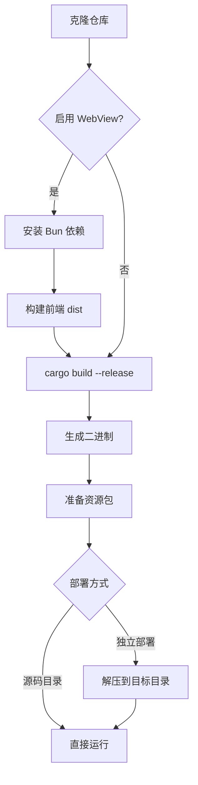
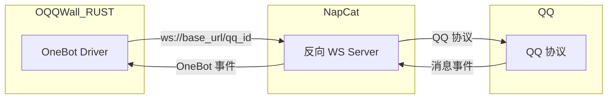

本页面将引导你从零开始构建、配置并首次运行 OQQWall_RUST —— 一个基于 Rust 的 QQ 校园墙自动运营系统。系统采用**事件驱动架构**（Functional Core / Imperative Shell），将投稿接收、聚合、渲染、审核、排程发送整合为单一可执行文件，性能相比原版提升百倍以上。

通过本指南，你将完成：源码编译 → 配置生成 → NapCat 对接 → 首次启动验证的完整流程。

## 系统概览

OQQWall_RUST 是一个单二进制 Rust 程序，负责校园墙日常运营的全链路：收稿 → 聚合成稿 → 渲染预览 → 审核群指令 → 排程发送 QQ 空间。系统支持文本、表情、表情包、图片、视频、文件等多种消息类型。

核心架构采用 **Functional Core / Imperative Shell** 模式：纯函数层（core）处理状态转换与决策，副作用层（drivers）执行 IO 操作（渲染、网络通信、文件写入）。这种设计确保了系统的可测试性、可回放性与幂等性。

Sources: [README.md](README.md#L1-L15), [dev_guide.md](docs/dev_guide.md#L31-L50)

## 前置条件

在开始之前，请确保你的环境满足以下要求：

| 条件 | 要求 | 说明 |
|------|------|------|
| **操作系统** | Linux（推荐 Ubuntu 22.04+） | 主线开发平台为 ArchLinux，生产环境兼容 glibc ≥ 2.31 |
| **Rust 工具链** | ≥ 1.94.0（2024 edition） | 项目使用 Rust 2024 edition |
| **系统依赖** | `python3`, `pkg-config`, `libfreetype6-dev`, `libfontconfig1-dev` | Skia 渲染引擎所需 |
| **Bun** | ≥ 1.3.14（可选） | 仅构建 WebView 前端时需要 |
| **NapCat** | 已部署并运行 | QQ 协议接入层，提供 OneBot 接口 |
| **QQ 账号** | 至少 1 个 | 用于机器人登录，需在 NapCat 中配置 |
| **审核群** | 1 个 QQ 群 | 用于接收投稿预览与执行审核指令 |

Sources: [Dockerfile.rust-glibc231-toolchain](Dockerfile.rust-glibc231-toolchain#L1-L14), [runbook.md](docs/runbook.md#L38-L50)

## 构建项目

### 方式一：从源码构建

```bash
# 1. 克隆仓库（含子模块）
git clone --recursive https://github.com/gfhdhytghd/OQQWall_rust.git
cd OQQWall_rust

# 2. 构建 WebView 前端（可选，启用 Web 审核界面时需要）
cd crates/app/webview-ui
bun install
bun run build
cd ../../..

# 3. 构建主程序（Release 模式）
cargo build --release -p OQQWall_RUST
```

构建产物位于 `target/release/OQQWall_RUST`。Release 配置启用了 LTO、单 codegen unit、符号剥离等优化，最终二进制体积最小化。

Sources: [Cargo.toml](Cargo.toml#L12-L16), [build-multi-arch.yml](.github/workflows/build-multi-arch.yml#L52-L72)

### 方式二：使用预编译二进制

从 [GitHub Releases](https://github.com/gfhdhytghd/OQQWall_rust/releases) 下载对应架构的文件：

- `OQQWall_RUST-linux-amd64` — x86_64 架构
- `OQQWall_RUST-linux-arm64` — ARM64 架构
- `OQQWall_RUST-res.tar.gz` — 资源包（表情、字体等）

将二进制与资源包解压到同一目录：

```bash
mkdir -p /opt/OQQWall_RUST && cd /opt/OQQWall_RUST
# 放入下载的二进制并重命名
mv OQQWall_RUST-linux-amd64 OQQWall_RUST
chmod +x OQQWall_RUST
# 解压资源包
tar xzf OQQWall_RUST-res.tar.gz
```

> **注意**：若程序目录下缺少 `res/` 目录但存在资源包 `.tar.gz` 文件，启动时会自动校验 SHA256 并解压。

Sources: [package_split_release.sh](scripts/package_split_release.sh#L1-L54), [runbook.md](docs/runbook.md#L72-L90)

### 完整构建流程图



## 首次配置（OOBE）

OQQWall_RUST 提供交互式 OOBE（Out-of-Box Experience）向导，引导你生成 `config.json` 配置骨架，避免手动填写错误。

### 运行 OOBE

```bash
# 方式一：在源码目录运行
cargo run -p OQQWall_RUST -- oobe

# 方式二：指定配置文件路径
cargo run -p OQQWall_RUST -- oobe --config ./config.json

# 方式三：使用预编译二进制
./OQQWall_RUST oobe
```

### OOBE 交互项说明

OOBE 会依次询问以下配置项（按回车使用默认值）：

| 配置项 | 默认值 | 说明 |
|--------|--------|------|
| **逻辑组名** | `default` | 对应 `groups.<group_id>`，支持多账号组 |
| **审核群 ID** | （必填） | 接收投稿预览与执行审核指令的 QQ 群 |
| **账号列表** | （必填） | 逗号分隔，第一个为主账号 |
| **NapCat Base URL** | `0.0.0.0:3001/oqqwall/ws` | NapCat 反向 WS 地址 |
| **NapCat Token** | 自动生成 | NapCat 访问令牌，可用环境变量覆盖 |
| **聚合窗口秒数** | `20` | 投稿聚合等待时间 |
| **时区偏移** | `480` | 中国大陆为 480（UTC+8） |
| **内存缓存上限** | `256` MB | 图片/blob 缓存 |
| **暂存条数** | `1` | `1` 表示通过后直接发送 |
| **定时发送** | 空 | 格式 `HH:MM`，逗号分隔 |

OOBE 完成后会生成 `config.json` 文件。密码字段（如 WebView 管理员）会自动归一化为 `sha256:` 哈希格式。

Sources: [oobe.rs](crates/app/src/oobe.rs#L1-L100), [oobe.md](docs/oobe.md#L1-L51)

## 配置 NapCat

NapCat 是 QQ 协议接入层，提供 OneBot 11 兼容接口。OQQWall_RUST 通过反向 WebSocket 连接 NapCat。

### NapCat 配置步骤

1. **启动 NapCat** 并登录 QQ 账号
2. **配置反向 WebSocket**：在 NapCat 中添加反向 WS 地址

```
ws://<napcat_base_url>/<QQ号>
```

例如，若 `napcat_base_url` 为 `127.0.0.1:3001/oqqwall/ws`，账号为 `3995477265`，则 NapCat 中填写：

```
ws://127.0.0.1:3001/oqqwall/ws/3995477265
```

3. **确保网络可达**：OQQWall_RUST 能访问 NapCat 的监听端口

### 连接架构



Sources: [config.md](docs/config.md#L95-L105), [oobe.md](docs/oobe.md#L36-L40)

## 启动运行

### 前台启动（调试）

```bash
# 源码目录
cargo run -p OQQWall_RUST

# 或直接运行二进制
./OQQWall_RUST
```

启动成功后，终端将输出 `系统已启动`，随后进入事件循环。程序会自动：
- 加载配置文件
- 初始化事件引擎（Engine）
- 连接 NapCat
- 启动状态日志与遥测服务
- 启动 Web API / WebView（若已启用）

若配置文件不存在且处于交互终端，程序会自动进入 OOBE 流程。

Sources: [main.rs](crates/app/src/main.rs#L30-L80), [runbook.md](docs/runbook.md#L92-L110)

### systemd 服务化（推荐生产环境）

创建 `/etc/systemd/system/OQQWall_RUST.service`：

```ini
[Unit]
Description=OQQWall_RUST
After=network.target

[Service]
Type=simple
WorkingDirectory=/opt/OQQWall_RUST
ExecStart=/opt/OQQWall_RUST/OQQWall_RUST
Restart=always
RestartSec=2
Environment=OQQWALL_CONFIG=/opt/OQQWall_RUST/config.json
Environment=OQQWALL_NAPCAT_TOKEN=your_token_here
StandardOutput=journal
StandardError=journal

[Install]
WantedBy=multi-user.target
```

启用并启动：

```bash
sudo systemctl daemon-reload
sudo systemctl enable --now OQQWall_RUST
sudo systemctl status OQQWall_RUST
```

查看实时日志：

```bash
journalctl -u OQQWall_RUST -f
```

Sources: [runbook.md](docs/runbook.md#L112-L145)

## 验证运行

系统启动后，通过以下步骤验证是否正常工作：

### 1. 检查连接状态

在审核群中发送：

```
@机器人 帮助
```

若收到帮助信息，说明 NapCat 连接正常且机器人已在线。

### 2. 测试投稿流程

向机器人私聊或在指定群发送一条测试消息（文本 + 图片），系统将：
1. 按 `process_waittime_sec` 窗口聚合投稿
2. 生成渲染预览 PNG
3. 在审核群推送摘要 + 渲染图

### 3. 执行审核指令

在审核群中，**回复**审核消息或使用 `@机器人 <review_code> <指令>` 语法：

| 指令 | 说明 |
|------|------|
| `是` | 通过并入队发送 |
| `否` | 跳过，人工处理 |
| `删` | 删除稿件 |
| `拒` | 拒绝并通知投稿人 |
| `等` | 延迟 180 秒后重新审核 |

### 4. 检查 Web 界面（可选）

若已启用 WebView，在浏览器访问：

```
http://<host>:<webview_port>/
```

使用配置的管理员账号登录，可查看待审核、待发送、已发送等状态。

Sources: [command.md](docs/command.md#L1-L60), [webview.md](docs/webview.md#L1-L30)

## 关键配置速查

以下是最常调整的配置项，完整说明见 [配置文件说明](4-pei-zhi-wen-jian-shuo-ming)：

| 配置路径 | 类型 | 默认值 | 说明 |
|----------|------|--------|------|
| `common.process_waittime_sec` | number | `20` | 投稿聚合窗口（秒） |
| `common.tz_offset_minutes` | number | `0` | 时区偏移（中国大陆 `480`） |
| `common.max_cache_mb` | number | `256` | 内存缓存上限（MB） |
| `common.webview.enabled` | bool | `false` | 启用 Web 审核界面 |
| `common.webview.port` | number | `10924` | Web 界面端口 |
| `common.web_api.enabled` | bool | `false` | 启用 HTTP API |
| `groups.<id>.mangroupid` | string | 必填 | 审核群 ID |
| `groups.<id>.accounts` | array | 必填 | QQ 账号列表 |
| `groups.<id>.napcat_base_url` | string | 继承 common | NapCat WS 地址 |
| `groups.<id>.send_schedule` | array | `[]` | 定时发送 `HH:MM` |

### 环境变量覆盖

敏感信息（如 Token）建议通过环境变量注入，避免写入配置文件：

| 环境变量 | 覆盖目标 |
|----------|----------|
| `OQQWALL_CONFIG` | 配置文件路径 |
| `OQQWALL_NAPCAT_BASE_URL` | 所有组的 NapCat 地址 |
| `OQQWALL_NAPCAT_TOKEN` | 所有组的 NapCat Token |
| `OQQWALL_API_TOKEN` | Web API Root Token |
| `OQQWALL_DATA_DIR` | 数据目录（默认 `data`） |

Sources: [config.md](docs/config.md#L15-L45), [config.rs](crates/app/src/config.rs#L1-L50)

## 运行目录结构

系统运行时会在工作目录（或 `OQQWALL_DATA_DIR` 指定路径）下生成以下数据：

```
data/
├── journal/          # 事件日志（append-only，用于崩溃恢复）
├── snapshot/         # 状态快照（缩短回放时间）
├── blobs/            # 产物与附件备份
├── telemetry/        # 遥测缓存（训练样本）
└── logs/             # 调试日志（debug build）
```

> **重要**：`data/` 目录应放在持久化存储上，不要放在 tmpfs，否则重启后将丢失历史数据。

Sources: [runbook.md](docs/runbook.md#L25-L37)

## 项目结构速览

```
OQQWall_rust/
├── crates/
│   ├── app/            # 主程序入口、配置、OOBE、Web API、WebView
│   │   ├── src/
│   │   │   ├── main.rs       # 程序入口
│   │   │   ├── config.rs     # 配置加载与解析
│   │   │   ├── engine.rs     # 事件引擎
│   │   │   ├── oobe.rs       # OOBE 向导
│   │   │   ├── web_api.rs    # HTTP API
│   │   │   └── webview.rs    # Web 审核界面
│   │   └── webview-ui/       # Vue + React 前端
│   ├── core/           # 纯函数层（事件、状态、决策）
│   │   └── src/
│   │       ├── event.rs      # 事件类型定义
│   │       ├── state.rs      # 状态视图与 Reducer
│   │       └── decide/       # 决策引擎（纯函数）
│   ├── infra/          # 基础设施（日志、缓存、总线）
│   └── drivers/        # 副作用层（渲染、OneBot、QQ空间）
├── res/                # 资源文件（表情、字体）
├── docs/               # 文档
└── scripts/            # 构建与打包脚本
```

Sources: [Cargo.toml](Cargo.toml#L1-L16), [engineering.md](docs/engineering.md#L55-L100)

## 下一步

完成快速开始后，建议按以下路径深入学习：

1. **[配置文件说明](4-pei-zhi-wen-jian-shuo-ming)** — 了解所有配置项的详细语义与高级用法
2. **[审核指令系统](6-shen-he-zhi-ling-xi-tong)** — 掌握群内审核指令的完整语法与快捷指令 DSL
3. **[投稿处理流程](7-tou-gao-chu-li-liu-cheng)** — 理解从投稿接收到空间发送的完整链路
4. **[项目架构详解](8-xiang-mu-jia-gou-xiang-jie)** — 深入 Functional Core / Imperative Shell 架构设计
5. **[生产环境部署](20-sheng-chan-huan-jing-bu-shu)** — systemd 服务化、资源限制、监控配置
6. **[故障排查手册](22-gu-zhang-pai-cha-shou-ce)** — 常见问题诊断与修复流程

遇到问题可加入技术交流群：**1056259167**