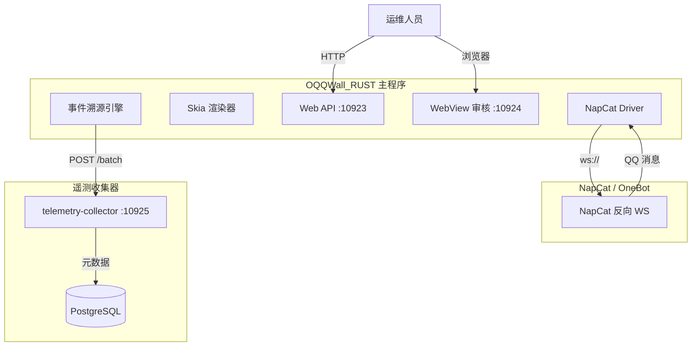
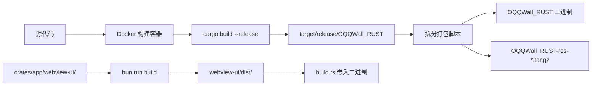
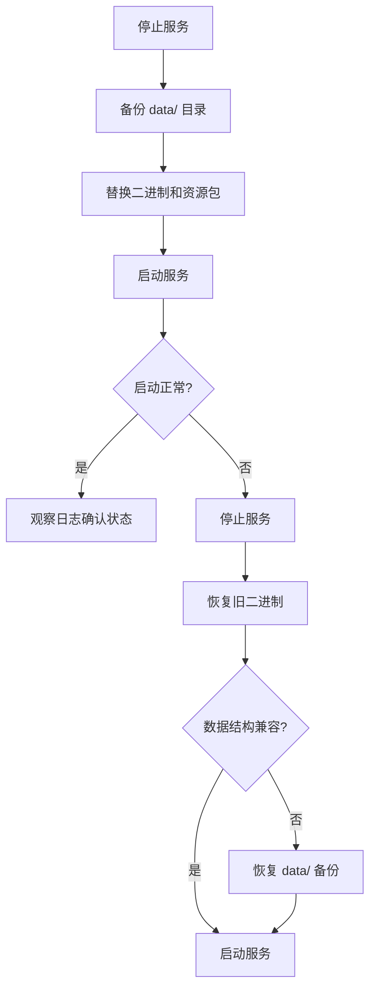

本页面为 OQQWall_RUST 的生产环境部署完整指南，涵盖从二进制构建、资源打包、系统服务配置到遥测收集器集成的全流程。项目采用**拆分发布**策略——二进制与静态资源独立打包，支持 x86_64 和 aarch64 双架构，通过 GitHub Actions 实现 CI/CD 自动化。

## 系统架构总览

生产环境由三个独立组件构成，它们通过网络协议松耦合协作：



**组件职责划分**：

| 组件 | 部署形态 | 默认端口 | 存储依赖 |
|------|---------|---------|---------|
| OQQWall_RUST | 单二进制 + res/ 资源目录 | 10923 (API), 10924 (WebView) | data/ 目录（journal、snapshot、blobs） |
| NapCat/OneBot | 外部进程或 managed 子进程 | 由 NapCat 配置决定 | 无 |
| telemetry-collector | 独立二进制 + Docker Compose | 10925 | PostgreSQL + 本地对象目录 |

Sources: [README.md](README.md#L1-L58), [docker-compose.telemetry.yml](docker-compose.telemetry.yml#L1-L41), [docs/runbook.md](docs/runbook.md#L1-L50)

## 构建与打包

### 二进制构建流程

项目使用 Docker 容器化构建确保 glibc 2.31 兼容性。构建工具链镜像基于 `rust:1.94.0-bullseye`，预装 Skia 所需的系统依赖。



构建工具链镜像安装了 Python3、pkg-config、libfreetype6-dev、libfontconfig1-dev、ffmpeg 和 ca-certificates，这些是 Skia 字体渲染和媒体处理的必要依赖。

Sources: [Dockerfile.rust-glibc231-toolchain](Dockerfile.rust-glibc231-toolchain#L1-L14), [crates/app/build.rs](crates/app/build.rs#L1-L104), [Cargo.toml](Cargo.toml#L1-L16)

### 拆分打包脚本

项目采用**二进制与资源分离发布**策略，核心逻辑封装在 `scripts/package_split_release.sh` 中。该脚本执行以下流程：

1. 调用 `cargo_docker.sh` 在容器内完成 release 构建
2. 将二进制复制到 `dist/OQQWall_RUST`
3. 将 `res/` 目录打包为 `OQQWall_RUST-res-<时间戳>.tar.gz`
4. 基于 SHA256 哈希判断资源是否变更，未变更时复用上次打包结果

```bash
# 执行拆分打包
./scripts/package_split_release.sh

# 产物位于 dist/ 目录
# dist/OQQWall_RUST          # 主程序二进制
# dist/OQQWall_RUST-res-*.tar.gz  # 资源包（含字体、头像、表情等）
```

`cargo_docker.sh` 脚本封装了 Docker 运行参数，自动挂载宿主机的 Cargo registry 缓存和目标目录，并在构建完成后修复文件所有权。

Sources: [scripts/package_split_release.sh](scripts/package_split_release.sh#L1-L54), [scripts/cargo_docker.sh](scripts/cargo_docker.sh#L1-L50)

### CI/CD 多架构构建

GitHub Actions 工作流 `.github/workflows/build-multi-arch.yml` 实现了完整的多架构构建和发布流水线：

| 阶段 | 运行器 | 说明 |
|------|-------|------|
| prepare-release | ubuntu-22.04 | 校验版本号格式，准备发布参数 |
| linux-build (amd64) | ubuntu-22.04 | 构建 x86_64 二进制 |
| linux-build (arm64) | ubuntu-24.04-arm | 构建 aarch64 二进制 |
| res-package | ubuntu-22.04 | 打包公共资源包 |
| publish-release | ubuntu-22.04 | 合并产物并发布到 GitHub Release |

工作流支持手动触发，可选指定版本号（如 `v0.3.1`）和更新日志。未指定版本号时仅构建产物不发布。

WebView 前端在构建前会先用 Bun 安装依赖并执行 `bun run build`，产物 `webview-ui/dist/` 通过 `build.rs` 的 `include_bytes!` 宏嵌入到最终二进制中。

Sources: [.github/workflows/build-multi-arch.yml](.github/workflows/build-multi-arch.yml#L1-L219)

## 部署步骤

### 环境准备

部署前需确认以下前置条件：

| 检查项 | 要求 | 验证方法 |
|--------|------|---------|
| 操作系统 | Linux（推荐 Ubuntu 22.04+） | `lsb_release -a` |
| glibc 版本 | >= 2.31 | `ldd --version` |
| 系统时钟 | 已启用 NTP | `timedatectl status` |
| 网络连通性 | 能访问 NapCat OneBot 端口 | `curl http://<napcat_host>:<port>` |
| 磁盘空间 | data/ 目录可写，建议稳定存储 | `df -h` |

**资源目录**是渲染引擎的必要依赖，包含字体、头像、表情等静态文件。资源目录的查找遵循优先级链：

1. `OQQWALL_RES_DIR` 环境变量指定的路径
2. 可执行文件同级的 `res/` 目录
3. 当前工作目录的 `res/` 目录

如果可执行文件旁存在 `OQQWall_RUST-res*.tar.gz` 归档，程序启动时会自动进行 SHA256 校验并解压。关键资源文件缺失会导致启动失败。

Sources: [docs/runbook.md](docs/runbook.md#L56-L100), [crates/drivers/src/renderer.rs](crates/drivers/src/renderer.rs#L8103-L8200)

### 首次部署

**步骤一：下载并解压产物**

```bash
# 创建部署目录
sudo mkdir -p /opt/OQQWall_RUST
cd /opt/OQQWall_RUST

# 下载对应架构的二进制（以 amd64 为例）
wget https://github.com/gfhdhytghd/OQQWall_rust/releases/download/v0.3.1/OQQWall_RUST-linux-amd64
chmod +x OQQWall_RUST-linux-amd64
mv OQQWall_RUST-linux-amd64 OQQWall_RUST

# 下载并解压资源包
wget https://github.com/gfhdhytghd/OQQWall_rust/releases/download/v0.3.1/OQQWall_RUST-res.tar.gz
tar xzf OQQWall_RUST-res.tar.gz
```

**步骤二：生成配置文件**

程序提供 OOBE 向导自动生成配置骨架：

```bash
./OQQWall_RUST oobe
# 按提示输入 NapCat 地址、审核群 ID、QQ 账号等
# 生成 config.json
```

或手动创建 `config.json` 并参照 [配置文件说明](4-pei-zhi-wen-jian-shuo-ming) 填写必填字段。

**步骤三：验证配置**

```bash
# 检查配置文件语法
./OQQWall_RUST --tui  # 进入 TUI 界面可可视化编辑配置
```

配置文件必填项检查清单：

- 每个 group 的 `napcat_base_url` 和 `napcat_access_token`
- 每个 group 的 `mangroupid`（审核群 ID）和 `accounts`（QQ 账号列表，首项为主账号）
- 启用 WebView 时至少配置一个 `webview_global_admins` 或组内 `webview_admins`

Sources: [docs/config.md](docs/config.md#L1-L234), [crates/app/src/config.rs](crates/app/src/config.rs#L1-L200)

### systemd 服务配置

推荐使用 systemd 管理服务生命周期。创建服务文件 `/etc/systemd/system/OQQWall_RUST.service`：

```ini
[Unit]
Description=OQQWall_RUST
After=network.target

[Service]
Type=simple
WorkingDirectory=/opt/OQQWall_RUST
ExecStart=/opt/OQQWall_RUST/OQQWall_RUST
Restart=always
RestartSec=2

# 配置文件路径（也可使用默认的 config.json）
Environment=OQQWALL_CONFIG=/opt/OQQWall_RUST/config.json

# 敏感信息通过环境变量注入，避免写入配置文件
Environment=OQQWALL_NAPCAT_TOKEN=your_napcat_token_here
Environment=OQQWALL_API_TOKEN=your_api_token_at_least_32_chars

# 数据目录
Environment=OQQWALL_DATA_DIR=/opt/OQQWall_RUST/data

# 资源目录（可选，默认查找 res/）
# Environment=OQQWALL_RES_DIR=/opt/OQQWall_RUST/res

# 资源限制（按机器情况调整）
# MemoryMax=2G
# CPUQuota=200%

# 日志输出到 journal
StandardOutput=journal
StandardError=journal

[Install]
WantedBy=multi-user.target
```

启用并启动服务：

```bash
sudo systemctl daemon-reload
sudo systemctl enable --now OQQWall_RUST
```

查看服务状态和日志：

```bash
sudo systemctl status OQQWall_RUST
journalctl -u OQQWall_RUST -f
```

Sources: [docs/runbook.md](docs/runbook.md#L110-L160), [crates/app/src/main.rs](crates/app/src/main.rs#L1-L145)

## 环境变量参考

环境变量可覆盖配置文件中的同名项，适用于敏感信息注入和容器化部署场景：

| 环境变量 | 覆盖目标 | 默认值 | 说明 |
|---------|---------|-------|------|
| `OQQWALL_CONFIG` | 配置文件路径 | `config.json` | 配置文件绝对或相对路径 |
| `OQQWALL_DATA_DIR` | 运行数据目录 | `data` | 影响 journal、snapshot、blobs、日志、遥测 |
| `OQQWALL_RES_DIR` | 资源目录 | 自动查找 | 字体、头像、表情等静态资源 |
| `OQQWALL_NAPCAT_BASE_URL` | 所有组的 NapCat base url | 无 | 覆盖配置文件中的 `napcat_base_url` |
| `OQQWALL_NAPCAT_TOKEN` | 所有组的 NapCat access token | 无 | 覆盖配置文件中的 `napcat_access_token` |
| `OQQWALL_API_TOKEN` | Web API root token | 无 | 覆盖 `common.web_api.root_token`，长度 >= 32 |
| `OQQWALL_PROCESS_WAITTIME_MS` | 投稿聚合窗口 | `20000` | 毫秒，优先于 `common.process_waittime_sec` |
| `OQQWALL_MAX_CACHE_MB` | 图片/blob 内存缓存上限 | `256` | 单位 MB |
| `OQQWALL_DEBUG_LOG` | 调试日志路径 | `data/logs/debug.log` | 仅 debug build 生效 |

Sources: [docs/config.md](docs/config.md#L20-L40), [crates/app/src/config.rs](crates/app/src/config.rs#L100-L200)

## 数据目录结构

程序运行时在 `OQQWALL_DATA_DIR`（默认 `data/`）下维护以下目录结构：

```
data/
├── journal/          # append-only 事件日志（分段存储，每段带 CRC）
├── snapshot/         # 周期性状态快照（用于缩短回放时间）
├── blobs/            # 产物与附件备份（写多读少）
├── telemetry/        # 遥测缓存
│   ├── pending_samples.jsonl   # 待上传训练样本
│   └── chat_objects/*.json     # 去重后的聊天对象
└── logs/             # 调试日志（debug build）
    └── debug.log
```

**重要**：`data/` 目录必须放在稳定磁盘上，不要放在 tmpfs。程序启动时会从 snapshot 恢复状态并回放 journal，如果数据丢失将导致历史投稿信息不可恢复。

Sources: [docs/runbook.md](docs/runbook.md#L25-L55)

## 网络服务端口

程序默认监听以下端口：

| 服务 | 默认端口 | 绑定地址 | 配置项 |
|------|---------|---------|--------|
| Web API | 10923 | 0.0.0.0 | `common.web_api.enabled`, `common.web_api.port` |
| WebView 审核界面 | 10924 | 0.0.0.0 | `common.webview.enabled`, `common.webview.host`, `common.webview.port` |

**安全建议**：

- WebView 审核界面建议绑定 `127.0.0.1` 仅本机访问
- 公网环境请将 WebView 放在反向代理（如 Nginx）后并加额外访问控制
- Web API 的 root token 建议通过 `OQQWALL_API_TOKEN` 环境变量注入

WebView 启用条件：配置中 `common.webview.enabled=true` 且至少配置一个管理员账号（`webview_global_admins` 或组内 `webview_admins`）。

Sources: [docs/config.md](docs/config.md#L60-L90), [docs/webview.md](docs/webview.md#L1-L150)

## 遥测收集器部署

遥测收集器是独立进程，用于接收主程序上传的投稿训练样本，支持幂等入库、对象落盘和 Parquet 导出。

### Docker Compose 部署（推荐）

项目提供了 `docker-compose.telemetry.yml` 一键部署遥测收集器及其 PostgreSQL 数据库：

```bash
# 先构建 collector 二进制
docker run --rm --network host \
  -v "$PWD:/work" -w /work \
  -v "$HOME/.cargo/registry:/root/.cargo/registry" \
  -v "$HOME/.cargo/git:/root/.cargo/git" \
  rust-glibc231:20.04-oqqwall \
  bash -lc 'CARGO_TARGET_DIR=/work/out-target cargo build --release -p oqqwall_telemetry_collector --bin telemetry-collector && cp /work/out-target/release/telemetry-collector /work/out/telemetry-collector'

# 启动服务
docker compose -f docker-compose.telemetry.yml up -d --build
```

Compose 文件定义了两个服务：

| 服务 | 镜像 | 端口 | 数据卷 |
|------|------|------|--------|
| postgres | postgres:16 | 5432 | telemetry_pg_data |
| collector | 自建 Dockerfile.telemetry-collector | 10925 | telemetry_collector_data |

### 遥测收集器配置

通过环境变量配置收集器：

| 环境变量 | 默认值 | 说明 |
|---------|-------|------|
| `COLLECTOR_HTTP_ADDR` | `0.0.0.0:10925` | 监听地址 |
| `COLLECTOR_PG_DSN` | 必填 | PostgreSQL 连接串 |
| `COLLECTOR_OBJECT_DIR` | `data/collector/objects` | 聊天对象存储目录 |
| `COLLECTOR_EXPORT_DIR` | `data/collector/exports` | Parquet 导出目录 |
| `COLLECTOR_BOOTSTRAP_ROOT_TOKEN` | 必填（>=16 字符） | root 管理 token |
| `COLLECTOR_MAX_BODY_MB` | `10` | 请求体上限 |

**安全提醒**：`COLLECTOR_BOOTSTRAP_ROOT_TOKEN` 应通过 Secret 管理注入，不要写入代码仓库。

健康检查：

```bash
curl http://127.0.0.1:10925/telemetry/v1/healthz
```

主程序与收集器的对接通过内置的 telemetry endpoint 和 token 完成，无需在 `config.json` 中额外配置 endpoint。如需自建收集器，需修改主程序内置的 endpoint/token 后重新编译。

Sources: [docker-compose.telemetry.yml](docker-compose.telemetry.yml#L1-L41), [Dockerfile.telemetry-collector](Dockerfile.telemetry-collector#L1-L12), [docs/telemetry_collector.md](docs/telemetry_collector.md#L1-L279)

## 升级与回滚

升级流程遵循**先备份、后替换、可回滚**原则：



**升级步骤**：

```bash
# 1. 停止服务
sudo systemctl stop OQQWall_RUST

# 2. 备份数据目录
tar -czf OQQWall_RUST-data-$(date +%F_%H%M%S).tar.gz data/

# 3. 替换二进制（保留旧版本以便回滚）
cp OQQWall_RUST OQQWall_RUST.old
cp /path/to/new/OQQWall_RUST OQQWall_RUST
chmod +x OQQWall_RUST

# 4. 如有资源包更新，解压覆盖 res/
# tar xzf OQQWall_RUST-res-new.tar.gz

# 5. 启动服务并观察日志
sudo systemctl start OQQWall_RUST
journalctl -u OQQWall_RUST -n 200 --no-pager
```

**事件溯源保证**：程序基于事件溯源架构，重启后会从 snapshot 恢复状态并回放 journal，确保数据一致性。即使升级过程中断，也不会丢失已提交的投稿数据。

Sources: [docs/runbook.md](docs/runbook.md#L200-L260), [crates/app/src/engine.rs](crates/app/src/engine.rs#L1-L100)

## 备份策略

最小备份集包含三个关键目录：

| 目录 | 重要性 | 建议频率 | 说明 |
|------|-------|---------|------|
| `data/journal/` | 必备 | 每天 | append-only 事件日志，丢失将无法恢复历史 |
| `data/snapshot/` | 必备 | 每天 | 状态快照，丢失会导致回放时间变长 |
| `data/blobs/` | 强烈建议 | 每天或按容量滚动 | 产物与附件，丢失会导致历史预览缺失 |

遥测数据备份（如需保留训练样本）：

- `data/telemetry/pending_samples.jsonl`：待上传样本
- `data/telemetry/chat_objects/`：去重后的聊天对象

恢复流程：将备份的 `data/` 解压到目标目录，启动服务即可。程序会自动执行 snapshot 加载 → journal 回放 → 状态重建 → 继续处理 pending 项。

Sources: [docs/runbook.md](docs/runbook.md#L260-L290)

## 下一步

部署完成后，建议按以下顺序阅读相关文档：

- [配置文件说明](4-pei-zhi-wen-jian-shuo-ming) — 详细配置项参考
- [首次运行与初始化](5-shou-ci-yun-xing-yu-chu-shi-hua) — OOBE 初始化流程
- [监控与遥测](21-jian-kong-yu-yao-ce) — 遥测数据管理与监控
- [故障排查手册](22-gu-zhang-pai-cha-shou-ce) — 常见问题排查指南