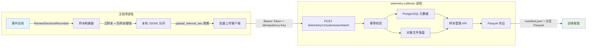
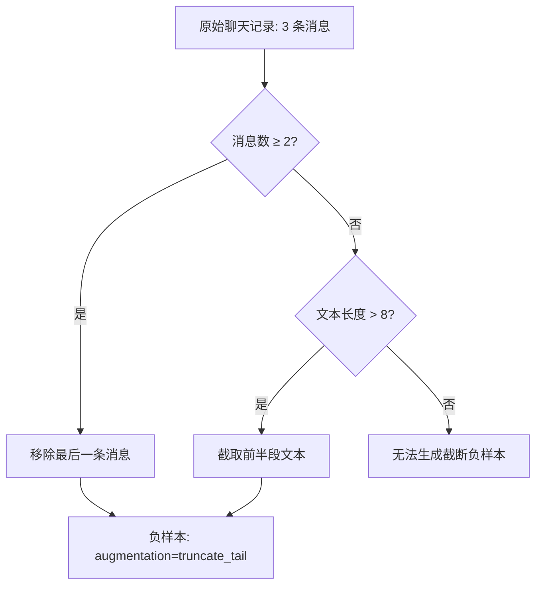
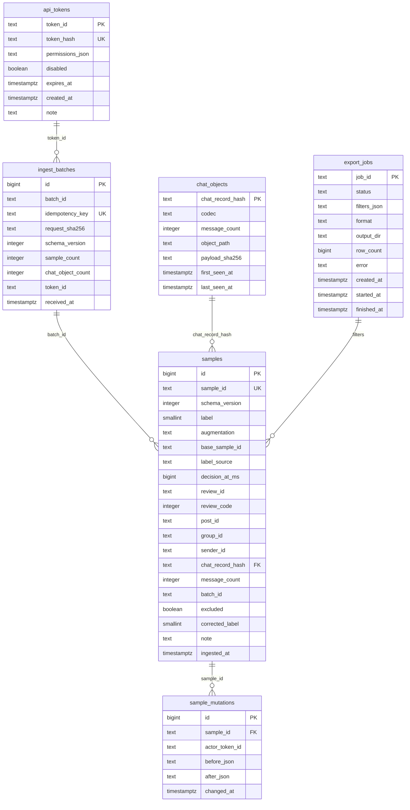
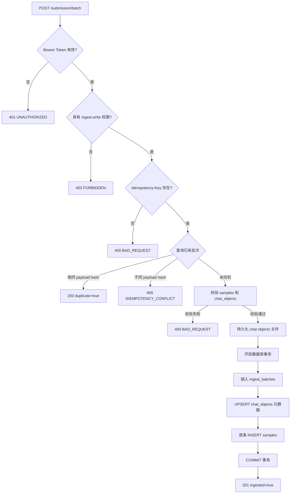

本页详细阐述 OQQWall_RUST 的**投稿遥测系统**——一套将审核决策转化为可训练样本的端到端数据管线。系统分为两个独立进程：主程序内的**遥测客户端**负责样本生成、本地缓存与批量上传；独立部署的 **telemetry-collector** 服务端负责幂等入库、样本管理与 Parquet 格式导出。该管线的最终目标是为审核模型的自动化训练提供高质量标注数据。

## 整体架构

遥测系统遵循**生产者-消费者**模式，通过 HTTP 批量上传协议解耦两端。主程序监听事件总线，在审核决策发生时生成训练样本，经本地 JSONL 队列缓冲后，按配置周期批量推送至 collector 服务端。服务端以 PostgreSQL 存储元数据、本地文件系统存储聊天对象原文，最终可按需导出为 Parquet 列式格式供训练框架消费。



该架构的核心设计决策在于**客户端与服务端完全解耦**：客户端仅负责样本生产与上传，不包含任何接收 API；服务端仅负责数据入库与管理，不参与审核逻辑。两者通过约定的 HTTP 协议交互，客户端内置固定的 endpoint 与 token，不通过配置文件暴露。

Sources: [telemetry.rs](crates/app/src/telemetry.rs#L1-L30), [main.rs](crates/telemetry-collector/src/main.rs#L1-L30), [telemetry.md](docs/telemetry.md#L1-L148), [telemetry_collector.md](docs/telemetry_collector.md#L1-L200)

## 样本生成机制

样本生成的核心触发点是事件总线上的 `ReviewDecisionRecorded` 事件。当管理员在审核群中对一条投稿做出决策时，`TelemetryRuntime` 的事件循环会捕获该事件，调用 `build_samples` 方法构造训练样本。

### 标签映射与决策语义

审核决策与样本标签之间存在明确的映射关系：

| 审核决策 | 样本标签 (`label`) | 标签来源 (`label_source`) | 是否生成样本 |
|---|---|---|---|
| `Approved` | `1`（正样本） | `approved` | ✅ 生成 1 正 + 多个负样本 |
| `Rejected` | `0`（负样本） | `rejected` | ✅ 生成 1 个负样本 |
| `Deleted` | `0`（负样本） | `deleted` | ✅ 生成 1 个负样本 |
| `Deferred` | — | — | ❌ 忽略 |
| `Skipped` | — | — | ❌ 忽略 |

**对于 `Approved` 决策，除了 1 条正样本外，还会自动生成额外的负样本**，通过两种增强策略实现。这些增强样本的 `augmentation` 字段标记了所用策略，`base_sample_id` 指向其对应的原始正样本，形成样本间的关联链。

Sources: [telemetry.rs](crates/app/src/telemetry.rs#L142-L190), [telemetry.md](docs/telemetry.md#L13-L24)

### 负样本增强策略

当决策为 `Approved` 时，系统会基于原始聊天记录生成两种负样本变体，旨在丰富模型对"边界情况"的判别能力：

**`truncate_tail` 策略**：截断聊天记录的尾部内容。若消息列表包含 2 条及以上消息，则移除最后一条消息；若仅有 1 条消息且文本长度超过 8 个字符，则截取前半段文本。该策略模拟"投稿信息不完整"的场景。



**`append_offtopic` 策略**：在原始聊天记录末尾追加同群组、同发送者的后续消息。系统从状态快照中筛选满足以下条件的消息：与投稿同属一个 `group_id`、来自同一 `sender_id`、发送时间晚于投稿最后一条消息、且不属于当前投稿。最多追加 `max_append_messages` 条（默认 2）。该策略模拟"将无关消息混入投稿"的场景。

当决策为 `Rejected` 或 `Deleted` 时，仅生成 1 条负样本，不进行任何增强（`augmentation=none`）。

Sources: [telemetry.rs](crates/app/src/telemetry.rs#L300-L398), [telemetry.md](docs/telemetry.md#L26-L37)

### 上下文构建

`build_base_context` 函数从 `StateView` 中聚合样本所需的完整上下文。它通过审核记录 (`review_id`) 反查投稿 (`post_id`)，再从 `post_ingress` 映射中获取所有关联的入口消息 (`IngressId`)，逐条解析 `ingress_meta` 与 `ingress_messages` 构建 `ChatRecord`。消息按 `(received_at_ms, ingress_id)` 排序，确保时间序列的一致性。

每条 `ChatMessage` 包含入口 ID、平台消息 ID、接收时间戳、文本内容以及附件列表。附件通过 `MediaReference` 枚举区分远程 URL 引用与本地 blob 引用，并记录媒体类型（图片/视频/文件/音频/贴纸/其他）。

Sources: [telemetry.rs](crates/app/src/telemetry.rs#L240-L300), [telemetry.rs](crates/app/src/telemetry.rs#L420-L470)

## 本地存储结构

遥测数据在客户端的本地落盘采用双层结构：**样本队列文件** + **聊天对象去重目录**。所有文件路径相对于 `OQQWALL_DATA_DIR` 下的 `telemetry.local_dir`（默认为 `telemetry/`）。

```
data/telemetry/
├── pending_samples.jsonl       # 待上传样本队列（每行一条 JSON）
└── chat_objects/               # 聊天对象去重存储
    ├── <chat_record_hash>.json # 按内容 SHA-256 去重
    ├── <chat_record_hash>.json
    └── ...
```

**`pending_samples.jsonl`** 是一个追加写入的 JSONL 文件，每行包含一条 `PendingSample` 的 JSON 序列化结果。样本入队时先确保关联的聊天对象已持久化，再将样本行追加到文件末尾。

**`chat_objects/*.json`** 按 `chat_record_hash`（聊天记录内容的 SHA-256 哈希）去重存储。每个文件包含完整的 `ChatObjectEntry`：哈希值、编解码器标识（当前固定为 `json`）、消息数量以及原始聊天记录 payload。文件写入采用先写临时文件再原子重命名的策略，避免写入中断导致数据损坏。

上传成功后，已上传的样本从 `pending_samples.jsonl` 中移除（通过重写整个文件实现），不再被任何待上传样本引用的聊天对象文件会被自动清理。

Sources: [telemetry.rs](crates/app/src/telemetry.rs#L530-L610), [telemetry.md](docs/telemetry.md#L39-L52), [runbook.md](docs/runbook.md#L36-L42)

## 上传协议与行为

客户端的上传线程与事件监听共享同一个 `tokio::select!` 循环，按 `upload_interval_sec`（默认 30 秒）周期触发上传尝试。上传逻辑封装在 `flush_uploads` 方法中，循环调用 `upload_one_batch` 直到没有足够样本为止。

### 批次构建与请求格式

每次上传操作从 `pending_samples.jsonl` 中读取所有待上传样本，取前 `batch_size` 条（固定为 20）组成一个批次。系统收集这批样本引用的所有 `chat_record_hash`，从 `chat_objects/` 目录中读取对应的完整聊天对象，一并打包进请求体。

请求采用 `POST` 方法，包含以下关键头部：

| Header | 值 | 用途 |
|---|---|---|
| `Authorization` | `Bearer <内置 token>` | 服务端认证 |
| `Idempotency-Key` | `b<毫秒时间戳>_<随机 u64>` | 防止重复提交 |

请求体 `UploadBatchRequest` 包含：

| 字段 | 类型 | 说明 |
|---|---|---|
| `batch_id` | `string` | 与 `Idempotency-Key` 相同 |
| `schema_version` | `u32` | 当前固定为 `1` |
| `chat_objects` | `ChatObjectEntry[]` | 去重后的完整聊天对象 |
| `samples` | `PendingSample[]` | 本批次的训练样本 |

### ACK 语义与重试

客户端的 ACK 语义简洁明确：**只要 HTTP 状态码为 2xx，即视为整批成功**，随即从本地队列中删除该批样本并清理无引用的聊天对象。非 2xx 响应或网络错误会导致整批样本保留在队列中，等待下一个上传周期重试。

Sources: [telemetry.rs](crates/app/src/telemetry.rs#L220-L240), [telemetry.rs](crates/app/src/telemetry.rs#L599-L690), [telemetry.md](docs/telemetry.md#L54-L72)

## 服务端采集与存储

`telemetry-collector` 是一个独立的 Rust 二进制进程，基于 Axum 框架提供 HTTP 服务，使用 PostgreSQL 存储元数据，本地文件系统存储聊天对象原文与导出产物。

### 数据库 Schema

服务端启动时通过 `init_schema` 自动创建以下核心表：



索引设计覆盖了高频查询路径：`decision_at_ms`、`label`、`group_id`、`review_id`、`post_id`、`chat_record_hash` 上均有 B-tree 索引，`idempotency_key` 的唯一约束保证了幂等性。

Sources: [main.rs](crates/telemetry-collector/src/main.rs#L510-L600), [telemetry_collector.md](docs/telemetry_collector.md#L60-L90)

### 幂等入库流程

上传请求的处理遵循严格的幂等保证，核心流程如下：



校验阶段包括：`schema_version` 必须为 1、samples 非空且不超过 2000 条、`label` 只能为 0 或 1、每条样本引用的 `chat_record_hash` 必须在本批 chat_objects 或数据库已有记录中存在、`chat_record_hash` 必须与 payload 计算结果一致。

聊天对象文件采用与客户端相同的"先写临时文件再重命名"策略。数据库写入通过单一事务保证原子性：批次记录、chat objects 元数据、所有样本要么全部成功，要么全部回滚。

Sources: [main.rs](crates/telemetry-collector/src/main.rs#L700-L1100), [telemetry_collector.md](docs/telemetry_collector.md#L30-L65)

### 认证与权限模型

服务端采用 **Bearer Token + RBAC** 的认证授权模型。Token 存储在 `api_tokens` 表中，以 SHA-256 哈希形式保存（原始 token 不落盘）。每次请求经过 `auth_middleware` 中间件：提取 `Authorization` 头中的 Bearer token，计算哈希后查询数据库，校验 token 是否存在、是否被禁用、是否过期，最后将解析出的权限集注入请求扩展。

系统启动时会根据 `COLLECTOR_BOOTSTRAP_ROOT_TOKEN` 环境变量自动创建或更新 `root` token，该 token 拥有全部 6 项权限。

| 权限标识 | 用途 | 对应接口 |
|---|---|---|
| `ingest.write` | 上传批次 | `POST /submission/batch` |
| `batches.read` | 查询批次列表与详情 | `GET /batches`, `GET /batches/{id}` |
| `samples.read` | 查询样本与聊天对象 | `GET /samples`, `GET /chat_objects/{hash}` |
| `samples.write` | 修订样本标签/排除/备注 | `PATCH /samples/{id}` |
| `exports.manage` | 创建与下载导出任务 | `POST/GET /exports`, `GET /exports/{id}/manifest` |
| `tokens.manage` | 创建与删除 API token | `POST/DELETE /admin/tokens` |

健康检查端点 `GET /telemetry/v1/healthz` 无需认证，可直接用于存活探针。

Sources: [main.rs](crates/telemetry-collector/src/main.rs#L620-L700), [main.rs](crates/telemetry-collector/src/main.rs#L2200-L2290), [telemetry_collector.md](docs/telemetry_collector.md#L105-L130)

## 样本管理与修订

入库后的样本支持在线修订，主要用于人工纠正错误标签或排除异常样本。修订操作通过 `PATCH /telemetry/v1/samples/{sample_id}` 接口执行，支持三个可选字段：

| 字段 | 类型 | 说明 |
|---|---|---|
| `excluded` | `bool` | 标记样本是否应被排除在训练集之外 |
| `corrected_label` | `Option<i16>` | 人工纠正后的标签（0 或 1） |
| `note` | `Option<String>` | 修订备注 |

每次修订操作都会在 `sample_mutations` 表中记录一条变更日志，包含操作者 token ID、变更前后的 JSON 快照以及变更时间戳。这确保了所有人工干预的完整审计追踪。

Sources: [main.rs](crates/telemetry-collector/src/main.rs#L1400-L1600), [telemetry_collector.md](docs/telemetry_collector.md#L145-L180)

## Parquet 导出

服务端支持将样本数据导出为 Apache Parquet 列式格式，供训练框架高效读取。导出是异步执行的：创建请求返回 `202 Accepted`，后台 tokio task 完成实际的数据查询、分组与文件写入。

### 导出参数

| 参数 | 类型 | 默认值 | 说明 |
|---|---|---|---|
| `from_decision_at_ms` | `i64` | 无限制 | 审核时间起始（毫秒时间戳） |
| `to_decision_at_ms` | `i64` | 无限制 | 审核时间截止 |
| `labels` | `Vec<i16>` | 全部 | 筛选标签值（0/1） |
| `include_excluded` | `bool` | `false` | 是否包含已排除样本 |
| `group_id` | `String` | 无限制 | 按群组筛选 |
| `format` | `String` | `parquet` | 输出格式（当前仅支持 parquet） |

### 输出目录结构

导出产物按 **审核日期 × 标签** 二级分区组织：

```
<export_root>/<job_id>/
├── manifest.json                           # 导出元信息
├── decision_date=2024-01-15/
│   ├── label=0/
│   │   └── part-<random_hex>.parquet
│   └── label=1/
│       └── part-<random_hex>.parquet
├── decision_date=2024-01-16/
│   └── ...
└── ...
```

`manifest.json` 包含任务 ID、schema 版本、总行数、筛选条件以及所有 Parquet 文件的路径、行数与 SHA-256 校验和。**训练端建议以 `manifest.json` 作为任务入口**，而非硬编码文件路径。

### Parquet Schema

每个 Parquet 文件包含以下 19 列：

| 列名 | 类型 | 可空 | 说明 |
|---|---|---|---|
| `sample_id` | Utf8 | 否 | 样本唯一标识 |
| `schema_version` | Int32 | 否 | Schema 版本 |
| `label` | Int16 | 否 | 标签（0/1） |
| `augmentation` | Utf8 | 否 | 增强策略 |
| `base_sample_id` | Utf8 | 是 | 基样本 ID |
| `label_source` | Utf8 | 否 | 标签来源 |
| `decision_at_ms` | Int64 | 否 | 审核时间戳 |
| `review_id` | Utf8 | 否 | 审核记录 ID |
| `review_code` | Int32 | 否 | 审核编码 |
| `post_id` | Utf8 | 否 | 投稿 ID |
| `group_id` | Utf8 | 否 | 群组 ID |
| `sender_id` | Utf8 | 否 | 发送者 ID |
| `chat_record_hash` | Utf8 | 否 | 聊天记录哈希 |
| `message_count` | Int32 | 否 | 消息数量 |
| `batch_id` | Utf8 | 否 | 上传批次 ID |
| `excluded` | Boolean | 否 | 是否已排除 |
| `corrected_label` | Int16 | 是 | 人工纠正标签 |
| `note` | Utf8 | 是 | 修订备注 |
| `chat_record_json` | Utf8 | 否 | 完整聊天记录 JSON |

其中 `chat_record_json` 列直接嵌入了完整的聊天对象 JSON，使训练脚本无需额外 join 即可获取原始对话内容。

Sources: [main.rs](crates/telemetry-collector/src/main.rs#L1700-L1950), [main.rs](crates/telemetry-collector/src/main.rs#L1900-L2000), [telemetry_collector.md](docs/telemetry_collector.md#L183-L200)

## 配置参考

### 客户端配置

客户端遥测配置位于 `config.json` 的 `common.telemetry` 节点：

| 配置键 | 类型 | 默认值 | 说明 |
|---|---|---|---|
| `telemetry.enabled` | `bool` | `true` | 是否启用样本生成 |
| `telemetry.local_dir` | `string` | `"telemetry"` | 本地缓存目录（相对 `OQQWALL_DATA_DIR`） |
| `telemetry.upload_enabled` | `bool` | `true` | 是否启用批量上传 |
| `telemetry.upload_interval_sec` | `u64` | `30` | 上传轮询间隔（钳制到 1..86400 秒） |
| `telemetry.max_append_messages` | `usize` | `2` | `append_offtopic` 最多追加消息数（钳制到 1..10） |

> **注意**：上传 endpoint 与 token 为客户端程序内置固定值，不通过配置文件或环境变量暴露。如需对接自建 collector，需修改源码后重新编译。

Sources: [config.rs](crates/app/src/config.rs#L72-L85), [config.md](docs/config.md#L89-L97), [telemetry.md](docs/telemetry.md#L107-L115)

### 服务端配置

服务端通过环境变量配置：

| 环境变量 | 默认值 | 必填 | 说明 |
|---|---|---|---|
| `COLLECTOR_HTTP_ADDR` | `0.0.0.0:10925` | 否 | HTTP 监听地址 |
| `COLLECTOR_PG_DSN` | — | **是** | PostgreSQL 连接串 |
| `COLLECTOR_OBJECT_DIR` | `data/collector/objects` | 否 | 聊天对象存储目录 |
| `COLLECTOR_EXPORT_DIR` | `data/collector/exports` | 否 | 导出产物目录 |
| `COLLECTOR_BOOTSTRAP_ROOT_TOKEN` | — | **是** | root token（≥16 字符） |
| `COLLECTOR_MAX_BODY_MB` | `10` | 否 | 请求体上限（MB，钳制到 1..256） |
| `RUST_LOG` | `info` | 否 | 日志级别 |

**安全建议**：生产环境应将 `COLLECTOR_BOOTSTRAP_ROOT_TOKEN` 置于 Secret 管理系统中，不写入代码仓库。root token 每次启动时按该环境变量覆盖更新。

Sources: [main.rs](crates/telemetry-collector/src/main.rs#L475-L510), [telemetry_collector.md](docs/telemetry_collector.md#L30-L45)

## 部署指南

### Docker Compose 部署（推荐）

项目提供了 `docker-compose.telemetry.yml` 一键部署 collector 与 PostgreSQL：

```bash
# 1. 先构建 Linux 兼容二进制
docker run --rm --network host \
  -v "$PWD:/work" -w /work \
  -v "$HOME/.cargo/registry:/root/.cargo/registry" \
  -v "$HOME/.cargo/git:/root/.cargo/git" \
  rust-glibc231:20.04-oqqwall \
  bash -lc 'CARGO_TARGET_DIR=/work/out-target cargo build --release -p oqqwall_telemetry_collector --bin telemetry-collector && cp /work/out-target/release/telemetry-collector /work/out/telemetry-collector'

# 2. 启动服务
docker compose -f docker-compose.telemetry.yml up -d --build
```

Compose 文件定义了两个服务：

| 服务 | 镜像 | 端口 | 说明 |
|---|---|---|---|
| `postgres` | `postgres:16` | 内部 5432 | PostgreSQL 数据库 |
| `collector` | 自建 | `10925` | 遥测采集服务 |

**重要**：部署前务必修改 `COLLECTOR_BOOTSTRAP_ROOT_TOKEN` 为强密码值。

Sources: [docker-compose.telemetry.yml](docker-compose.telemetry.yml#L1-L41), [Dockerfile.telemetry-collector](Dockerfile.telemetry-collector#L1-L12), [telemetry_collector.md](docs/telemetry_collector.md#L200-L230)

### 与主程序对接

主程序内置的 telemetry endpoint 指向默认的 collector 地址。若使用 Docker Compose 默认配置，只需在主程序的 `config.json` 中确保遥测功能开启即可。上传 endpoint 与认证 token 为编译时内置值，不通过配置暴露。

如需自建 collector 并修改对接目标，需编辑主程序源码中的内置 endpoint/token 常量后重新编译。

Sources: [telemetry_collector.md](docs/telemetry_collector.md#L230-L240), [runbook.md](docs/runbook.md#L200-L215)

## 运维与监控

### 健康检查

collector 提供无需认证的健康检查端点：

```bash
curl http://127.0.0.1:10925/telemetry/v1/healthz
```

返回示例：
```json
{
  "status": "ok",
  "now": "2024-01-15T08:30:00Z"
}
```

### 遥测队列状态检查

在主程序所在机器上检查本地遥测缓存状态：

```bash
# 待上传样本条数
wc -l data/telemetry/pending_samples.jsonl

# 去重后的聊天对象数量
ls -1 data/telemetry/chat_objects | wc -l
```

若 `pending_samples.jsonl` 行数长期不下降，排查方向：

1. 检查 `common.telemetry.upload_enabled` 是否为 `true`
2. 检查内置 collector 地址是否可达
3. 查看主程序日志中 `telemetry upload start/success/failed` 相关条目

Sources: [runbook.md](docs/runbook.md#L200-L215)

### 批次与样本查询

通过 collector API 查询最近入库情况：

```bash
# 查看最近批次
curl -sS -H "Authorization: Bearer <token>" \
  "http://127.0.0.1:10925/telemetry/v1/batches?limit=10"

# 按标签筛选样本
curl -sS -H "Authorization: Bearer <token>" \
  "http://127.0.0.1:10925/telemetry/v1/samples?limit=50&label=1"
```

### 常见错误码

| HTTP 状态码 | 错误码 | 原因 | 处理方式 |
|---|---|---|---|
| `401` | `UNAUTHORIZED` | token 缺失/无效/过期/已禁用 | 检查 token 有效性 |
| `403` | `FORBIDDEN` | token 权限不足 | 确认 token 拥有所需权限 |
| `400` | `BAD_REQUEST` | 样本字段或 hash 校验失败 | 检查客户端版本与数据完整性 |
| `409` | `IDEMPOTENCY_CONFLICT` | 同一 Idempotency-Key 对应不同请求体 | 通常无需处理，客户端会重试 |
| `500` | `INTERNAL` | 服务端内部错误 | 检查 collector 日志与数据库状态 |

### 备份策略

collector 的数据完整性依赖于**数据库与对象目录的联合备份**，二者缺一不可：

| 备份目标 | 说明 |
|---|---|
| PostgreSQL 数据卷 | 所有元数据、样本记录、修订历史、token |
| `COLLECTOR_OBJECT_DIR` | 聊天对象原始 JSON 文件 |
| `COLLECTOR_EXPORT_DIR` | 导出产物（可选，可重新生成） |

> **注意**：`samples` 表通过外键引用 `chat_objects`，仅备份数据库而不备份对象目录将导致导出时无法获取完整聊天记录。

Sources: [telemetry_collector.md](docs/telemetry_collector.md#L250-L270), [runbook.md](docs/runbook.md#L100-L120)

### 数据保留

当前实现**不做自动 TTL 清理**，所有数据永久保留。如需按业务策略清理历史数据，应通过外部定时任务执行，可基于 `decision_at_ms` 或 `ingested_at` 时间戳进行分区删除。

Sources: [telemetry_collector.md](docs/telemetry_collector.md#L270-L279)

## 下一步

- 如需深入了解审核决策的生成机制，请参阅 [指令决策引擎](11-zhi-ling-jue-ce-yin-qing)
- 如需了解事件溯源架构如何支撑遥测的事件捕获，请参阅 [事件溯源架构](9-shi-jian-su-yuan-jia-gou)
- 如需排查遥测上传失败等问题，请参阅 [故障排查手册](22-gu-zhang-pai-cha-shou-ce)
- 如需了解主程序的整体部署方式，请参阅 [生产环境部署](20-sheng-chan-huan-jing-bu-shu)