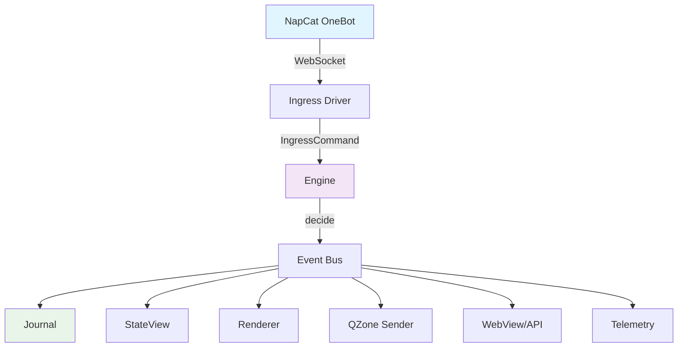

本手册为 OQQWall_RUST 运维与开发人员提供系统性的故障诊断指南。手册覆盖从启动配置、消息处理、渲染发送到数据持久化的完整链路，每个故障场景均包含**症状描述、根因分析、排查步骤和修复方案**。

## 故障诊断总览

在开始具体排查前，建议先理解 OQQWall_RUST 的核心架构。系统采用**事件溯源架构**，所有状态变更通过事件驱动，这使得故障排查具有可追溯性——任何异常都会在事件日志中留下痕迹。



**排查优先级**：启动配置 → 连接状态 → 消息流 → 渲染发送 → 数据一致性

Sources: [main.rs](crates/app/src/main.rs#L1-L145), [engine.rs](crates/app/src/engine.rs#L1-L247)

## 启动与配置问题

### 1.1 配置文件加载失败

**症状**：程序启动时立即退出，错误信息包含 `failed to read config` 或 `invalid config json`。

**根因分析**：配置文件路径错误、文件不存在、JSON 格式错误或必填字段缺失。

**排查步骤**：

1. **检查配置文件路径**：
   - 默认路径：`./config.json`
   - 环境变量覆盖：`OQQWALL_CONFIG=/path/to/config.json`
   - 验证文件是否存在：`ls -la config.json`

2. **验证 JSON 格式**：
   ```bash
   cat config.json | jq .
   ```

3. **检查必填字段**：
   - 每个 group 必须有 `mangroupid` 和 `accounts`
   - `accounts` 必须为非空数字数组
   - 若配置 NapCat，需提供 `napcat_base_url`

**修复方案**：
```bash
# 重新生成配置骨架
cargo run -p OQQWall_RUST -- oobe

# 或使用 TUI 编辑器
cargo run -p OQQWall_RUST -- --tui
```

Sources: [config.rs](crates/app/src/config.rs#L100-L200), [runbook.md](docs/runbook.md#L20-L50)

### 1.2 OOBE 无法自动启动

**症状**：首次运行时程序退出，提示 `未找到配置文件...且当前无交互终端`。

**根因分析**：在非交互环境（如 systemd、Docker）中首次运行，无法启动交互式 OOBE。

**修复方案**：
```bash
# 手动运行 OOBE 生成配置
OQQWall_RUST oobe --config /path/to/config.json

# 或在交互终端中运行
./OQQWall_RUST
```

Sources: [main.rs](crates/app/src/main.rs#L70-L90)

### 1.3 资源文件缺失

**症状**：启动时报错 `res/ 目录缺失` 或渲染时字体/图标加载失败。

**根因分析**：静态资源目录 `res/` 未正确部署或路径配置错误。

**排查步骤**：
1. 检查 `res/` 目录是否存在：`ls -la res/`
2. 验证关键资源文件：
   - `res/Anonymous_avatar.png`
   - `res/fonts/PingFangSC-Regular.otf`
   - `res/face/default_config.json`

**修复方案**：
```bash
# 使用环境变量指定资源目录
export OQQWALL_RES_DIR=/path/to/res

# 或从发布包解压资源
tar -xzf OQQWall_RUST-res-*.tar.gz
```

Sources: [renderer.rs](crates/drivers/src/renderer.rs#L70-L80), [runbook.md](docs/runbook.md#L60-L80)

## NapCat/OneBot 连接问题

### 2.1 WebSocket 连接失败

**症状**：日志中反复出现连接断开或无 `OneBotConnected` 事件。

**根因分析**：NapCat 服务未启动、地址/端口错误、token 不匹配或网络不通。

**排查步骤**：

1. **检查 NapCat 状态**：
   ```bash
   # external 模式
   curl -s http://127.0.0.1:3001/health
   
   # managed 模式检查子进程
   ps aux | grep napcat
   ```

2. **验证连接配置**：
   - 检查 `napcat_base_url` 格式：`host:port/path`
   - 验证 token 是否匹配：`OQQWALL_NAPCAT_TOKEN` 环境变量

3. **测试网络连通性**：
   ```bash
   telnet 127.0.0.1 3001
   ```

**修复方案**：
```json
{
  "common": {
    "napcat_base_url": "127.0.0.1:3001/oqqwall/ws",
    "napcat_access_token": "your_token_here"
  }
}
```

Sources: [napcat.rs](crates/drivers/src/napcat.rs#L50-L100), [connect.rs](crates/app/src/connect.rs#L30-L60)

### 2.2 NapCat 重启风暴

**症状**：日志中频繁出现 `NapCatProcessStarted` / `NapCatProcessExited`。

**根因分析**：配置错误导致连接循环失败、NapCat 崩溃或端口冲突。

**排查步骤**：
1. 检查 NapCat 错误日志
2. 验证端口是否被占用：`lsof -i :3001`
3. 检查 token 是否正确

**修复方案**：
```bash
# 临时切换为 external 模式
export OQQWALL_MANAGE_NAPCAT=false

# 或降低重启频率（需修改代码）
```

Sources: [runbook.md](docs/runbook.md#L200-L220)

## 消息接收与处理问题

### 3.1 消息无法接收（Ingress 为空）

**症状**：审核群无任何消息，状态日志中无 `MessageAccepted` 事件。

**根因分析**：OneBot 连接异常、群 ID 配置错误或消息被过滤。

**排查步骤**：

1. **检查连接状态**：
   ```bash
   # 查看日志中的连接事件
   grep -E "Connected|Disconnected" data/logs/debug.log
   ```

2. **验证群配置**：
   - 确认 `mangroupid` 正确
   - 检查 `accounts` 是否包含机器人 QQ 号

3. **检查消息过滤**：
   - 是否被黑名单过滤：`MessageIgnored` 事件
   - 是否重复消息：`Duplicate` 原因

**修复方案**：
```json
{
  "groups": {
    "your_group": {
      "mangroupid": "123456789",
      "accounts": ["3995477265"]
    }
  }
}
```

Sources: [ingress.rs](crates/core/src/decide/ingress.rs#L1-L50), [status.rs](crates/app/src/status.rs#L20-L40)

### 3.2 投稿不成稿（Session 不关闭）

**症状**：用户发送消息后，Session 一直不关闭，无法生成投稿。

**根因分析**：`process_waittime_sec` 设置过大、Timer tick 未运行或用户持续输入。

**排查步骤**：

1. **检查 Session 状态**：
   - 查看日志中的 `SessionOpened` 和 `SessionClosed` 事件
   - 验证 `process_waittime_sec` 配置

2. **检查输入状态**：
   - 用户是否在输入中（`Typing`/`Speaking` 状态）
   - 输入状态超时：`INPUT_STATUS_ACTIVE_MAX_MS` = 30 分钟

**修复方案**：
```json
{
  "common": {
    "process_waittime_sec": 20
  }
}
```

Sources: [tick.rs](crates/core/src/decide/tick.rs#L30-L80), [config.md](docs/config.md#L30-L50)

### 3.3 消息重复处理

**症状**：同一消息被多次处理，生成重复投稿。

**根因分析**：NapCat 消息重发或 ingress_id 计算冲突。

**排查步骤**：
1. 检查日志中的 `MessageIgnored` 事件，确认 `Duplicate` 原因
2. 验证 ingress_id 生成逻辑

**说明**：系统通过 `derive_ingress_id` 基于 profile_id/chat_id/user_id/platform_msg_id 生成唯一 ID，正常情况下不会重复。

Sources: [ingress.rs](crates/core/src/decide/ingress.rs#L10-L20)

## 渲染与预览问题

### 4.1 PNG 渲染失败

**症状**：投稿状态卡在 `RenderRequested` 或出现 `RenderFailed` 事件。

**根因分析**：字体缺失、资源文件损坏、消息内容异常或 Skia 渲染错误。

**排查步骤**：

1. **检查渲染错误日志**：
   ```bash
   grep -E "RenderFailed|render.*error" data/logs/debug.log
   ```

2. **验证资源完整性**：
   - 字体文件：`res/fonts/PingFangSC-Regular.otf`
   - 表情配置：`res/face/default_config.json`
   - Emoji 元数据：`res/emoji_png/apple_color_emoji/metadata.json`

3. **检查消息内容**：
   - 特殊字符是否需要 XML escape
   - 图片 URL 是否可访问

**修复方案**：
```bash
# 确保资源目录完整
ls -la res/fonts/PingFangSC-Regular.otf

# 或指定资源目录
export OQQWALL_RES_DIR=/path/to/res
```

Sources: [renderer.rs](crates/drivers/src/renderer.rs#L70-L80), [runbook.md](docs/runbook.md#L400-L420)

### 4.2 渲染图片质量/尺寸问题

**症状**：渲染图片模糊、尺寸异常或截断。

**根因分析**：画布宽度/高度配置不当。

**配置优化**：
```json
{
  "common": {
    "renderer": {
      "canvas_width_px": 1152,
      "max_height_px": 6912
    }
  }
}
```

**参数说明**：
- `canvas_width_px`：画布宽度，影响文字排版和输出图片宽度
- `max_height_px`：最大高度，超出部分按渲染器策略截断

Sources: [renderer.rs](crates/drivers/src/renderer.rs#L50-L60), [config.md](docs/config.md#L100-L110)

## 审核流程问题

### 5.1 审核群不发预览

**症状**：投稿生成后，审核群无预览消息。

**根因分析**：`audit_group_id` 配置错误、渲染队列卡住或 OneBot 发送失败。

**排查步骤**：

1. **检查审核事件流**：
   ```bash
   grep -E "ReviewItemCreated|ReviewPublishRequested|ReviewPublished" data/logs/debug.log
   ```

2. **验证审核群配置**：
   ```json
   {
     "groups": {
       "your_group": {
         "mangroupid": "123456789"
       }
     }
   }
   ```

3. **检查渲染状态**：
   - 投稿是否已渲染完成（`Rendered` 阶段）
   - 渲染是否有错误

**修复方案**：
- 确认 `mangroupid` 正确
- 检查 NapCat 连接状态
- 临时切换为文本预览模式

Sources: [tick.rs](crates/core/src/decide/tick.rs#L100-L150)

### 5.2 审核指令无响应

**症状**：在审核群发送指令后无任何反应。

**根因分析**：指令格式错误、权限不足或 NapCat 消息接收异常。

**排查步骤**：

1. **检查指令格式**：
   - 正确格式：`@机器人 指令内容`
   - 支持的指令参见：[审核指令系统](docs/command.md)

2. **验证权限**：
   - 操作者是否在审核群
   - 是否有对应指令权限

3. **检查消息接收**：
   - 查看日志中的 `MessageAccepted` 事件
   - 确认消息是否被正确解析

Sources: [command.rs](crates/core/src/command.rs#L1-L50), [napcat.rs](crates/drivers/src/napcat.rs#L200-L300)

### 5.3 审核决策不生效

**症状**：发送审核指令后，投稿状态未改变。

**根因分析**：review_code 错误、决策处理异常或状态同步延迟。

**排查步骤**：

1. **检查审核 ID**：
   ```bash
   # 查看待审核列表
   grep "ReviewItemCreated" data/logs/debug.log
   ```

2. **验证决策事件**：
   ```bash
   grep "ReviewDecisionRecorded" data/logs/debug.log
   ```

3. **检查状态更新**：
   - 通过 WebView 或 API 查看投稿状态
   - 验证 StateView 是否正确更新

Sources: [review.rs](crates/core/src/decide/review.rs#L1-L100)

## 发送队列问题

### 6.1 发送队列积压

**症状**：投稿停留在 `Scheduled` 或 `Sending` 阶段，长时间不发送。

**根因分析**：发送窗口限制、账号冷却、min_interval 过大或发送超时。

**排查步骤**：

1. **检查发送计划**：
   ```bash
   grep "SendPlanCreated" data/logs/debug.log
   ```

2. **验证发送条件**：
   - `send_schedule` 是否配置定时窗口
   - `min_interval_ms` 是否过大
   - 账号是否在冷却中（`cooldown_until_ms`）

3. **检查发送状态**：
   ```bash
   grep -E "SendStarted|SendSucceeded|SendFailed" data/logs/debug.log
   ```

**修复方案**：
```json
{
  "groups": {
    "your_group": {
      "min_interval_ms": 0,
      "send_timeout_ms": 300000,
      "send_max_attempts": 3
    }
  }
}
```

Sources: [tick.rs](crates/core/src/decide/tick.rs#L250-L336), [config.md](docs/config.md#L80-L100)

### 6.2 发送超时

**症状**：投稿长时间处于 `Sending` 状态，最终超时失败。

**根因分析**：QQ 空间 API 响应慢、网络问题或账号权限不足。

**排查步骤**：

1. **检查发送超时配置**：
   ```json
   {
     "send_timeout_ms": 300000
   }
   ```

2. **验证账号状态**：
   - 账号是否登录正常
   - 是否有空间访问权限

3. **检查网络连接**：
   ```bash
   curl -I https://user.qzone.qq.com
   ```

**修复方案**：
- 增加 `send_timeout_ms` 值
- 检查账号登录状态
- 使用 `@机器人 系统修复` 指令

Sources: [tick.rs](crates/core/src/decide/tick.rs#L200-L250)

### 6.3 QQ 空间发送失败

**症状**：发送阶段出现 `SendFailed` 事件，错误信息包含 `QzoneError`。

**根因分析**：Cookie 失效、风控拦截、图片上传失败或 API 限制。

**错误类型**：

| 错误类型 | 说明 | 处理方式 |
|---------|------|---------|
| `Network` | 网络连接失败 | 检查网络，稍后重试 |
| `RiskControl` | 风控拦截 | 更换账号或等待 |
| `Account` | 账号问题 | 检查登录状态 |
| `Unknown` | 未知错误 | 查看详细日志 |

**排查步骤**：
1. 检查日志中的详细错误信息
2. 验证账号 Cookie 是否有效
3. 检查图片大小是否超过限制（4MB）

Sources: [qzone.rs](crates/drivers/src/qzone.rs#L60-L100)

## WebView/API 问题

### 7.1 WebView 页面无法访问

**症状**：浏览器无法打开 WebView 页面。

**根因分析**：WebView 未启用、端口配置错误或绑定地址问题。

**排查步骤**：

1. **检查 WebView 配置**：
   ```json
   {
     "common": {
       "webview": {
         "enabled": true,
         "host": "0.0.0.0",
         "port": 10924
       }
     }
   }
   ```

2. **验证端口监听**：
   ```bash
   lsof -i :10924
   ```

3. **检查防火墙**：
   ```bash
   # Linux
   sudo iptables -L -n | grep 10924
   ```

**修复方案**：
- 确认 `webview.enabled=true`
- 检查 `webview_admins` 配置
- 查看日志中的 `webview bind failed` 错误

Sources: [webview.rs](crates/app/src/webview.rs#L1-L50), [webview.md](docs/webview.md#L100-L150)

### 7.2 WebView 登录失败

**症状**：输入用户名密码后登录失败。

**根因分析**：账号不存在、密码错误或密码格式不正确。

**排查步骤**：

1. **检查账号配置**：
   ```json
   {
     "webview_global_admins": [
       {
         "username": "admin",
         "password": "sha256:your_password_hash"
       }
     ]
   }
   ```

2. **验证密码格式**：
   - 推荐使用 `sha256:<hex64>` 格式
   - 明文密码会在启动时自动转换

**修复方案**：
```bash
# 生成密码哈希
echo -n "your_password" | sha256sum | awk '{print "sha256:"$1}'
```

Sources: [webview.rs](crates/app/src/webview.rs#L50-L100), [webview.md](docs/webview.md#L30-L50)

### 7.3 API 认证失败

**症状**：API 请求返回 401 或 403 错误。

**根因分析**：Token 错误、Session 过期或权限不足。

**排查步骤**：

1. **检查 API 配置**：
   ```json
   {
     "common": {
       "web_api": {
         "enabled": true,
         "root_token": "your_token_at_least_32_chars"
       }
     }
   }
   ```

2. **验证 Token**：
   - 长度至少 32 字符
   - 建议使用环境变量：`OQQWALL_API_TOKEN`

3. **检查 Session**：
   - Session 有效期：`webview.session_ttl_sec`
   - 默认 12 小时

Sources: [web_api.rs](crates/app/src/web_api.rs#L50-L100), [config.md](docs/config.md#L70-L80)

## 数据持久化问题

### 8.1 Journal 损坏

**症状**：启动时日志显示 `journal corruption` 或回放失败。

**根因分析**：非正常断电、磁盘错误或写入中断。

**系统处理**：
- Journal 分段存储，每段带 CRC 校验
- 损坏时自动截断到最后一条完整事件
- 从 Snapshot + 剩余 Journal 重建状态

**排查步骤**：

1. **检查损坏位置**：
   ```bash
   grep "journal corruption" data/logs/debug.log
   ```

2. **验证 Journal 文件**：
   ```bash
   ls -la data/journal/
   ```

3. **使用 TUI 查看 Journal**：
   ```bash
   cargo run -p OQQWall_RUST --bin journal_tui -- data
   ```

**修复方案**：
- 系统会自动修复（截断损坏部分）
- 严重损坏时从备份恢复 `data/journal/`

Sources: [journal.rs](crates/infra/src/journal.rs#L100-L200), [engine.rs](crates/app/src/engine.rs#L100-L150)

### 8.2 Snapshot 损坏

**症状**：启动时日志显示 `snapshot load failed`。

**根因分析**：Snapshot 文件损坏或版本不匹配。

**系统处理**：
- Snapshot 损坏时忽略，从 Journal 全量回放
- 回放完成后自动创建新 Snapshot

**排查步骤**：
```bash
# 检查 Snapshot 文件
ls -la data/snapshot/latest.snap

# 查看日志
grep "snapshot" data/logs/debug.log
```

**修复方案**：
- 删除损坏的 Snapshot：`rm data/snapshot/latest.snap`
- 重启服务，系统会从 Journal 重建

Sources: [snapshot.rs](crates/infra/src/snapshot.rs#L50-L92), [engine.rs](crates/app/src/engine.rs#L80-L100)

### 8.3 Blob 存储问题

**症状**：图片/附件预览失败，日志显示 blob 不存在。

**根因分析**：Blob 文件丢失、缓存配置错误或路径问题。

**排查步骤**：

1. **检查 Blob 目录**：
   ```bash
   ls -la data/blobs/
   ```

2. **验证缓存配置**：
   ```json
   {
     "max_cache_mb": 256
   }
   ```

3. **检查 Blob ID**：
   - 通过 WebView 或 API 查看帖子详情
   - 验证 blob_id 是否存在于 `data/blobs/`

**修复方案**：
- 确保 `data/blobs/` 目录存在且可写
- 调整 `max_cache_mb` 配置
- 从备份恢复丢失的 Blob

Sources: [blob_cache.rs](crates/drivers/src/blob_cache.rs), [config.md](docs/config.md#L40-L50)

## 遥测问题

### 9.1 遥测数据未生成

**症状**：`data/telemetry/pending_samples.jsonl` 为空或不存在。

**根因分析**：遥测未启用、审核决策未触发或配置错误。

**排查步骤**：

1. **检查遥测配置**：
   ```json
   {
     "common": {
       "telemetry": {
         "enabled": true,
         "local_dir": "telemetry"
       }
     }
   }
   ```

2. **验证审核决策**：
   ```bash
   grep "ReviewDecisionRecorded" data/logs/debug.log
   ```

3. **检查目录权限**：
   ```bash
   ls -la data/telemetry/
   ```

Sources: [telemetry.rs](crates/app/src/telemetry.rs#L1-L50)

### 9.2 遥测上传失败

**症状**：`pending_samples` 长期不下降，日志显示 `telemetry upload failed`。

**根因分析**：Collector 不可达、Token 错误或网络问题。

**排查步骤**：

1. **检查上传配置**：
   ```json
   {
     "telemetry": {
       "upload_enabled": true,
       "upload_interval_sec": 30
     }
   }
   ```

2. **查看上传日志**：
   ```bash
   grep -E "telemetry upload" data/logs/debug.log
   ```

3. **验证 Collector 状态**：
   - 参考 `docs/telemetry_collector.md` 部署 Collector

Sources: [telemetry.rs](crates/app/src/telemetry.rs#L100-L150), [runbook.md](docs/runbook.md#L180-L200)

## 性能与资源问题

### 10.1 内存占用过高

**症状**：进程内存持续增长，可能导致 OOM。

**根因分析**：Blob 缓存过大、Journal 回放过多或内存泄漏。

**排查步骤**：

1. **检查缓存配置**：
   ```json
   {
     "max_cache_mb": 256
   }
   ```

2. **监控内存使用**：
   ```bash
   # Linux
   ps aux | grep OQQWall_RUST
   
   # 或使用 systemd
   systemctl status OQQWall_RUST
   ```

3. **检查 Journal 大小**：
   ```bash
   du -sh data/journal/
   ```

**修复方案**：
- 降低 `max_cache_mb` 值
- 定期清理旧 Journal 分段
- 增加 Snapshot 频率

Sources: [config.md](docs/config.md#L40-L50), [runbook.md](docs/runbook.md#L350-L370)

### 10.2 CPU 占用过高

**症状**：进程 CPU 使用率持续偏高。

**根因分析**：渲染任务繁重、消息处理频繁或 Timer tick 异常。

**排查步骤**：

1. **检查渲染队列**：
   ```bash
   grep "RenderRequested" data/logs/debug.log | wc -l
   ```

2. **验证消息频率**：
   ```bash
   grep "MessageAccepted" data/logs/debug.log | wc -l
   ```

3. **优化配置**：
   - 增加 `process_waittime_sec` 减少渲染频率
   - 降低 `canvas_width_px` 减少渲染复杂度

Sources: [tick.rs](crates/core/src/decide/tick.rs#L1-L30)

## 故障排查工具箱

### 日志分析命令

```bash
# 查看实时日志
journalctl -u OQQWall_RUST -f

# 搜索错误
grep -E "error|failed|Error" data/logs/debug.log

# 统计事件类型
grep -oP 'Event::\w+' data/logs/debug.log | sort | uniq -c

# 查看特定时间段日志
grep "2024-01-01" data/logs/debug.log
```

### 状态检查命令

```bash
# 检查进程状态
systemctl status OQQWall_RUST

# 查看端口监听
lsof -i :10923  # API
lsof -i :10924  # WebView

# 检查磁盘空间
df -h data/

# 查看 Journal 大小
du -sh data/journal/
```

### 数据恢复命令

```bash
# 从备份恢复
tar -xzf OQQWall_RUST-data-backup.tar.gz

# 重建索引（如有）
cargo run -p OQQWall_RUST --bin rebuild_index -- data

# 查看 Journal 内容
cargo run -p OQQWall_RUST --bin journal_tui -- data
```

## 故障上报清单

当遇到无法解决的问题时，请收集以下信息：

| 信息 | 获取方式 | 说明 |
|-----|---------|------|
| 配置文件 | `cat config.json` | 脱敏 token/cookie |
| 最近日志 | `journalctl -u OQQWall_RUST -n 500` | 最后 500 行 |
| Journal 分段 | `ls -la data/journal/` | 最近 1-2 个分段 |
| Snapshot | `ls -la data/snapshot/` | 如有 |
| 问题时间点 | 记录发生时间 | 对应 review_code/post_id |
| 系统信息 | `uname -a` | 操作系统版本 |
| 磁盘空间 | `df -h` | 可用空间 |
| 进程状态 | `ps aux \| grep OQQWall` | 运行状态 |

**提交格式**：
```
## 问题描述
[简要描述问题现象]

## 环境信息
- OS: [操作系统]
- 版本: [OQQWall_RUST 版本]
- 配置: [关键配置项]

## 复现步骤
1. [步骤1]
2. [步骤2]
3. [步骤3]

## 日志片段
[粘贴相关日志]

## 已尝试的解决方案
[列出已尝试的方法]
```

## 相关文档

- [配置文件说明](4-pei-zhi-wen-jian-shuo-ming)：详细配置项说明
- [生产环境部署](20-sheng-chan-huan-jing-bu-shu)：部署最佳实践
- [监控与遥测](21-jian-kong-yu-yao-ce)：监控体系说明
- [审核指令系统](6-shen-he-zhi-ling-xi-tong)：指令使用指南
- [HTTP API v1](19-http-api-v1)：API 接口文档
- [WebView 审核界面](18-webview-shen-he-jie-mian)：WebView 使用说明

## 下一步

- 了解系统架构：[项目架构详解](8-xiang-mu-jia-gou-xiang-jie)
- 优化系统性能：[性能优化策略](23-xing-neng-you-hua-ce-lue)
- 扩展集群部署：[未来集群扩展](26-wei-lai-ji-qun-kuo-zhan)