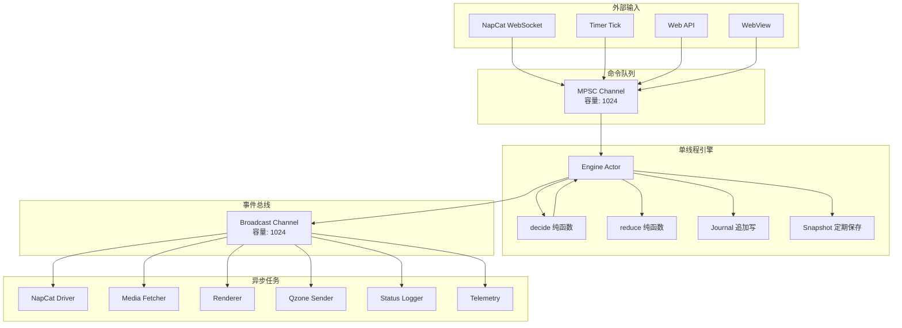
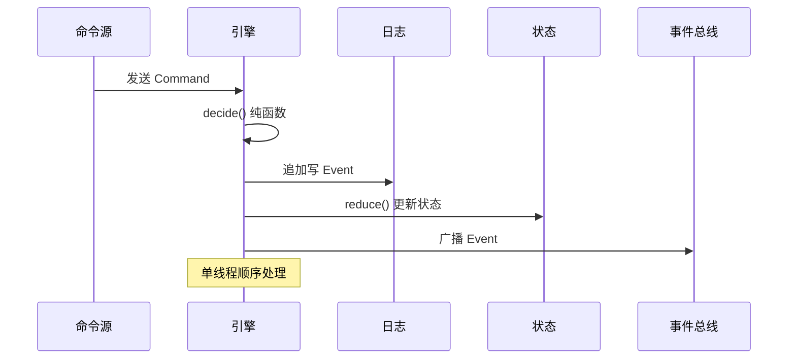

本文档详细阐述 OQQWall_Rust 项目中的并发处理架构。该系统采用**事件溯源（Event Sourcing）**与**函数式核心（Functional Core）**相结合的设计模式，通过单线程引擎保证状态一致性，同时利用异步任务和广播通道实现高效的并发处理。

## 1. 整体并发架构概览

OQQWall_Rust 的并发模型建立在三个核心原则之上：**单线程状态机**保证一致性、**广播通道**实现事件分发、**异步任务**隔离副作用。这种设计避免了传统多线程并发中的锁竞争和状态不一致问题。



Sources: [main.rs](crates/app/src/main.rs#L31-L116), [engine.rs](crates/app/src/engine.rs#L60-L143)

## 2. 单线程引擎设计

引擎是整个系统的**状态管理核心**，采用**单线程 Actor** 模式设计。这种设计的核心优势在于：**无需锁机制**即可保证状态一致性，**事件顺序性**天然得到保障，**可重放性**使得系统能够从故障中恢复。

引擎的核心结构包含以下关键组件：

| 组件 | 类型 | 职责 |
|------|------|------|
| `state: StateView` | 当前状态 | 内存中的完整系统状态 |
| `cmd_rx: mpsc::Receiver<Command>` | 命令接收器 | 接收来自各组件的命令 |
| `bus: broadcast::Sender<EventEnvelope>` | 事件总线 | 向所有订阅者广播事件 |
| `journal: LocalJournal` | 日志存储 | 追加写事件日志 |
| `snapshot: SnapshotStore` | 快照存储 | 定期保存状态快照 |
| `shared_state: Arc<RwLock<StateView>>` | 共享状态 | 供其他组件读取的当前状态 |



Sources: [engine.rs](crates/app/src/engine.rs#L26-L39), [engine.rs](crates/app/src/engine.rs#L105-L143)

## 3. 命令队列与事件分发

系统使用**有界多生产者单消费者（MPSC）通道**作为命令队列，容量为 1024。这种设计提供了**背压机制**，当引擎处理速度跟不上命令产生速度时，生产者会自然阻塞。

```rust
// 命令队列创建
let (cmd_tx, cmd_rx) = mpsc::channel(1024);
```

事件分发采用**广播通道**，容量同样为 1024。广播通道允许**多个订阅者**同时接收相同的事件，每个订阅者独立处理。当订阅者处理速度跟不上时，会收到 `Lagged` 错误，系统会跳过该事件继续处理。

```rust
// 事件总线创建
let (bus, _) = broadcast::channel(1024);
```

命令队列和事件分发的关键特性：

- **有界队列**：防止内存无限增长
- **背压机制**：慢消费者自然阻塞生产者
- **多订阅者**：支持多个驱动并发处理
- **事件顺序性**：所有订阅者按相同顺序接收事件

Sources: [engine.rs](crates/app/src/engine.rs#L65-L66), [main.rs](crates/app/src/main.rs#L97-L111)

## 4. 异步任务隔离模式

系统将各种副作用操作（IO、渲染、网络请求等）隔离到独立的异步任务中。这种模式遵循**Actor 模型**的思想，每个任务专注于特定的职责，通过消息传递进行通信。

### 4.1 驱动任务类型

| 驱动任务 | 启动函数 | 主要职责 | 订阅事件 |
|----------|----------|----------|----------|
| NapCat Driver | `spawn_napcat_ws` | WebSocket 通信、消息处理 | 所有事件 |
| Media Fetcher | `spawn_media_fetcher` | 媒体文件下载 | IngressEvent, MediaEvent |
| Renderer | `spawn_renderer` | PNG 渲染 | RenderEvent |
| Qzone Sender | `spawn_qzone_sender` | QQ空间发送 | SendEvent |
| Status Logger | `spawn_status_logger` | 状态日志输出 | IngressEvent, DraftEvent |
| Telemetry | `spawn_submission_telemetry` | 遥测数据收集 | ReviewEvent |

### 4.2 任务启动模式

所有驱动任务都遵循统一的启动模式：

```rust
pub fn spawn_xxx(
    cmd_tx: mpsc::Sender<Command>,
    bus_rx: broadcast::Receiver<EventEnvelope>,
    config: XxxConfig,
) -> JoinHandle<()> {
    tokio::spawn(async move {
        // 初始化
        let mut bus_rx = bus_rx;
        
        // 主循环：监听事件
        loop {
            let env = match bus_rx.recv().await {
                Ok(env) => env,
                Err(broadcast::error::RecvError::Closed) => break,
                Err(broadcast::error::RecvError::Lagged(_)) => continue,
            };
            
            // 处理特定事件
            match env.event {
                Event::Xxx(xxx_event) => {
                    // 执行副作用
                    // 通过 cmd_tx 发送结果事件
                }
                _ => {}
            }
        }
    })
}
```

Sources: [connect.rs](crates/app/src/connect.rs#L24-L138), [media_fetcher.rs](crates/drivers/src/media_fetcher.rs#L59-L148), [renderer.rs](crates/drivers/src/renderer.rs#L1795-L1850)

## 5. 共享状态管理

系统在多个层次使用共享状态，采用不同的同步机制：

### 5.1 引擎共享状态

引擎维护一个 `Arc<RwLock<StateView>>` 供其他组件读取当前状态：

```rust
// 引擎状态更新
{
    if let Ok(mut guard) = self.shared_state.write() {
        *guard = self.state.clone();
    }
}

// 其他组件读取状态
let state_view = handle.state.read().unwrap();
```

### 5.2 驱动内部状态

各个驱动使用 `tokio::sync::Mutex` 保护内部状态：

```rust
// Qzone Sender 内部状态
let state = Arc::new(Mutex::new(build_state_from_view(&state_view)));

// 状态访问
let mut guard = state.lock().await;
guard.ingress_messages.insert(ingress_id, message);
```

### 5.3 缓存状态

缓存系统使用 `std::sync::Mutex` 和 `OnceLock` 实现全局单例：

```rust
// Blob 缓存
static CACHE: OnceLock<Mutex<CacheState>> = OnceLock::new();

// Avatar 缓存
static AVATAR_CACHE: OnceLock<Mutex<AvatarCacheState>> = OnceLock::new();
```

### 5.4 状态同步策略对比

| 状态类型 | 同步机制 | 使用场景 | 特点 |
|----------|----------|----------|------|
| 引擎状态 | `Arc<RwLock>` | 全局状态读取 | 读多写少，写操作在引擎线程 |
| 驱动内部状态 | `tokio::sync::Mutex` | 异步任务内部 | 支持 `.await`，适合异步上下文 |
| 缓存状态 | `std::sync::Mutex` | 全局缓存 | 同步锁，性能要求高 |

Sources: [engine.rs](crates/app/src/engine.rs#L38), [qzone.rs](crates/drivers/src/qzone.rs#L351), [blob_cache.rs](crates/drivers/src/blob_cache.rs#L38-L47)

## 6. 阻塞任务处理

系统对 CPU 密集型任务（如 PNG 渲染）采用**专用线程池**隔离：

```rust
// 使用 spawn_blocking 隔离渲染任务
tokio::task::spawn_blocking(move || {
    render_png_pages(&draft, &header, &image_sources, &config)
})
```

阻塞任务处理的关键策略：

- **专用线程池**：避免阻塞异步运行时
- **队列限长**：防止内存溢出（默认容量 16）
- **降级机制**：积压过多时降级为文本摘要

Sources: [renderer.rs](crates/drivers/src/renderer.rs#L1795-L1850)

## 7. 事件溯源与状态恢复

系统通过**事件溯源**实现状态持久化和恢复，这是并发安全性的基础保障。

### 7.1 事件处理顺序

引擎严格遵循以下顺序处理事件：

1. **接收命令**：从 MPSC 通道读取命令
2. **决策生成**：调用 `decide` 纯函数生成事件
3. **日志追加**：将事件写入 Journal
4. **状态更新**：调用 `reduce` 纯函数更新状态
5. **事件广播**：通过广播通道通知订阅者


### 7.2 状态恢复流程

系统启动时通过以下步骤恢复状态：

1. **加载快照**：从 `latest.snap` 加载最近的状态快照
2. **回放日志**：从快照位置开始回放后续事件
3. **重建状态**：通过 `reduce` 函数重建完整状态
4. **修复损坏**：如果发现日志损坏，自动截断并修复

```rust
// 状态恢复逻辑
fn restore_state(
    journal: &mut LocalJournal,
    snapshot: &SnapshotStore,
) -> Result<(StateView, JournalCursor, i64), String> {
    // 1. 加载快照
    // 2. 回放日志
    // 3. 修复损坏
    // 4. 返回恢复后的状态
}
```

### 7.3 快照策略

系统采用**双重快照策略**：

- **事件计数**：每 1000 个事件保存一次快照
- **时间间隔**：每 5 分钟保存一次快照
- **原子写入**：使用临时文件 + 重命名保证原子性

```rust
const SNAPSHOT_EVERY_EVENTS: u64 = 1000;
const SNAPSHOT_EVERY_MS: i64 = 5 * 60 * 1000;
```

Sources: [engine.rs](crates/app/src/engine.rs#L145-L206), [journal.rs](crates/infra/src/journal.rs#L84-L200), [snapshot.rs](crates/infra/src/snapshot.rs#L74-L91)

## 8. 并发安全设计原则

### 8.1 单线程状态机

引擎采用单线程处理所有状态变更，避免了以下并发问题：

- **竞态条件**：多个线程同时修改状态
- **死锁**：多个锁的交叉等待
- **状态不一致**：部分更新导致的状态混乱

### 8.2 纯函数决策

`decide` 和 `reduce` 函数是**纯函数**，具有以下特性：

- **无副作用**：不执行 IO 操作
- **确定性**：相同输入总是产生相同输出
- **可重放**：可以从日志重建状态
- **可测试**：便于单元测试和属性测试

### 8.3 消息传递并发

系统采用**消息传递**而非**共享内存**进行组件间通信：

- **命令队列**：组件通过发送命令影响系统状态
- **事件总线**：系统状态变化通过事件广播通知组件
- **请求-响应**：某些操作通过 `oneshot` 通道实现请求-响应模式

### 8.4 并发控制策略总结

| 策略 | 实现方式 | 优势 | 适用场景 |
|------|----------|------|----------|
| 单线程引擎 | Actor 模型 | 状态一致性 | 核心状态管理 |
| 异步任务 | tokio::spawn | IO 并发 | 网络请求、文件操作 |
| 阻塞隔离 | spawn_blocking | CPU 隔离 | 渲染、图像处理 |
| 广播通道 | broadcast channel | 一对多通知 | 事件分发 |
| 有界队列 | mpsc channel | 背压控制 | 命令队列 |

Sources: [engine.rs](crates/app/src/engine.rs#L105-L143), [engineering.md](docs/engineering.md#L37-L44)

## 9. 性能与扩展性考虑

### 9.1 当前限制

- **单线程瓶颈**：引擎处理能力受限于单线程性能
- **广播通道容量**：1024 的容量可能成为高负载瓶颈
- **内存使用**：所有状态保持在内存中

### 9.2 未来扩展点

系统设计已为未来扩展预留了接口：

- **分布式日志**：Journal 接口可替换为分布式实现
- **分布式锁**：Lease 接口可支持多机协调
- **分布式缓存**：BlobStore 接口可支持分布式存储

### 9.3 性能优化建议

1. **调整队列容量**：根据负载情况调整 MPSC 和广播通道容量
2. **优化快照策略**：根据恢复时间需求调整快照频率
3. **增加工作线程**：对 CPU 密集型任务使用专用线程池
4. **实现背压机制**：在生产者端实现流量控制

Sources: [engineering.md](docs/engineering.md#L320-L324), [dev_guide.md](docs/dev_guide.md#L50-L51)

## 总结

OQQWall_Rust 的并发处理机制通过**单线程引擎**保证状态一致性，**异步任务**隔离副作用，**事件溯源**实现可恢复性。这种设计在保证系统可靠性的同时，提供了良好的并发处理能力。系统的核心优势在于：

1. **简单可靠**：单线程引擎避免了复杂的并发问题
2. **可恢复**：事件溯源支持故障恢复和状态重建
3. **可扩展**：清晰的接口设计支持未来分布式扩展
4. **高性能**：异步任务充分利用系统 IO 能力