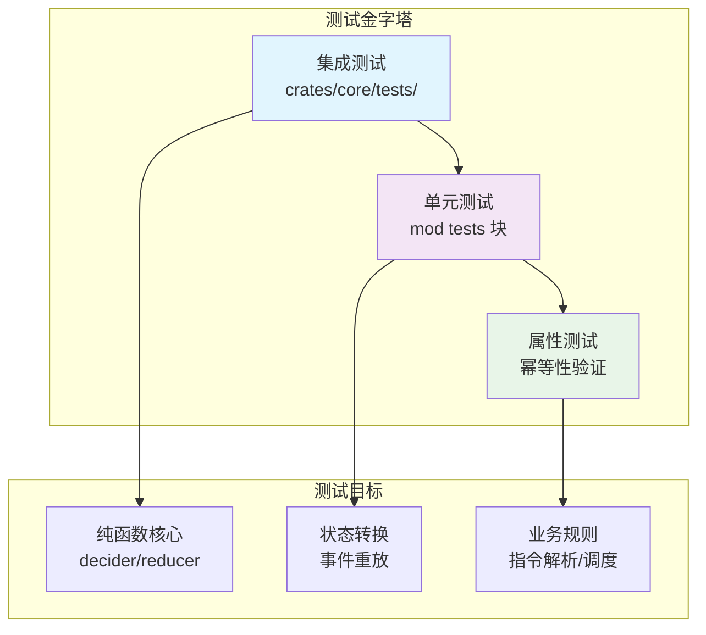
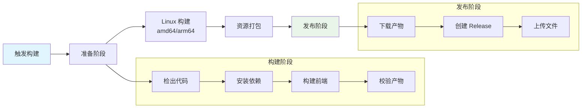
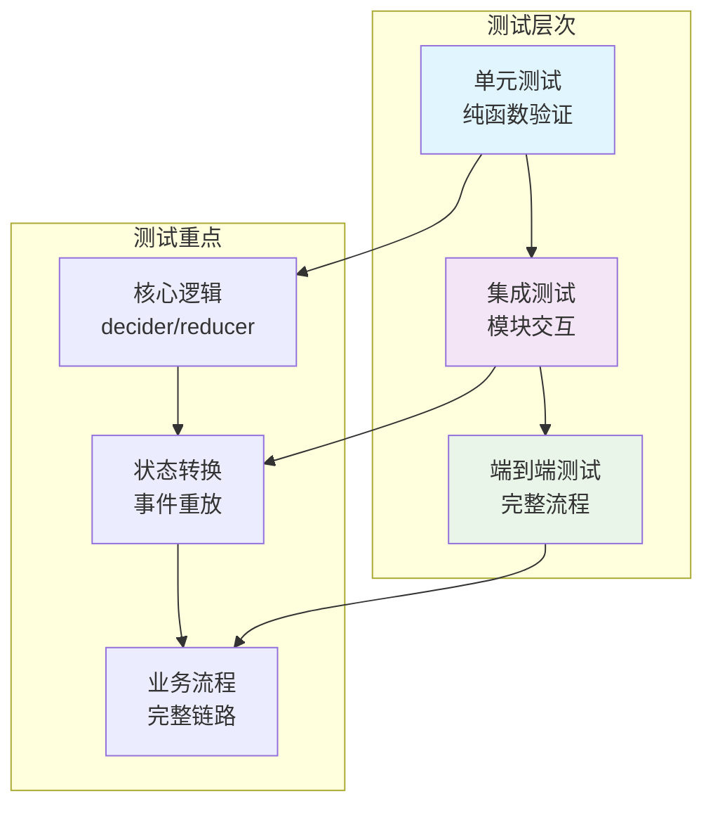

OQQWall_Rust 采用**分层测试策略**，以 Functional Core / Imperative Shell 架构为基础，通过纯函数测试确保核心业务逻辑的正确性，结合事件溯源架构实现可重放的状态验证。本文档详细介绍了项目的测试架构、测试模式、CI/CD 流程以及质量保证实践。

## 测试架构概览

OQQWall_Rust 的测试架构遵循**事件溯源**和**纯函数优先**的设计原则，将测试分为三个层次：



**核心测试原则**：
- **纯函数可测性**：核心业务逻辑（decider、reducer）不依赖 IO，可完全通过输入输出验证
- **事件驱动验证**：所有状态变化通过事件序列验证，确保可重放一致性
- **确定性优先**：使用哈希派生 ID，避免随机性导致测试不稳定
- **副作用隔离**：IO 操作集中在 drivers 层，通过 mock 或 fixture 测试

Sources: [engineering.md](docs/engineering.md#L38-L53), [reduce_replay.rs](crates/core/tests/reduce_replay.rs#L20-L191)

## 测试文件组织

项目采用**集成测试 + 内联单元测试**的混合组织方式：

| 测试类型 | 位置 | 数量 | 覆盖范围 |
|---------|------|------|----------|
| **集成测试** | `crates/core/tests/` | 16 个文件 | 核心业务逻辑、状态转换、决策引擎 |
| **单元测试** | 各 crate 的 `mod tests` 块 | 9 个文件 | 工具函数、解析逻辑、配置验证 |
| **总计** | - | 134 个 `#[test]` | 全栈覆盖 |

**集成测试文件清单**：
- `decide_tick.rs` - 定时器决策逻辑测试
- `decide_review_stack.rs` - 审核队列管理测试
- `decide_action_batch.rs` - 批量操作测试
- `reduce_replay.rs` - 事件重放一致性测试
- `builder.rs` - 草稿构建逻辑测试
- `safety_regex.rs` - 内容安全检测测试
- `anonymous_regex.rs` - 匿名处理测试

Sources: [crates/core/tests/](crates/core/tests/), [decide_tick.rs](crates/core/tests/decide_tick.rs#L1-L96)

## 核心测试模式

### 1. 事件驱动测试模式

这是项目最核心的测试模式，用于验证状态转换的正确性：

```rust
// 测试模式：构造事件序列 → 应用到状态 → 验证最终状态
#[test]
fn reducer_replay_matches_full_apply() {
    // 1. 构造事件序列
    let events = vec![
        wrap(Event::Config(ConfigEvent::Applied { ... }), 1, 1_000),
        wrap(Event::Ingress(IngressEvent::MessageAccepted { ... }), 2, 1_100),
        // ... 更多事件
    ];
    
    // 2. 完整应用
    let mut full_state = StateView::default();
    for env in &events {
        full_state = full_state.reduce(env);
    }
    
    // 3. 分片重放验证
    let split = 6;
    let mut replay_state = StateView::default();
    for env in &events[..split] {
        replay_state = replay_state.reduce(env);
    }
    for env in &events[split..] {
        replay_state = replay_state.reduce(env);
    }
    
    // 4. 验证一致性
    assert_eq!(full_state, replay_state);
}
```

**关键特点**：
- **确定性 ID**：使用 `Id128` 和哈希派生，确保事件可重放
- **时间戳固定**：事件时间戳在测试中固定，避免时序依赖
- **状态快照比较**：通过 `PartialEq` 实现状态快照的精确比较

Sources: [reduce_replay.rs](crates/core/tests/reduce_replay.rs#L20-L191), [decide_tick.rs](crates/core/tests/decide_tick.rs#L23-L96)

### 2. 决策引擎测试模式

测试纯函数 decider 的输入输出关系：

```rust
#[test]
fn tick_closes_session_and_creates_draft() {
    // 1. 构造初始状态和配置
    let mut config = CoreConfig::default();
    config.default_process_waittime_ms = 1_000;
    
    // 2. 应用入站事件建立状态
    let mut state = StateView::default();
    let events = decide(&state, &Command::Ingress(ingress), &config);
    for (idx, event) in events.into_iter().enumerate() {
        state = state.reduce(&wrap(event, idx as u128 + 1));
    }
    
    // 3. 执行决策命令
    let tick_events = decide(&state, &Command::Tick(tick), &config);
    
    // 4. 验证输出事件
    assert_eq!(tick_events.len(), 3);
    assert!(tick_events.iter().any(|e| matches!(e, 
        Event::Session(SessionEvent::Closed { .. })
    )));
    assert!(tick_events.iter().any(|e| matches!(e, 
        Event::Draft(DraftEvent::PostDraftCreated { .. })
    )));
}
```

**测试要点**：
- **纯函数验证**：decider 不依赖外部状态，仅通过输入参数产生输出
- **幂等性测试**：相同输入重复调用产生相同输出
- **边界条件**：测试时间窗口、队列满、重试逻辑等边界情况

Sources: [decide_tick.rs](crates/core/tests/decide_tick.rs#L23-L96), [decide_review_stack.rs](crates/core/tests/decide_review_stack.rs#L107-L167)

### 3. 异步测试模式

用于测试 Web API 等异步代码：

```rust
#[tokio::test]
async fn create_post_success_returns_review_code_and_sends_ingress() {
    // 1. 构造测试状态
    let (state, mut rx, session_id) = build_test_state(None);
    let headers = build_headers(&session_id, Some(idem_key));
    
    // 2. 启动后台任务模拟状态变化
    let shared_state = state.state.clone();
    tokio::spawn(async move {
        sleep(Duration::from_millis(50)).await;
        let mut guard = shared_state.write().expect("lock");
        guard.posts.insert(expected_post, PostMeta { ... });
    });
    
    // 3. 执行异步操作
    let response = create_post(State(state), headers, Json(req)).await;
    
    // 4. 验证响应
    assert_eq!(response.status(), StatusCode::OK);
    let body = response_json(response).await;
    assert!(body["review_code"].is_number());
}
```

**异步测试特点**：
- **`#[tokio::test]`**：使用 tokio 运行时执行异步测试
- **通道验证**：通过 `mpsc::Receiver` 验证事件发送
- **状态共享**：使用 `Arc<RwLock<StateView>>` 共享状态进行测试

Sources: [web_api.rs](crates/app/src/web_api.rs#L5796)

### 4. 配置解析测试模式

测试配置文件的解析和规范化：

```rust
#[test]
fn normalize_group_accounts_prefers_accounts_and_removes_legacy_keys() {
    // 1. 构造旧格式配置
    let mut group = json!({
        "accounts": ["10001", "10002"],
        "mainqqid": "20001",
        "minorqqid": ["20002"]
    }).as_object().cloned().expect("group object");
    
    // 2. 执行规范化
    assert!(normalize_group_accounts(&mut group));
    
    // 3. 验证结果
    assert_eq!(group.get("accounts"), Some(&json!(["10001", "10002"])));
    assert!(!group.contains_key("mainqqid")); // 旧字段已移除
}
```

**配置测试要点**：
- **向后兼容**：测试旧格式配置的自动迁移
- **字段规范化**：验证配置字段的标准化处理
- **错误处理**：测试无效配置的错误处理

Sources: [config.rs](crates/app/src/config.rs#L5796)

## 测试基础设施

### 1. 测试辅助函数

项目定义了多个测试辅助函数，提高测试代码的可读性和复用性：

```rust
// 通用事件包装函数
fn wrap(event: Event, id: u128, ts_ms: i64) -> EventEnvelope {
    EventEnvelope {
        id: Id128(id),
        ts_ms,
        actor: Id128(0),
        correlation_id: None,
        event,
    }
}

// 状态应用辅助函数
fn apply_event(state: &mut StateView, event: Event, id: u128) {
    *state = state.reduce(&wrap(event, id));
}

// 测试数据生成函数
fn seed_post(
    state: &mut StateView,
    post_id: Id128,
    review_id: Id128,
    review_code: u32,
    ingress_id: Id128,
    group_id: &str,
    attachment_count: usize,
    with_render: bool,
    mut next_id: u128,
) -> u128 {
    // ... 构造测试数据
}
```

Sources: [decide_review_stack.rs](crates/core/tests/decide_review_stack.rs#L9-L105), [decide_tick.rs](crates/core/tests/decide_tick.rs#L13-L21)

### 2. 测试隔离机制

项目使用多种机制确保测试隔离：

| 隔离技术 | 使用场景 | 示例 |
|---------|---------|------|
| **临时目录** | 文件系统测试 | `unique_test_path()` 生成唯一路径 |
| **环境变量** | 配置测试 | `OQQWALL_BLOB_DIR` 设置测试目录 |
| **OnceLock** | 全局状态初始化 | `ensure_test_blob_dir()` 确保只初始化一次 |
| **Mutex** | 并发测试隔离 | `global_test_lock()` 防止测试并发冲突 |

```rust
// 测试隔离示例
fn ensure_test_blob_dir() {
    static INIT: OnceLock<()> = OnceLock::new();
    INIT.get_or_init(|| {
        let dir = std::env::temp_dir().join("oqqwall_rust_web_api_test_blobs");
        let _ = std::fs::create_dir_all(&dir);
        unsafe {
            std::env::set_var("OQQWALL_BLOB_DIR", &dir);
        }
    });
}
```

Sources: [web_api.rs](crates/app/src/web_api.rs#L5796), [config.rs](crates/app/src/config.rs#L5796)

### 3. 渲染测试基础设施

项目提供了专门的渲染测试工具：

**渲染 Fixture 示例**：
```rust
// crates/drivers/examples/render_fixture.rs
fn main() -> Result<(), Box<dyn Error>> {
    let fixture = serde_json::from_slice::<Fixture>(&fs::read(&input)?)?;
    let pages = render_preview_png_pages(&fixture.draft, fixture.header, &config)?;
    for (idx, bytes) in pages.into_iter().enumerate() {
        fs::write(page_output, bytes)?;
    }
    Ok(())
}
```

**渲染比较脚本**：
```bash
# scripts/render_compare_fixture.sh
# 功能：比较新旧版本渲染结果
# 1. 加载旧版本渲染结果
# 2. 使用新版本重新渲染
# 3. 生成差异图像和度量指标
```

**渲染测试特点**：
- **视觉回归测试**：比较渲染输出的像素差异
- **多页面支持**：支持长内容的分页渲染测试
- **配置覆盖**：支持通过环境变量调整测试参数

Sources: [render_fixture.rs](crates/drivers/examples/render_fixture.rs#L1-L82), [render_compare_fixture.sh](scripts/render_compare_fixture.sh#L1-L258)

## CI/CD 流程

### 1. 构建流水线

项目使用 GitHub Actions 进行多架构构建：



**构建特点**：
- **多架构支持**：同时构建 amd64 和 arm64 版本
- **前端构建**：使用 Bun 构建 WebView 前端
- **缓存优化**：Cargo 依赖和前端依赖缓存
- **产物校验**：自动验证构建产物完整性

Sources: [build-multi-arch.yml](.github/workflows/build-multi-arch.yml#L1-L219)

### 2. 推荐的 CI 检查

根据工程文档推荐，完整的 CI 流程应包括：

```yaml
# 推荐的 CI 检查步骤
steps:
  - name: 代码格式检查
    run: cargo fmt --check
  
  - name: 静态分析
    run: cargo clippy -D warnings
  
  - name: 单元测试
    run: cargo test
  
  - name: 核心模块测试
    run: cargo test -p oqqwall_rust_core
  
  - name: 构建验证
    run: cargo build --release
```

**质量门禁**：
- **格式化**：确保代码风格一致
- **Clippy**：捕获常见错误和性能问题
- **测试覆盖**：确保所有测试通过
- **构建成功**：验证编译无错误

Sources: [engineering.md](docs/engineering.md#L361-L367)

## 测试策略与最佳实践

### 1. 分层测试策略



**各层测试重点**：
- **单元测试**：验证纯函数的输入输出关系，确保无副作用
- **集成测试**：验证模块间的交互，特别是事件驱动的状态转换
- **端到端测试**：验证完整的业务流程，从输入到输出的完整链路

### 2. 测试命名规范

项目采用一致的测试命名模式：

```rust
// 格式：功能_场景_预期结果
#[test]
fn tick_closes_session_and_creates_draft() { ... }

#[test]
fn approve_stacks_until_threshold() { ... }

#[test]
fn safety_detects_unsafe() { ... }

#[test]
fn normalize_group_accounts_prefers_accounts_and_removes_legacy_keys() { ... }
```

**命名原则**：
- **动词开头**：清晰表达测试行为
- **场景描述**：说明测试的具体场景
- **预期结果**：明确期望的输出或行为

### 3. 测试数据构造

项目使用多种方式构造测试数据：

| 数据构造方式 | 适用场景 | 示例 |
|-------------|---------|------|
| **内联构造** | 简单数据 | `IngressMessage { text: "hello".to_string(), ... }` |
| **辅助函数** | 复杂数据 | `seed_post()` 构造完整的测试状态 |
| **JSON Fixture** | 配置测试 | `json!({ "accounts": [...] })` |
| **环境变量** | 运行时配置 | `OQQWALL_BLOB_DIR` 设置测试目录 |

**数据构造最佳实践**：
- **最小化原则**：只构造测试所需的数据
- **确定性**：避免随机性，确保测试可重复
- **可读性**：使用有意义的测试数据，便于理解测试意图

## 质量保证实践

### 1. 事件溯源质量保证

项目通过事件溯源架构确保状态的一致性：

```rust
// 事件重放一致性验证
#[test]
fn reducer_replay_matches_full_apply() {
    // 构造事件序列
    let events = vec![...];
    
    // 完整应用
    let mut full_state = StateView::default();
    for env in &events {
        full_state = full_state.reduce(env);
    }
    
    // 分片重放
    let mut replay_state = StateView::default();
    for env in &events[..split] {
        replay_state = replay_state.reduce(env);
    }
    for env in &events[split..] {
        replay_state = replay_state.reduce(env);
    }
    
    // 验证一致性
    assert_eq!(full_state, replay_state);
}
```

**质量保证要点**：
- **可重放性**：所有状态变化都可通过事件重放
- **一致性**：不同路径的状态变化结果一致
- **可追溯性**：每个状态变化都有对应的事件记录

Sources: [reduce_replay.rs](crates/core/tests/reduce_replay.rs#L20-L191)

### 2. 幂等性保证

项目通过多种机制确保操作的幂等性：

```rust
// 幂等性测试示例
#[test]
fn tick_group_flush_is_idempotent_for_same_minute() {
    // 第一次执行
    let events = decide(&state, &Command::Tick(tick.clone()), &config);
    assert_eq!(events.len(), 1);
    
    // 应用事件更新状态
    let mut reduced = state;
    for (idx, event) in events.into_iter().enumerate() {
        reduced = reduced.reduce(&wrap(event, idx as u128 + 1));
    }
    
    // 第二次执行，验证无额外事件
    let events_again = decide(&reduced, &Command::Tick(tick), &config);
    assert!(events_again.is_empty());
}
```

**幂等性保证机制**：
- **确定性 ID**：使用哈希派生的 ID，避免重复创建
- **状态检查**：在决策前检查当前状态，避免重复操作
- **事件去重**：通过事件 ID 和时间戳进行去重

Sources: [decide_tick.rs](crates/core/tests/decide_tick.rs#L152-L194)

### 3. 错误处理测试

项目全面测试各种错误场景：

```rust
// 配置错误测试
#[test]
fn normalize_group_accounts_migrates_from_acount_alias() {
    let mut group = json!({
        "acount": ["12345", "12346"]
    }).as_object().cloned().expect("group object");
    
    assert!(normalize_group_accounts(&mut group));
    assert_eq!(group.get("accounts"), Some(&json!(["12345", "12346"])));
}

// 输入验证测试
#[test]
fn decode_sender_avatar_base64_rejects_invalid_data() {
    let out = decode_sender_avatar_base64("!!!");
    assert!(out.is_err());
}

// 边界条件测试
#[test]
fn tick_closes_explicit_immediate_session_without_waiting() {
    // 测试立即关闭场景
}
```

**错误测试覆盖**：
- **输入验证**：测试无效输入的处理
- **边界条件**：测试极端值和边界情况
- **异常恢复**：测试错误后的恢复机制

Sources: [config.rs](crates/app/src/config.rs#L5796), [web_api.rs](crates/app/src/web_api.rs#L5796)

## 测试工具与依赖

### 1. 测试框架

项目使用 Rust 标准测试框架，无需额外依赖：

```toml
# Cargo.toml 中无额外测试依赖
[dev-dependencies]
# 项目未添加额外的测试框架依赖
```

**测试框架特点**：
- **内置支持**：Rust 语言原生支持的测试框架
- **零依赖**：无需引入额外的测试库
- **标准断言**：使用 `assert!`、`assert_eq!`、`assert_ne!` 等标准宏

### 2. 异步测试支持

对于异步代码，项目使用 tokio 测试运行时：

```rust
#[tokio::test]
async fn async_test_function() {
    // 异步测试代码
}
```

**异步测试配置**：
- **tokio 运行时**：使用 `#[tokio::test]` 宏
- **超时控制**：通过 `tokio::time::sleep` 控制测试时序
- **并发测试**：支持并发异步操作的测试

### 3. 测试辅助库

项目使用以下库辅助测试：

| 库 | 用途 | 示例 |
|---|------|------|
| `serde_json` | JSON 数据构造 | `json!({ "key": "value" })` |
| `tokio` | 异步测试运行时 | `#[tokio::test]` |
| `std::time` | 时间相关测试 | `SystemTime::now()` |
| `std::fs` | 文件系统测试 | 临时目录和文件操作 |

## 测试执行与调试

### 1. 运行测试

```bash
# 运行所有测试
cargo test

# 运行特定 crate 的测试
cargo test -p oqqwall_rust_core

# 运行特定测试文件
cargo test --test decide_tick

# 运行特定测试函数
cargo test tick_closes_session_and_creates_draft

# 显示测试输出
cargo test -- --nocapture
```

### 2. 调试测试

```bash
# 启用调试日志
RUST_LOG=debug cargo test

# 运行失败的测试
cargo test -- --failed

# 运行被忽略的测试
cargo test -- --ignored
```

### 3. 测试覆盖率

虽然项目未配置专门的覆盖率工具，但可以通过以下方式评估测试覆盖：

```bash
# 使用 cargo-tarpaulin 生成覆盖率报告（需安装）
cargo install cargo-tarpaulin
cargo tarpaulin --out Html

# 使用 cargo-llvm-cov（需安装）
cargo install cargo-llvm-cov
cargo llvm-cov --html
```

## 质量指标与监控

### 1. 代码质量指标

项目关注以下质量指标：

| 指标 | 目标 | 检查方式 |
|------|------|----------|
| **测试通过率** | 100% | `cargo test` |
| **Clippy 警告** | 0 | `cargo clippy -D warnings` |
| **格式化** | 100% 符合规范 | `cargo fmt --check` |
| **构建成功率** | 100% | `cargo build --release` |

### 2. 业务质量指标

针对业务逻辑的质量保证：

| 业务指标 | 验证方式 | 测试示例 |
|---------|---------|----------|
| **状态一致性** | 事件重放测试 | `reducer_replay_matches_full_apply` |
| **决策正确性** | 决策引擎测试 | `decide_tick` 系列测试 |
| **幂等性** | 重复操作测试 | `tick_group_flush_is_idempotent` |
| **错误处理** | 异常场景测试 | 各种错误边界测试 |

### 3. 性能质量指标

虽然项目未配置专门的性能测试，但工程文档建议：

- **基准测试**：使用 `criterion` 库进行性能基准测试（未实现）
- **内存分析**：使用 `valgrind` 或 `heaptrack` 分析内存使用
- **并发测试**：测试高并发场景下的性能表现

## 最佳实践总结

### 1. 测试编写原则

1. **纯函数优先**：核心业务逻辑使用纯函数实现，便于测试
2. **事件驱动**：通过事件序列验证状态变化
3. **确定性测试**：避免随机性和时间依赖
4. **最小化依赖**：测试代码尽量减少外部依赖

### 2. 测试维护原则

1. **测试隔离**：每个测试独立，不依赖其他测试的状态
2. **可重复性**：测试结果一致，不受环境影响
3. **快速反馈**：测试执行时间短，快速发现问题
4. **清晰命名**：测试名称清晰表达测试意图

### 3. 质量文化

1. **测试驱动开发**：先写测试，再写实现
2. **持续集成**：每次提交都运行完整测试套件
3. **代码审查**：测试代码与业务代码同等重要
4. **文档同步**：测试文档与代码同步更新

## 常见问题与解决方案

### 1. 测试不稳定

**问题**：测试结果随机失败
**解决方案**：
- 检查是否有随机数生成
- 确认时间依赖的测试使用固定时间戳
- 验证测试隔离是否完整

### 2. 测试执行慢

**问题**：测试套件执行时间过长
**解决方案**：
- 使用 `cargo test --test <name>` 运行特定测试
- 并行执行测试：`cargo test -- --test-threads=4`
- 优化测试数据构造，减少不必要的 IO 操作

### 3. 测试覆盖不足

**问题**：某些代码路径未被测试覆盖
**解决方案**：
- 使用覆盖率工具识别未覆盖代码
- 添加边界条件和异常场景测试
- 考虑添加属性测试（proptest）验证通用属性

## 未来改进方向

### 1. 测试基础设施增强

1. **属性测试**：引入 `proptest` 进行属性测试
2. **基准测试**：使用 `criterion` 进行性能基准测试
3. **覆盖率报告**：集成覆盖率工具生成报告
4. **测试数据工厂**：创建测试数据生成工具

### 2. CI/CD 流程优化

1. **并行测试**：在 CI 中并行执行测试
2. **测试缓存**：缓存测试结果，避免重复执行
3. **质量门禁**：在 PR 合并前强制执行质量检查
4. **自动回归测试**：在每次提交时自动运行回归测试

### 3. 测试策略演进

1. **契约测试**：为模块间接口添加契约测试
2. **混沌测试**：测试系统在异常情况下的表现
3. **安全测试**：添加安全相关的测试用例
4. **兼容性测试**：测试不同环境下的兼容性

---

通过上述测试与质量保证体系，OQQWall_Rust 确保了系统的可靠性、可维护性和可扩展性。项目的测试架构充分体现了 Functional Core / Imperative Shell 设计理念的优势，通过纯函数测试和事件溯源验证，为系统的长期演进提供了坚实的质量基础。