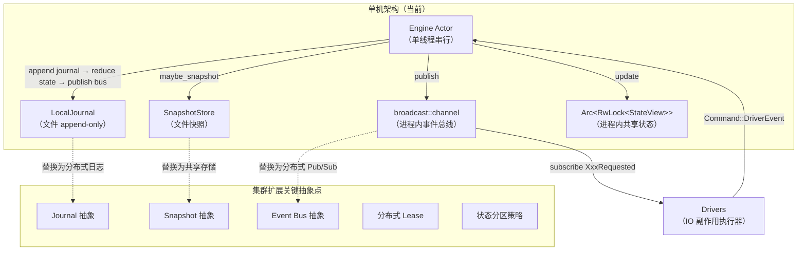
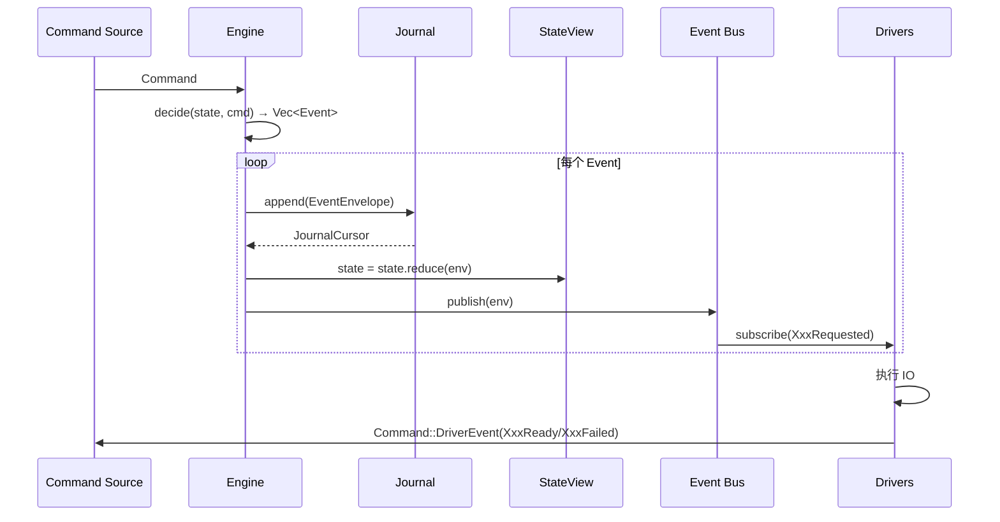
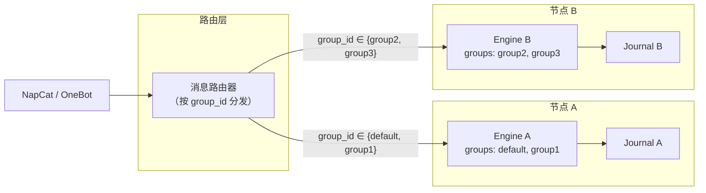

本文面向需要将 OQQWall_RUST 从单机部署扩展到多节点集群的开发者。内容基于当前代码库的实际架构进行分析，识别出哪些设计决策已经为集群扩展做了铺垫，哪些部分需要引入新的抽象层，以及推荐的分阶段演进路线。

## 当前架构：为何天生适合扩展

OQQWall_RUST 当前采用**事件溯源 + 函数式核心 / 命令式外壳**（Functional Core / Imperative Shell）架构。这一设计选择并非偶然——它将所有业务决策收敛为**纯函数**，将所有 IO 副作用隔离到 **Drivers**，并通过**确定性 ID 派生**保证了跨实例的幂等性。这三个特性共同构成了向集群扩展的坚实基础。



Sources: [engineering.md](docs/engineering.md#L1-L30), [engine.rs](crates/app/src/engine.rs#L1-L50)

## 确定性 ID：跨节点幂等的基石

当前系统中，所有业务实体 ID 均通过 `blake3` 哈希**确定性派生**，而非依赖随机数或数据库自增。这意味着任何节点对相同输入计算出的 `IngressId`、`SessionId`、`PostId`、`ReviewId`、`BlobId` 都完全一致。

| ID 类型 | 派生方式 | 确定性来源 |
|---------|---------|-----------|
| `IngressId` | `hash(profile + chat + user + platform_msg_id)` | 投稿消息的平台级唯一标识 |
| `SessionId` | `hash(chat + user + first_ingress_id)` | 会话的创建者与首条消息 |
| `PostId` | `hash(session_id)` | 会话到稿件的 1:1 映射 |
| `ReviewId` | `hash(post_id)` | 稿件到审核的 1:1 映射 |
| `BlobId` | `hash(ingress_id + attachment_index + attempt)` | 附件的来源与重试次数 |

这一设计在集群场景下的意义在于：**即使多个节点同时处理同一投稿，它们产生的事件序列在语义上也是幂等的**。重复的 `MessageAccepted` 事件在 reducer 层面是 no-op（因为 `ingress_seen` 集合），重复的 `SendStarted` 可以通过分布式 lease 来防止。

此外，所有 IO 操作遵循 `XxxRequested → XxxReady / XxxFailed` 事件模式，将"请求"与"结果"解耦。这使得 decider 纯函数不依赖 IO 返回值——它可以安全地在任何节点上运行，而无需等待远程调用。

Sources: [ids.rs](crates/core/src/ids.rs#L48-L86), [state.rs](crates/core/src/state.rs#L1-L50)

## 事件溯源架构：天然的分布式一致性协议

当前引擎的处理循环遵循严格的三步顺序：**append journal → reduce state → publish bus**。这一顺序保证了：

1. **事件一旦写入 journal 就是不可变的真相来源**——crash 后从 journal 恢复不会丢失任何已确认的决策
2. **StateView 是事件的派生产物**——任何时候都可以从 journal + snapshot 重建
3. **Drivers 订阅到的事件一定已落盘**——不会出现"通知了但未持久化"的不一致状态



在集群环境中，这个三步循环可以直接映射为：**写入分布式日志 → 本地 reduce → 发布到分布式 pub/sub**。核心逻辑（decide/reduce）完全不需要修改，只需要替换 IO 层的抽象实现。

Sources: [engine.rs](crates/app/src/engine.rs#L95-L135), [engineering.md](docs/engineering.md#L75-L110)

## 需要引入的抽象层

当前 `crates/infra` 中的 `LocalJournal` 和 `SnapshotStore` 直接使用文件系统 API，`crates/app` 中的 `Engine` 直接使用 `tokio::sync::broadcast` 和 `mpsc`。要支持集群，需要将这些组件抽象为 trait，使得可以插入不同的后端实现。

### 1. Journal 抽象

当前 `LocalJournal` 的核心接口是 `append` 和 `replay`。集群扩展需要将其抽象为 trait，允许替换为分布式日志后端（如 NATS JetStream、Apache Kafka、Redpanda 等）。

```text
trait Journal: Send + Sync {
    fn append(&self, env: &EventEnvelope) -> Result<JournalCursor>;
    fn replay(&self, start: Option<JournalCursor>, apply: impl FnMut(&EventEnvelope)) -> Result<ReplayOutcome>;
    fn truncate_tail(&self, cursor: JournalCursor) -> Result<()>;
}
```

`JournalCursor`（由 `segment` 和 `offset` 两个 `u64` 组成）在分布式日志中可以映射为 topic/partition + offset。当前的分段文件格式（每段带 CRC32 校验）为迁移提供了清晰的边界——每个 segment 可以映射为一个 partition。

Sources: [journal.rs](crates/infra/src/journal.rs#L35-L60), [journal.rs](crates/infra/src/journal.rs#L95-L150)

### 2. Snapshot 抽象

当前 `SnapshotStore` 使用本地文件系统的 `write` + `rename` 原子操作。集群扩展需要将其替换为支持原子写入的共享存储（如 S3 + 条件写入、etcd、或分布式文件系统）。

```text
trait SnapshotStore: Send + Sync {
    fn load(&self) -> Result<Option<Snapshot>>;
    fn write(&self, snapshot: &Snapshot) -> Result<()>;
}
```

Snapshot 的当前格式（带长度前缀 + CRC32 校验 + bincode 序列化）可以原样存储到任何支持字节流的后端。

Sources: [snapshot.rs](crates/infra/src/snapshot.rs#L1-L92)

### 3. Event Bus 抽象

当前 `Engine` 使用 `tokio::sync::broadcast::channel` 作为进程内事件总线。集群扩展需要将其替换为分布式 pub/sub 系统。

```text
trait EventBus: Send + Sync {
    fn publish(&self, env: &EventEnvelope) -> Result<()>;
    fn subscribe(&self, filter: EventFilter) -> BoxStream<'_, EventEnvelope>;
}
```

事件过滤器（`EventFilter`）应支持按事件类型（如 `XxxRequested`、`SendStarted`）订阅，使得不同节点上的 Drivers 可以只接收自己关心的事件。

### 4. 分布式 Lease

当前单机版本通过引擎层的 `sending` 集合实现"单写者发送"策略——全局 `sending` 非空则不再产生 `SendStarted`。在集群环境中，这需要替换为分布式 lease/lock 机制。

```text
trait SendLease: Send + Sync {
    fn try_acquire(&self, post_id: PostId, node_id: NodeId, ttl: Duration) -> Result<bool>;
    fn renew(&self, post_id: PostId, node_id: NodeId) -> Result<bool>;
    fn release(&self, post_id: PostId, node_id: NodeId) -> Result<()>;
}
```

Lease 的 TTL 机制保证了即使持有者崩溃，lease 也会在超时后自动释放，不会永久阻塞发送队列。

Sources: [state.rs](crates/core/src/state.rs#L130-L140), [engineering.md](docs/engineering.md#L280-L295)

## 分阶段演进路线

集群扩展不应一步到位，而应分阶段演进，每个阶段都产出可独立部署的增量价值。

### Phase 1：共享存储集群（Shared-Storage Cluster）

最简单的扩展方式是让多个节点共享同一个数据目录（通过 NFS、GlusterFS 或分布式文件系统）。每个节点独立运行完整的 Engine，但共享 journal 和 snapshot。

**关键约束**：
- Journal 的 `append` 操作需要文件锁（`flock` 或分布式锁）保证互斥
- 只有一个节点的 Engine 能够活跃写入 journal（Leader election）
- 其他节点作为热备，通过 `replay` 保持状态同步
- Leader 故障时，备节点通过 lease 抢占成为新 Leader

**优点**：改动最小——只需在 `LocalJournal` 上增加文件锁抽象，无需引入新的外部依赖。
**缺点**：共享文件系统是单点瓶颈，不适合跨机房部署。

### Phase 2：分区式集群（Partitioned Cluster）

引入 **group_id 级别的状态分区**。每个节点负责一组 `group_id`，拥有独立的 journal 和 snapshot。投稿消息通过路由层（如 Nginx 或内置路由）分发到正确的节点。



**关键设计**：
- 路由层维护 `group_id → 节点` 的映射表（静态配置或服务发现）
- 每个节点的 `StateView` 只包含自己负责的 groups
- 跨 group 的操作（如全局指令）需要通过路由层转发
- OneBot WS 连接按 group 分配到不同节点

**优点**：水平扩展能力强，每个节点独立运行，无共享状态。
**缺点**：需要路由层，单 group 无法跨节点扩展。

### Phase 3：分布式事件日志集群（Distributed Event Log Cluster）

引入分布式事件日志（如 NATS JetStream）作为所有节点的共享 journal。每个 group 对应一个 stream/partition，所有节点都可以读写。

**关键变化**：
- `LocalJournal` 替换为 `NatsJournal`（或 `KafkaJournal`）
- `SnapshotStore` 替换为 `S3SnapshotStore`（或 `EtcdSnapshotStore`）
- `broadcast::channel` 替换为 `NatsEventBus`（或 `RedisPubSub`）
- 引入 `SendLease` trait，使用 Redis 或 etcd 实现分布式 lease

**架构优势**：
- 事件日志成为系统的 Single Source of Truth
- 任何节点都可以通过 replay 重建任意 group 的状态
- 发送任务可以通过 lease 在节点间动态分配
- 新增/移除节点无需迁移数据

Sources: [engine.rs](crates/app/src/engine.rs#L137-L180), [engineering.md](docs/engineering.md#L45-L75)

## 多实例发送协调

当前单机版本的"单写者发送"策略（`sending` 集合非空则不再产生 `SendStarted`）是集群扩展中最需要重新设计的部分。

在集群环境中，需要引入以下机制：

1. **分布式 Lease**：发送前必须获取 lease，lease 持有者才能执行发送。lease 带 TTL，持有者崩溃后自动释放。
2. **账号亲和性**：同一账号的发送应尽量路由到同一节点（避免 cookie/session 竞争）。
3. **冷却状态共享**：`AccountRuntime.cooldown_until_ms` 需要在节点间同步（通过事件或共享存储）。
4. **发送结果回写**：`SendSucceeded` / `SendFailed` 事件必须写入分布式 journal，而非本地 journal。

```text
// 伪代码：集群发送流程
fn try_send(state: &StateView, lease: &dyn SendLease, node_id: NodeId) -> Option<PostId> {
    let due = find_first_due(state);
    if let Some(post_id) = due {
        if lease.try_acquire(post_id, node_id, SEND_LEASE_TTL) {
            Some(post_id)
        } else {
            None // 其他节点正在发送
        }
    } else {
        None
    }
}
```

Sources: [qzone.rs](crates/drivers/src/qzone.rs#L1-L80), [state.rs](crates/core/src/state.rs#L115-L145)

## Crate 级别的改造影响

集群扩展对各 crate 的影响程度不同：

| Crate | 改造范围 | 说明 |
|-------|---------|------|
| `crates/core` | **几乎不改** | 纯函数层，decide/reduce 逻辑完全不变。只需确保新增的集群事件类型（如 `LeaseAcquired`）被正确处理。 |
| `crates/infra` | **重大改造** | 需要将 `LocalJournal`、`SnapshotStore` 抽象为 trait，并提供分布式后端实现（如 `NatsJournal`、`S3SnapshotStore`）。 |
| `crates/drivers` | **中等改造** | `QzoneSender` 需要支持分布式 lease 协调；`NapCatDriver` 需要支持多实例连接管理。 |
| `crates/app` | **中等改造** | `Engine` 需要注入 trait 对象（而非直接使用本地实现）；需要引入路由层和节点发现机制。 |

`crates/core` 的稳定性是集群扩展的最大保障——它包含了所有业务决策逻辑，且完全不依赖 IO。这意味着无论底层基础设施如何变化，核心业务语义始终一致。

Sources: [lib.rs](crates/core/src/lib.rs#L1-L31), [decide/mod.rs](crates/core/src/decide/mod.rs#L1-L28), [reduce/mod.rs](crates/core/src/reduce/mod.rs#L1-L40)

## 遥测收集器：已有的分布式先例

`crates/telemetry-collector` 是项目中**已经实现的独立分布式组件**。它作为独立二进制运行，通过 HTTP API 接收主程序上传的训练样本，使用 PostgreSQL 存储元数据，使用本地对象目录存储聊天原文。它的部署架构（Docker Compose + PostgreSQL）为集群扩展提供了参考模式。

主程序与遥测收集器之间的通信模式（批量上传 + 幂等 + 重试）可以复用到集群内部的节点间通信中。

Sources: [telemetry_collector.md](docs/telemetry_collector.md#L1-L30), [docker-compose.telemetry.yml](docker-compose.telemetry.yml#L1-L41)

## 配置与运维考量

集群部署需要在配置层面引入新的维度：

- **节点标识**：每个节点需要唯一的 `node_id`（用于 lease 持有者标识和事件 actor 分配）
- **分区映射**：`group_id → node_id` 的映射表（静态配置或服务发现）
- **共享存储端点**：分布式 journal、snapshot、lease 的连接信息
- **健康检查**：每个节点需要暴露健康检查端点，供负载均衡器和编排系统使用

当前 `config.json` 的 `groups` 结构天然支持分区——只需在不同节点的配置中分配不同的 group 即可。`common` 部分的全局配置（如 `tz_offset_minutes`、`renderer`）应在所有节点间保持一致。

Sources: [config.md](docs/config.md#L1-L60), [runbook.md](docs/runbook.md#L1-L40)

## 下一步阅读

如需深入了解本文涉及的其他主题，请参考：

- [项目架构详解](8-xiang-mu-jia-gou-xiang-jie)：整体架构与 crate 关系
- [事件溯源架构](9-shi-jian-su-yuan-jia-gou)：事件溯源模式的设计细节
- [状态管理与还原](10-zhuang-tai-guan-li-yu-huan-yuan)：StateView 结构与 reducer 机制
- [并发处理机制](24-bing-fa-chu-li-ji-zhi)：当前单机并发模型
- [生产环境部署](20-sheng-chan-huan-jing-bu-shu)：单机部署与 systemd 配置
- [故障排查手册](22-gu-zhang-pai-cha-shou-ce)：常见问题与排障流程