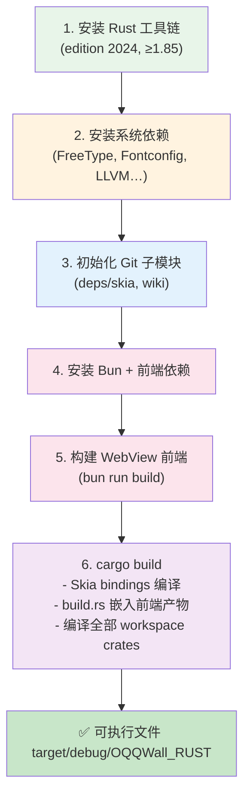
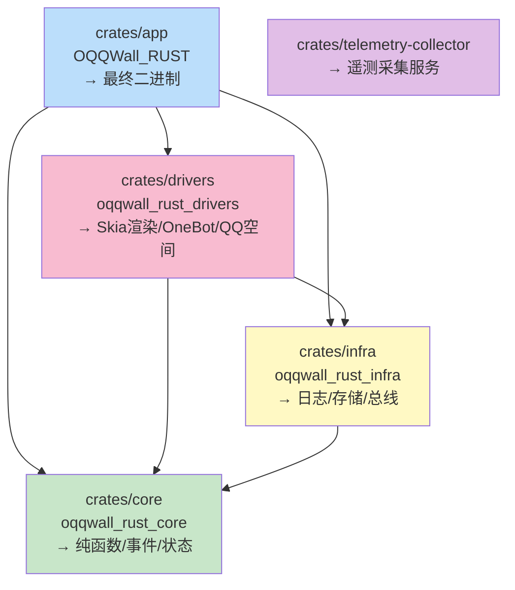

本文档指导开发者从零开始搭建 OQQWall_Rust 的本地开发环境。项目是一个基于 Rust 的 QQ 校园墙自动运营系统，采用 **Functional Core / Imperative Shell** 架构，包含 Skia 渲染引擎、WebView 前端审核界面、NapCat OneBot 集成等子系统。搭建过程涉及 Rust 工具链、系统级 C/C++ 依赖（Skia 编译）、前端构建工具链三个层面。

## 整体构建流程概览

在深入具体步骤之前，先了解项目的完整构建流程。OQQWall_Rust 最终产出**单一 Rust 二进制文件**，但构建过程中需要先编译 WebView 前端并将其嵌入二进制：



项目使用 Cargo workspace 管理五个 crate，它们的依赖关系如下：



Sources: [Cargo.toml](Cargo.toml#L1-L16), [docs/engineering.md](docs/engineering.md#L100-L135)

## 系统要求

### 操作系统

项目主线开发和生产环境均为 Linux（作者使用 Arch Linux 开发，Ubuntu 22.04 部署）。macOS 可以正常开发，但**最终生产构建推荐 Linux**。Docker 工具链镜像基于 Debian Bullseye，最低兼容 glibc 2.31。

| 平台 | 开发支持 | 生产支持 | 备注 |
|------|---------|---------|------|
| Linux (x86_64/aarch64) | ✅ 完整支持 | ✅ 完整支持 | 主线平台 |
| macOS (Apple Silicon / Intel) | ✅ 可开发 | ⚠️ 不推荐 | Skia 编译需要额外配置 |
| Windows (WSL2) | ⚠️ 通过 WSL2 | ❌ 不支持 | 需在 WSL2 Linux 环境内操作 |

Sources: [README.md](README.md#L10-L14), [Dockerfile.rust-glibc231-toolchain](Dockerfile.rust-glibc231-toolchain#L1-L14)

### 磁盘空间

Skia bindings 的首次编译会下载并构建 Skia 源码，`target/` 目录在 debug 模式下可达 **5–10 GB**。建议预留至少 **15 GB** 可用空间。

## 第一步：安装 Rust 工具链

项目所有 crate 均声明 `edition = "2024"`，这要求 **Rust 1.85.0 或更高版本**。CI 使用的版本是 1.94.0。

```bash
# 安装 rustup（如尚未安装）
curl --proto '=https' --tlsv1.2 -sSf https://sh.rustup.rs | sh

# 安装最新稳定版工具链
rustup install stable
rustup default stable

# 验证版本（需要 ≥ 1.85.0）
rustc --version
cargo --version
```

Sources: [crates/core/Cargo.toml](crates/core/Cargo.toml#L4), [Dockerfile.rust-glibc231-toolchain](Dockerfile.rust-glibc231-toolchain#L1)

### Cargo 配置

项目根目录的 `.cargo/config.toml` 当前为空文件，无需额外配置。Cargo 使用 workspace 根 `Cargo.toml` 中声明的 `resolver = "2"` 进行依赖解析。

Sources: [.cargo/config.toml](.cargo/config.toml#L1), [Cargo.toml](Cargo.toml#L12)

## 第二步：安装系统依赖

项目依赖两类系统级库：**Skia 编译所需**和**运行时字体渲染所需**。

### Linux（Debian/Ubuntu）

```bash
sudo apt-get update
sudo apt-get install -y --no-install-recommends \
    python3 \
    pkg-config \
    libfreetype6-dev \
    libfontconfig1-dev \
    ffmpeg \
    ca-certificates \
    clang \
    libclang-dev
```

### Linux（Arch Linux）

```bash
sudo pacman -S base-devel python pkg-config freetype2 fontconfig ffmpeg clang llvm
```

### macOS（Homebrew）

```bash
brew install pkg-config freetype fontconfig ffmpeg llvm
# 如需指定 LLVM 路径（Skia bindgen 需要）
export LIBCLANG_PATH="$(brew --prefix llvm)/lib"
```

各系统依赖的作用说明：

| 依赖包 | 用途 | 必需 |
|--------|------|------|
| `python3` | Skia 构建脚本（GN/Ninja）需要 Python 3 | ✅ |
| `pkg-config` | 定位系统库路径（FreeType、Fontconfig） | ✅ |
| `libfreetype6-dev` | Skia 字体光栅化 | ✅ |
| `libfontconfig1-dev` | Skia 字体发现与匹配 | ✅ |
| `clang` / `libclang-dev` | `skia-bindings` 通过 `bindgen` 生成 Rust FFI 绑定，需要 libclang | ✅ |
| `ffmpeg` | 媒体文件处理（视频缩略图等） | ✅ |
| `ca-certificates` | HTTPS 证书（下载 Skia 源码/字体等） | ✅ |

Sources: [Dockerfile.rust-glibc231-toolchain](Dockerfile.rust-glibc231-toolchain#L5-L13), [Cargo.lock](Cargo.lock) (skia-bindings → bindgen → clang-sys)

## 第三步：初始化 Git 子模块

项目通过 Git submodule 管理两个外部依赖：

```bash
git submodule update --init --recursive
```

| 子模块 | 路径 | 用途 |
|--------|------|------|
| Skia 源码 | `deps/skia` | 本地 Skia 源码引用（可选，skia-bindings 也可自动下载） |
| 项目 Wiki | `OQQWall_rust.wiki` | 文档 wiki 仓库 |

> **注意**：`deps/skia` 子模块在某些环境下可以不初始化——`skia-bindings` crate 会在编译时自动从网络下载预编译的 Skia 库或从源码构建。但初始化子模块可以避免网络问题导致的构建失败。

Sources: [.gitmodules](.gitmodules#L1-L7)

## 第四步：安装前端构建工具链

项目的 WebView 审核界面是一个 React 单页应用，使用 **Bun** 作为包管理器和运行时，**Vite** 作为构建工具。

### 安装 Bun

```bash
# macOS / Linux
curl -fsSL https://bun.sh/install | bash

# 验证安装（项目锁定版本 1.3.14）
bun --version
```

### 安装前端依赖

```bash
cd crates/app/webview-ui
bun install
cd ../../..
```

前端技术栈一览：

| 技术 | 版本 | 用途 |
|------|------|------|
| React | 19.x | UI 框架 |
| TypeScript | 5.8+ | 类型安全 |
| Vite | 5.x | 构建工具与开发服务器 |
| Tailwind CSS | 4.x | 原子化 CSS |
| HeroUI (NextUI) | 3.x | 组件库 |
| Lucide React | 1.x | 图标库 |

Sources: [crates/app/webview-ui/package.json](crates/app/webview-ui/package.json#L1-L30), [crates/app/webview-ui/tsconfig.json](crates/app/webview-ui/tsconfig.json#L1-L18)

## 第五步：构建 WebView 前端

**这是编译 Rust 二进制之前必须完成的步骤**。`crates/app/build.rs` 会将 `webview-ui/dist/` 目录下的所有文件通过 `include_bytes!` 嵌入到最终的 Rust 二进制中。如果 `dist/` 目录不存在或为空，构建仍然会成功，但运行时 WebView 审核界面将无法使用。

```bash
cd crates/app/webview-ui

# 构建生产版本（输出到 dist/）
bun run build

# 验证产物
ls dist/index.html
ls dist/assets/

# 可选：开发模式（带热重载，需配合后端 API 代理）
bun run dev
```

开发模式下，Vite 会将 `/auth` 和 `/api` 路径代理到后端服务（默认 `http://127.0.0.1:10924`），可通过环境变量 `VITE_WEBVIEW_BACKEND` 覆盖：

```bash
VITE_WEBVIEW_BACKEND=http://localhost:10924 bun run dev
```

Sources: [crates/app/build.rs](crates/app/build.rs#L1-L104), [crates/app/webview-ui/vite.config.ts](crates/app/webview-ui/vite.config.ts#L1-L27)

## 第六步：编译 Rust 项目

### 首次编译（Debug 模式）

```bash
# 回到项目根目录
cd /path/to/OQQWall_rust

# 编译整个 workspace（首次编译 Skia bindings 耗时较长，约 10-30 分钟）
cargo build

# 验证产物
ls -la target/debug/OQQWall_RUST
```

> **首次编译特别说明**：`skia-bindings` crate 首次编译时会下载 Skia 源码并通过 GN/Ninja 构建系统编译 C++ 代码，之后通过 `bindgen`（依赖 libclang）生成 Rust FFI 绑定。这个过程非常耗时且占用大量磁盘空间（`target/` 可达数 GB）。后续增量编译会快很多。

### Release 编译

```bash
cargo build -r -p OQQWall_RUST
```

Release 配置启用了激进优化，适合生产部署：

```toml
[profile.release]
opt-level = "z"     # 优化体积
lto = "fat"         # 全量链接时优化
codegen-units = 1   # 单编译单元，最大化优化
strip = "symbols"   # 去除调试符号
```

Sources: [Cargo.toml](Cargo.toml#L14-L16), [Cargo.lock](Cargo.lock) (skia-bindings)

### 运行测试

```bash
# 运行所有测试
cargo test

# 只运行 core 单元测试（纯函数，无 IO，速度最快）
cargo test -p oqqwall_rust_core

# 运行集成测试
cargo test -p oqqwall_rust_core --test reduce_replay
```

项目在 `crates/core/tests/` 下有丰富的测试用例，覆盖决策引擎、事件溯源回放、审核指令、安全正则等场景：

Sources: [crates/core/tests/](crates/core/tests/)

## 第七步：首次运行

编译完成后，可以启动 OOOB（Out-of-Box Experience）初始化向导来生成配置文件：

```bash
# 交互式初始化（会引导创建 config.json）
cargo run -- oobe

# 或直接运行（首次运行时若无 config.json 会自动进入 OOBE）
cargo run
```

程序支持以下运行模式：

| 命令 | 功能 |
|------|------|
| `cargo run` | 正常启动（加载 config.json） |
| `cargo run -- oobe` | 进入 OOBE 初始化向导 |
| `cargo run -- --tui` | 启动 TUI 终端管理界面 |
| `OQQWALL_DATA_DIR=./mydata cargo run` | 指定数据目录 |
| `OQQWALL_RES_DIR=./res cargo run` | 指定资源目录 |
| `OQQWALL_CONFIG=myconfig.json cargo run` | 指定配置文件路径 |

Sources: [crates/app/src/main.rs](crates/app/src/main.rs#L30-L55), [crates/app/src/oobe.rs](crates/app/src/oobe.rs#L1-L60)

## Docker 构建环境（可选）

如果你不想在本地安装 Skia 编译的系统依赖，可以使用 Docker 工具链镜像进行构建。CI 流水线正是使用此方式。

### 构建工具链镜像

```bash
docker build --network host \
    -t rust-glibc231:20.04-oqqwall \
    -f Dockerfile.rust-glibc231-toolchain .
```

### 使用 Docker 执行 cargo 命令

```bash
# 编译 release 版本
scripts/cargo_docker.sh build -r -p OQQWall_RUST

# 编译 debug 版本
scripts/cargo_docker.sh build -p OQQWall_RUST

# 运行测试
scripts/cargo_docker.sh test -p oqqwall_rust_core
```

`scripts/cargo_docker.sh` 会自动挂载 `~/.cargo/registry`（缓存 crate 索引）和 `target/`（编译产物），避免每次重建容器时重新下载依赖。

> **注意**：Docker 构建仍需先在宿主机完成前端 `bun install && bun run build`，因为 `crates/app/webview-ui/dist/` 需要存在。

Sources: [Dockerfile.rust-glibc231-toolchain](Dockerfile.rust-glibc231-toolchain#L1-L14), [scripts/cargo_docker.sh](scripts/cargo_docker.sh#L1-L50)

## 资源文件说明

项目在 `res/` 目录下存放渲染所需的静态资源，运行时二进制通过 `OQQWALL_RES_DIR` 环境变量或相对于可执行文件的 `res/` 目录自动定位：

| 资源路径 | 用途 |
|----------|------|
| `res/fonts/PingFangSC-Regular.otf` | 默认字体（苹方），Skia 渲染文本使用 |
| `res/face/*.png` | QQ 表情图片（347 个） |
| `res/Anonymous_avatar.png` | 默认匿名头像 |
| `res/face/default_config.json` | QQ 表情映射配置 |
| `res/*.png` | 各类文件类型图标（image.png, video.png, pdf.png 等） |

渲染引擎在启动时会扫描 `res/fonts/` 目录加载所有 `.ttf` / `.otf` 字体文件，并将它们注册到 Skia 的字体集合中。开发者可以将自定义字体放入此目录以扩展字体支持。

Sources: [crates/drivers/src/renderer.rs](crates/drivers/src/renderer.rs#L7287-L7360), [crates/drivers/src/renderer.rs](crates/drivers/src/renderer.rs#L7723-L7748)

## 完整搭建命令汇总

以下是 macOS/Linux 上从零开始的完整搭建流程：

```bash
# 1. 克隆仓库
git clone https://github.com/gfhdhytghd/OQQWall_rust.git
cd OQQWall_rust

# 2. 安装 Rust 工具链（≥1.85.0）
curl --proto '=https' --tlsv1.2 -sSf https://sh.rustup.rs | sh
rustup default stable

# 3. 安装系统依赖（以 Ubuntu 为例）
sudo apt-get install -y python3 pkg-config \
    libfreetype6-dev libfontconfig1-dev ffmpeg \
    ca-certificates clang libclang-dev

# 4. 初始化子模块
git submodule update --init --recursive

# 5. 安装 Bun 并构建前端
curl -fsSL https://bun.sh/install | bash
cd crates/app/webview-ui
bun install
bun run build
cd ../../..

# 6. 编译项目
cargo build

# 7. 首次运行（进入 OOBE 向导）
cargo run -- oobe
```

## 常见问题排查

| 问题 | 原因 | 解决方案 |
|------|------|----------|
| `skia-bindings` 编译报错 `cannot find -lclang` | 缺少 libclang | 安装 `libclang-dev`（Ubuntu）或 `llvm`（macOS），并设置 `LIBCLANG_PATH` |
| `skia-bindings` 编译报 Python 错误 | Skia GN 构建需要 Python 3 | 安装 `python3` 并确保在 PATH 中 |
| `webview_assets.rs` 找不到文件 | 未构建前端 | 先执行 `cd crates/app/webview-ui && bun install && bun run build` |
| `font cache: disk_fonts=0` 日志 | `res/fonts/` 目录缺失 | 确保 `res/` 目录在工作目录中（或设置 `OQQWALL_RES_DIR`） |
| `edition = "2024"` 编译错误 | Rust 版本过低 | `rustup update stable` 升级到 ≥1.85.0 |
| 首次编译极慢（>20 分钟） | Skia C++ 源码首次编译 | 正常现象，后续增量编译会快很多 |
| macOS `ld: warning: pointer not aligned` | macOS 链接器警告 | 通常可忽略，不影响功能 |

## 下一步

环境搭建完成后，建议按以下顺序阅读文档：

1. [配置文件说明](4-pei-zhi-wen-jian-shuo-ming) — 了解 `config.json` 的完整字段与含义
2. [首次运行与初始化](5-shou-ci-yun-xing-yu-chu-shi-hua) — 完成 OOBE 后的实际启动与验证
3. [项目架构详解](8-xiang-mu-jia-gou-xiang-jie) — 深入理解 Functional Core / Imperative Shell 架构
4. [审核指令系统](6-shen-he-zhi-ling-xi-tong) — 了解审核群的指令交互方式