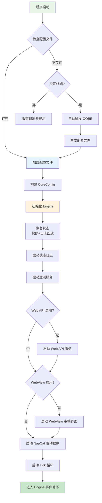
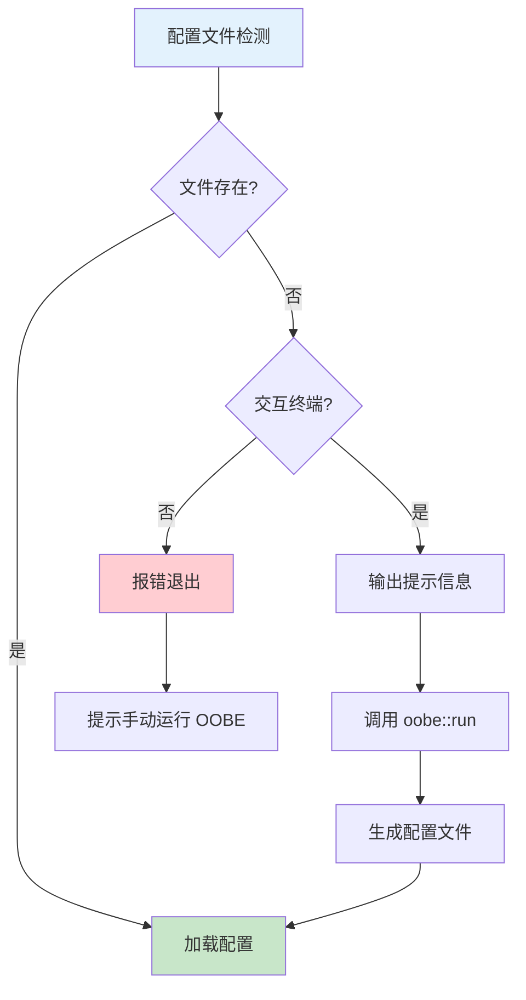

本文档详细说明 OQQWall_RUST 的首次运行流程与系统初始化机制。当用户首次启动程序时，系统会通过 OOBE（开箱体验）引导生成配置文件，随后依次完成配置加载、事件引擎初始化、驱动程序启动等关键步骤，最终进入事件循环处理投稿消息。

## 启动流程概览

OQQWall_RUST 的启动流程遵循严格的顺序依赖关系，确保各组件正确初始化后再进入运行状态。整个流程可分为四个主要阶段：**配置加载**、**引擎初始化**、**服务启动**和**事件循环**。

程序启动时首先检查配置文件是否存在。若配置文件存在则直接加载；若不存在且处于交互终端环境，系统会自动触发 OOBE 流程引导用户生成配置。配置加载完成后，系统依次初始化事件引擎、恢复历史状态、启动各类服务，最终进入主事件循环处理所有 Command。

Sources: [main.rs](crates/app/src/main.rs#L30-L115), [config.rs](crates/app/src/config.rs#L112-L130)

## 配置文件检测与 OOBE 触发

程序启动时首先调用 `load_app_config_with_auto_oobe()` 函数检测配置文件状态。该函数通过 `config::resolve_config_path()` 确定配置文件路径（默认为 `config.json`，可通过环境变量 `OQQWALL_CONFIG` 覆盖），然后检查文件是否存在。

**自动 OOBE 触发逻辑**：当配置文件不存在时，系统会检查当前是否处于交互终端环境（通过 `std::io::stdin().is_terminal()` 和 `std::io::stdout().is_terminal()` 判断）。若为交互终端，程序会自动进入 OOBE 流程；若为非交互环境（如 systemd 服务或容器），则会报错退出并提示用户手动运行 OOBE 命令。

OOBE 流程会依次询问用户配置项，包括逻辑组名、审核群 ID、账号列表、NapCat 连接信息等核心参数。用户输入完成后，系统生成标准 JSON 配置文件并写入磁盘。OOBE 完成后，程序继续加载新生成的配置文件进入后续初始化流程。

Sources: [main.rs](crates/app/src/main.rs#L125-L144), [oobe.rs](crates/app/src/oobe.rs#L8-L156)

## 配置加载与验证

配置加载过程由 `AppConfig::load()` 函数负责，该函数执行以下关键步骤：

1. **读取配置文件**：从指定路径读取 JSON 格式的配置文件内容
2. **JSON 解析**：将 JSON 字符串解析为 `serde_json::Value` 结构
3. **配置归一化**：调用 `normalize_config_in_place()` 检测并迁移不兼容字段
4. **写回配置**：若发生归一化修改，将更新后的配置写回文件
5. **结构化解析**：调用 `AppConfig::from_value()` 将 JSON 值转换为类型安全的 `AppConfig` 结构体

配置归一化过程会自动处理字段迁移，例如将旧版 `common.use_web_review` 迁移为 `common.web_api.enabled`，确保配置文件的向后兼容性。归一化完成后，系统会验证必填字段（如 `mangroupid`、`accounts`）的有效性，若缺少必填字段则报错退出。

**环境变量覆盖机制**：配置加载时会检查多个环境变量（如 `OQQWALL_NAPCAT_BASE_URL`、`OQQWALL_API_TOKEN` 等），这些环境变量会覆盖配置文件中的对应字段。环境变量优先级高于配置文件，便于容器化部署和敏感信息管理。

Sources: [config.rs](crates/app/src/config.rs#L112-L130), [config.rs](crates/app/src/config.rs#L131-L391)

## 引擎初始化与状态恢复

配置加载完成后，系统进入引擎初始化阶段。`Engine::new()` 函数负责创建事件引擎实例，该过程包括以下关键步骤：

**通道与总线创建**：创建 Command 通道（`mpsc::channel(1024)`）和事件总线（`broadcast::channel(1024)`），建立组件间通信机制。Command 通道用于接收外部输入（如 NapCat 消息、管理员指令），事件总线用于向所有订阅者广播事件。

**存储层初始化**：打开本地日志存储（`LocalJournal::open()`）和快照存储（`SnapshotStore::open()`），这些存储组件负责持久化事件日志和定期快照，是系统可恢复性的基础。

**状态恢复流程**：系统通过 `restore_state()` 函数从快照和日志中恢复历史状态。恢复过程遵循以下优先级：
1. 尝试加载最新快照（若存在）
2. 从快照的游标位置开始回放后续事件日志
3. 若快照加载失败，则从日志开头完整回放
4. 若发现日志损坏，会自动截断损坏部分并继续恢复

状态恢复完成后，系统会初始化共享状态（`Arc<RwLock<StateView>>`），供其他组件查询当前状态。`EngineHandle` 结构体封装了引擎的公共接口，包括 Command 发送通道、事件订阅器和状态访问器。

Sources: [engine.rs](crates/app/src/engine.rs#L60-L103), [engine.rs](crates/app/src/engine.rs#L145-L247)

## 服务组件启动

引擎初始化完成后，系统依次启动各类服务组件。这些组件以异步任务形式运行，通过事件总线与引擎交互。

**状态日志服务**：`spawn_status_logger()` 启动状态日志记录器，该服务订阅事件总线，将关键事件（如 `MessageAccepted`、`PostDraftCreated`）输出到终端，便于调试和监控。

**遥测服务**：`spawn_submission_telemetry()` 启动遥测数据收集服务，该服务监听审核决策事件，生成训练样本并支持批量上传。遥测服务默认启用，可通过配置项 `telemetry.enabled` 禁用。

**Web API 服务**：若配置项 `web_api.enabled` 为 true，系统会启动 HTTP API 服务（默认端口 10923）。该服务提供 RESTful 接口，支持第三方系统集成，需配置长度至少 32 的 root token 才能启动。

**WebView 审核界面**：若配置项 `webview.enabled` 为 true，系统会启动内置审核前端（默认端口 10924）。该界面提供图形化审核操作，支持账号密码登录和权限管理，需配置至少一个管理员账号才能启动。

**NapCat 驱动程序**：`spawn_napcat_drivers()` 函数启动所有副作用驱动程序，包括：
- NapCat WebSocket 客户端：连接 NapCat 服务接收/发送消息
- 媒体获取器：下载附件 URL 到本地 blob 存储
- 渲染器：将稿件渲染为 PNG 图片
- QQ 空间发送器：处理空间发布请求

每个驱动程序都采用 `Requested → Ready/Failed` 事件模式，确保核心引擎保持纯函数特性。

Sources: [main.rs](crates/app/src/main.rs#L75-L92), [connect.rs](crates/app/src/connect.rs#L24-L138)

## Tick 循环与事件循环

所有服务组件启动后，系统进入主运行循环。该循环包含两个并行的异步任务：

**Tick 循环**：每秒向 Command 通道发送一个 `Tick` 命令，携带当前时间戳和时区偏移。Tick 命令用于驱动时间相关的业务逻辑，如定时发送、冷却检查等。时区偏移从配置中读取（中国大陆通常为 480 分钟，即 UTC+8）。

**Engine 事件循环**：`engine.run()` 方法进入主事件循环，从 Command 通道接收命令，调用纯函数 `decide()` 生成事件，然后依次执行：
1. 将事件写入本地日志（`journal.append()`）
2. 更新内存状态（`state.reduce()`）
3. 更新共享状态供其他组件查询
4. 通过事件总线广播事件给所有订阅者
5. 检查是否需要创建快照（每 1000 个事件或每 5 分钟）

事件循环会持续运行直到 Command 通道关闭（通常意味着程序退出）。所有业务逻辑都通过事件驱动，确保系统的可重放性和可测试性。

Sources: [main.rs](crates/app/src/main.rs#L95-L115), [engine.rs](crates/app/src/engine.rs#L105-L143)

## 首次运行验证

首次运行成功的关键指标是终端输出 `系统已启动` 消息，随后程序进入静默运行状态。用户可通过以下方式验证系统是否正常工作：

**终端输出观察**：正常启动时会依次显示配置加载信息、引擎初始化状态、服务启动状态。若配置文件不存在，会显示 OOBE 引导提示。

**状态查询**：通过审核群发送 `@机器人 自检` 指令，系统会返回当前状态信息。若启用了 WebView 审核界面，可通过浏览器访问 `http://<host>:<port>/` 查看系统状态。

**日志检查**：调试版本会在 `data/logs/debug.log` 文件中记录详细日志，包括配置加载、引擎初始化、服务启动等关键步骤。生产环境可通过 systemd journal 查看日志。

**常见问题排查**：
- 配置文件路径错误：检查 `OQQWALL_CONFIG` 环境变量
- NapCat 连接失败：检查 `napcat_base_url` 和 `napcat_access_token` 配置
- 端口冲突：检查 Web API 和 WebView 的端口是否被占用
- 权限问题：确保 `data/` 目录可写，资源文件可读

Sources: [main.rs](crates/app/src/main.rs#L50-L57), [runbook.md](docs/runbook.md#L109-L165)

## 下一步

完成首次运行验证后，建议按以下顺序深入学习：

1. [审核指令系统](6-shen-he-zhi-ling-xi-tong) - 掌握管理员在审核群中的操作指令
2. [投稿处理流程](7-tou-gao-chu-li-liu-cheng) - 了解从收稿到发送的完整业务流程
3. [配置文件说明](4-pei-zhi-wen-jian-shuo-ming) - 深入理解各项配置参数的含义与最佳实践
4. [生产环境部署](20-sheng-chan-huan-jing-bu-shu) - 学习 systemd 服务化与生产环境优化

对于开发者，建议进一步阅读：
- [项目架构详解](8-xiang-mu-jia-gou-xiang-jie) - 理解 Functional Core / Imperative Shell 架构模式
- [事件溯源架构](9-shi-jian-su-yuan-jia-gou) - 掌握事件驱动与状态管理机制
- [测试与质量保证](25-ce-shi-yu-zhi-liang-bao-zheng) - 了解单元测试、属性测试与集成测试策略