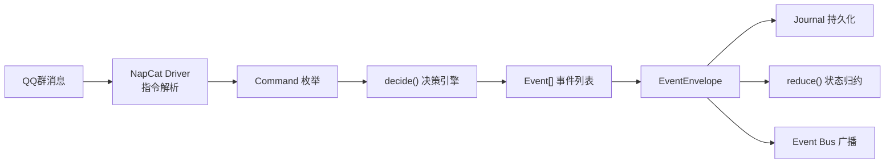
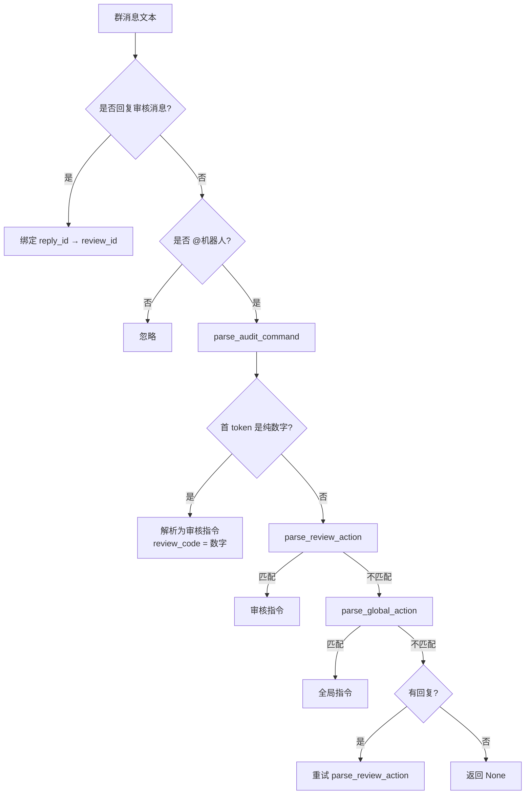
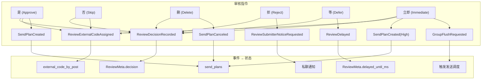

审核指令系统是 OQQWall\_Rust 的核心操控接口，它允许管理员通过 QQ 群内消息或 Web 审核界面对投稿的整个生命周期进行精确控制。系统采用**事件溯源架构**——每个指令不直接修改状态，而是被翻译为一组事件，这些事件依次追加到日志并驱动状态机演进。

Sources: [command.rs](crates/core/src/command.rs#L1-L153)、[decide/mod.rs](crates/core/src/decide/mod.rs#L1-L28)

## 架构总览

从一条群消息到最终状态变更，审核指令经历以下处理链路：

指令系统的核心设计原则是**决策与执行分离**：`decide` 函数根据当前状态和指令生成纯事件，`reduce` 函数将事件应用到状态。这两个函数都是无副作用的纯函数，使系统天然支持重放、审计和调试。

Sources: [decide/mod.rs](crates/core/src/decide/mod.rs#L14-L27)、[reduce/mod.rs](crates/core/src/reduce/mod.rs#L19-L30)、[engine.rs](crates/app/src/engine.rs#L126-L156)

## 指令分类体系

系统将所有指令分为两大类，每类对应不同的**作用域**和**触发条件**：

| 维度 | 审核指令（ReviewAction） | 全局指令（GlobalAction） |
|---|---|---|
| **作用域** | 绑定到单个投稿 | 作用于整个账号组 |
| **触发前提** | 需要 `review_code` 或回复审核消息 | 需要 `@机器人` 前缀 |
| **权限** | 审核群管理员 | 审核群管理员 |
| **核心用途** | 审批、拒绝、延迟、修改投稿 | 队列管理、系统维护、快捷配置 |
| **标识类型** | `Command::ReviewAction` | `Command::GlobalAction` |

两者的批量变体（`ReviewActionBatchCommand`、`GlobalActionBatchCommand`）支持快捷指令 DSL 展开后的多步顺序执行。批量执行中每一步都会立即应用到临时状态副本，如果某一步产出空事件列表则停止后续步骤。

Sources: [command.rs](crates/core/src/command.rs#L3-L12)、[decide/review.rs](crates/core/src/decide/review.rs#L209-L251)、[decide/global.rs](crates/core/src/decide/global.rs#L169-L201)

## 指令触发方式

管理员可以通过两种方式触发审核指令：

**方式一：@机器人 + 指令（推荐用于全局指令）**。群消息中包含 `@机器人` 时，系统识别为指令候选。全局指令格式为 `@机器人 指令 [参数]`，审核指令格式为 `@机器人 <review_code> 指令 [参数]`。

**方式二：回复审核消息（推荐用于审核指令）**。直接回复审核群中的审核推送消息并输入指令关键词，系统通过 `audit_msg_id` 反查绑定的审核项，无需手动输入内部编号。这是最安全、最高效的审核操作方式。

在代码层面，两种方式最终汇入 `parse_audit_command` 函数进行统一解析，该函数根据文本首 token 是否为数字来区分审核指令和全局指令。

Sources: [napcat.rs](crates/drivers/src/napcat.rs#L3724-L3776)

## 指令解析流程

`parse_audit_command` 函数的核心逻辑是**三阶段匹配**：首先尝试将文本首段解析为审核编号（纯数字）并匹配后续审核指令；其次尝试直接匹配审核指令关键词；最后回退到全局指令匹配。这种设计既兼容原版 OQQWall 的 `@机器人 review_code 指令` 语法，又支持直接输入指令关键词。

Sources: [napcat.rs](crates/drivers/src/napcat.rs#L3748-L3776)

## 投稿标识与解析

### 审核编号（review\_code）

`review_code` 是系统为每个投稿分配的内部编号（类型为 `u32`），仅在审核群中可见，不对外展示。它与 `ReviewId`（128 位哈希派生 ID）是不同的概念——前者是人类可读的短期编号，后者是系统的永久唯一标识。审核指令通过以下优先级解析到最终的 `ReviewId`：

1. **回复消息绑定**：若消息是回复审核推送，则通过 `audit_msg_id → review_id` 映射表直接查找
2. **审核编号查找**：若消息包含数字 review\_code，则通过 `review_by_code` 映射表查找
3. **权限校验**：确认目标投稿属于当前机器人所属账号组，否则返回"无权限操作该稿件"
4. **状态校验**：确认目标投稿尚未被处理，否则返回"此稿件已被处理"

Sources: [napcat.rs](crates/drivers/src/napcat.rs#L3548-L3624)、[decide/review.rs](crates/core/src/decide/review.rs#L401-L422)

### 外部编号（external\_code）

`external_code` 是面向投稿人和 QQ 空间访客的可见编号（类型为 `u64`），按账号组维护递增序列。它与 review\_code 的区别在于：review\_code 在投稿接收时即分配，而 external\_code 在审核通过（或删除/跳过时）才分配。`撤回` 操作会将 external\_code 回滚，并对后续稿件的编号进行重排。

Sources: [decide/review.rs](crates/core/src/decide/review.rs#L424-L439)、[decide/global.rs](crates/core/src/decide/global.rs#L209-L280)

## 审核指令详解

审核指令通过 `ReviewAction` 枚举建模，每种变体映射到不同的事件生成策略：

### 终态指令

| 指令 | 语法 | 语义 | 生成事件 | 状态转移 |
|---|---|---|---|---|
| **是** | `是` | 通过并入队发送 | `ReviewDecisionRecorded(Approved)` + `SendPlanCreated` | ReviewPending → Reviewed → Scheduled |
| **否** | `否` | 跳过，人工发送 | `ReviewDecisionRecorded(Skipped)` + 外部分配 external\_code | ReviewPending → Skipped |
| **删** | `删 [理由]` | 删除，不发送 | `ReviewDecisionRecorded(Deleted)` + `SendPlanCanceled` | ReviewPending → Deleted |
| **拒** | `拒 [理由]` | 拒绝并通知投稿人 | `ReviewDecisionRecorded(Rejected)` + `ReviewSubmitterNoticeRequested` | ReviewPending → Rejected |

`是` 指令的发送计划创建逻辑考虑了暂存区大小限制（`max_queue`）和单帖图片数上限（`max_images_per_post`）。当暂存队列深度达到上限时，会立即触发组级 flush；否则稿件进入暂存区等待定时发送。若 `max_queue == 1`（默认），则通过后直接进入发送流程，跳过暂存。

Sources: [decide/review.rs](crates/core/src/decide/review.rs#L45-L70)、[decide/review.rs](crates/core/src/decide/review.rs#L254-L320)

### 延迟与立即

| 指令 | 语法 | 语义 | 生成事件 |
|---|---|---|---|
| **等** | `等` | 延迟 180 秒后重新发布审核 | `ReviewDecisionRecorded(Deferred)` + `ReviewDelayed(now + 180s)` |
| **立即** | `立即` | 立即发送当前稿件并 flush 暂存区 | `ReviewDecisionRecorded(Approved)` + `SendPlanCreated(High)` + `GroupFlushRequested` |

`立即` 指令与 `是` 的关键区别在于：它赋予 `High` 优先级并立刻触发组级 flush，绕过所有发送窗口和时间间隔约束。这适用于紧急内容的快速发布场景。

Sources: [decide/review.rs](crates/core/src/decide/review.rs#L80-L89)、[decide/review.rs](crates/core/src/decide/review.rs#L322-L357)

### 渲染与内容操作

| 指令 | 语法 | 语义 | 生成事件 |
|---|---|---|---|
| **刷新** | `刷新` | 从原始消息重建 Draft → 重新渲染 → 重新发布审核 | `MessageSynced` × N + `PostDraftCreated` + `ReviewRefreshRequested` + `RenderRequested` |
| **重渲染** | `重渲染` | 仅重新渲染（Draft 不变） | `MessageSynced` × N + `ReviewRerenderRequested` + `RenderRequested` |
| **消息全选** | `消息全选` | 强制使用全部消息重建 Draft → 重新渲染 | `MessageSynced` × N + `PostDraftCreated` + `ReviewSelectAllRequested` + `RenderRequested` |
| **匿** | `匿` | 切换匿名状态 → 重新渲染 | `MessageSynced` × N + `ReviewAnonToggled` + `RenderRequested` |

这组指令的共同特征是都会触发重新渲染。`刷新` 会重建整个 Draft（包含消息分段逻辑），而 `重渲染` 只刷新视觉输出。`匿` 指令会切换投稿元数据中的 `is_anonymous` 字段。

Sources: [decide/review.rs](crates/core/src/decide/review.rs#L90-L129)

### 通信与交互

| 指令 | 语法 | 语义 | 生成事件 |
|---|---|---|---|
| **回复** | `回复 <文本>` | 私聊通知投稿人 | `ReviewReplyRequested` |
| **拉黑** | `拉黑 [理由]` | 将投稿人加入黑名单 | `ReviewBlacklistRequested` |
| **合并** | `合并 <review_code>` | 合并两个同投稿人稿件 | 验证 + `PostDraftCreated` + 重新渲染 + 跳过目标 |
| **评论** | `评论 <文本>` | 给稿件增加评论块 | `ReviewCommentAdded` |
| **展示** | `展示` | 展示稿件内容 | `ReviewDisplayRequested` |

`合并` 指令是最复杂的审核操作之一：它要求两个稿件属于同一投稿人和同一账号组，执行时会按接收时间排序合并 ingress 消息、重建 Draft、重新渲染，并将目标稿件标记为 Skipped。合并后的稿件保留源稿件的 `post_id`。

Sources: [decide/review.rs](crates/core/src/decide/review.rs#L135-L148)、[decide/review.rs](crates/core/src/decide/review.rs#L488-L580)

## 全局指令详解

全局指令通过 `GlobalAction` 枚举建模，主要涵盖队列管理、系统维护和快捷配置三类功能：

### 队列管理

| 指令 | 语法 | 语义 | 生成事件 |
|---|---|---|---|
| **待处理** | `待处理` | 列出待审核和待发送项 | （在 Driver 层直接生成文本响应） |
| **删除待处理** | `删除待处理` | 批量删除所有待审核投稿 | 逐项 `ReviewDecisionRecorded(Deleted)` + external\_code 分配 + `SendPlanCanceled` |
| **删除暂存区** | `删除暂存区` | 清空发送队列 | 逐项 `SendPlanCanceled` |
| **发送暂存区** | `发送暂存区` | 立即触发组级 flush | `GroupFlushRequested` + `SendPlanRescheduled` |
| **撤回** | `撤回 <review_code>` | 从暂存区或已发布动态中撤回 | 见下方详细说明 |
| **清理发送中** | `清理发送中` | 重置发送中的稿件到暂存区 | 逐项 `SendFailed` + `SendPlanRescheduled` |

`撤回` 指令根据稿件所处阶段执行不同逻辑：若稿件在暂存区，取消发送计划、清除外部编号、重新发布审核并重排后续编号；若已发布到 QQ 空间，则从动态中移除该稿件的图片并追加 `[已删除]` 标记。

Sources: [decide/global.rs](crates/core/src/decide/global.rs#L17-L62)、[decide/global.rs](crates/core/src/decide/global.rs#L209-L354)

### 系统维护

| 指令 | 语法 | 语义 |
|---|---|---|
| **帮助** | `帮助` | 输出完整指令列表 |
| **调出** | `调出 <review_code>` | 重新生成已接收稿件的渲染产物并展示 |
| **信息** | `信息 <review_code>` | 查询投稿元信息（来源、状态、失败原因） |
| **手动重新登录** | `手动重新登录` | 触发人工扫码登录流程 |
| **自动重新登录** | `自动重新登录` | 尝试自动刷新 QQ 空间会话 |
| **自检** | `自检` | 系统健康检查 |
| **系统修复** | `系统修复` | 重启驱动、清理 socket（强修复） |

### 快捷配置

| 指令 | 语法 | 语义 |
|---|---|---|
| **快捷回复** | `快捷回复` | 列出当前组的快捷回复模板 |
| **快捷回复 添加** | `快捷回复 添加 指令名=内容` | 添加快捷回复模板 |
| **快捷回复 删除** | `快捷回复 删除 指令名` | 删除快捷回复模板 |
| **快捷指令** | `快捷指令` | 列出当前组的审核/全局快捷指令 |
| **快捷指令 添加** | `快捷指令 添加 <审核\|全局> 指令名=步骤DSL` | 添加快捷指令 |
| **快捷指令 删除** | `快捷指令 删除 <审核\|全局> 指令名` | 删除快捷指令 |
| **设定编号** | `设定编号 <数字>` | 设定下一条外部编号 |
| **列出拉黑** | `列出拉黑` | 列出黑名单 |
| **取消拉黑** | `取消拉黑 <sender_id>` | 移除黑名单条目 |

Sources: [shortcut.rs](crates/drivers/src/shortcut.rs#L299-L380)

## 快捷指令 DSL

快捷指令系统允许管理员定义复合操作的模板，通过 `|` 或换行分隔多个步骤，执行时按顺序展开为内置指令序列。

### 审核快捷指令

审核快捷指令支持以下占位符，在展开时自动替换为当前上下文的值：

| 占位符 | 说明 | 示例输出 |
|---|---|---|
| `{args}` | 指令后的剩余参数 | `请重发` |
| `{review_code}` | 当前审核编号 | `42` |
| `{sender_id}` | 投稿人 QQ 号 | `10001` |
| `{group_id}` | 当前账号组 ID | `wall-a` |

示例配置与展开结果：

| 快捷指令名 | 步骤 DSL | 输入 | 展开结果 |
|---|---|---|---|
| `婉拒` | `回复 抱歉，{args}\|拒` | `婉拒 内容不合规` | `回复 抱歉，内容不合规` → `拒` |
| `通知拉黑` | `回复 因{args}被拉黑\|拉黑 {args}` | `通知拉黑 广告` | `回复 因广告被拉黑` → `拉黑 广告` |
| `滚` | `拒\|拉黑` | `滚` | `拒` → `拉黑` |

### 全局快捷指令

全局快捷指令支持 `{args}` 和 `{group_id}` 占位符，但**不支持** `{review_code}` 和 `{sender_id}`（因为全局指令不绑定到特定投稿）。全局快捷指令的步骤只能包含允许批量执行的内置全局指令。

### 优先级与冲突

指令解析遵循以下优先级：

1. **`原始` 前缀**：`原始 <指令名>` 强制调用被快捷指令覆盖的内置指令
2. **快捷指令**：当前作用域的快捷指令定义
3. **内置指令**：系统内置的审核/全局指令关键词
4. **快捷回复**：仅在回复审核消息时，未匹配到审核指令则尝试快捷回复模板

Sources: [shortcut.rs](crates/drivers/src/shortcut.rs#L165-L230)、[napcat.rs](crates/drivers/src/napcat.rs#L3797-L3888)

## 权限与校验

审核指令系统实施两层权限控制：

**第一层：群权限**。系统沿用 QQ 群权限模型——只有群主和管理员才能触发指令，不维护额外的管理员名单。Web 审核界面的登录账号也需要在配置中显式声明。

**第二层：组归属校验**。每个指令在执行前都会验证目标投稿的 `group_id` 是否与当前机器人所属的账号组匹配。跨组操作会被拒绝并返回"无权限操作该稿件"。

此外，系统还检查投稿的处理状态：已被处理的稿件（decision 不为 None）会返回"此稿件已被处理"，防止重复操作。

Sources: [napcat.rs](crates/drivers/src/napcat.rs#L3579-L3615)

## 指令到事件的映射

每个审核指令最终被 `decide_review_action` 或 `decide_global_action` 函数翻译为一组事件。这些事件通过 `reduce` 函数驱动状态机的演进。下图展示了主要指令与事件类型之间的映射关系：

Sources: [decide/review.rs](crates/core/src/decide/review.rs#L11-L160)、[reduce/mod.rs](crates/core/src/reduce/mod.rs#L368-L468)

## 下一步

理解审核指令系统后，建议继续阅读：

- **[投稿处理流程](7-tou-gao-chu-li-liu-cheng)**：了解从接收投稿到审核发布、发送的完整生命周期
- **[指令决策引擎](11-zhi-ling-jue-ce-yin-qing)**：深入了解 `decide` 函数的架构设计和状态依赖逻辑
- **[状态管理与还原](10-zhuang-tai-guan-li-yu-huan-yuan)**：理解事件如何被 `reduce` 应用到状态，以及快照和重放机制
- **[配置文件说明](4-pei-zhi-wen-jian-shuo-ming)**：查看 `quick_replies`、`review_shortcuts`、`global_shortcuts` 的配置语法