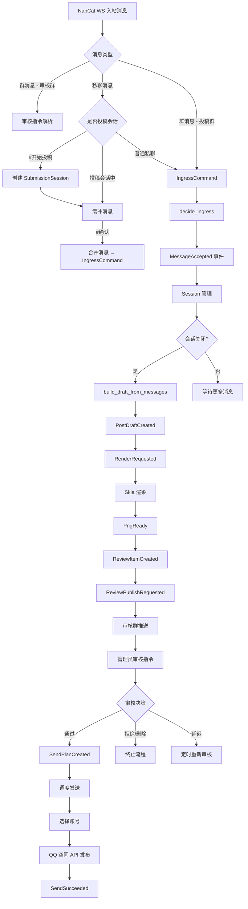
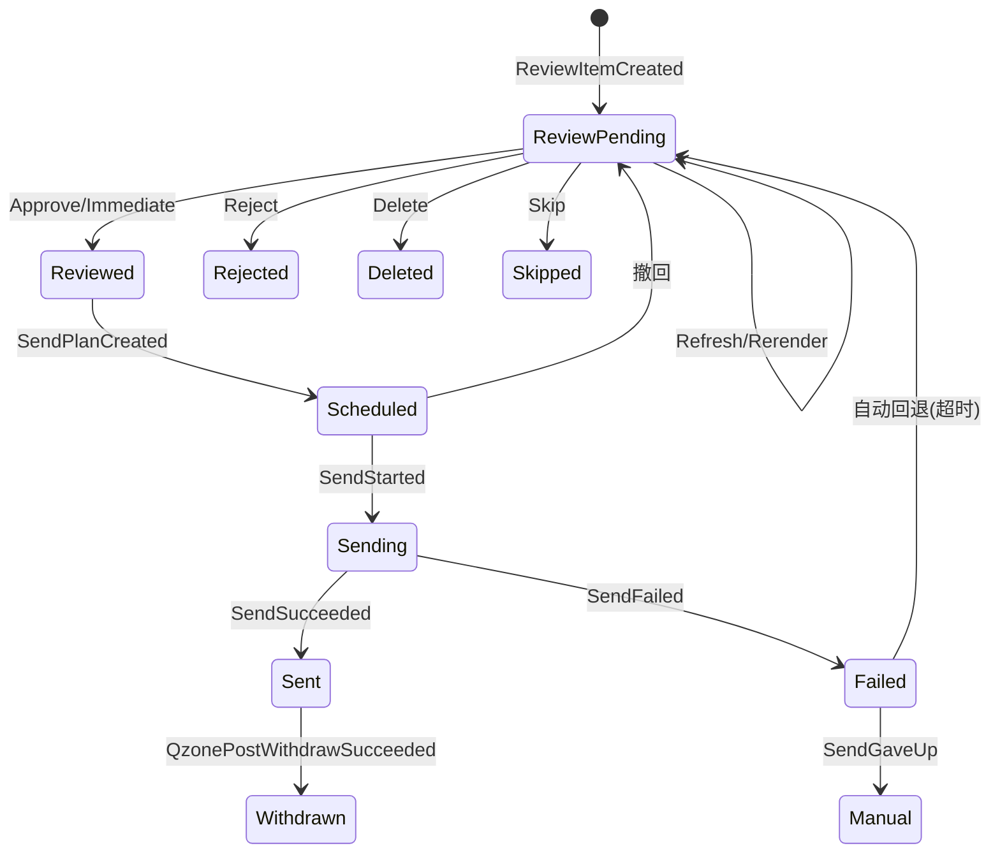

本文档详细阐述 OQQWall_rust 中投稿从接收到最终发布至 QQ 空间的完整处理流水线。系统采用**事件溯源架构**，投稿经历消息接收、会话聚合、草稿构建、渲染、审核、调度发送六个核心阶段，每个阶段的状态变更均以不可变事件记录。

## 整体架构概览

投稿处理流程涉及 `core`、`drivers` 两个 crate 的多个模块协作。核心决策逻辑位于 `decide` 模块，状态还原逻辑位于 `reduce` 模块，IO 驱动层（NapCat WebSocket、QQ 空间 API、Skia 渲染器）则在 `drivers` crate 中实现。

Sources: [decide/mod.rs](crates/core/src/decide/mod.rs#L1-L28), [napcat.rs](crates/drivers/src/napcat.rs#L2020-L2050), [state.rs](crates/core/src/state.rs#L39-L53)

## 阶段一：消息接收与入站

投稿消息通过两条路径进入系统：**群消息直发**和**私聊投稿会话**。NapCat WebSocket 驱动负责解析 OneBot 协议消息并转换为核心层 `IngressCommand`。

### 群消息直发

当用户在投稿群中直接发送消息时，NapCat 驱动提取消息内容（文本 + 附件），生成 `IngressCommand` 提交至决策引擎。群消息路径会跳过审核群（`mangroupid`）的消息，仅处理非审核群的投稿内容。消息接收后，系统通过 `derive_ingress_id` 基于 `(profile_id, chat_id, user_id, platform_msg_id)` 生成唯一 ID，用于去重。

Sources: [napcat.rs](crates/drivers/src/napcat.rs#L2073-L2075), [ids.rs](crates/core/src/ids.rs#L44-L48)

### 私聊投稿会话

私聊投稿支持更灵活的多消息聚合模式。用户发送 `#开始投稿` 触发会话创建，系统初始化 `SubmissionSession` 并提示用户发送内容。会话期间，每条消息被缓冲至 `messages` 向量中。用户可通过以下指令控制会话：

| 指令 | 作用 |
|------|------|
| `#开始投稿` | 创建投稿会话，开始缓冲消息 |
| `#结束投稿` | 暂停接收，提示确认/追加/取消 |
| `#确认` | 将所有缓冲消息合并为单条 `IngressCommand`（`close_immediately: true`） |
| `#追加` | 返回继续接收模式 |
| `#取消` | 丢弃会话 |

合并时，系统将所有消息的文本用 `\n\n` 拼接，附件收集至统一列表，生成合成的 `chat_id`（格式：`{user_id}_submission_{started_at_ms}`）以创建独立会话。

Sources: [napcat.rs](crates/drivers/src/napcat.rs#L2489-L2610), [napcat.rs](crates/drivers/src/napcat.rs#L196-L203)

### 入站决策逻辑

`decide_ingress` 函数处理所有入站消息，执行以下检查：

1. **去重检查**：若 `ingress_id` 已存在于 `ingress_seen` 集合，生成 `MessageIgnored(Duplicate)` 事件
2. **黑名单检查**：若 `(group_id, user_id)` 在黑名单中，生成 `MessageIgnored(Blacklisted)` 事件
3. **会话归属**：通过 `SessionKey { chat_id, user_id, group_id }` 查找已有会话。若存在，生成 `SessionAppended`；否则创建新会话 `SessionOpened`
4. **媒体获取**：对附件中的远程 URL 生成 `MediaFetchRequested` 事件（`data:` 协议的内联数据除外）

会话的 `close_at_ms` 由 `process_waittime_ms` 配置决定，同时考虑用户的输入状态（正在输入/正在说话）以动态延长聚合窗口。

Sources: [decide/ingress.rs](crates/core/src/decide/ingress.rs#L7-L115)

## 阶段二：会话聚合与草稿构建

### 会话关闭判定

`decide_tick` 中的 `close_due_sessions` 函数在每个定时 tick 中检查是否有会话到达关闭时间。关闭判定逻辑考虑三个因素：

- **最后消息时间**：会话中最后一条消息的接收时间
- **聚合等待时间**：`process_waittime_ms` 配置值（可按组覆盖）
- **输入状态**：若用户处于 `Typing` 或 `Speaking` 状态，会话保持活跃；但若活跃状态超过 30 分钟（`INPUT_STATUS_ACTIVE_MAX_MS`），则强制关闭

对于私聊投稿会话（`close_immediately: true`），会话在确认时立即关闭。

Sources: [decide/tick.rs](crates/core/src/decide/tick.rs#L32-L95)

### Draft 构建

会话关闭时，`build_draft_from_messages` 将所有关联消息转换为结构化的 `Draft`。`Draft` 由 `DraftBlock` 序列组成，支持以下块类型：

| 块类型 | 说明 | 来源 |
|--------|------|------|
| `Paragraph` | 文本段落 | 消息文本 |
| `Attachment` | 媒体附件（图片/视频/文件/音频/贴纸） | 消息附件 |
| `Reply` | 回复引用（含预览） | `[[reply:...]]` 标记 |
| `Poke` | 戳一戳 | `[[poke]]` 标记 |
| `JsonCard` | JSON 卡片 | `[[jsoncard:...]]` 标记 |
| `Forward` | 合并转发 | `[[forward:...]]` 标记 |

文本解析器逐字符扫描，遇到 `[[` 前缀时尝试匹配特殊标记（Base64 编码的有效载荷），否则累积为普通文本段落。多个消息的块按顺序拼接。

Sources: [decide/builder.rs](crates/core/src/decide/builder.rs#L1-L55), [draft.rs](crates/core/src/draft.rs#L7-L27)

### 匿名检测与安全检测

草稿构建同时触发两项自动检测：

**匿名检测** (`detect_anonymous`)：基于正则表达式匹配最近 12 条消息中的关键词。正面模式包括"匿名"、"打码"、"马赛克"等；负面模式包括"不用匿名"、"直接发"等。检测结果存储于 `PostMeta.is_anonymous`，审核时可手动切换。

**安全检测** (`detect_safe`)：检查消息中是否包含不当内容关键词（脏话、敏感政治词汇等）。若检测到不安全内容，`PostMeta.is_safe` 设为 `false`。

Sources: [anonymous.rs](crates/core/src/anonymous.rs#L1-L147), [safety.rs](crates/core/src/safety.rs#L1-L80)

## 阶段三：渲染管线

### 渲染请求与执行

`PostDraftCreated` 事件后，系统立即生成 `RenderRequested` 事件，将投稿状态推进至 `RenderRequested`。渲染驱动（`renderer.rs`）监听此事件，基于 Skia 引擎将 `Draft` 渲染为 PNG 图像。

渲染过程处理以下元素：
- 文本段落（支持 PingFang SC 字体、Emoji、QQ 表情）
- 图片附件（内联或远程获取）
- 回复引用（嵌套气泡样式）
- 合并转发（递归展开，最大深度 4 层）
- 视频/文件/音频卡片
- JSON 卡片（含二维码）

渲染产物存储为 Blob，支持单图或多图模式（`PngReady` / `PngBatchReady`）。

Sources: [renderer.rs](crates/drivers/src/renderer.rs#L1-L100), [reduce/mod.rs](crates/core/src/reduce/mod.rs#L300-L350)

### 渲染失败重试

若渲染失败，系统记录错误并设置 `retry_at_ms`。后续 tick 中 `retry_failed_renders` 函数检测到重试时间到达后，重新生成 `RenderRequested` 事件。投稿状态回退至 `Failed` 直到渲染成功。

Sources: [decide/tick.rs](crates/core/src/decide/tick.rs#L160-L180)

## 阶段四：审核流程

### 审核项创建与发布

渲染成功后，`decide_driver_event` 检测到 `PngReady`/`PngBatchReady` 事件，自动创建 `ReviewItemCreated` 事件。此时投稿进入 `ReviewPending` 阶段，分配唯一的 `review_code`（审核编号）。

审核发布流程生成包含以下内容的审核消息：
- 摘要文本：`#<review_code> 来自 <昵称>(<QQ>)`
- 消息概览：逐条列出文本内容，多媒体以 `[图片]`/`[视频]`/`[文件]`/`[合并转发]` 提示
- 渲染 PNG 图像
- 原始图片附件（便于放大查看）

审核消息发送至配置的审核群（`mangroupid`），通过 NapCat 的 `send_group_msg` API 实现。发送失败时按指数退避重试（5s → 60s 上限）。

Sources: [decide/driver.rs](crates/core/src/decide/driver.rs#L35-L70), [command.md](docs/command.md#L1-L50)

### 审核指令体系

管理员可通过两种方式执行审核指令：

1. **@机器人 + 编号 + 指令**：`@机器人 123 是`
2. **回复审核消息 + 指令**：回复审核消息，仅输入 `是`

核心审核指令及其效果：

| 指令 | 决策 | 后续行为 |
|------|------|----------|
| `是` (Approve) | Approved | 分配外部编号，创建 SendPlan（Normal 优先级） |
| `立即` (Immediate) | Approved | 分配外部编号，创建 SendPlan（High 优先级），触发 GroupFlush |
| `否` (Skip) | Skipped | 分配外部编号，取消发送计划 |
| `拒` (Reject) | Rejected | 通知投稿人，取消发送计划 |
| `删` (Delete) | Deleted | 分配外部编号，取消发送计划 |
| `等` (Defer) | Deferred | 延迟 180 秒后重新发布审核 |
| `匿` (ToggleAnonymous) | - | 切换匿名状态，重新渲染并发布 |
| `刷新` (Refresh) | - | 从原始消息重建草稿，重新渲染 |
| `重渲染` (Rerender) | - | 保持草稿不变，重新渲染 |
| `消息全选` (SelectAllMessages) | - | 使用所有消息重建草稿 |
| `合并 <code>` (Merge) | - | 合并同一投稿人的两条稿件 |
| `拉黑` (Blacklist) | - | 将投稿人加入黑名单 |

Sources: [decide/review.rs](crates/core/src/decide/review.rs#L18-L200), [command.rs](crates/core/src/command.rs#L60-L90)

### 审核决策状态转换

Sources: [state.rs](crates/core/src/state.rs#L39-L53), [reduce/mod.rs](crates/core/src/reduce/mod.rs#L500-L560)

## 阶段五：发送调度

### 发送计划创建

审核通过后，`build_send_plan_events` 根据配置创建 `SendPlanCreated` 事件。调度逻辑考虑以下因素：

- **发送时间窗口** (`send_windows`)：限制每日可发送的时间段
- **最小间隔** (`min_interval_ms`)：同组连续发送的最小间隔
- **队列深度** (`max_queue`)：暂存区上限。`max_queue > 1` 时启用堆叠模式，稿件在暂存区中积累
- **图片数量限制** (`max_image_number_one_post`)：单条说说最大图片数
- **队列溢出**：当队列深度或图片数达到上限时，触发 GroupFlush 立即发送所有暂存内容

堆叠模式下，通过的稿件获得 `STACKING_HOLD_MS`（约 1 年）的 `not_before_ms`，使其停留在暂存区等待 flush。非堆叠模式（`max_queue == 1`）下，稿件按时间窗口和最小间隔计算发送时间。

Sources: [decide/review.rs](crates/core/src/decide/review.rs#L280-L370), [decide/scheduler.rs](crates/core/src/decide/scheduler.rs#L1-L98)

### 定时 Flush 与手动 Flush

系统支持两种 flush 触发方式：

1. **定时 Flush**：`send_schedule` 配置每日触发时间点（格式 `HH:MM`），tick 函数在匹配的分钟触发 `GroupFlushRequested`
2. **手动 Flush**：管理员执行 `发送暂存区` 或 `立即` 指令时触发

Flush 操作将所有暂存区稿件的 `not_before_ms` 更新为当前时间，使其立即可发送。

Sources: [decide/tick.rs](crates/core/src/decide/tick.rs#L220-L250), [decide/flush.rs](crates/core/src/decide/flush.rs#L1-L29)

### 账号选择

`choose_account` 函数从配置的账号列表中选择最佳发送账号。选择策略：

1. 跳过已禁用的账号
2. 跳过处于冷却期的账号（`cooldown_until_ms`）
3. 选择 `last_send_ms` 最早的账号（负载均衡）
4. 若所有账号均不可用，返回最早冷却结束时间或 Unavailable

同一时间仅允许一个发送任务（`state.sending` 非空时跳过）。

Sources: [decide/sender.rs](crates/core/src/decide/sender.rs#L1-L84)

## 阶段六：QQ 空间发布

### 发送执行

QZone 驱动监听 `SendStarted` 事件，执行以下流程：

1. 准备渲染 PNG 和原始图片
2. 调用 QQ 空间图片上传 API（`upload_image`）上传图片，支持 JPEG 压缩自适应（质量 90→50 逐步降级）
3. 调用 `emotion_cgi_publish_v6` API 发布说说
4. 发布成功后生成 `SendSucceeded` 事件，记录 `remote_id`（QQ 空间动态 ID）

发布内容包含渲染 PNG 和可选的原始图片（由 `individual_image_in_posts` 配置控制）。非匿名且空间不可访问的投稿人可选 @提及（由 `at_unprived_sender` 配置控制）。

Sources: [qzone.rs](crates/drivers/src/qzone.rs#L1-L100)

### 发送失败处理

发送失败时，系统根据错误类型采取不同策略：

| 错误类型 | 处理方式 |
|----------|----------|
| 超时错误 | 立即回退至 ReviewPending，重新发布审核消息 |
| 网络错误 | 按 `retry_at_ms` 重新调度，最多 `send_max_attempts` 次 |
| 达到最大重试 | 生成 `SendGaveUp`，进入 Manual 状态，需人工介入 |
| 风控错误 | 记录账号冷却时间，切换账号重试 |

Sources: [decide/driver.rs](crates/core/src/decide/driver.rs#L80-L120)

### 撤回机制

已发布的说说可通过 `撤回` 指令撤回。系统调用 `emotion_cgi_update` API 更新原动态，移除对应稿件的图片并追加 `#<外部编号> [已删除]` 标记。撤回成功后，投稿状态转为 `Withdrawn`。

Sources: [decide/global.rs](crates/core/src/decide/global.rs#L250-L354)

## 状态模型

### PostStage 状态机

投稿的完整生命周期由 `PostStage` 枚举定义：

| 阶段 | 含义 | 触发事件 |
|------|------|----------|
| `Drafted` | 草稿已创建 | `PostDraftCreated` |
| `RenderRequested` | 已请求渲染 | `RenderRequested` |
| `Rendered` | 渲染完成 | `PngReady` / `PngBatchReady` |
| `ReviewPending` | 等待审核 | `ReviewItemCreated` / `ReviewPublishRequested` |
| `Reviewed` | 审核通过 | `ReviewDecisionRecorded(Approved)` |
| `Scheduled` | 已排入发送队列 | `SendPlanCreated` |
| `Sending` | 正在发送 | `SendStarted` |
| `Sent` | 已发送 | `SendSucceeded` |
| `Rejected` | 已拒绝 | `ReviewDecisionRecorded(Rejected)` |
| `Deleted` | 已删除 | `ReviewDecisionRecorded(Deleted)` |
| `Skipped` | 已跳过 | `ReviewDecisionRecorded(Skipped)` |
| `Failed` | 发送/渲染失败 | `SendFailed` / `RenderFailed` |
| `Manual` | 需人工介入 | `SendGaveUp` / `ManualInterventionRequired` |
| `Withdrawn` | 已撤回 | `QzonePostWithdrawSucceeded` |

Sources: [state.rs](crates/core/src/state.rs#L39-L53)

### 核心数据模型

系统通过 `StateView` 维护全局状态快照，关键数据结构包括：

- **IngressMeta**：入站消息元数据（发送者、群组、时间戳）
- **SessionMeta**：会话元数据（会话 ID、关联消息列表、关闭时间）
- **Draft**：结构化草稿（`DraftBlock` 序列）
- **PostMeta**：投稿元数据（阶段、审核 ID、匿名标志、安全标志）
- **RenderMeta**：渲染元数据（PNG Blob ID、重试状态）
- **ReviewMeta**：审核元数据（决策、审核消息 ID、延迟时间）
- **SendPlan**：发送计划（优先级、发送时间、序列号）

所有状态变更通过 `reduce` 函数从事件流中重建，保证状态的可审计性和可恢复性。

Sources: [state.rs](crates/core/src/state.rs#L200-L329), [reduce/mod.rs](crates/core/src/reduce/mod.rs#L1-L50)

## 外部编号与审核编号

系统维护两套编号体系：

- **review_code**（审核编号）：系统内部编号，从 1 递增，仅用于审核流程。每个投稿分配唯一编号，审核群中以 `#<review_code>` 展示
- **external_code**（外部编号）：对外展示编号，与账号组绑定递增。审核通过/跳过/删除时分配，用于 QQ 空间说说的可见标识

`撤回` 指令会回滚外部编号：被撤回稿件之后的所有稿件编号减 1，全局编号计数器同步调整。

Sources: [decide/review.rs](crates/core/src/decide/review.rs#L400-L430), [decide/global.rs](crates/core/src/decide/global.rs#L250-L354)

## 阅读建议

理解投稿处理流程后，可根据兴趣深入以下主题：

- **[审核指令系统](6-shen-he-zhi-ling-xi-tong)**：了解完整的指令语法、权限模型和快捷指令 DSL
- **[事件溯源架构](9-shi-jian-su-yuan-jia-gou)**：深入事件驱动设计和状态重建机制
- **[指令决策引擎](11-zhi-ling-jue-ce-yin-qing)**：理解 `decide` 函数的纯函数设计和命令分发逻辑
- **[Skia 渲染引擎](12-skia-xuan-ran-yin-qing)**：了解 PNG 渲染的排版算法和资源管理
- **[NapCat OneBot 集成](15-napcat-onebot-ji-cheng)**：深入了解消息收发和 WebSocket 协议处理
- **[QQ空间发送机制](16-qqkong-jian-fa-song-ji-zhi)**：了解图片上传、说说发布和撤回的 API 细节