OQQWall_RUST 是一个采用**事件溯源（Event Sourcing）**和**函数式核心/命令式外壳（Functional Core / Imperative Shell）**架构的 QQ 校园墙自动运营系统。本文档将深入剖析其分层架构设计、核心数据流、状态管理机制以及各模块的职责边界，帮助开发者从宏观到微观全面理解系统的工作原理。

## 整体架构概览

系统采用经典的 **Functional Core / Imperative Shell** 模式，将业务逻辑（纯函数）与副作用（IO 操作）严格分离。这种架构确保了核心逻辑的可测试性、可重放性和幂等性，同时为未来的集群扩展预留了清晰的边界。

```mermaid
graph TB
    subgraph "Imperative Shell（命令式外壳）"
        A[NapCat WebSocket<br/>OneBot 协议接入]
        B[MediaFetcher<br/>媒体下载器]
        C[Renderer<br/>Skia 渲染引擎]
        D[QzoneSender<br/>QQ空间发送器]
        E[WebView<br/>Web审核界面]
        F[HTTP API<br/>RESTful接口]
        G[LocalJournal<br/>追加写日志]
        H[SnapshotStore<br/>快照存储]
    end
    
    subgraph "Functional Core（函数式核心）"
        I[Command<br/>命令输入]
        J[Decider<br/>决策器：(State, Cmd) → Events]
        K[Reducer<br/>状态归约：(State, Event) → State']
        L[StateView<br/>内存状态视图]
        M[Event<br/>事件定义]
    end
    
    A -->|Command| I
    I --> J
    J -->|Events| K
    K -->|StateView'| L
    L -->|查询| C
    L -->|查询| D
    L -->|查询| E
    L -->|查询| F
    
    J -->|Events| G
    G -->|恢复| K
    H -->|快照| L
```

**架构设计原则**：
- **纯函数决策**：所有业务决策由 `(StateView, Command) → Vec<Event>` 纯函数完成，无 IO、无副作用
- **状态归约**：状态通过 `(StateView, Event) → StateView'` 纯函数累积，确保可重放
- **请求-响应对称**：所有需要 IO 返回值的操作采用 `Requested → Ready/Failed` 事件对
- **单线程串行引擎**：避免锁和竞态，保证可重放一致性

Sources: [dev_guide.md](docs/dev_guide.md#L1-L100), [engine.rs](crates/app/src/engine.rs#L1-L100)

## Workspace 模块划分

项目采用 Cargo workspace 组织，最终编译为单一二进制。这种结构既保证了模块间的隔离性，又实现了部署的简洁性。

| Crate | 职责 | 核心依赖 | 关键特征 |
|-------|------|----------|----------|
| **core** | 纯函数核心：事件、状态、决策器、归约器 | blake3, serde | 零 IO 依赖，可独立测试 |
| **infra** | 基础设施：追加写日志、快照存储 | bincode, crc32fast | 本地持久化，写多读少 |
| **drivers** | 副作用执行器：渲染、NapCat、QQ空间 | skia-safe, tokio-tungstenite | IO 密集，异步执行 |
| **app** | 应用入口：引擎、Web API、WebView、TUI | axum, ratatui | 依赖注入，任务编排 |
| **telemetry-collector** | 遥测服务端：采集审核数据 | - | 独立部署，可选组件 |

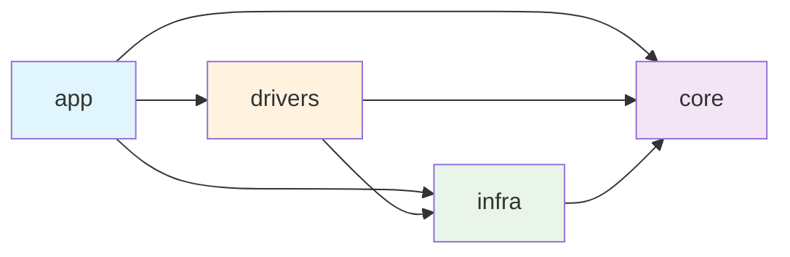

**依赖约束**：
- `core` 不依赖任何 IO 库（tokio、reqwest 等）
- `infra` 仅依赖 `core`，不依赖 `drivers`
- `drivers` 同时依赖 `core` 和 `infra`
- `app` 依赖所有其他 crate，负责组装

Sources: [Cargo.toml](Cargo.toml#L1-L16), [crates/core/Cargo.toml](crates/core/Cargo.toml#L1-L13), [crates/infra/Cargo.toml](crates/infra/Cargo.toml#L1-L11)

## 核心数据流

系统的数据流遵循严格的单向流动模式：**Command → Events → StateView**。引擎（Engine）作为唯一的事件生产者和消费者，确保了状态变更的串行性和可重放性。

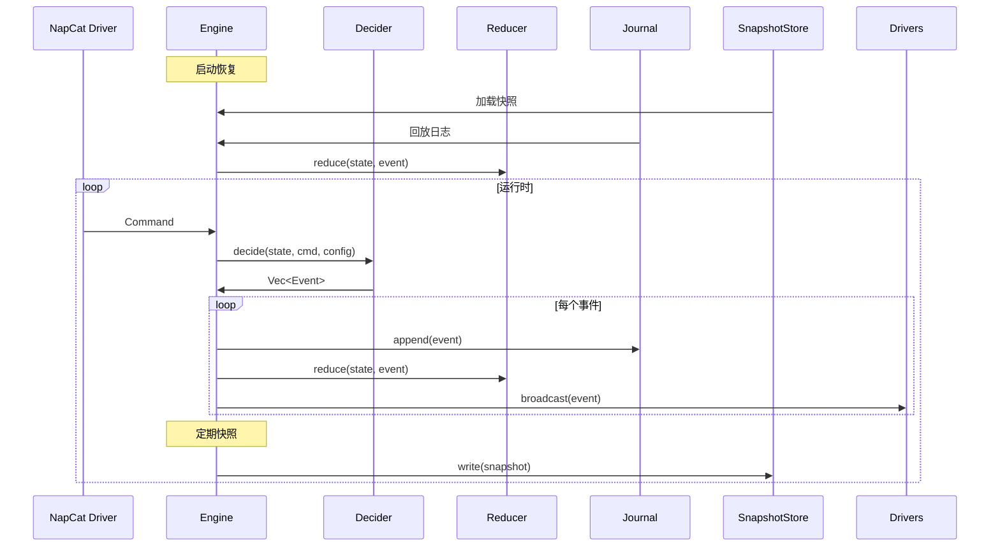

**数据流关键路径**：
1. **入站消息**：NapCat Driver → `IngressCommand` → `decide_ingress()` → `MessageAccepted` + `SessionOpened/Appended`
2. **成稿决策**：TickCommand → `decide_tick()` → `PostDraftCreated`（时间窗口聚合）
3. **渲染流程**：`PostDraftCreated` → Renderer → `RenderRequested` → `PngReady`
4. **审核发布**：`PngReady` → NapCat Driver → `ReviewPublishRequested` → `ReviewPublished`
5. **指令处理**：审核群消息 → `ReviewActionCommand` → `decide_review_action()` → `ReviewDecisionRecorded`
6. **排程发送**：TickCommand → `decide_tick()` → `SendPlanCreated` → QzoneSender → `SendSucceeded`

Sources: [engine.rs](crates/app/src/engine.rs#L100-L200), [decide/mod.rs](crates/core/src/decide/mod.rs#L1-L28), [reduce/mod.rs](crates/core/src/reduce/mod.rs#L1-L100)

## 事件溯源架构

系统采用事件溯源作为核心状态管理策略。所有状态变更都以不可变事件的形式追加写入日志，状态通过回放事件序列重建。这种设计天然支持崩溃恢复、审计追踪和未来的集群复制。

### 事件类型体系

事件采用层次化的枚举结构，每种事件类型对应系统中的一个聚合边界：

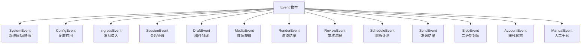

**事件命名约定**：
- `XxxRequested`：请求执行某操作
- `XxxReady` / `XxxSucceeded`：操作成功完成
- `XxxFailed`：操作失败（含重试信息）
- `XxxCreated`：实体创建
- `XxxUpdated`：实体状态更新

**请求-响应对称原则**：任何需要 IO 返回值的操作（如 `audit_msg_id`、`qzone_post_id`、`blob_id`）必须拆分为 `Requested → Ready/Failed` 事件对，确保 Decider 保持纯函数特性。

Sources: [event.rs](crates/core/src/event.rs#L1-L100), [event.rs](crates/core/src/event.rs#L200-L300)

### 确定性 ID 派生

系统使用 Blake3 哈希算法派生实体 ID，确保相同输入始终产生相同 ID。这是实现幂等性和可重放性的关键基础：

| ID 类型 | 派生输入 | 用途 |
|---------|----------|------|
| `IngressId` | `profile_id + chat_id + user_id + platform_msg_id` | 消息去重 |
| `SessionId` | `chat_id + user_id + first_ingress_id` | 会话聚合 |
| `PostId` | `session_id` | 稿件标识 |
| `ReviewId` | `post_id` | 审核记录 |
| `BlobId` | `内容哈希` | 二进制对象去重 |

```rust
// 示例：IngressId 派生
let ingress_id = derive_ingress_id(&[
    cmd.profile_id.as_bytes(),
    cmd.chat_id.as_bytes(),
    cmd.user_id.as_bytes(),
    cmd.platform_msg_id.as_bytes(),
]);
```

Sources: [ids.rs](crates/core/src/ids.rs#L1-L86)

## StateView 内存状态视图

`StateView` 是系统的核心内存数据结构，包含所有业务实体的状态索引。它是事件回放的产物，也是所有查询的数据源。运行期所有业务查询都只读 `StateView`，不直接访问磁盘。

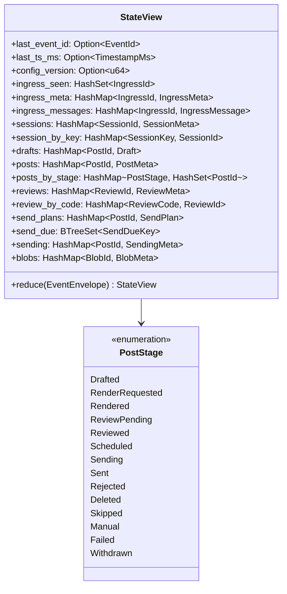

**核心索引说明**：
- `ingress_seen`：消息去重集合，防止重复处理
- `session_by_key`：按 `(chat_id, user_id, group_id)` 快速查找会话
- `posts_by_stage`：按状态分组的稿件集合，便于批量查询
- `review_by_code`：审核码到审核记录的映射，支持指令查找
- `send_due`：按发送时间排序的发送队列，支持优先级调度

**状态机转换**：

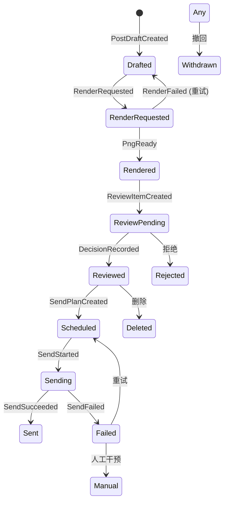

Sources: [state.rs](crates/core/src/state.rs#L200-L329), [reduce/mod.rs](crates/core/src/reduce/mod.rs#L1-L200)

## 决策器（Decider）设计

决策器是系统的"大脑"，负责根据当前状态和输入命令产生事件。所有决策逻辑都是纯函数，不依赖任何 IO 操作，确保了可测试性和确定性。

### 决策器入口

```rust
pub fn decide(state: &StateView, command: &Command, config: &CoreConfig) -> Vec<Event> {
    match command {
        Command::Ingress(cmd) => ingress::decide_ingress(state, cmd, config),
        Command::Tick(cmd) => tick::decide_tick(state, cmd, config),
        Command::ReviewAction(cmd) => review::decide_review_action(state, cmd, config),
        Command::ReviewActionBatch(cmd) => review::decide_review_action_batch(state, cmd, config),
        Command::GlobalAction(cmd) => global::decide_global_action(state, cmd, config),
        Command::GlobalActionBatch(cmd) => global::decide_global_action_batch(state, cmd, config),
        Command::DriverEvent(event) => driver::decide_driver_event(state, event, config),
    }
}
```

### 命令类型

| 命令类型 | 来源 | 职责 |
|----------|------|------|
| `IngressCommand` | NapCat Driver | 处理入站消息，创建会话 |
| `TickCommand` | 定时器（每秒） | 时间驱动决策：关闭会话、重试、发送 |
| `ReviewActionCommand` | 审核群指令 | 处理审核决策：通过/拒绝/延后 |
| `GlobalActionCommand` | 全局指令 | 管理操作：召回/黑名单/队列管理 |
| `DriverEvent` | 驱动层 | 处理 IO 结果：渲染完成/发送成功 |

### 决策逻辑示例：入站消息处理

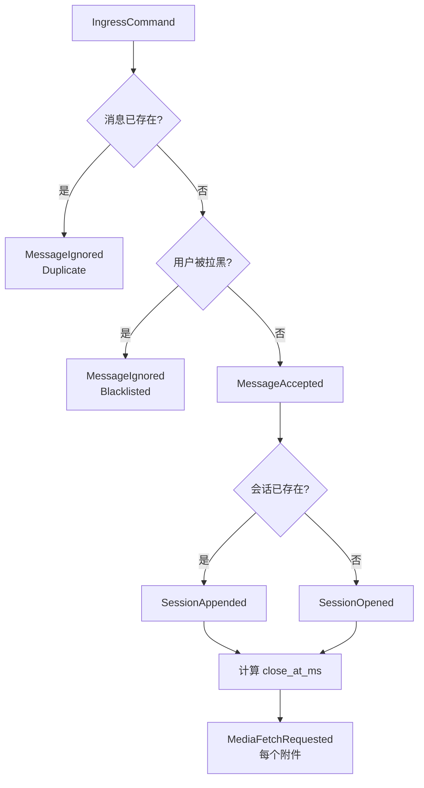

**关键设计点**：
- **幂等性**：通过 `ingress_seen` 集合实现消息去重
- **确定性 ID**：相同输入产生相同 `IngressId` 和 `SessionId`
- **时间窗口聚合**：通过 `close_at_ms` 实现投稿聚合，支持输入状态（typing）影响

Sources: [decide/mod.rs](crates/core/src/decide/mod.rs#L1-L28), [decide/ingress.rs](crates/core/src/decide/ingress.rs#L1-L50)

## 基础设施层（Infra）

基础设施层提供本地持久化能力，包括追加写日志（Journal）和快照存储（Snapshot）。这是系统实现崩溃恢复的关键组件。

### 追加写日志（LocalJournal）

日志采用分段文件（Segment）结构，每个记录包含长度头、CRC32 校验和和序列化的事件载荷。这种设计兼顾了写入性能和数据完整性。

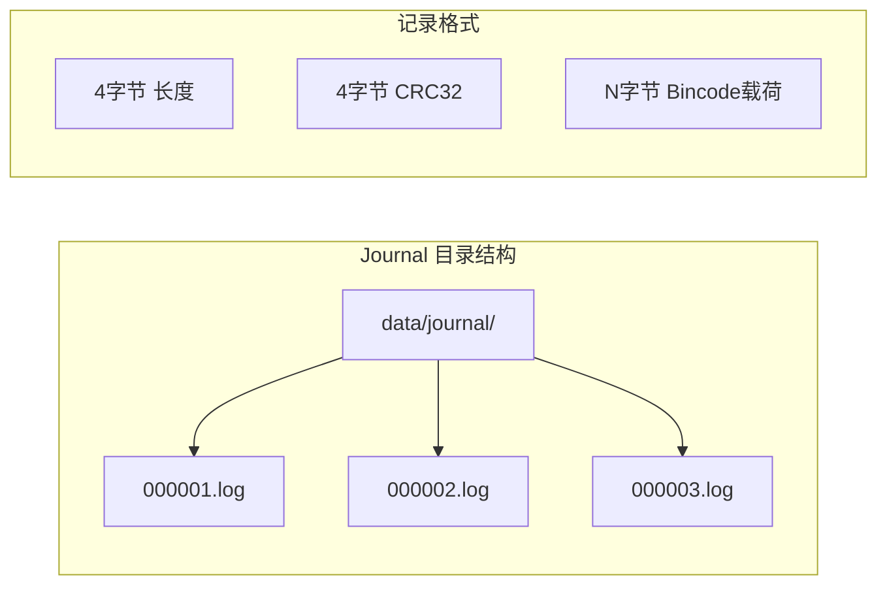

**日志配置参数**：

| 参数 | 默认值 | 说明 |
|------|--------|------|
| `segment_size_bytes` | 64 MB | 单个日志段最大大小 |
| `flush_bytes` | 256 KB | 累积写入量触发 flush |
| `flush_interval` | 50 ms | 时间间隔触发 flush |
| `max_record_bytes` | 16 MB | 单条记录最大大小 |

**恢复策略**：
1. 加载最新快照，获取 `journal_cursor`
2. 从 cursor 位置回放后续日志
3. 检测到损坏时截断尾部，丢弃损坏数据
4. 完整回放后重建 `StateView`

### 快照存储（SnapshotStore）

快照定期保存完整的 `StateView` 状态，避免每次都从头回放所有日志。快照采用原子写入（写临时文件 + rename）确保一致性。

**快照触发条件**：
- 距离上次快照超过 1000 个事件
- 距离上次快照超过 5 分钟

Sources: [journal.rs](crates/infra/src/journal.rs#L1-L100), [snapshot.rs](crates/infra/src/snapshot.rs#L1-L92)

## 驱动层（Drivers）

驱动层负责所有 IO 密集型操作，包括 NapCat WebSocket 通信、媒体下载、Skia 渲染和 QQ 空间发送。每个驱动都是独立的异步任务，通过事件总线（broadcast channel）与引擎通信。

### 驱动架构

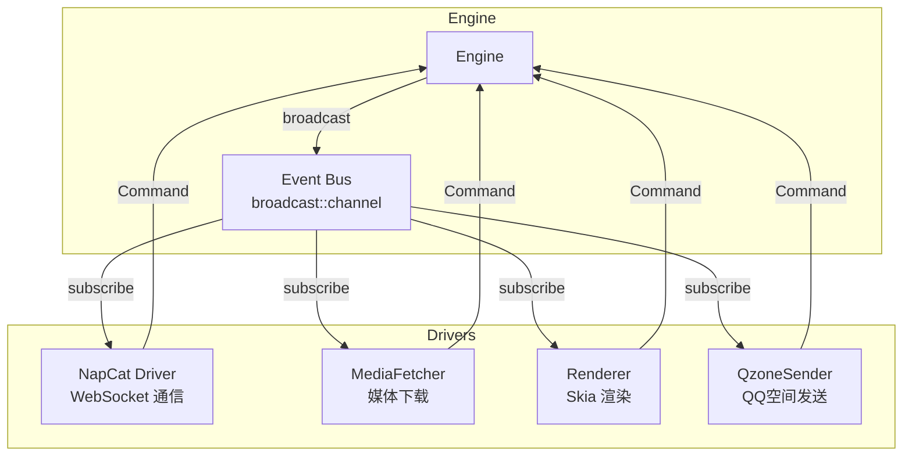

**驱动工作模式**：
1. 订阅事件总线，监听感兴趣的事件
2. 收到 `Requested` 事件后执行 IO 操作
3. 将结果封装为 `Command::DriverEvent` 发送给引擎
4. 引擎通过决策器产生 `Ready/Failed` 事件

### NapCat Driver

NapCat Driver 负责与 NapCat（QQ 机器人框架）的 WebSocket 通信，实现 OneBot 协议的消息收发。它处理：
- 消息接收与解析（文本、图片、视频、文件、表情包）
- 审核群指令解析（通过/拒绝/延后等）
- 审核消息发布（预览图 + 操作按钮）
- 好友请求处理
- 历史消息同步

Sources: [napcat.rs](crates/drivers/src/napcat.rs#L1-L150), [connect.rs](crates/app/src/connect.rs#L1-L100)

### Renderer（Skia 渲染引擎）

渲染器使用 Skia 图形库将稿件渲染为 PNG 图片，用于审核预览和最终发送。它支持：
- 多种消息类型排版（文本、图片、视频、文件、表情包、回复、合并转发）
- 中英文混排、Emoji 渲染
- 头像获取与缓存
- 水印添加
- JSON 卡片渲染
- 二维码生成

**渲染配置**：

| 参数 | 默认值 | 说明 |
|------|--------|------|
| `canvas_width_px` | 1152 | 画布宽度 |
| `max_height_px` | 6912 | 最大高度限制 |
| 字体 | PingFang SC | 苹方字体 |

Sources: [renderer.rs](crates/drivers/src/renderer.rs#L1-L150)

### QzoneSender（QQ空间发送器）

发送器负责将审核通过的稿件发布到 QQ 空间，支持：
- 多账号轮换发送
- 图片上传与压缩（JPEG 渐进式压缩）
- 发送窗口调度
- 失败重试与账号冷却
- 说说编辑与撤回
- 并发帖子合并发送

**发送流程**：

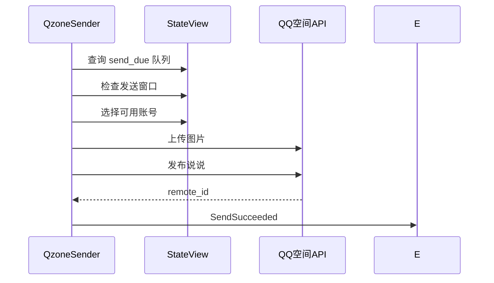

Sources: [qzone.rs](crates/drivers/src/qzone.rs#L1-L150)

### MediaFetcher（媒体下载器）

媒体下载器负责将消息中的远程 URL 附件下载到本地 blob 存储，支持：
- 多种媒体类型（图片、视频、文件、音频、表情包）
- 失败重试（最多 3 次）
- 超时控制（15 秒）
- 头像缓存

Sources: [media_fetcher.rs](crates/drivers/src/media_fetcher.rs#L1-L100)

## 应用层（App）

应用层是系统的入口，负责组装所有组件、启动异步任务和提供用户接口。

### 引擎（Engine）

引擎是系统的核心协调者，采用单线程串行处理模式，确保状态变更的确定性和可重放性。

```rust
pub struct Engine {
    state: StateView,              // 内存状态
    config: CoreConfig,            // 核心配置
    cmd_rx: mpsc::Receiver<Command>, // 命令接收
    bus: broadcast::Sender<EventEnvelope>, // 事件总线
    journal: LocalJournal,         // 日志存储
    snapshot: SnapshotStore,       // 快照存储
    shared_state: Arc<RwLock<StateView>>, // 共享状态（供查询）
}
```

**引擎主循环**：
1. 从命令通道接收 `Command`
2. 调用 `decide()` 产生事件
3. 将事件追加到日志
4. 通过 Reducer 更新状态
5. 广播事件到驱动层
6. 定期创建快照

### 启动流程

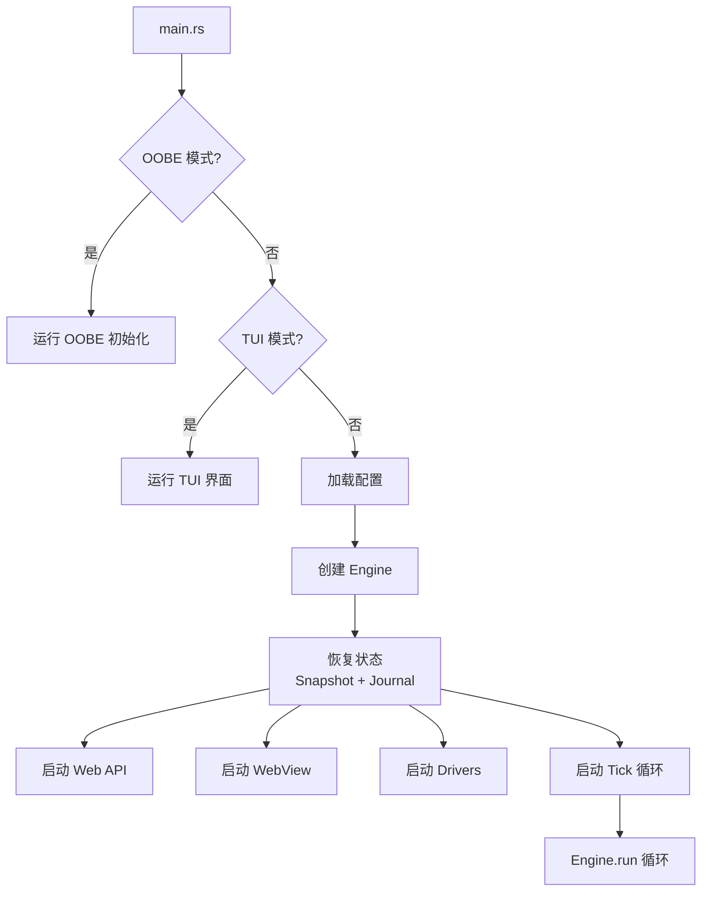

**启动恢复流程**：
1. 加载最新快照，恢复 `StateView` 和 `journal_cursor`
2. 从 cursor 位置回放后续日志
3. 检测并修复日志损坏
4. 完成状态恢复，开始处理新命令

Sources: [main.rs](crates/app/src/main.rs#L1-L145), [engine.rs](crates/app/src/engine.rs#L1-L247)

### Web API

系统提供 RESTful HTTP API，支持外部系统集成和自动化操作。API 包含：
- 认证与会话管理（Token + Session）
- 稿件列表与详情查询
- 稿件创建与审核操作
- 黑名单管理
- 快捷回复管理

Sources: [web_api.rs](crates/app/src/web_api.rs#L1-L200)

### WebView 审核界面

WebView 提供基于浏览器的审核界面，支持：
- 稿件列表浏览与筛选
- 预览图展示
- 审核操作（通过/拒绝/延后）
- 审计日志查看
- 角色权限管理

Sources: [webview.rs](crates/app/src/webview.rs#L1-L100)

## 配置系统

系统采用分层配置设计，支持全局默认值和分组覆盖。配置通过 YAML/JSON 文件加载，支持运行时热更新。

### 核心配置结构

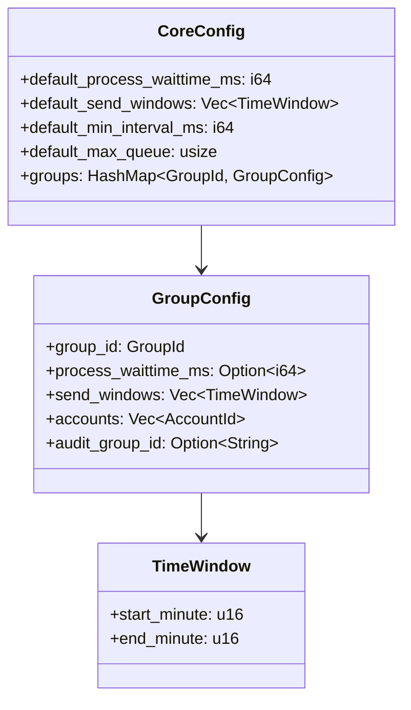

**配置优先级**：分组配置 > 全局默认值

Sources: [config.rs](crates/core/src/config.rs#L1-L87)

## 测试策略

项目采用多层次测试策略，确保核心逻辑的正确性和稳定性。

### 测试目录结构

```
crates/core/tests/
├── reduce_replay.rs           # 状态归约回放测试
├── decide_tick.rs             # 定时决策测试
├── decide_ingress_blacklist.rs # 黑名单决策测试
├── decide_review_merge.rs     # 审核合并测试
├── decide_review_stack.rs     # 审核堆叠测试
├── builder.rs                 # 稿件构建测试
├── anonymous_regex.rs         # 匿名正则测试
└── safety_regex.rs            # 安全正则测试
```

**测试类型**：
- **单元测试**：测试单个 Reducer/Decider 函数
- **属性测试**：验证事件回放的幂等性
- **集成测试**：模拟完整业务流程

Sources: [crates/core/tests/](crates/core/tests/)

## 未来扩展点

当前架构为未来的集群扩展预留了清晰的边界：

| 组件 | 当前实现 | 未来扩展 |
|------|----------|----------|
| Journal | 本地文件追加写 | 复制日志（如 Kafka/NATS） |
| Bus | 进程内 broadcast channel | 分布式消息队列 |
| Snapshot | 本地文件存储 | 分布式对象存储（如 MinIO） |
| Lease | 单机互斥 | 分布式锁（如 etcd/Redis） |
| BlobStore | 本地文件系统 | 分布式文件系统 |

**扩展原则**：
- 所有核心接口使用 trait 定义
- 当前实现作为默认实现
- 未来可通过依赖注入替换为分布式实现

Sources: [dev_guide.md](docs/dev_guide.md#L100-L200), [engineering.md](docs/engineering.md#L1-L150)

## 总结

OQQWall_RUST 的架构设计体现了几个核心思想：

1. **函数式核心**：所有业务逻辑都是纯函数，确保可测试性和确定性
2. **事件溯源**：状态通过事件序列重建，支持崩溃恢复和审计追踪
3. **请求-响应对称**：IO 操作采用 `Requested → Ready/Failed` 模式，保持核心纯净
4. **单线程串行引擎**：避免并发问题，简化状态管理
5. **分层隔离**：core/infra/drivers/app 各司其职，边界清晰

这种架构虽然在初期实现时需要更多的设计工作，但它带来了显著的长期收益：易于测试、易于调试、易于扩展、易于理解。对于需要高可靠性和可维护性的系统来说，这是一种值得投入的架构模式。