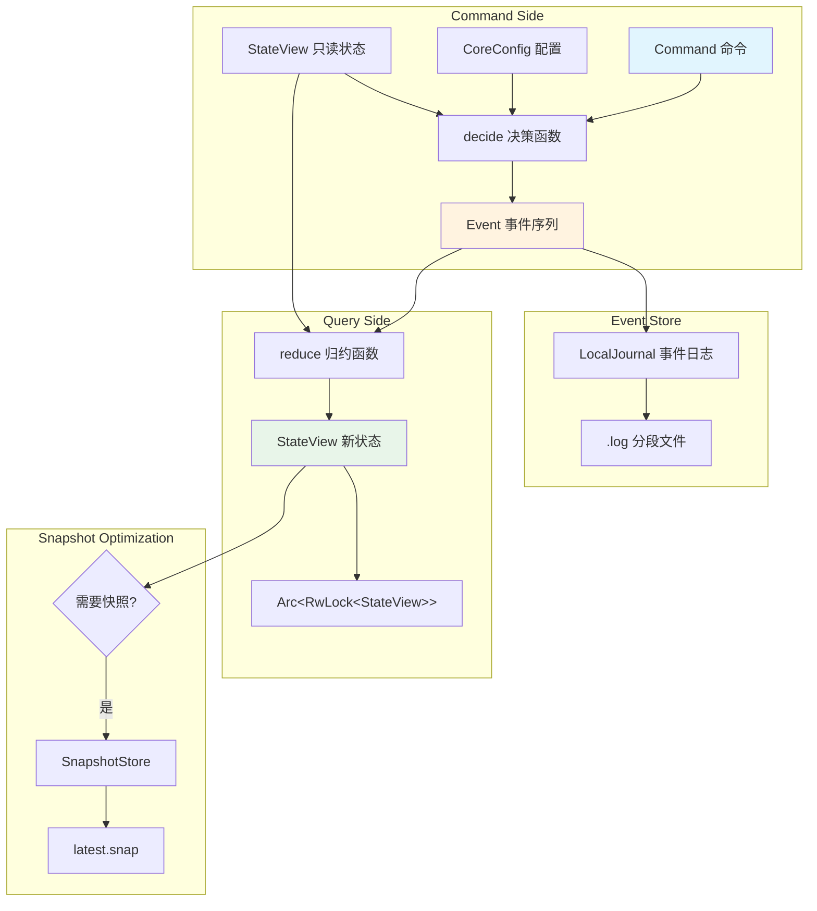
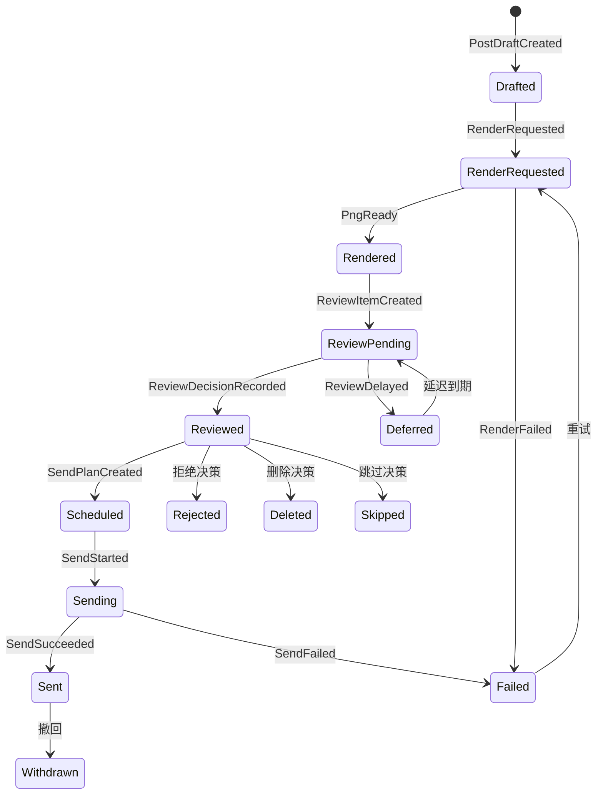
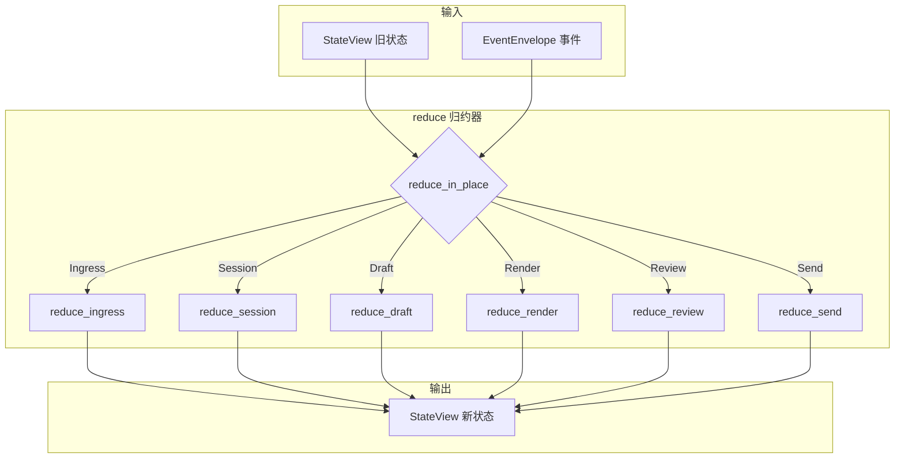
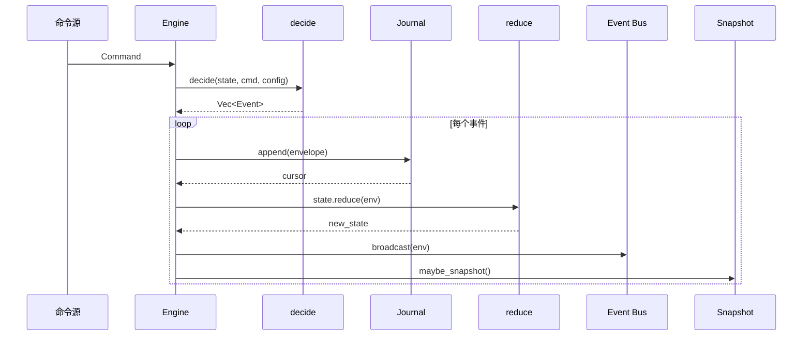

本文档深入解析 OQQWall_rust 的**事件溯源架构**，这是系统的核心设计模式。通过将所有状态变更记录为不可变的事件序列，系统实现了完整的审计追踪、可靠的状态恢复以及灵活的状态重建能力。

## 架构概览

OQQWall_rust 采用**事件溯源（Event Sourcing）+ CQRS**的混合架构模式。系统不直接修改数据库记录，而是将每一次业务操作转化为不可变的**事件（Event）**，通过**归约（Reduce）**函数从事件流重建当前状态。



Sources: [engine.rs](crates/app/src/engine.rs#L26-L39), [lib.rs](crates/core/src/lib.rs#L1-L31)

## 事件层次结构

系统定义了**12 种顶层事件类别**，涵盖了从消息接收到发送完成的完整业务流程：

| 事件类别 | 职责 | 核心事件示例 |
|---------|------|-------------|
| **SystemEvent** | 系统生命周期 | `Booted`, `SnapshotLoaded` |
| **ConfigEvent** | 配置变更 | `Applied { version }` |
| **IngressEvent** | 消息接入 | `MessageAccepted`, `MessageIgnored` |
| **SessionEvent** | 会话管理 | `Opened`, `Appended`, `Closed` |
| **DraftEvent** | 草稿创建 | `PostDraftCreated` |
| **MediaEvent** | 媒体处理 | `MediaFetchRequested`, `MediaFetchSucceeded` |
| **RenderEvent** | 渲染任务 | `RenderRequested`, `PngReady` |
| **ReviewEvent** | 审核流程 | `ReviewItemCreated`, `ReviewDecisionRecorded` |
| **ScheduleEvent** | 调度管理 | `SendPlanCreated`, `SendPlanCanceled` |
| **SendEvent** | 发送执行 | `SendStarted`, `SendSucceeded` |
| **BlobEvent** | 二进制对象 | `BlobRegistered`, `BlobPersisted` |
| **ManualEvent** | 人工干预 | `ManualInterventionRequired` |

每个事件都封装在 **EventEnvelope** 中，携带元数据信息：

```rust
pub struct EventEnvelope {
    pub id: EventId,                    // 事件唯一标识
    pub ts_ms: TimestampMs,            // 时间戳（毫秒）
    pub actor: ActorId,                // 操作者标识
    pub correlation_id: Option<CorrelationId>,  // 关联ID（用于因果追踪）
    pub event: Event,                  // 具体事件内容
}
```

Sources: [event.rs](crates/core/src/event.rs#L8-L32), [event.rs](crates/core/src/event.rs#L34-L97)

## 投稿生命周期状态机

投稿（Post）从创建到完成经历严格的状态转换，体现了业务流程的完整性：



状态机的核心在于**每一个转换都是一个不可变的事件**，系统可以通过重放事件序列精确还原任意时刻的状态。

Sources: [state.rs](crates/core/src/state.rs#L48-L63), [reduce/mod.rs](crates/core/src/reduce/mod.rs#L296-L340)

## 决策引擎：命令到事件的转换

**决策函数（decide）** 是 CQRS 模式中命令侧的核心，负责将业务命令转化为事件：

```mermaid
flowchart LR
    subgraph "Command 输入"
        INGRESS_CMD[IngressCommand]
        TICK_CMD[TickCommand]
        REVIEW_CMD[ReviewActionCommand]
        GLOBAL_CMD[GlobalActionCommand]
        DRIVER_CMD[DriverEvent]
    end
    
    subgraph "decide 分发器"
        DECIDE{decide()}
    end
    
    subgraph "Event 输出"
        EVENTS[Vec&lt;Event&gt;]
    end
    
    INGRESS_CMD --> DECIDE
    TICK_CMD --> DECIDE
    REVIEW_CMD --> DECIDE
    GLOBAL_CMD --> DECIDE
    DRIVER_CMD --> DECIDE
    
    DECIDE --> ingress::decide_ingress
    DECIDE --> tick::decide_tick
    DECIDE --> review::decide_review_action
    DECIDE --> global::decide_global_action
    DECIDE --> driver::decide_driver_event
    
    ingress::decide_ingress --> EVENTS
    tick::decide_tick --> EVENTS
    review::decide_review_action --> EVENTS
    global::decide_global_action --> EVENTS
    driver::decide_driver_event --> EVENTS
```

决策函数遵循**纯函数**原则：相同的状态和命令总是产生相同的事件序列，确保系统行为的可预测性和可测试性。

### 消息接入决策示例

当接收到新消息时，`decide_ingress` 函数执行以下逻辑：

1. **幂等性检查**：通过 `ingress_id` 检测重复消息
2. **黑名单过滤**：检查用户是否被封禁
3. **会话管理**：决定创建新会话或追加到现有会话
4. **媒体请求**：为远程附件生成下载请求

```rust
// 简化的决策流程
if state.ingress_seen.contains(&ingress_id) {
    return vec![Event::Ingress(IngressEvent::MessageIgnored { ... })];
}
if is_blacklisted(state, &cmd.group_id, &cmd.user_id) {
    return vec![Event::Ingress(IngressEvent::MessageIgnored { ... })];
}
// 生成接受事件和会话事件...
```

Sources: [decide/mod.rs](crates/core/src/decide/mod.rs#L17-L27), [decide/ingress.rs](crates/core/src/decide/ingress.rs#L9-L86)

## 归约函数：事件到状态的投影

**归约函数（reduce）** 是事件溯源的核心，负责从事件流重建状态视图：



**关键设计原则**：归约函数是**确定性的**和**可组合的**，允许从任意时间点开始重放：

```rust
// 从头重建
let mut state = StateView::default();
for env in &all_events {
    state = state.reduce(env);
}

// 从快照 + 增量事件重建
let mut state = snapshot.state;
for env in &events_since_snapshot {
    state = state.reduce(env);
}
```

Sources: [reduce/mod.rs](crates/core/src/reduce/mod.rs#L15-L42), [reduce/mod.rs](crates/core/src/reduce/mod.rs#L44-L128)

## 持久化层：事件日志与快照

### 事件日志（LocalJournal）

事件日志采用**分段文件**结构，提供高吞吐量的顺序写入和可靠的持久化：

| 配置参数 | 默认值 | 说明 |
|---------|-------|------|
| `segment_size_bytes` | 64 MB | 单个日志段的最大大小 |
| `flush_bytes` | 256 KB | 触发刷盘的字节阈值 |
| `flush_interval` | 50 ms | 触发刷盘的时间间隔 |
| `MAX_RECORD_BYTES` | 16 MB | 单条记录的最大大小 |

每条日志记录的二进制格式：

```
┌─────────────┬─────────────┬─────────────────────┐
│ Length (4B) │ CRC32 (4B)  │ Payload (变长)        │
└─────────────┴─────────────┴─────────────────────┘
```

- **Length**：payload 的字节长度（小端序）
- **CRC32**：payload 的校验和，用于检测损坏
- **Payload**：`EventEnvelope` 的 bincode 序列化

Sources: [journal.rs](crates/infra/src/journal.rs#L11-L16), [journal.rs](crates/infra/src/journal.rs#L108-L157)

### 快照存储（SnapshotStore）

快照机制优化了状态恢复性能，避免每次启动都重放完整事件流：

```rust
pub struct Snapshot {
    pub version: u32,                    // 快照格式版本
    pub taken_at_ms: i64,               // 快照创建时间
    pub journal_cursor: Option<JournalCursor>,  // 日志游标位置
    pub state: StateView,               // 完整状态视图
}
```

**快照策略**：
- 每 **1000 个事件** 自动创建快照
- 每 **5 分钟** 自动创建快照
- 采用**原子写入**（临时文件 + rename）确保一致性

Sources: [snapshot.rs](crates/infra/src/snapshot.rs#L14-L31), [engine.rs](crates/app/src/engine.rs#L23-L24)

## 引擎：事件循环的核心协调者

**Engine** 结构体是整个事件溯源架构的运行时核心，协调命令处理、事件持久化、状态更新和快照管理：



**状态恢复流程**：

1. 加载最新快照（如果存在）
2. 从快照的 `journal_cursor` 位置开始重放日志
3. 如果遇到日志损坏，截断损坏部分并从头重放
4. 将恢复的状态同步到共享状态

Sources: [engine.rs](crates/app/src/engine.rs#L105-L143), [engine.rs](crates/app/src/engine.rs#L145-L206)

## 确定性 ID 生成

系统使用 **BLAKE3 哈希**生成确定性 ID，确保相同输入总是产生相同的 ID，支持幂等操作和事件重放：

```rust
pub fn derive_id128(tag: &[u8], parts: &[&[u8]]) -> Id128 {
    let mut hasher = blake3::Hasher::new();
    hasher.update(tag);      // 领域标签（如 "ingress_id"）
    hasher.update(&[0u8]);   // 分隔符
    for part in parts {
        hasher.update(part);
        hasher.update(&[0u8]);
    }
    let hash = hasher.finalize();
    // 取前 16 字节作为 128 位 ID
    Id128::from_u128(u128::from_be_bytes(...))
}
```

| ID 类型 | 标签 | 生成输入 |
|--------|------|---------|
| `IngressId` | `ingress_id` | profile_id, chat_id, user_id, platform_msg_id |
| `SessionId` | `session_id` | chat_id, user_id, group_id, ingress_id |
| `PostId` | `post_id` | session_id |
| `ReviewId` | `review_id` | post_id |

Sources: [ids.rs](crates/core/src/ids.rs#L44-L54), [ids.rs](crates/core/src/ids.rs#L56-L78)

## 状态视图：只读查询模型

**StateView** 是 CQRS 模式中查询侧的核心，包含所有业务实体的当前状态：

| 状态集合 | 用途 | 键类型 |
|---------|------|--------|
| `ingress_seen` | 幂等性检查 | `HashSet<IngressId>` |
| `ingress_meta` | 消息元数据 | `HashMap<IngressId, IngressMeta>` |
| `sessions` | 活跃会话 | `HashMap<SessionId, SessionMeta>` |
| `posts` | 投稿元数据 | `HashMap<PostId, PostMeta>` |
| `posts_by_stage` | 按阶段索引 | `HashMap<PostStage, HashSet<PostId>>` |
| `reviews` | 审核记录 | `HashMap<ReviewId, ReviewMeta>` |
| `send_due` | 发送队列 | `BTreeSet<SendDueKey>` |

StateView 通过 `Arc<RwLock<StateView>>` 在多线程环境中安全共享，支持并发读取。

Sources: [state.rs](crates/core/src/state.rs#L206-L254), [engine.rs](crates/app/src/engine.rs#L55-L57)

## 调度与时间窗口

系统实现了基于**时间窗口**的发送调度，避免在不适当的时间发送内容：

```rust
pub fn compute_not_before(
    now_ms: TimestampMs,
    delay_until_ms: Option<TimestampMs>,
    send_windows: &[TimeWindow],
    min_interval_ms: TimestampMs,
    last_send_ms: Option<TimestampMs>,
    queue_depth: usize,
    max_queue: usize,
    tz_offset_minutes: i32,
) -> TimestampMs
```

调度逻辑考虑以下因素：
- **延迟时间**：审核通过后的延迟发送
- **发送窗口**：限制在特定时间段内发送
- **最小间隔**：同一账号的发送间隔
- **队列溢出**：队列过长时的退避策略

Sources: [scheduler.rs](crates/core/src/decide/scheduler.rs#L4-L34), [scheduler.rs](crates/core/src/decide/scheduler.rs#L47-L59)

## 测试与验证

事件溯源架构的可测试性是其核心优势之一。系统包含以下测试类别：

| 测试文件 | 验证内容 |
|---------|---------|
| `reduce_replay.rs` | 归约函数的可组合性（分段重放 = 完整重放） |
| `decide_ingress_blacklist.rs` | 黑名单过滤逻辑 |
| `decide_tick.rs` | 定时任务触发逻辑 |
| `decide_review_stack.rs` | 审核流程堆栈处理 |
| `decide_driver_send.rs` | 发送驱动事件处理 |

关键测试模式：验证**事件重放的确定性**，确保无论是一次性处理还是分段处理，最终状态完全一致。

Sources: [reduce_replay.rs](crates/core/tests/reduce_replay.rs#L20-L191)

## 下一步阅读

- **[状态管理与还原](10-zhuang-tai-guan-li-yu-huan-yuan)**：深入了解 StateView 的详细结构和状态转换规则
- **[指令决策引擎](11-zhi-ling-jue-ce-yin-qing)**：探索各个决策函数的完整实现
- **[并发处理机制](24-bing-fa-chu-li-ji-zhi)**：了解事件循环与异步任务的协调方式